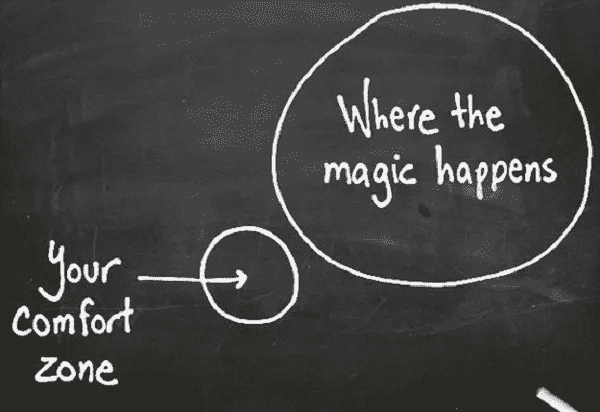
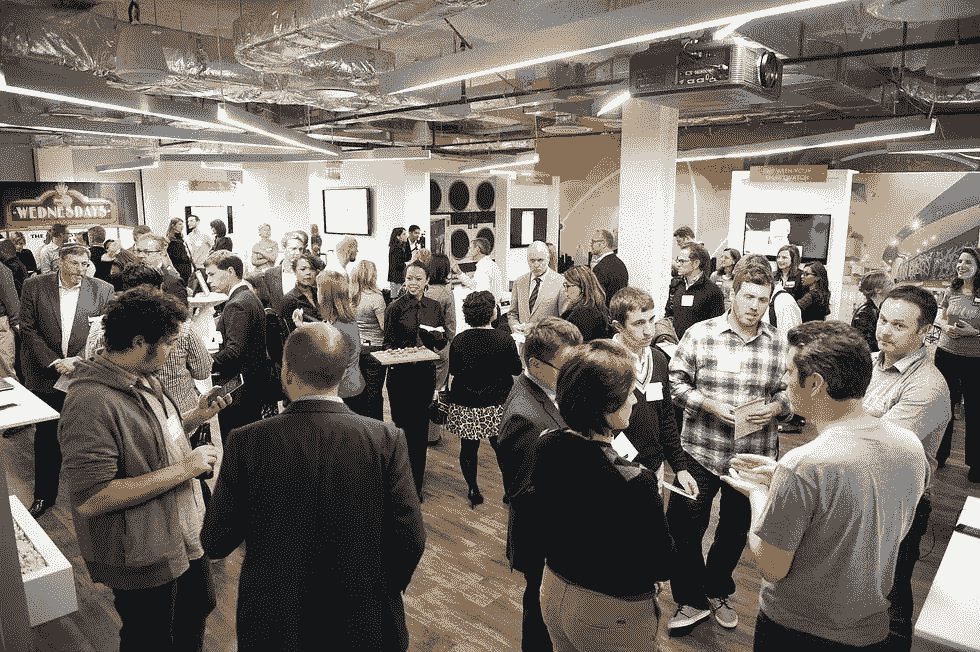
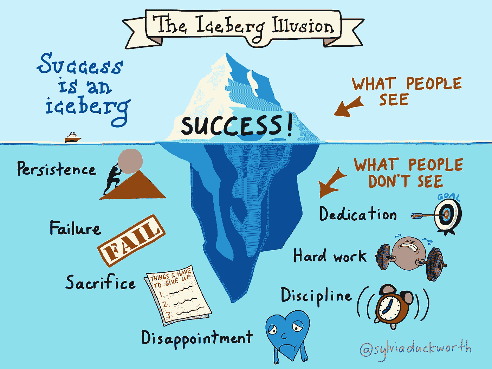

# 克服自我怀疑

> 原文：<https://medium.com/hackernoon/overcome-self-doubt-bf04f1c557fd>

## 知道你并不孤单。

第一，承认大家都有疑惑。相信你是唯一一个缺乏自信的人是很孤立的。如果你觉得自己是局外人，你会破坏你的成功。

> 获得自信的最好方法是做你害怕做的事情。

## 不要担心别人怎么想。

当你花费所有的时间和精力试图管理别人对你的看法时，你会陷入一个不适当的循环。**总会有人看起来做得更好、走得更远或拥有更多的财富。不要拿别人的成就和财产来衡量自己。**

## 设定近期目标。

除了采用雄心勃勃的长期目标，记得建立可实现的短期目标。当你的大目标没有立即实现时，很容易产生怀疑。**通过一路实现较小的目标，你可以不断享受频繁的胜利。**

## 和合适的人在一起。

俗话说，没有人是一座孤岛，这也适用于你的商业生活。与鼓励你的人保持密切联系，定期寻求他们的反馈。与那些总是对你、你的业务和你的未来持悲观态度的人保持距离。

## 休息一下。

如果你对你认为进展不顺利的事情感到不知所措，那就花些时间离开那个项目，专注于一些完全不同的事情。有时，将我们的注意力从我们所坚持的事情上转移开，有助于我们在回到这个问题上时，采取新的视角。

用手涂鸦、乱涂、画画。放上你最喜欢的音乐，四处走动。

## 滋养自己。

当我们忘记照顾自己的需求时，很容易迷失在自我怀疑的海洋中。

确保你有足够的玩耍时间(离开工作去平衡工作和玩耍)。**一定要全天保持充足的水分，保证充足的睡眠，健康饮食**。

坚持写感恩艺术日记，从杂志或网上选一张照片，每天选择一到三件你感恩的事情。

## 与他人联系。

虽然加强你的自爱肌肉很重要，但从别人那里获得你需要的支持也同样重要。无论是来自朋友、家人，还是专业治疗师或教练，从别人那里获得安慰或帮助都会有很大的不同。

有时，仅仅是确认你不是唯一陷入困境或自我怀疑的人，就能帮助你转变“为什么是我”的态度。

## 要有选择性。

每天花点时间记住你的成就，即使是很小的成就，积极地选择以积极的方式看待你周围的世界。

总是寻找与你期望的不一样的情况的另一种解释。事情的发生超出了你的控制范围，不管你是否参与其中。

## 要果断，但不要害怕改变主意。

当做决定的时候，不要过度消耗你的精力。**在大多数情况下，你的第一直觉可能是正确的选择，所以做出决定，继续前进。**

但是，如果最终你意识到这毕竟不是一个正确的选择，不要害怕改变路线。这似乎是矛盾的，但事实并非如此。

## 分散注意力。

人们很容易陷入消极的想法中，如果不加以控制，消极的想法会蔓延到你生活的方方面面。立即打破循环。**尝试摆脱这种自我毁灭的心理循环的几种方法包括散步、转移到另一个项目或做运动。在悲观情绪吞噬你之前，尝试并找到最有效的方法来平息它。**

## 直面你的恐惧。

最后，不要让恐惧或自我怀疑左右你的个人生活或经营事业。定期评估最坏的情况以及风险回报比，直面让你害怕的事情。

害怕失败的人永远不会前进或成长，无论是个人还是职业。你越鞭策自己，你就越会意识到自己的能力。最终，你甚至可以逆转自我怀疑的负面影响，用它来挑战你的局限，实现伟大。

> 每天做一些让你害怕的事情。

*   去健身房吧
*   对陌生人微笑或击掌
*   去参加一个演讲会并发表演讲
*   开始跑步，甚至做铁人三项
*   大胆尝试，追求你害怕的大机会
*   走到你一直关注的人面前，邀请他们约会

我的灵感来自这里的、这里的和这里的。