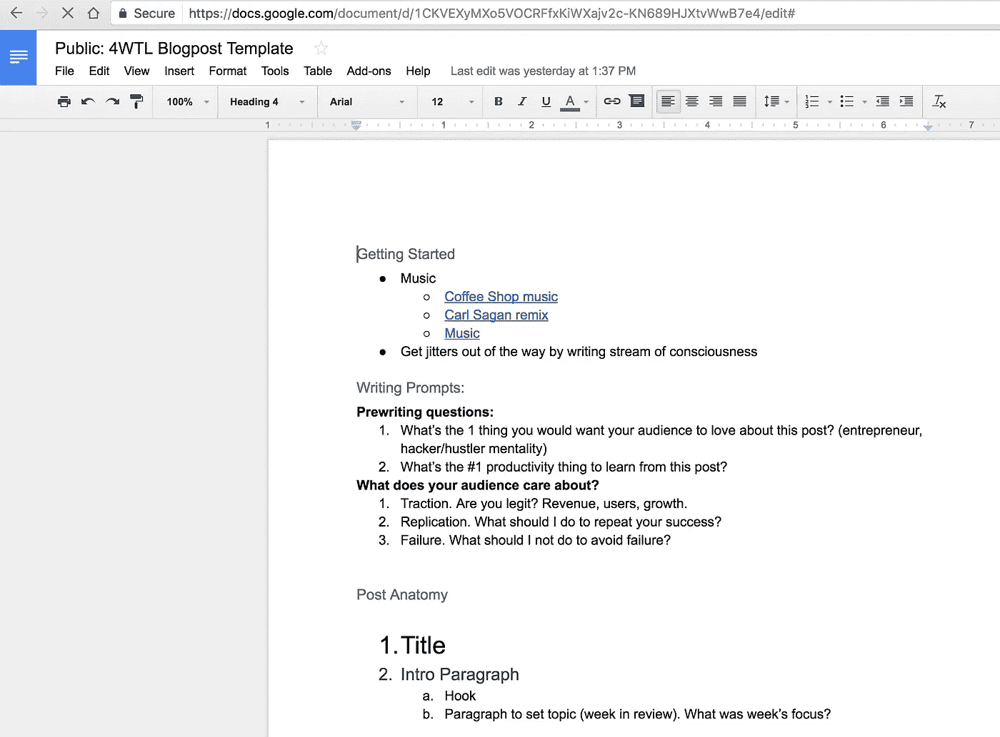

# 启动 1:第 3 周—一夜**成功

> 原文：<https://medium.com/hackernoon/overnight-success-4a8b03f73a77>

*注意:4 周启动是一个正在进行的关于在多个创业公司中建立被动收入的系列——每 4 周就有一个新的* [*创业公司*](https://hackernoon.com/tagged/startup) *。阅读* [*第 4 周发布*](http://4weekstolaunch.com/4-weeks-to-launchlaunch/) *开始。*

一夜成名很牛逼吧？早上醒来看到你的银行账户里有几千美元？好了，白日梦做够了。回到现实。

我们都有成功人士的愿景。他们是超人。泰坦们。无限的意志力，完美的解决问题的能力，以及不知疲倦地工作的能力。事实上，成功人士并没有想象中的那么优秀。他们是系统的组合，测试快速的结果，并有正确的团队。

# #1 建立系统，而不是意志力

我一直在博客帖子中挣扎，因为我一直试图用蛮力写作。每周一，我开始用头敲打键盘几个小时，直到我有一篇博客文章。并没有变得更容易。

那是因为意志力真的很难“挖掘”。这是一个有限的资源，并且只在突发时有用。如果它是无限的，那么当然，我们可以用武力解决所有的问题，但是意志力不是随随便便就能得到的。这就是系统的用武之地。

制度(和习惯)远比意志力有效。一旦养成了一种习惯，保持这种习惯所需的努力就会减少。这就像去健身房一样——每周去一次比每月去一次 5 小时更重要。

为了帮助我写博客，我制定了一个写作时间表，在一周内写博客，而不是一天。我还做了一个[博文模板文档](https://docs.google.com/document/d/1CKVEXyMXo5VOCRFfxKiWXajv2c-KN689HJXtvWwB7e4/edit#heading=h.d7v0i6p2sbtq)来帮助入门。

像这样的简单系统可能看起来很小，但放在一起就有力量。不要等到“灵感来了”才开始行动。这是不可持续的，你会失败的。相反，关注你的平均速度。选择一个舒适的配速，每天都这样做。James Clear 有一个帖子，说有人用这种方法在 9 个月内写了 3 本书。

# 变得斗志昂扬——事半功倍

在第二周，我也很难获得 JFDI.ninja 的关注。现在产品完成了(好玩的部分)，我需要用户(没玩的部分)。由于我不喜欢[营销](https://hackernoon.com/tagged/marketing)，我就停滞不前了。

发布 4 周的一个很好的副作用是向全世界暴露了我的弱点。营销是这些弱点之一。我本该在本周专注于市场营销，但却没有。

*我如何解决这个问题？*

专注于正确的心态。不要生闷气抱怨，要想出解决办法。问问你自己，*“如果我对 X 一无所知但我必须在 24 小时内有结果，我会怎么做？”*

这是一个有力的问题。作为一个开放式问题，没有错误的答案，所以你开始关注解决方案而不是阻碍因素。

## 我列出了一些吸引用户的方法:

*   在论坛上发帖
*   在博客的评论区发帖
*   联系博客作者
*   上 indiehackers.com
*   在 Reddit 上发布
*   DM 朋友
*   请大家分享/参考
*   告诉更多的人
*   重新定义如何让它具有可分享性和可推销性。很难描述
*   向新闻界推销
*   每天给人们发电子邮件，问“你一直在拖延的一件事是什么？”
*   广告词/fb
*   产品搜索
*   向网站添加社交证明
*   分发传单，上面写着“获得自由时间”

瞧啊。现成的营销策略。我把清单缩减为可执行的任务:

*   寻找关于生产力和帖子的论坛/博客，提供我的服务
*   联系博客写手，看看他们是否会认可我的网站
*   在社交媒体上给朋友发短信，让他们使用 JFDI.ninja，或者询问他们是否可以推荐忙碌的朋友
*   在网站上添加客户评价
*   在 Reddit 上发布

本周，我将尽可能尝试各种不同的策略，看看哪些能奏效。

# 寻求专业的免费帮助

我们大多数人都试图自己做每件事。谁想求助？我有很多朋友和陌生人主动提出在 4 周内提供帮助，但都很固执。

但是为什么不寻求帮助呢？说真的，为什么不呢？你无法靠自己成就伟业，所以去找那些对你所做的事情感到兴奋的人吧。

我开始让人们参与 4 周的发布。我让其他人参与的越多，4 周发布会就越成功。

# 指标和目标

1.  参见 JFDI.ninja 的[指标](https://docs.google.com/spreadsheets/d/17FkveYguYnoPUA5pfPttPnVfwYTx14TLCa_ln6iqXsI/edit#gid=0)
2.  参见[发布 4 周的指标](https://docs.google.com/spreadsheets/d/17FkveYguYnoPUA5pfPttPnVfwYTx14TLCa_ln6iqXsI/edit#gid=552417787)
3.  第 2 周收入:8 美元

## 本周的计划/目标

1.  关注:获取用户([周目标链接](https://docs.google.com/spreadsheets/d/1jELsOFyACrxs2ci9w347d2OmlO0lDG-8P7l6P4gQKFU/edit#gid=995892820))
2.  收入目标:50 美元或 25 个订单的下一个职位

这一周是一次重要的学习经历。碰壁迫使我去解决这个问题，即使解决这个问题需要时间。营销是建立公司的重要组成部分，没有用户就没有业务！

# 你为什么生自己的气？

*   你有什么长期目标，但你似乎无法坚持？请在评论中告诉我，并让自己负起责任！
*   如果你想在收件箱里看到这些每周更新，注册邮件列表。承诺，没有垃圾邮件，只有帖子。

> [黑客中午](http://bit.ly/Hackernoon)是黑客如何开始他们的下午。我们是 [@AMI](http://bit.ly/atAMIatAMI) 家庭的一员。我们现在[接受投稿](http://bit.ly/hackernoonsubmission)并乐意[讨论广告&赞助](mailto:partners@amipublications.com)机会。
> 
> 如果你喜欢这个故事，我们推荐你阅读我们的[最新科技故事](http://bit.ly/hackernoonlatestt)和[趋势科技故事](https://hackernoon.com/trending)。直到下一次，不要把世界的现实想当然！

