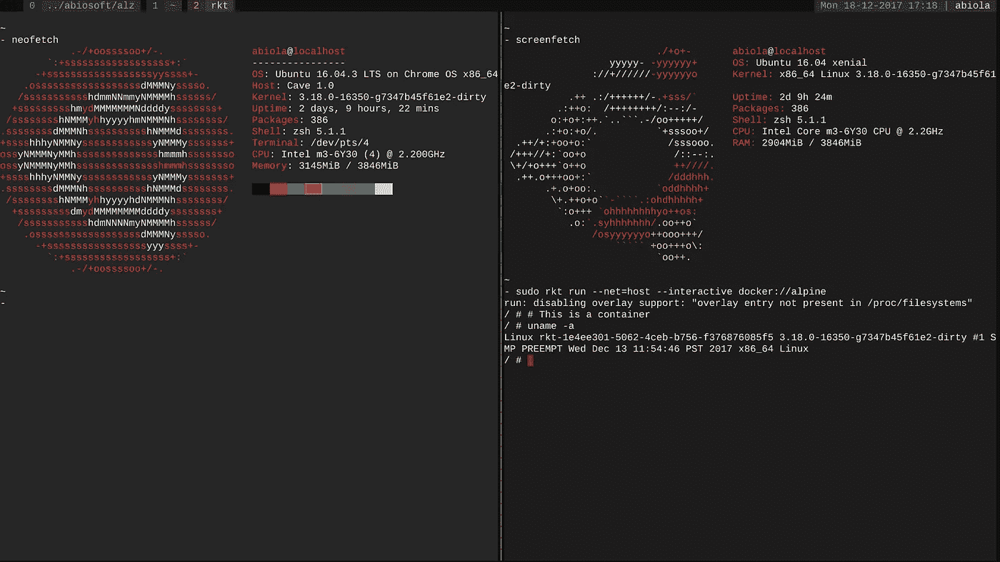

# 拥有一台 Chromebook

> 原文：<https://medium.com/hackernoon/owning-a-chromebook-6a364c87d830>

当谷歌宣布推出 PixelBook 时，一片混乱，我也是批评者之一。

《T2》的 PixelBook 成功做到的一件事就是让更多的人来看《T4》的 chrome book。这可能是谷歌设备目标的一部分。

巧合的是，我正处于换工作的过程中，我将有大约两个星期没有笔记本电脑。我在寻找可以填补那个时期空白的东西，并在之后继续作为第二笔记本电脑使用。

进一步吸引我的是 Andriod 应用程序的支持。我没有把 Chromebook 看作一个网络浏览器，而是把它看作一个 Andriod 平板电脑，配有全尺寸键盘和桌面浏览器。到目前为止，我更喜欢在桌面上浏览，我更喜欢使用原生移动应用程序，而不是移动网站。

我想要一点溢价的感觉，但不愿意花 999 美元来做实验。大多数 Chromebooks 的塑料外壳很便宜，对于使用 MacBooks 几年的人来说，这是一个巨大的下降。

在阅读可用的评论和观看视频后，我选择了华硕 C302。像许多其他人一样，选择总是在三星 Chromebook Plus/Pro 和华硕之间。我选择华硕是因为我的键盘使用量相当大，并且宁愿在键盘质量上不妥协。

# **设备和 Chrome 操作系统**

这个设备就是我在评论中看到的。我花了几天时间喜欢上了它，并一直希望它能做得更多。它是如此的轻和舒适，以至于普通的笔记本电脑开始感觉像一个沉重的负担。

Chrome 操作系统可能有局限性，但它非常流畅。几乎没有延迟，除非是一个重度用户同时运行多个 Chrome 标签和多个 android 应用或游戏。它在几秒钟内关闭或打开，睡眠或恢复几乎立即发生。最重要的是，操作系统在后台更新下载，也需要几秒钟来应用。

Android 应用程序时好时坏，但通常都能正常工作。沥青 8 看起来像是一个为 Chromebook 设计的游戏，键盘很适合控制。我的 PS4 游戏手柄也可以通过 USB 和蓝牙为支持这些功能的游戏工作( [SBK16](https://play.google.com/store/apps/details?id=it.dtales.sbk16) 和 [Real Racing 3](https://play.google.com/store/apps/details?id=com.ea.games.r3_row) )。此外，我还可以在一台旧的惠普打印机上通过 USB 进行打印。

不要相信“Chromebooks 无法离线工作”的说法。你只需要第一次上网设置，Chromebooks 离线时和 Windows/macOS 笔记本电脑没什么区别。顺便说一下，现在没有人会离线，不管你用的是什么设备。

# **现实**

在满意地探索了 Chrome OS 之后，我回到了我需要写代码的现实。使用 Chromebook 作为瘦客户端和 ssh 到服务器进行开发的选项是存在的，但我更喜欢有一个本地开发设置。

我一开始用的是 [Termux](https://play.google.com/store/apps/details?id=com.termux) ，但很快意识到这还不够，唯一的出路是启用开发者模式。由于安全成本和可怕的启动屏幕，我很不情愿。

Termux 对大多数人来说已经足够了。它提供了对流行开发环境的访问，包括 Node 和 Go，但对我来说一个主要的限制是操作系统是 32 位 Android。

Development environment on Termux

# **开发者模式**

有点背景。我是那种喜欢摆弄设备的人。例如，拆箱后，我在我的 Galaxy S2 上刷新了定制 ROM 和无效保修，我甚至没有看到三星开机屏幕是什么样子。我已经在我的 Mac 上构建了 Hackintosh 并运行了 Linux，等等。因此，在我的 Chromebook 上不启用开发者模式实际上是对我自己的伤害。

我决定启用开发者模式，用 [crouton](https://github.com/dnschneid/crouton) 添加 Ubuntu。因为我有一个 tmux 和 vim 设置，所以我只需要 Linux 功能，而不需要桌面环境。

唯一缺少的是 Docker，Chrome OS 内核不支持。一个变通办法是使用 [rkt](https://coreos.com/rkt/) ，它在 Chrome OS 上的限制是主机网络要求`--net=host`。每当需要构建 docker 映像时，我都会在云服务器上完成。

Ubuntu environment

# **为什么它对我有效**

如果以下内容不适用于您，Chromebook 可能不适合您作为开发机器。

*   不依赖任何 Windows 或 macOS 软件。
*   愿意启用开发者模式并获得完整的 Linux 功能。
*   使用 CLI 编辑器，如 Vim。VSCode、IntelliJ 或其他 GUI 编辑器是可以实现的，但需要桌面环境安装，这是以性能为代价的。
*   不依赖于建立码头工人的形象。使用 rkt 可以运行现有的 Docker 映像。
*   零需要编辑重度视频或玩 AAA 游戏。

# **Chrome 操作系统愿望清单**

我主要希望 Chrome OS 在两个方面有所改进。

*   在启动时使用组合键而不是空格键来禁用开发者模式。空格键太冒险了。如果你碰巧把你的 Chromebook 留给了别人，你可以肯定，如果他们碰巧重启了它，他们会按空格键。
*   内核中的 Docker 支持。那将是仙境。

# **结论**

Chromebooks 已经适用于 95%的电脑用户。是的，95%的电脑用户只使用 Chromebook 提供的功能。网络浏览、社交媒体、视频、音乐和编辑文档。Android 应用程序进一步增强了 2 合 1 Chromebooks 的平板电脑模式。

对于像我这样的程序员属于的其余 5%，Chromebook 是一个非常强大的设备，如果你有一个采用英特尔处理器的设备，并且你足够大胆地启用开发者模式。你会得到一个 64 位的 Linux 系统和 Chrome 操作系统。

现在，如果你为和我有相似配置的人考虑一下，PixelBook 在价格上还不错。优质构建质量、顶级键盘、高分辨率屏幕、Linux 环境。这就是你用 ThinkPads 得到的，它们的价格超过 999 美元。

现在我期待着 2018 年即将到来的 Chromebooks，如果我找到一款值得的，可能会升级。这是我 4 个月前从未想过自己会做的事情。