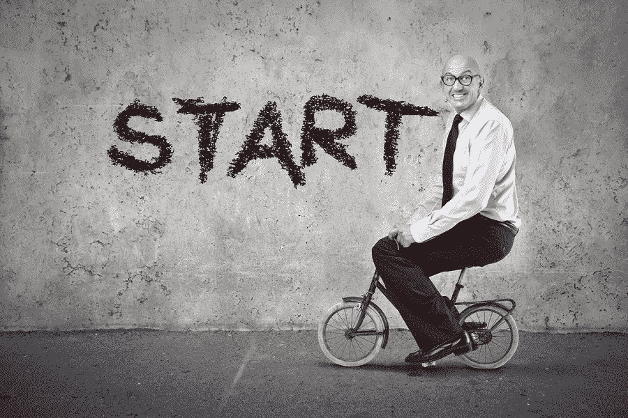

# 拥有你的糟糕时刻

> 原文：<https://medium.com/hackernoon/owning-your-suck-moments-960093ff9d44>

Photo credits: [http://gratisography.com/](http://gratisography.com/)

在你非常熟悉的事情上再次成为初学者是什么感觉？

最近开始学开手动挡的车。虽然我在自动挡车上已经是一个称职的驾驶员很多年了，但是在手动挡车上我是一个完全的初学者。

我跳上我的学车，犹豫地用出汗的手掌发动了引擎。我试图用离合器找到我的摩擦点，汽车开始挣扎，哎呀，我熄火了！

没错。我又开始学了…这是我的 [**吸瞬间**](https://hackernoon.com/tagged/suck-moment) 。

再次成为一名初学者会感到兴奋、害怕、有趣，并彻底颠覆你的世界。老实说，我对此百感交集。我又爱又恨！

为了描述我对此的感受，想象一下，一个 50 级的职业选手突然降到了 5 级。不可避免的事情一定会发生，你的一部分会受到严重伤害——你的自我。

我的肯定是伤痕累累和嫩化。

如果要我总结整个学习经历，我会用一个词来形容——“令人**谦卑**”

学习新事物可能是一个令人谦卑的旅程。

A piece of humble pie, anyone?

在创业[的世界里，从零开始创造一个产品或建立一个想法意味着企业家每天都必须面对和拥有他们的糟糕时刻，因为他们努力证明他们的假设。这个功能会起作用吗？这会带来更多的顾客吗？这会促进我的销售吗？当客户没有像预期的那样回应时，我会颜面扫地吗？](https://hackernoon.com/tagged/startup)

有许多词汇可以用活该的时刻来描述。日语里叫 [Kaizen](http://www.leanproduction.com/kaizen.html) 。持续改进的经营理念。用最简单的话来说，依我拙见，可以这样翻译:

> 吮吸——学习——重复

拥有你的糟糕时刻，从你的经历中学习，应用你的知识，并重复。

在企业界，大型蓝筹公司正在他们的竞技场上被打乱。他们正在寻求创新来应对这些威胁。需要改变，改变确实正在到来。

只有一种方法来适应不断变化的公司环境；你必须准备好度过你的糟糕时刻。

你准备好了吗？

最近，我和一个 Scrum 团队一起工作，团队成员有不同的经验和成熟度。

他们经历了一段艰难时期，经历了许多糟糕的时刻。

作为他们的敏捷教练，我想确保他们能从这些艰难时刻中学到一些东西。

以下是他们改变之旅的快照，并讲述了他们糟糕的时刻

# 1.接受

这个新团队苦于彼此做了太多的假设。对其团队成员的知识、技能、承诺、工作方法和沟通的假设等等。

对于这个 Scrum 团队来说，假设已经开始在圈子里制造混乱。

结果，一些团队成员产出被认为质量不是很好。而指责的游戏也开始了。

团队只能通过接受摆在桌面上的事实，共同努力为团队制定一个可接受的模式和产出，并承认他们的糟糕时刻来摆脱这种局面。

承认自己的糟糕时刻，必须带领团队在以下领域开展工作:

1.  **团队成员的知识差距**
2.  **在团队中引入责任。**谁发起什么？当某件事做得不对时会发生什么？
3.  **呼叫通信模式。他们更喜欢面对面的交谈吗？亲自接受反馈？电话，邮件，会议？。**
4.  **说出团队中每个角色的职责。**因为这是一个具有不同经验水平的新团队，所以重新规定了每个角色的职责，从而强化了每个团队成员的责任。

# 2.用脚手架学习

这个团队需要重组。

尽管这很痛苦，但解决团队成员知识差距的唯一方法是共同努力建立他们对主题的理解。

当你在加固一栋建筑的结构时，脚手架会围绕着它一点一点地工作，直到它可以自己站立。坚固耐用。

我们人类的学习过程是一样的；在你和你的团队能够自立之前，你周围需要脚手架。

作为这支队伍的教练，我充当脚手架。努力提高他们的技能，一条生命线，或者打电话给朋友(在紧急情况下)。

# 3.吮吸——学习——重复

你可以谷歌一下，看很多关于如何开手动挡汽车的文章。但是开车只有一个办法，那就是干——**开**就行。

执行是一切汇集的地方。应用你所学的，知道你会在这方面很糟糕，学习什么是有效的，什么是无效的，去做，然后重复。

学习新事物的过程是痛苦的，但慢慢地，脚手架的零件会脱落。

# 4.呼唤严厉的爱

这是必然会发生的，随着脚手架的一部分开始脱落，团队开始自信地独立工作。

现在是巩固团队所有知识的时候了。

严厉的爱只是协商性的，而不是为他们解决问题。艰难的时刻就在前方，但该团队现在有能力自己解决这些问题。

我称之为严厉的爱，因为在许多情况下，你将不得不看着团队/个人经历更多糟糕的时刻，直到他们明白他们可以靠自己。

严厉的爱在每个团队成员和他们的能力之间建立信任。允许完全移除早先在该团体周围建造的脚手架。实现信任、力量和持久。

经历这些糟糕的时刻让这个 scrum 团队很好地接受了改变，成为了一个更强大的 scrum 团队，成为了带着好奇心和微笑去接触新事物的人。

或许，作为你 2017 年决心的一部分，你已经决定学习一项新技能、工具，或者学习你领域之外的新东西。嗯，祝你一切顺利！

记住这将是一段糟糕的时光，但也要知道只有通过这些糟糕的时刻，你才能真正发光。所以拥有它吧！

## 嘿！感谢阅读！我是 Juliet Lara，我写关于生活、学习、技术、创业和交流的文章。

## 如果你喜欢读这篇文章，请点击绿色的心按钮分享你的爱。我将能在回悉尼的路上看到你的微笑！

## 您可以通过 twitter @ julietlspeaks 联系

> [黑客中午](http://bit.ly/Hackernoon)是黑客如何开始他们的下午。我们是 [@AMI](http://bit.ly/atAMIatAMI) 家庭的一员。我们现在[接受投稿](http://bit.ly/hackernoonsubmission)并乐意[讨论广告&赞助](mailto:partners@amipublications.com)机会。
> 
> 如果你喜欢这个故事，我们推荐你阅读我们的[最新科技故事](http://bit.ly/hackernoonlatestt)和[趋势科技故事](https://hackernoon.com/trending)。直到下一次，不要把世界的现实想当然！

