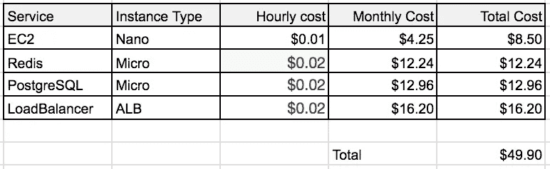

# PaaS——是福是祸？

> 原文：<https://medium.com/hackernoon/paas-a-blessing-or-a-curse-7398c08506bd>

我刚刚在 medium 上看到了一篇[非常有趣的文章，讨论了 Firebase 定价的变化如何导致家庭自动化](/@contact_16315/firebase-costs-increased-by-7-000-81dc0a27271d)[初创公司](https://hackernoon.com/tagged/startup)的成本增加了 7000%。作为实时后台服务 [deepstreamHub](http://www.deepstreamhub.com) 的联合创始人，这一点非常切中要害。因此，我很乐意就我们在开发和运行平台即服务(“PaaS”)产品时所面临的挑战以及我们如何努力克服这些挑战提供一些见解。

让我们先来了解一下为什么 PaaS 是一个如此繁荣的行业。

经营任何有竞争力的企业的梦想是提供更低的成本。这通常通过提供多租户系统来实现，该系统允许多个用户共享您的系统资源。与度假屋[分时度假](https://en.wikipedia.org/wiki/Timeshare)或 AWS 基础设施即服务基本相同。你认为你有一台完整的机器，但你实际上一小时只有几分钟。对用户的好处？您可以以不到 50 美元的成本运行您的整个堆栈，并且您永远不需要担心基础架构问题，如扩展、数据库迁移、安全问题、ssl 问题等等……对于平台本身来说，我们的优势是能够有效地分配负载(这意味着我们实际上可以盈利)，专注于困难方面，并专注于通过每一个版本来改善体验。

好吧，这是一个 PaaS 公司的人说的，所以我可以理解这可能会被怀疑。来自开发人员的一般评论表明，避免供应商锁定的更好方法可能是自己托管一切。有道理对吗？你可以使用像 [Kubernetes](https://kubernetes.io/) 和 docker Swarm 这样的容器编排服务来运行你自己的 Docker 映像，或者利用像 [AWS 的弹性容器服务](https://aws.amazon.com/ecs/details/)或[谷歌容器引擎](https://cloud.google.com/container-engine/)这样的云产品的所有好处来减少你的买入费。最终，您不再依赖特定供应商的任何产品，而是在价格或条款发生变化时，转向任何其他基于基础架构的公司。

从概念上来说，这一切都很棒。人们有时容易忘记的一点是，当你使用特定的供应商开发应用程序时，你可能已经花费了数千美元，你在平台本身上的经常性成本仍然低于每月 50 美元。那是一笔相当不错的交易。

作为一个热爱 devops 的人，让我们将它分解为如何实际部署相同的服务来支持实时应用程序。在完全公开的情况下，我将基于 [deepstream.io](https://deepstream.io/) ，为 deepstreamHub 提供动力的开源核心。这些要求是:

*   持续正常运行时间
*   提供低延迟的集中式高速缓存
*   持久数据库
*   SSL，因为是 2017 人

这意味着在 AWS 上托管 deepstream.io 至少需要:

*   两个独立可用性区域中的两台机器
*   允许它们相互通信的消息总线
*   允许快速读取和写入的缓存层，允许大约 16 毫秒的延迟
*   持久数据的数据库

因此，看起来应该是这样的(截至今天的发布日期):

这几乎是 50 美元，没有任何附加的隐性成本，例如吞吐量成本(这确实增加了！)、 [ALB 单位](https://aws.amazon.com/elasticloadbalancing/applicationloadbalancer/pricing/)，建立和维护的费用等。

还要记住，这是可能的最小堆栈！一台纳米机提供 512mb 内存 1 分钟 [CPU 爆仓](https://aws.amazon.com/ec2/instance-types/#burst)！这意味着你的负载需要非常非常小才能工作。

完全公开，我们在我们的开发环境中使用该堆栈——对于非生产用例来说非常便宜！

好吧，我希望我还有你们！我希望你们都同意，自托管某些系统并不像 PaaS 看起来那么便宜。

这就把我们带到了这篇文章的主要和最重要的部分。

使用平台作为服务是祸是福？

我个人的看法，明显略显偏颇，就是那两者都可以！能够使用既开源又为你托管的东西绝对应该被认为是一种福气。在这个领域里，有些人喜欢:

*   [deepstreamHub](https://deepstreamhub.com) (基于 deepstream.io)
*   [graph.cool](https://www.graph.cool/) (基于 graphql 协议)
*   [baasil.io](http://baasil.io) (基于 socketcluster)
*   [流星星系](https://www.meteor.com/hosting)(基于流星)
*   [AWS Lambda](https://aws.amazon.com/lambda/) (我马上就要说到这个了！)

这样做的好处是，如果发生了一些事情，如价格飙升、不受欢迎的新条款，或者甚至是您真正想要的功能集丢失，就会有足够多的人在生产中自托管，从而使迁移到自托管环境几乎与将数据从一个地方导出到另一个地方一样无缝。

诅咒是如果它不是开源的，你的供应商锁定会从背后咬你一口。parse 等一些平台通过在正式下线之前提前开源其核心，使这种诅咒变得更容易忍受，但只要你不能做出这种保证，就总会有相关的风险。

最后，正如今天对令人惊讶的[见解深刻的博客文章](/@contact_16315/firebase-costs-increased-by-7-000-81dc0a27271d)的一些评论:

> Alex R. Young 建议说:“依赖 AWS Lambda 不会潜在地导致同样的问题吗？当您可以在容器或虚拟机中运行服务，并且可以轻松地重新部署到任何三巨头的架构中时，为什么还要依赖任何特定的供应商提供的服务呢？"

我最近参加了一个 AWS 峰会，会上强烈推荐将你的应用程序逻辑构建成一个独立的依赖项。入口点应该足够通用，既可以从 lambda 运行，也可以从运行在您自己的机器实例上的 http 服务器、docker 服务运行，或者在我们的例子中，甚至可以从不同的协议调用(deepstream.io [RPCs](https://deepstreamhub.com/docs/client-js/reqres-client-rpc/) )。

> 请记住，您使用的服务随时都可能发生变化，如果您不小心的话，会让您陷入别无选择的境地。
> 
> 只要有可能，就依靠自己的基础设施。SaaS 模式似乎对初创公司和服务提供商都很有吸引力……但最终，被它咬了一口的是初创公司，真正赚钱的是服务提供商。
> 
> 总是大量考虑开源替代方案(当时 Firebase 还没有这种东西…)，但是现在已经有了替代方案，比如 Horizon 和 Backendless。

我希望我在这篇文章中已经很好地涵盖了这两个方面，并希望听到你对此的想法！

> [黑客中午](http://bit.ly/Hackernoon)是黑客如何开始他们的下午。我们是 [@AMI](http://bit.ly/atAMIatAMI) 家庭的一员。我们现在[接受投稿](http://bit.ly/hackernoonsubmission)并乐意[讨论广告&赞助](mailto:partners@amipublications.com)机会。
> 
> 如果你喜欢这个故事，我们推荐你阅读我们的[最新科技故事](http://bit.ly/hackernoonlatestt)和[趋势科技故事](https://hackernoon.com/trending)。直到下一次，不要把世界的现实想当然！

