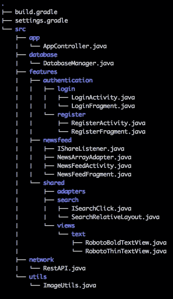

# 按要素而非图层打包

> 原文：<https://medium.com/hackernoon/package-by-features-not-layers-2d076df1964d>

“将[包](https://hackernoon.com/tagged/packages)层层拆分，就像将同事按职业拆分，而不是拆分成组织团队。”

想象一下这种荒谬的情况:

**经理公司、**、**人力资源公司**和**营销公司**，其中**程序员公司**将只有**程序员**而没有**经理**、**营销人员**或**人力资源**；

> 根据内容而不是功能来包装，只会让你跳到你要找的地方 10 次。

figure 1 - Small sample of a package-by-feature structure

# 收益和好处

*   通过**查看**这个结构，你已经可以知道这个应用是关于什么的了(图 1)；
*   更高的模块化；
*   **更简单的**代码导航；
*   更高层次的抽象；
*   分离[特征](https://hackernoon.com/tagged/features)和图层；
*   更可读和可维护的结构；
*   更有凝聚力；
*   更容易扩展；
*   意外修改不相关的类或文件的机会更少；
*   添加或删除应用程序功能要容易得多；
*   和更多可重用的模块。

# 你同意吗？你的方法是什么？

> [黑客中午](http://bit.ly/Hackernoon)是黑客如何开始他们的下午。我们是这个家庭的一员。我们现在[接受投稿](http://bit.ly/hackernoonsubmission)并乐意[讨论广告&赞助](mailto:partners@amipublications.com)机会。
> 
> 要了解更多信息，[请阅读我们的“关于”页面](https://goo.gl/4ofytp)、[在脸书上给我们点赞/发消息](http://bit.ly/HackernoonFB)，或者简单地说， [tweet/DM @HackerNoon。](https://goo.gl/k7XYbx)
> 
> 如果你喜欢这个故事，我们推荐你阅读我们的[最新科技故事](http://bit.ly/hackernoonlatestt)和[趋势科技故事](https://hackernoon.com/trending)。直到下一次，不要把世界的现实想当然！