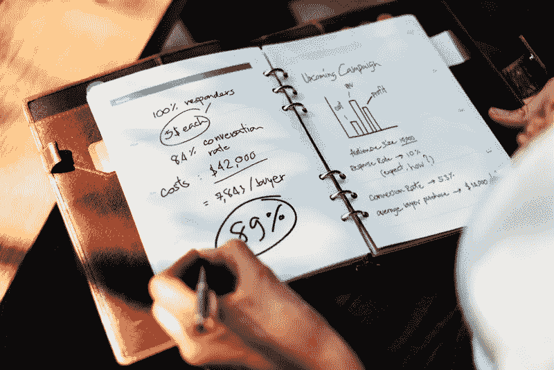
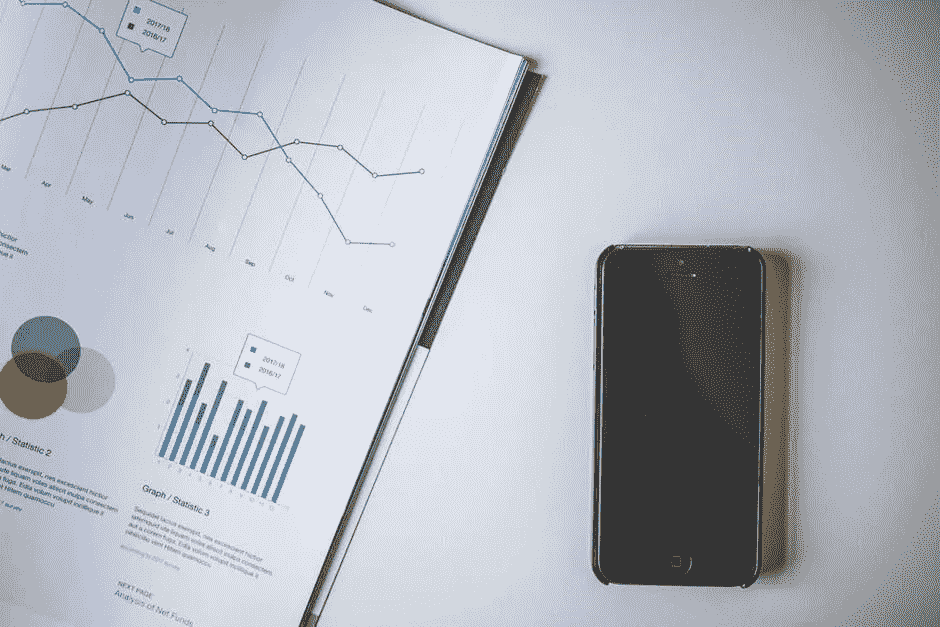
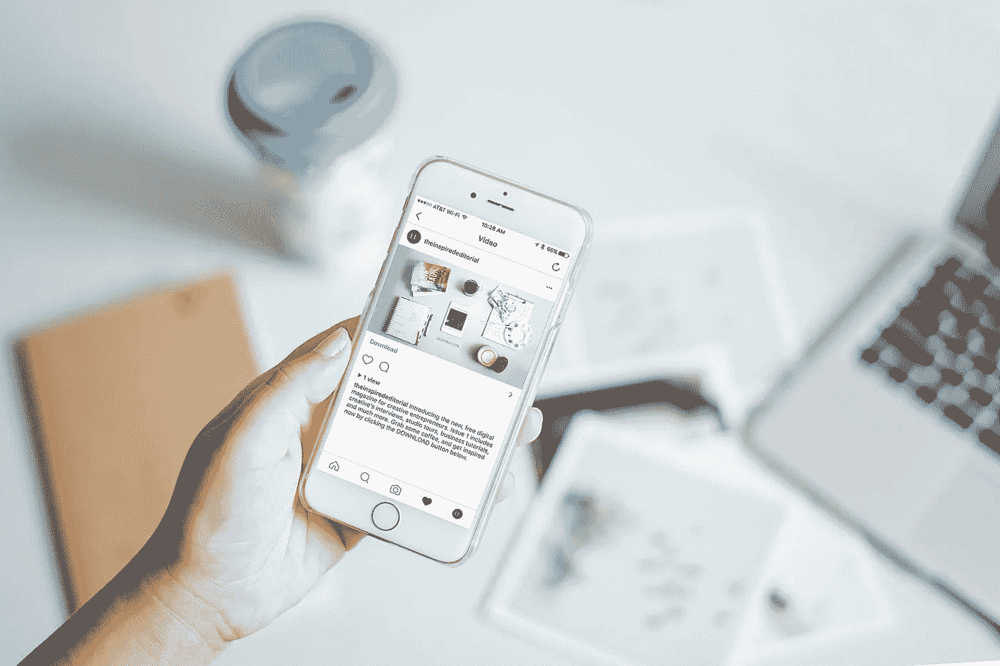
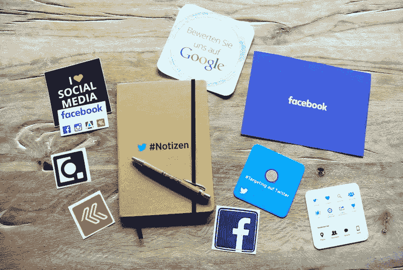

# 付费用户获取策略:成为应用商店 Rockstar 的 5 种方法

> 原文：<https://medium.com/hackernoon/paid-user-acquisition-strategy-5-ways-to-become-an-app-store-rockstar-b50a5fdfa40c>

你已经做了一个很棒的应用程序，现在你想获得一些用户，也有一点收入也不错。但这可能是一个艰巨的任务，随着越来越多的应用程序竞相下载，应用商店变得更加混乱。独立的应用开发者可以通过优质的应用和有效的营销策略从应用商店获得可观的收入。在这里，我们将向您介绍五个技巧，您可以使用它们来成功营销您的应用程序并获得用户:媒体评论、交叉促销营销、视频广告、基于奖励的营销，以及最后但并非最不重要的社交媒体营销。

# 媒体评论

获得积极的媒体评论是让公众了解你的应用并获得下载量的最好方法之一。例如，如果你有一个热门的商业应用程序，从一个著名的商业杂志或博客获得评论或推广可能是一个建立宣传和吸引潜在用户的巨大事件。审查请求有点像大海捞针。记者在这类事情上收到的大量报道，以及以一种更受欢迎的方式展示自己，往往会让你处于一个更好的位置。这可以通过简短的相关电子邮件提交和社交媒体互动来实现。

# 交叉促销营销

想法是这样的——借用别人的平台。您可以在相关受众的广告循环中为您的应用程序放置应用程序内促销广告。例如，如果你的应用都是关于视频编辑的，那么用一个拥有相当数量观众的摄影或照片编辑应用来做广告可能是一个好主意，并且不会提供有竞争力的功能。在这里，你利用了一个相关的利益，并希望为最终用户提供更多的价值。对于为你提供平台的应用程序和你自己的应用程序来说，这是一个双赢的策略，同时[提高你自己的用户获取数量](https://www.incredo.co/blog/promoting-your-mobile-app-for-greater-success)。

# 视频广告

在过去的几年中，视频广告的数量激增，目前投入到视频广告的收入接近 100 亿美元。十个营销者中有九个将视频广告纳入他们的整体营销策略。这也是获得客户浏览量和下载量的最重要的方式之一。作为传达信息的一种方式，视频广告让你不仅仅通过文本或音频来讲述你的故事。它唤起了更多的情感反应，因为观众能够看到，听到，并与分享这个故事的人联系起来。

此外，通过视频广告接触到你的应用的用户往往比那些通过不同广告渠道找到你的用户拥有更高的留存率。

# 基于奖励的营销

那些看到有机会尝试一些通常需要付出代价的东西的用户会认为自己得到了一些特别的东西。因为这不是每天都会发生的，而且他们(看起来)不劳而获。所以在这里，提供一个暂时免费的下载体验，带着一种紧迫感，是刺激用户浏览和下载你的应用的一种方式。众所周知的诱饵。为推荐他人使用该应用提供奖励，如附加功能，或使用另一个相关或付费版本的应用的折扣或免费通行证，也可以成为推动用户获取的一种方式。这些是人们倾向于喜欢利用和分享的东西。

# 社交媒体营销

从搜索引擎优化的角度来看，谷歌在搜索结果中为社交媒体档案提供了更高的特权，拥有多个社交媒体档案可以在搜索结果中提供更高的可见性。作为第二大搜索引擎，Youtube 是一个不可忽视的强大渠道。脸书和推特也不能被低估，他们都拥有超过 20 亿的每日搜索量。Instagram 也非常值得考虑，因为它每天有 35 亿张照片，每月有 4 亿用户。如果使用得当，它可能是病毒成功的关键。积极有效的社交媒体参与所能产生的潜在受众和投资回报使其成为成功广告活动的最重要方面之一，尤其是在移动用户获取的世界中，移动设备是大多数网络用户的访问点。

虽然拥有更多关于你的应用的社交媒体简介可以提高你的知名度，但仅仅填写简介是不够的。这是一种需要积极参与的方法，通过在每个地点推广来推动你的应用程序的活动。除了你自己的努力之外，目标明确的社交媒体广告也可以更快更有效地提升你的成绩。例如，像脸书这样的平台上的付费广告是一种很好的方式，可以将你的信息发送给可能会表现出兴趣并采取行动的目标受众。

当然，有各种各样的[方式来推广你的应用](https://www.incredo.co/blog/2014/09/17/12-creative-ways-promote-mobile-app-0-marketing-budget)。这只是其中的五个。一个应用程序的发布就像任何其他产品一样，它必须是高质量的，有用的，独特的，并且有一个可靠的宣传活动来将你的信息传递给正确的受众。应用程序营销没有灵丹妙药，您有责任了解您的受众，并通过结合使用各种方法和工具来定制营销活动，从而在应用程序商店中获得成功。

***发现这个帖子有用？好心的打了一下*** 👏**下方的*按钮显示你对这段内容的喜爱程度！:)***

跟随 Inapptics: [媒体](/@inapptics) | [推特](https://twitter.com/inapptics) | [脸书](https://www.facebook.com/inapptics/)

最初发表于[blog.inapptics.com](http://blog.inapptics.com/paid-user-acquisition-strategy-5-ways-to-become-an-app-store-rockstar/)

**阅读下一篇:** [6 种吸引应用用户的有效方法](https://uxplanet.org/6-proven-ways-of-engaging-your-app-users-99d9c5bc5327)

**作者简介:**

Artash Arakelyan 是 Incredo 公司的首席执行官。6 年互联网营销经验，营销执念。总是想着去异国旅行，希望我能整天吃高级定制的纸杯蛋糕。我的生日是 12 月 17 日，是的，我不介意匿名生日礼物！