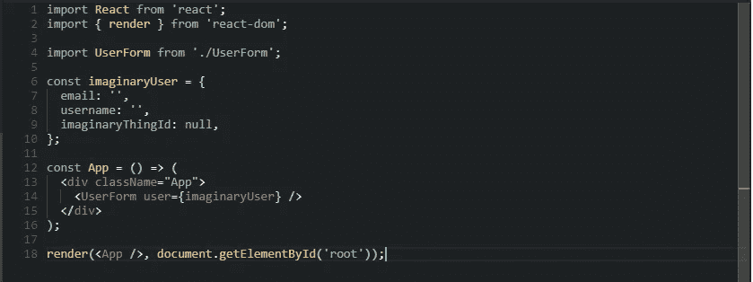
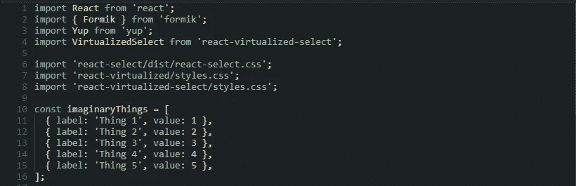
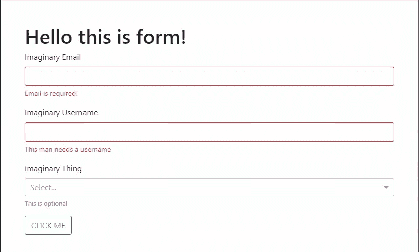

# 使用 Formik 进行无痛反应

> 原文：<https://medium.com/hackernoon/painless-react-forms-with-formik-e61b70473c60>


formik logo

我从一开始就和 [React](https://hackernoon.com/tagged/react) 在一起，我一直讨厌的一件事是，编写表单和相应的验证是多么无聊，有时甚至是困难的工作。它需要做太多的工作来获得回报，并且需要做更多的工作来集中和重用代码。

嗯，不再是了！😃 ✨✨✨

我最近发现[福米克](https://github.com/jaredpalmer/formik)，疼痛消失了！

[Formik](https://hackernoon.com/tagged/formik) 帮助解决 React 中处理表单的主要问题:

1.  **将道具转化为形态状态**
2.  **验证和错误信息**
3.  **处理表单提交**

对于验证，Formik 使用了[是的](https://github.com/jquense/yup)，这是一个惊人的对象模式验证/解析库。

让我带你浏览一下这个神奇产品的速成教程。

# 构建表单

首先安装软件包，包括 Formik 和 Yup

```
yarn add formik yup
```

让我们开始构建我们的表单。它将由一个虚构的用户填写他的电子邮件，用户名和一些虚构的东西了许多选择。相当标准的形式，你会看到它是多么容易。

完整的最终示例[此处](https://codesandbox.io/s/zl8zr8yqx)或以下！😄

working example

我们的主文件 **index.js** :



index.js

当然，这只是一个用于演示目的的根文件的基本示例，但是我想指出的是**imaginar user**变量可以来自你喜欢的任何地方。无论是 API、从文件中读取还是其他。我们只需要它的缺省值(或现有值)来将它们映射到 Formik 中。

所以我们看到我们有一个用户，他的电子邮件是空白的，用户名也是空白的，imaginaryThingId 的**和**都是空的。再来看看我们的 **UserForm.js** 。



UserForm.js dependencies and variables

我们首先必须得到我们的 Formik 和 Yup 依赖项。

我使用[react-virtualized-select](https://github.com/bvaughn/react-virtualized-select)来选择具有记忆功能的框，以最大限度地提高许多项目的性能。我们还必须包括默认外观的选择框样式。

**imaginaryThings** 只是选择框的一个选项数组，它们是为了演示的目的而声明的。您可以获取它们，并按照您喜欢的方式传递它们。它们已经为选择框进行了正确的格式化。

我们想要这样的东西:



正如我们所看到的，这是再简单不过的了。必需的电子邮件、必需的用户名和可选字段。让我们看看如何把这些都插上。

通过浏览表单代码，你可能已经意识到 Formik 是一个特设([高阶组件](https://facebook.github.io/react/docs/higher-order-components.html))。它给你的表单组件注入了一些便利的道具，你可以用它们做任何你想做的事情！

在我的例子中，我已经定制了 **mapPropsToValues** 、 **validationSchema** 和 **handleSubmit** 。

**mapPropsToValues:** 你可以用它来简化和“展平”一些嵌套的对象，以使事情更容易理解和操作。

**validationSchema:** 这是您定义表单验证的地方。使用 Yup，您可以创建简单和复杂的验证结构。我将在这篇文章的后面给出两个复杂的例子。

**handleSubmit:** 这是表单的提交处理程序。只有当表单有效并且您可以在其中做任何事情时，它才会触发。你想做一个翻转，唱一首歌，去吃寿司，然后发送数据到服务器？！


JUST DO IT

如果你摆弄过我的例子，你可能知道要点。**值**属性保存所有表单值，**错误**(咄！)、**触摸**和**脏**分别保存输入失去焦点和用户与输入交互的值。

我使用的函数是 **handleChange** ,它处理值和输入名称(如果没有名称和 id 的话),为您变魔术。如果你在变魔术之前需要一些额外的工作，你可以使用 **setFieldValue** ，我用它来设置 **imaginaryThingId** 的值。 **handleBlur** 处理输入的模糊事件并运行验证。最后**处理提交**，我们直接插入表单的 **onSubmit** 事件。

正如你所看到的，这非常简单。你什么都不用做，Formik 是一只野兽，它会为你做所有的事情，同时给你提供超越的工具。

# 让我们来谈谈验证👌 ✅ ❎

给 Yup 的文档是**惊人的**。你可能会在那里找到你想要的任何东西。但是，因为我是一个好人，所以我将抛出一些复杂形式的验证的例子。

这里有一些为演示目的而简化的例子。

## 如果我想验证用户名的长度，只有当电子邮件是 foobar@example.com？


JUST DO IT

我们可以看到，当电子邮件是**example@foobar.com**时，我们将 **min** 规则添加到模式中。如果没有，我们只是原封不动地返回模式！

## 如果我想根据情况更改错误消息的标签，该怎么办？


JUST DO IT

很简单！Yup 有**。为此标记**。让我们看看如何！

如您所见，当条件为真时，标签会切换到 **papidipupi** 的错误消息中。我们可以通过将 **${path}** 添加到我们想要的任何消息中来动态地做到这一点。例如:所需的错误消息。

## 如果我想运行自己的自定义验证函数，该怎么办？


JUST DO IT

为此，我们将使用**测试**函数，该函数允许您为特定字段定义新的测试。

让我们看看是否可以具体测试用户名是(没有合理的理由)**之字形！**

正如我们所看到的，我们刚刚添加了一个简单直接的检查！

我们可以继续下去，但我想我已经提供了足够的基础知识来引导你使用 Formik 和 Yep！这两个项目都有大量的文档，所以你必须去看看。

# 链接和参考💻

[Formik Github](https://github.com/jaredpalmer/formik)

[Formik 基本演示](https://codesandbox.io/s/zKrK5YLDZ)

[这个故事演示](https://codesandbox.io/s/zl8zr8yqx)

[是 Github](https://github.com/jquense/yup)

[是沙盒](https://runkit.com/jquense/yup)