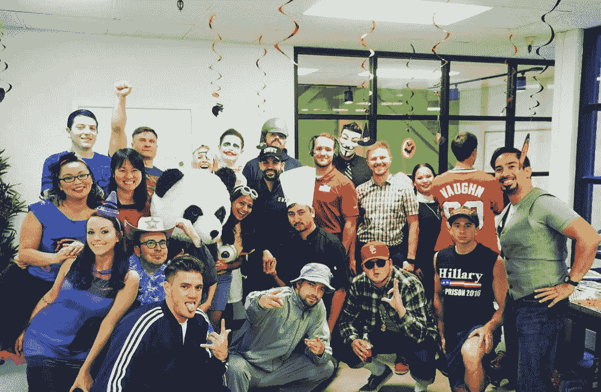
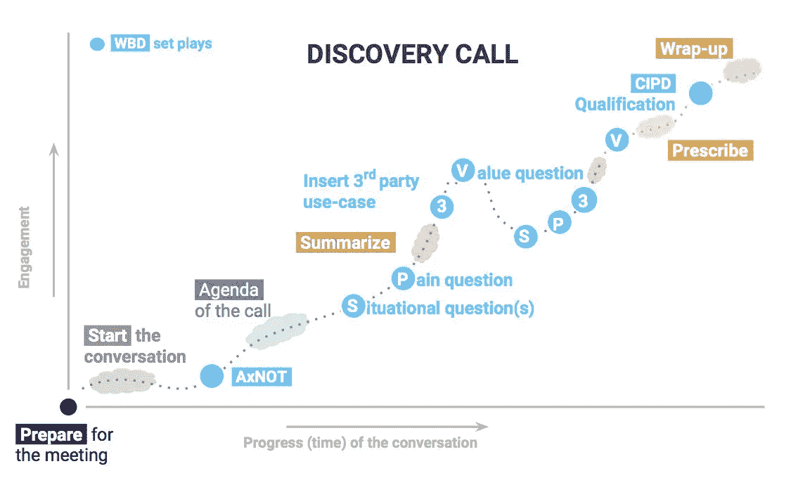
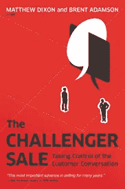

# PandaDoc 如何在两年内从 100 万美元增长到 1000 万美元

> 原文：<https://medium.com/hackernoon/pandadoc-growth-10-million-1d5f82e4c26f>

## 潘达多克销售的秘方

虽然没有销售成功的灵丹妙药，但有一些屡试不爽的销售策略，所以你不必重新发明轮子。 ***销售秘笈***[***fresh Sales***](https://www.freshworks.com/freshsales-crm/?utm_source=Medium&utm_medium=Secret%20Sauce&utm_campaign=JFPandaDoc)*介绍各行各业的顶级销售领袖，让您深入了解他们的销售方法。*

Jared Fuller 是 PandaDoc 的销售和业务发展副总裁。PandaDoc 是一个应用程序，可以让您在一个地方构建、跟踪和签名您的文档。超过 7000 家公司使用该应用程序。在 PandaDoc 之前，他是多家创业公司的创始人，包括 JobHive(招聘自动化软件)。

Jared 是 entrepreneur . com 2017 年十大最具创新力的销售领袖之一。他还定期向 Inc、《企业家》、《赫芬顿邮报》等杂志投稿。

我们设法找到了贾里德·富勒，谈论他在 PandaDoc 的销售故事。开始了。

## 你一生都是创始人，是什么让你加入 PandaDoc 的？

有一段时间，我们知道 JobHive 不会成功，我正准备开发我的下一个产品。奇怪的是，我是 JobHive 的 PandaDoc 的测试版客户，我认识[在这里，学习是最重要的。我们相信每个人都是来学习的。这也是我们文化的核心。正如杰克·韦尔奇(通用电气公司前首席执行官)所说:](https://medium.com/u/819a5d3a829b#1.很多失败。
</blockquote>
 [一个组织的学习能力，以及快速将学习转化为行动的能力，是最终的竞争优势。](https://medium.com/u/819a5d3a829b#1.很多失败。
</blockquote>
</blockquote>
</blockquote>
 [#2.渴望学习。](https://medium.com/u/819a5d3a829b#1.很多失败。
</blockquote>
</blockquote>
 [我的销售代表以前从未从事过专业工作，这与旧金山的销售招聘方式完全背道而驰。](https://medium.com/u/819a5d3a829b#1.很多失败。
</blockquote>
</blockquote>
 [#3.尊重并努力掌握销售技巧。](https://medium.com/u/819a5d3a829b#1.很多失败。
</blockquote>
</blockquote>
 [阅读关于](https://medium.com/u/819a5d3a829b#1.很多失败。
</blockquote>
 时间和价格。不是时机不对就是太贵。

你必须知道如何识别这些错误的异议。这些就是我所说的虚假异议。你被骗了，因为你没有成功通过前四个销售关口。

**关口 1:愿景=定位**

如果他们没有围绕你的产品愿景达成一致，那就没得谈了。

也就是说，如果我的客户不鄙视 Adobe PDF、Microsoft Word、通过电子邮件发送附件、进行修改以及花数小时完成提案的噩梦，他们就不会购买我们的产品。

**网关 2:验证=信任**

如果他们不相信你考虑到了他们的最大利益，他们会反击。

如果我的潜在客户不相信我的产品是最好的，也不相信我在为他们的团队改进销售流程而努力，他们可能会说时机或价格不合适。

**关口 3:痛苦=价值**

如果他们不能将他们的痛苦与你产品的价值联系起来，他们就不会和你一起前进。

您的潜在客户必须能够清楚地阐述您的解决方案如何解决他们的问题。如果他们不能，这是一个交易破坏者。

**关口 4:决策者**

如果你不与决策者交谈，你就在为自己设定一个更长的销售周期。

看门人或内部倡导者几乎总是会回来要求更多的时间或巨大的折扣。

**网关 5:价格**

如果你的潜在客户将价格作为一个障碍，那么他们首先就不符合你产品的价值。

**网关 6:时间**

如果你的潜在客户告诉你他们需要更多的时间，他们很可能被困在另一个关口。

> 买入的时机永远是现在。

[**The 6 Gateways of Sales**](https://www.huffingtonpost.com/young-entrepreneur-council/the-6-gateways-of-sales_b_8306490.html) by Jared Fuller

## 在您的发现电话中，您会问哪些开放式的问题来帮助您通过这六个关口？

我按照 **AxNot** 的程序由[T3【丹·史密斯】T5 披着](https://medium.com/u/da40de8ee6da?source=post_page-----1d5f82e4c26f--------------------------------)[的解剖完美的发现叫](/@justdansmith/the-anatomy-of-a-perfect-discovery-call-919dcca43158) **。**

**AxNOT:通话开启**

*   感谢您抽出时间接听今天的电话。
*   **x** = time →“我们今天安排了 30 分钟的发言时间，这对你来说还合适吗？记得听他们的回应，必要时调整你的称呼)
*   很自然，你会问我一些关于我公司的问题。
*   很明显，我想问你一些关于你的团队和目标的问题，如果我们能帮上忙的话。
*   通常，这个电话会以我们决定评估的下一步结束，或者如果在任何时候你意识到这不是一个很好的选择，你会打断我让我知道吗？

我加倍下注。我让我的潜在客户知道，如果我没有增加价值，他们可以让我知道。

> 我告诉他们，“我不想让你的收件箱被诸如跟进、检查、联络之类的邮件弄得乱七八糟。如果不合适，请告诉我。”

[Winning By Design](https://winningbydesign.com/) — Discovery Call Framework

[理查德·哈里斯](https://medium.com/u/78909f25c276?source=post_page-----1d5f82e4c26f--------------------------------)称之为**“建立尊重契约”**。在通话开始时，它为诚实定下了基调。如果你不这么做，你会被误导的。你不会关门，因为他们不信任你。

## 你最喜欢的提高效率的方法是什么？

电子邮件提醒——它们是最好的。说行动和基于时间的提醒，提醒我，如果一个潜在客户没有在 x 天内答复。

> 阅读“ [**五个销售工作流程自动化，它们是伟大的生产力黑客。**](https://stories.freshsales.io/6-workflow-automations-that-are-actually-awesome-productivity-hacks-c2b7347f6805)

## **你每天看的三个指标是什么？**

1.  已预订机会。
2.  新销售线索的数量。
3.  销售接受的销售线索。

## 你最喜欢的销售报价是什么？

这不是一个销售报价，但我喜欢这个由 Jerzy Gregorek(作家和举重运动员):

> 艰难的选择。轻松的生活。简单的选择。艰苦的生活。

## 你推荐的销售读物是什么？

有两本书。一个是最近最喜欢的，另一个我推荐给我的销售团队:

[***“永远不要分割分歧——谈判就像你的生命取决于此一样。”***](https://www.amazon.com/Never-Split-Difference-Negotiating-Depended/dp/0062407805/)

作者是克里斯·沃斯(前联邦调查局人质谈判专家)。这是一本很棒的读物！

[***《挑战者销售——掌控客户对话》*作者布伦特·阿达姆松和马修·狄克逊**](https://www.amazon.com/Challenger-Sale-Control-Customer-Conversation/dp/1591844355)

做顾问对有些人来说很难。销售代表需要明白，你需要成为挑战他们当前业务流程和提供更好产品的专家。十有八九，你的产品不会符合你的潜在客户所期望的完美循环。他们必须改变一些东西来适应你所销售的工具或服务。

[***fresh sales***](https://www.freshworks.com/freshsales-crm/?utm_source=Medium&utm_medium=Secret%20Sauce&utm_campaign=JFPandaDoc)*是一款专为帮助您停止杂耍多种工具而打造的销售 CRM。非常适合小型企业，让企业耳目一新。*

虽然没有销售成功的灵丹妙药，但有一些屡试不爽的销售策略，所以你不必重新发明轮子。《新鲜销售秘笈》介绍了各行各业的顶级销售领袖，并让您深入了解他们的销售方法。请在评论中给我们留言，或者发邮件给***nivas.ravichandran@freshworks.com****提出建议。*

对我在这个博客上的合著者阿丽娜·本尼大声喊出来！

 [## 艾莉娜·本尼-中号

### 据《连线》报道，该漏洞并非源自 Android(或任何固件版本),而是来自…

medium.com](/@alinabenny)