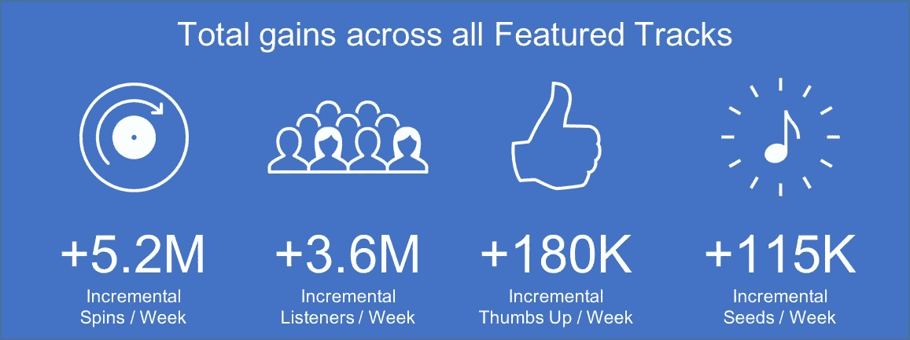

# 潘多拉有三个数字对你来说应该是天籁之音:4000 万，7600 万，10 亿。

> 原文：<https://medium.com/hackernoon/pandora-has-three-numbers-that-should-be-music-to-your-ears-40-million-76-million-and-1-billion-ab424913a4b5>

## 艺术家营销平台是任何流媒体服务中最好的艺术家工具。句号。等等，去掉句号。潘多拉刚刚宣布了一些新功能。

由格伦人民，潘多拉音乐见解和分析

俗话说，天下没有免费的午餐，但它并不总是适用于流媒体服务的艺术家[工具](https://hackernoon.com/tagged/tools)。

就在潘多拉推出其分析和[营销](https://hackernoon.com/tagged/marketing)工具的新功能时，它也宣布它通过了**10 亿次艺术家创作信息的展示**。如果你最近一直在听 Pandora，你可能会听到一个最喜欢的艺术家关于新音乐、混音带或本地节目的消息。这些信息很酷，这也是潘多拉从每月超过 7600 万听众中选择你的原因:科学。稍后会详细介绍。

艺术家可以使用潘多拉**艺术家营销平台**上的推广工具，并保证他们将到达正确的听众。当然，还有其他方式来宣传一首歌或一张专辑。社交媒体也提供了与粉丝的联系，但这些服务可能需要艺术家真金白银才能在社交媒体上接触到粉丝。艺术家营销平台免费提供对潘多拉每月 7600 万听众的洞察和访问。

印象有价值。如果 Pandora 的 10 亿次音频信息展示的成本与一次普通的脸书广告活动的成本相同，它们将价值约 4000 万美元。(这个数字是基于 Pandora 语音信息的平均点击率和脸书一项极具针对性的广告活动的每次点击成本 1.68 美元得出的。)这是有效地找到了钱。对于独立艺术家和独立唱片公司的艺术家来说，他们通常没有多少资源用于在线营销活动，音频消息提供了令人难以置信的投资回报。

**可以肯定地说，潘多拉的艺人营销平台优于同行**。其他流媒体服务也提供分析见解，向艺术家展示人们如何以及在哪里听他们的音乐。幸运的是，这些以艺术家为中心的产品实际上已经成为做生意的基本要求。虽然比赛只能让观众一瞥他们的听众，就像一个孩子透过商店橱窗看玩具一样，但 Pandora 已经创建了一套实用的艺术家工具。艺人可以利用这个平台直接与粉丝沟通，推广他们的音乐、演出和新专辑。

周二，潘多拉公布了艺人营销平台的四项改进。三个是新功能，一个是现有功能的更新。获得产品更新、功能或里程碑事件的新闻报道并不容易，但周二新闻报道的广度，从[福布斯](https://www.forbes.com/sites/hughmcintyre/2017/07/18/pandoras-artist-marketing-platform-has-now-racked-up-one-billion-ad-impressions/#483e045b48b5)到[每日双点击](http://hitsdailydouble.com/news&id=307542)到[综艺](http://variety.com/2017/music/news/pandoras-artist-marketing-platform-hits-1-billion-impressions-1202499793/)，暗示了一些事情。首先，人们仍然注意到潘多拉对艺术家社区工具的投资。第二，10 亿次信息印象的里程碑有点令人眼花缭乱。

两个新功能，**推广秀**和**推广单**，增加了艺人音频信息的有效性。Promote Show 通过提高艺术家在巡回演出的所有日期对粉丝进行地理定位的能力，帮助推动门票销售。推广单曲允许艺术家将特定的音频消息链接到特色曲目活动。另一个新功能是**自定义个人资料照片**，这是自去年秋天以来最受欢迎的功能。

**特色曲目**也得到了改进。它是这样工作的:一个艺术家选择一首歌——也许是一首新单曲——它想让听众听到。特色曲目将逐渐加快向听众推荐该曲目的过程。这与通过看门人——电台 DJ、程序员——接触听众有着本质的不同。即使有特色曲目的帮助，潘多拉的音乐发现仍然是一个由听众驱动的现象。如果听众喜欢一首歌，Pandora 会更频繁地播放它。听众听到什么最终取决于听众。你可以通过 Pandora 数据科学团队成员的这篇[详细文章来深入了解精选曲目，或者在艺人营销平台网站](https://engineering.pandora.com/promotional-song-targeting-bb2bb6913ece)上获得该功能的[概述。](https://ampplaybook.com/featured-tracks/)

这些新功能增加了**的元素，提高了**的针对性。Pandora 调整了估计听众对某个艺术家的喜爱程度的方式。换句话说，额外的信号被考虑在内，以完善和提高艺术家音频信息和特色曲目的准确性。更高的准确度会让最容易接受的听众听到信息，并让曲目流向最有可能对歌曲竖起大拇指的听众。艺术家想要更多的拇指，因为它们将导致更多的旋转和更多的种子(种子是用作新电台起点的艺术家、专辑或曲目，种子)。

**艺术家们注意:精选音轨是一个不容忽视的工具**。它的积极影响对于每天收到少于 1000 次旋转的艺术家来说甚至更大，那些崭露头角的、发展中的艺术家可以从强大的营销工具中获得最大的好处。

在早期测试中，**精选曲目已经发布了很好的指标**。以拇指比例为例。艺术家们希望听众能够欣赏他们的歌曲，因为 Pandora 会相应地调整未来的推荐，最重要的是，重新播放歌曲。当听众听到一首精选的歌曲时，有 82%的可能会竖起大拇指。这是很好的目标。艺术家也希望听众使用他们或他们的音乐来建立一个新的电台。这里也有不错的表现。特色曲目的听众现在多创造了 56%的种子。一颗新种子就像一个发现引擎。当用户基于某首精选曲目创建新种子时，Pandora 会收到该信号，并更频繁地播放该歌曲和该艺术家。更多的拇指和更多的种子使得特色曲目的旋转平均增长了 25%。

从太空中观察，特色赛道的影响是惊人的:每周 520 万次增量旋转，或每年 18 亿次增量旋转。

数字音乐已经走过了漫长而曲折的道路，直到周二的发布。今天，数据被认为是一种与艺术家和唱片公司共享的资源。潘多拉建立营销工具的方式有一种强烈的合作意识。但在数字音乐行业，情况并非总是如此。一些数字服务试图以邪恶的方式利用听众数据。

最初的 Napster 早期商业模式要求听众数据成为一道防御墙，以保护唱片公司免受其平台上发生的版权侵权行为的影响。正如《所有的狂欢》一书中所描述的，Napster 希望发展到足够大，以利用其关于用户收听习惯和音乐收藏的数据。“Napster 将能够告诉华纳兄弟，在他的电脑上有 Cure MP3s 的普通人最有可能对寻找暴力女性的新音乐感兴趣，”它解释了“太大而不能倒”的战略。

臭名昭著的 Grooveshark 也计划利用其数据。这家非法流媒体服务公司计划积累 1 亿用户，然后将听众数据出售给唱片公司，确保 Grooveshark 支付给唱片公司的内容成本低于唱片公司支付给 Grooveshark 的粒度听众数据，根据母公司董事长在对该公司的诉讼中透露的一封电子邮件。这不是一个好策略，Grooveshark 在 2015 年倒闭了。

今天的法律服务可以保护和保密他们的数据。没有一个音乐下载服务提供潘多拉所提供的透明度、分析和艺术家工具。但对艺术家来说，有一个好消息:越多的人将他们的收听从自有音乐转移到流媒体，艺术家对他们的音乐就有越多的洞察力。

二月份，我概述了[潘多拉正在做的推动行业发展的 10 件事](/@glennpeoples/10-things-pandora-is-doing-to-help-move-the-industry-forward-48338d3e89cb)。艺术家营销平台榜上有名，其他上榜的还有直接授权协议、新的 Pandora Premium 和 Pandora Plus 服务、拇指纹电台，以及像 *Questlove Supreme* 这样的原创内容。潘多拉在很多方面帮助艺术家和音乐产业。但是艺人营销平台是艺人可以用来自助的。