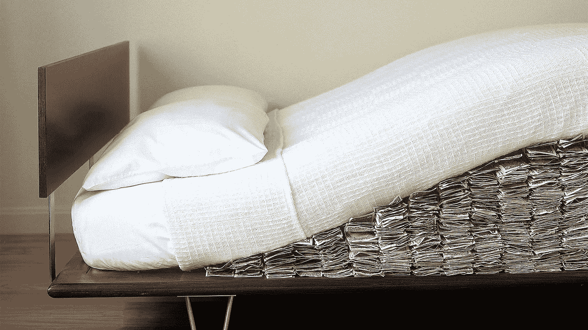

# 纸质钱包

> 原文：<https://medium.com/hackernoon/paper-wallets-2a88f3f443e1>

你可以用比特币做的最令人兴奋的事情之一就是将它们发送到一张纸上。这听起来有点平凡，但是想一想。在比特币出现之前，你，普通公民，是做不到这一点的。当然，你可以创作一幅画、写一本书或创作一首交响乐并出售，但你不能只是把你的劳动成果放进一个二维码。现在你可以了。这意味着巨大的影响。现在，把钱藏在床垫下实际上是银行金库的一个可行替代方案，因为通货膨胀或监管不会再从中吸取价值。那么你是怎么做到的呢？

首先，密码俱乐部的第一条规则是:

你的钥匙——你的比特币，不是你的钥匙——不是你的比特币。

你需要做的是遵循这些简单的步骤来确保你是控制你的私人密钥的人。

*   用公钥和私钥创建一个比特币地址*离线*
*   离线打印这些键
*   *离线擦除*私钥*的任何痕迹***
*   *向这个新创建的地址发送比特币*

*有很多方法可以创建你自己的密钥，但是可以说最好的方法之一是使用基于开源的网络服务，比如 www.bitaddress.org*

*开源软件是可以信任的，因为任何人都可以审查代码。你不必知道代码的每一部分是做什么的，因为你可以相信有人会做。*

*同样的事情也适用于你的网络浏览器。*

1.  *下载并安装一个你不常用的开源浏览器，比如[https://www.mozilla.org/firefox/](https://www.mozilla.org/firefox/)*
2.  *转到[www.bitaddress.org](http://www.bitaddress.org)*
3.  *使*离线**
4.  *通过移动鼠标来创建地址*
5.  *离线打印纸质钱包*。*确保你的打印机也离线了，或者，如果你真的有妄想症，手动记下密钥*
6.  *清除浏览器的*缓存*。这是你刚刚访问的网站的所有信息临时存储的地方，包括你刚刚创建的非常秘密的密钥。你可以在 Firefox 的设置菜单中设置。*
7.  *卸载浏览器并删除所有相关文件*

*了解每个步骤的作用以及*为什么*您可以信任流程中的每个步骤，这一点非常重要。如果你对阴谋论感兴趣，甚至还有更多防弹步骤，比如专门为此购买一台专用电脑和打印机，并在再次上网前用压路机碾压，但如果你知道自己在做什么，上述方法应该足够了。www.bitaddress.org 的[网站可以从同一个种子中为你创建三个不同的地址，你可以通过向其中一个发送少量比特币来查看它们是否按预期工作，从而轻松检查它们是否工作。](http://www.bitaddress.org)*

*完成上述步骤后，用手机上比特币钱包中的二维码阅读器扫描公钥。确保你的手机摄像头*看不到私钥！再次强调，如果你有妄想症，只需将公钥输入你的钱包。大多数比特币钱包都可以做到这一点。再次上线，把比特币发到这个地址。**

*这个地址现在的价值和你寄给它的比特币一模一样。这反过来意味着你只是给纸分配了一个特定的值。只要报纸没有受到损害，你就拥有你刚刚寄给它的任何金额。例如，如果你在 2017 年 2 月 1 日制作了一个价值 1000 美元的纸质钱包，它将被分配 1 个比特币。将日期改为 2011 年 1 月 1 日，你将有 3333 个比特币被分配给它。*

*祝你好运！*