# 纸莎草纸去

> 原文：<https://medium.com/hackernoon/papyrus-go-267d4b83a1f8>

纸莎草字体以其细长、破旧字体的媚俗美学而闻名，似乎从未在设计知识分子的心中找到一席之地。忘记了它可能在网上发现的仇恨者和普遍的反击，它在过去几十年里坚持不懈地成为某种程度上臭名昭著的 21 世纪名人。

它已经变得无处不在，现在可以在商店标牌、食品标签、视频标题等各种载体上找到它。随着越来越多的选择，还不清楚它会持续多久…所以在它完全被遗忘之前，在它被给予最后一击之前，我想给它一个适当的送别。如果纸莎草纸已经存在和使用了这么长时间，那一定是因为它提供了一些东西，作为一种字体，作为一种品牌解决方案，仍然有些相关。在这篇文章中，我探索了是什么让它如此流行和臭名昭著，纸莎草纸的使用说明了我们的视觉文化，以及自从数字印刷术产生以来，它是如何在世界上演变的。

# **背景故事**

当试图弄清楚是什么让纸莎草纸成为如此广泛使用(或至少是可识别的)的字体时，有几个原因浮现在脑海中。一个很好的切入点是 [Michael Beirut 为《设计观察家》撰写的文章](http://designobserver.com/feature/graphic-design-criticism-as-a-spectator-sport/37607/)。在这篇文章中，贝鲁特概述了“大多数人”在判断标志设计质量时倾向于关注的三件事，换句话说，这三个关键因素使得低挂水果设计的价值受到质疑。根据他的说法，人们更喜欢看起来像他们努力创造的标志和图形，他们更喜欢字面上的东西而不是隐喻，他们更喜欢他们“习惯”的东西。在贝鲁特看来，纸莎草纸可能是典型的低挂品牌果实，因为它拥有所有受大众欢迎的成分。

但这还不是全部…考虑到纸莎草纸最初是在 1984 年以 Letraset vinyl rub-off 字体发布的，然后随着微软 Office '97 套件首次出现在桌面计算机的数字领域，它已经存在了近 20 年。当你看看竞争对手时，在 Office97 提供的所有其他[字体中，Papyrus 脱颖而出，成为少数几个既有手写又有纹理风格的字体之一(有 Blackadder、Bradley Hand ITC、Chiller、Viner Hand ITC ),也是唯一一个真正发挥其书法、夸张大写字母和痛苦的字体的字体，赋予其“复杂”的美学部分真实，部分预言。这种独特的风格，以及它作为当时大多数个人电脑标准的默认文字处理软件的一部分已经存在了近三十年的事实，使它成为了我们视觉文化的核心。从而使其成为低预算品牌努力和自制设计的前沿解决方案。然而，一个问题仍然存在，究竟是什么将纸莎草纸与其 Office '97 发布伙伴分离开来？](https://www.microsoft.com/typography/fonts/product.aspx?PID=91)

# **一次纸莎草纸冒险**

当开始这个小项目时，我的假设是纸莎草纸有更多的东西，一些我不能简单地从我的电脑屏幕后面合理化的东西。几个月前，就在[口袋妖怪 Go](http://www.pokemongo.com/) 狂潮爆发的时候，我决定通过收集我能找到的所有纸莎草样本来探索这种纸莎草现象，希望它们能揭示字体的神奇成分，并揭示它的吸引力。在我寻宝游戏的过程中，我大部分时间都在洛杉矶，并短暂访问了法国和瑞士，所以你会发现所有三个地方的样本，但大部分来自洛杉矶(下次来洛杉矶时，请随意寻找它们)。以下是一些从最常见到最小众的主题。

## 精神品牌:

有几次，我看到纸莎草纸被用来唤起经文、缥缈的概念，暗示神性或不可理解的事物:它出现在修道院院长金内的神秘之旅书店的主要标志上，洛斯费利兹的山达基教堂的商标上，在备受质疑的古鲁的视频中，以及在阿尔罕布拉的圣地咖啡店周围(更不用说詹姆斯卡梅隆的头像了……)。有趣的是，这些应用程序非常接近字体的原始灵感，因为它的创造者[科斯特洛告诉《快速公司》:](https://www.fastcodesign.com/3055865/meet-the-man-who-created-papyrus-the-worlds-other-most-hated-font)“我当时想了很多关于中东和圣经时代的事情，所以我画了很多有发际线排列的连字和字母。”

值得注意的是，大量的工作和风格探索进入了这种字体的创作，它来自根深蒂固的书法形式语言，贝鲁特的信用这些特点与“大多数人”产生共鸣。

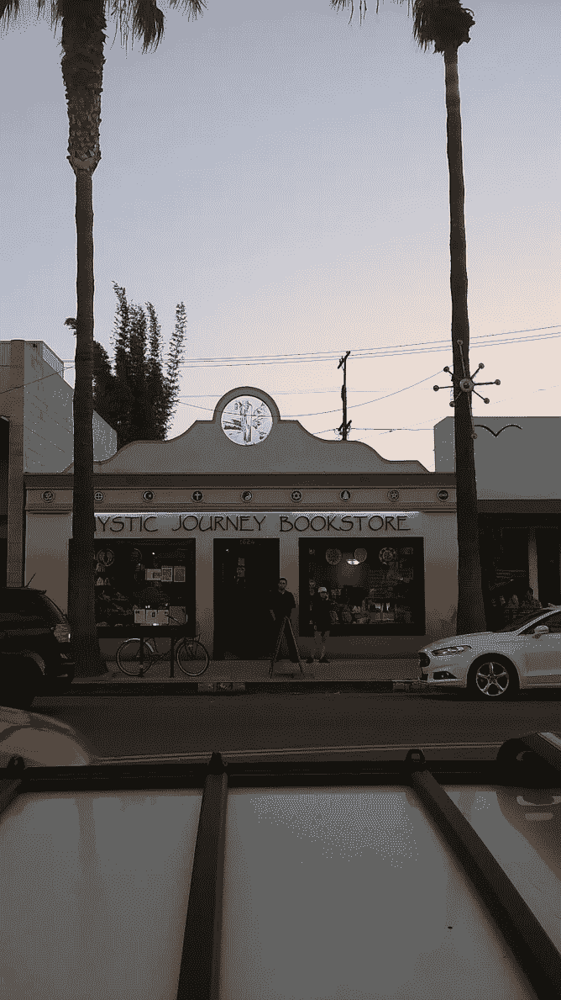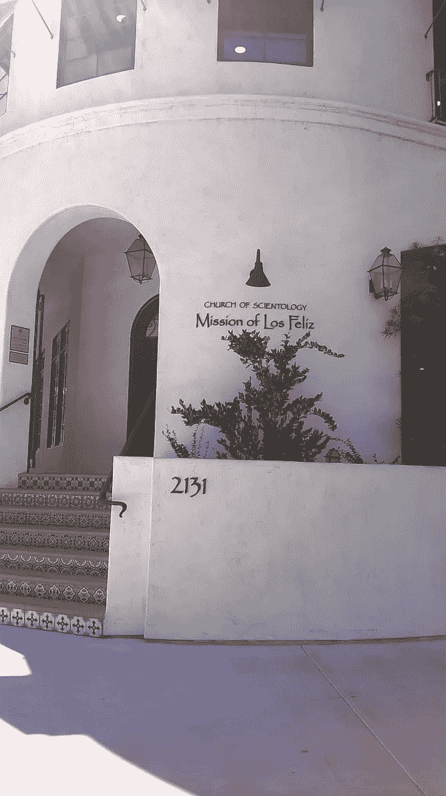

## 天然品牌 **:**

给予产品一种自然的氛围是纸莎草最为人所知和最常用的，它出现在乔氏维生素 E 油瓶、瑜伽课海报、凉茶包装和阿特沃特水培商店上。每个例子都指向健康、锻炼、营养的自然、环保的替代方案。这种应用也是纸莎草纸最常被驳回的原因:

“人们抱怨连环画。纸莎草纸更糟糕。如果你去健康食品店，所有的“天然”产品都使用这种字体。就好像他们认为消费者会愚蠢到相信某样东西不可能是天然的，除非它被大地色和丑陋的字体所覆盖。纸莎草纸是一种散发着广藿香臭味的可怕字体。”【Papyruswatch.com/罗雷梅朱恩

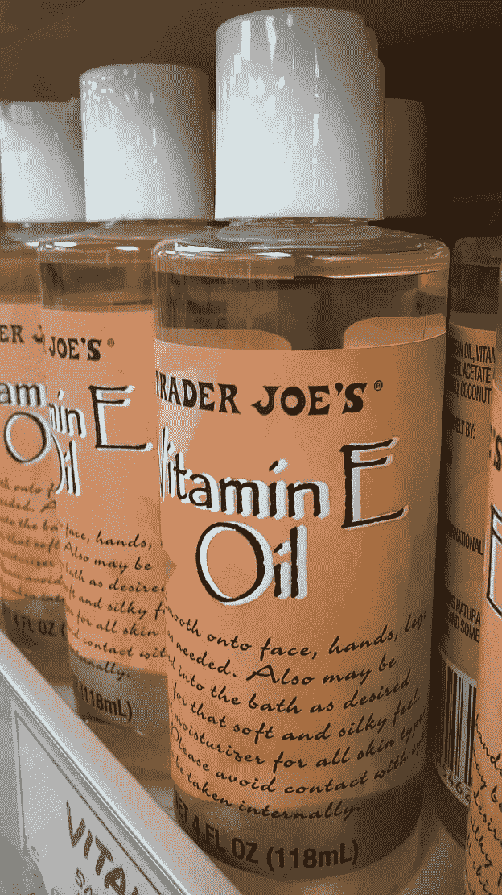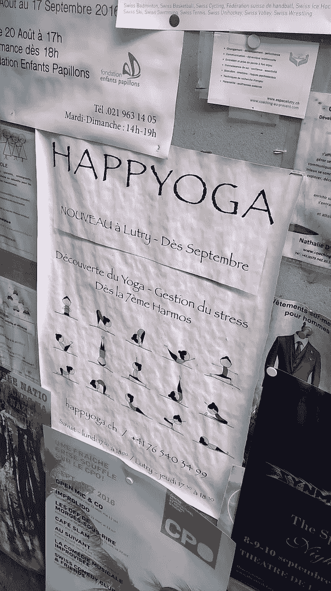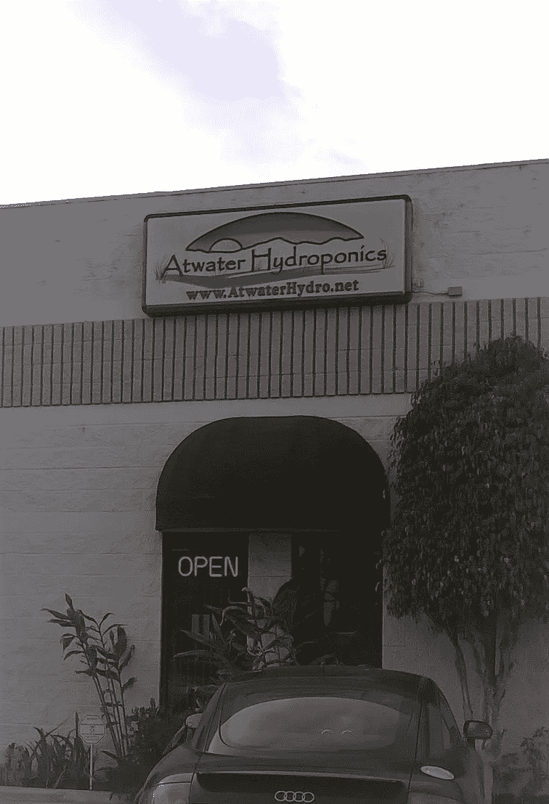

## 一个异国情调的品牌:

我能预见到的一个更令人惊讶的主题是，纸莎草纸被用作所有外来事物的首选字体，特别是如果使用它的产品或品牌与亚洲有一点点联系的话(不管是哪个国家)。一本关于日本色情行为的书，小东京的一家供应日本啤酒的酒吧，一箱 babaghannouj 和现成的绿茶，都用纸莎草纸来销售产品，暗指充满丰富文化遗产的遥远国度。在每一个例子中，字体都是用来引起外国人微妙的神秘感和好奇心，而不是真正传达任何类型的细节。

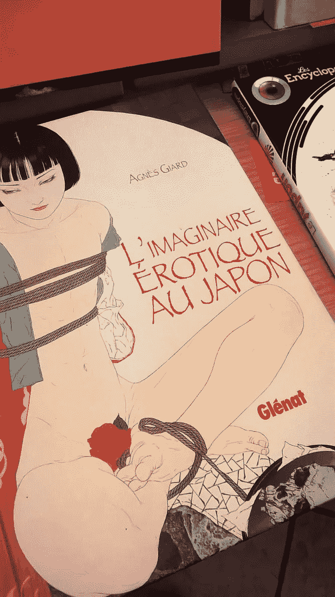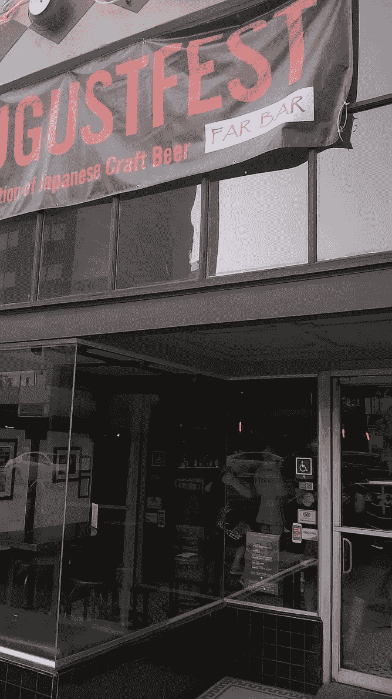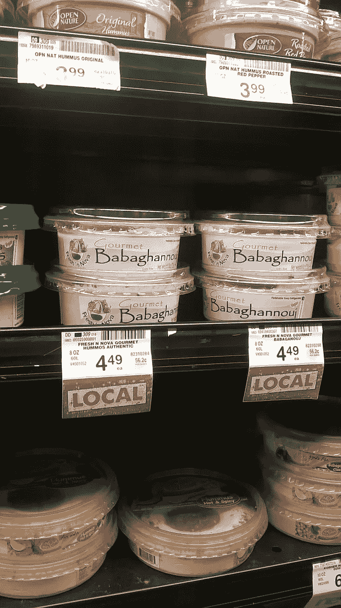

## 一个文化品牌:

一种不太常见但更具体的异国情调纸莎草纸可以用来暗示与伪文艺复兴-意大利文化的结合。它被用在橄榄花园礼品卡上，标题是“享受意大利的礼物”，洛杉矶周围的一系列公寓命名为达芬奇、美第奇、彼得罗等，还有韩国城的一家咖啡馆名为“在你的杯子里品尝欧洲”。这些对意大利和旧大陆的引用旨在向观众传达一种不可否认的古典文化。这种技术是否有效是另一个问题，但这个主题不同于上面的异国情调的主题，因为它渴望通过文化传达一种精英主义的感觉，而不是未知的吸引力，出售地位而不是好奇心。

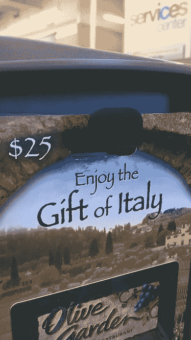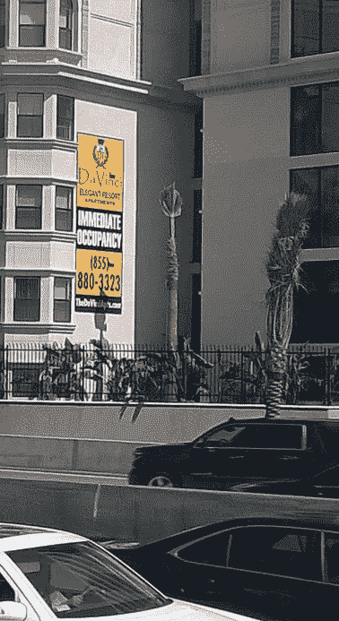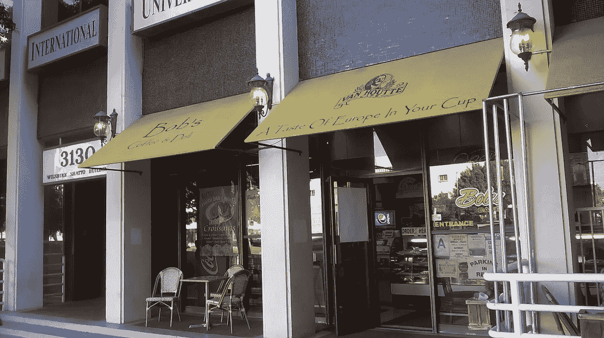

## 公共品牌:

尽管在有限的场合下，纸莎草纸最令人惊讶的应用是在基层，以社区为中心的信息，如公共听证会公告，Craigslist 上的 Valley Village 的日间项目主任的请求，以及 Holy Grounds 咖啡店，因为它确实参与了当地的社区规划。这个主题对我来说是最意想不到的。审美和信息之间似乎没有明显的关联。然而，使用一种看起来古老的字体，信息被赋予了智慧与和平？或者只是看起来更有趣，更容易接近，就像漫画中的 Sans 一样？

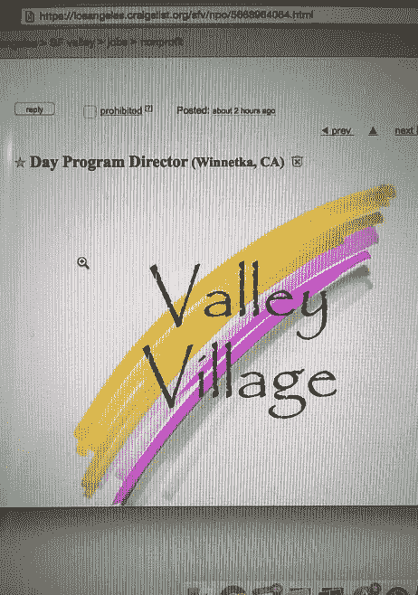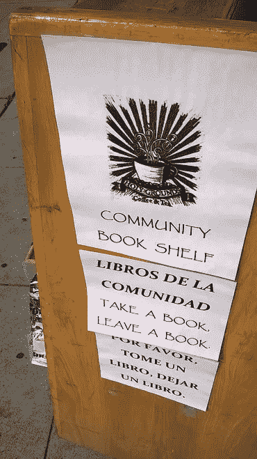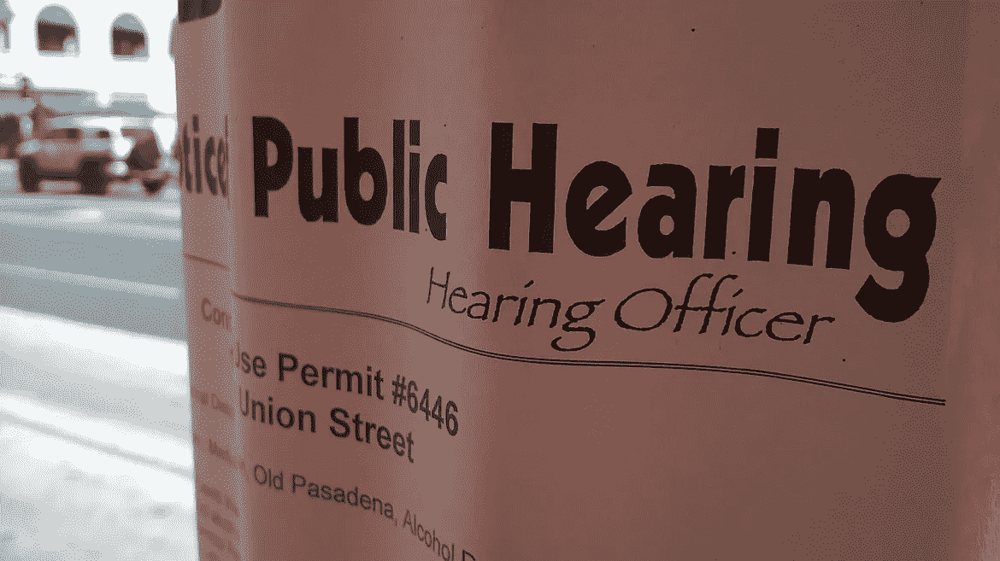

## 一个牙科品牌:

是的，这是一个笑话，但不尽然。我发现了两个纸莎草被用作商标的例子，它们可能与牙齿或饮食有关。一个是位于帕萨迪纳的名为微笑代理处的牙齿矫正办公室，另一个是在不同地点提供水果花束的可食用品牌。*咀嚼商标*选项是我最喜欢的字体改版之一。

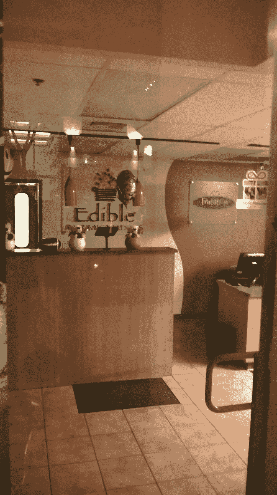

# **多元文化设计**

关于这些主题最引人注目的是，任何数量的字体都可以适用于它们中的任何一个，但很少有人能够像纸莎草纸一样多功能地完成这些角色，尤其是 97 年的发射伙伴，他们居住在不完全手写和由喝醉的大象写的不可思议的山谷中。

它的多功能性和表现力乍一看似乎是矛盾的，但这正是它的魅力所在。在这个意义上，纸莎草纸已经成为一股不可忽视的力量。凭借其独特的，有点媚俗的审美，以及刚刚全面*地下*的流行，纸莎草纸已经成为一个无意的反文化设计的体现。从某些方面来说，现在平面设计就像时尚中的安全别针一样，它在创作时有着精确的意图，但通过误用和重新分配，已经被赋予了挑战当前设计文化及其参与者之间关系的能力:设计师和公司，用户和消费者。

演员们在不稳定的平衡中构成了一个创造性的生态系统，好的设计并不总是文化发展或至少自我表达的同义词。在广告繁荣时期，平面设计作为一个领域从标志绘画发展成为今天的行业，在那个时代，客户往往比观众对最终设计结果有更多的发言权。随着时间的推移，不管是好是坏，这种企业的存在使这个领域得以扩大，并为许多人提供了就业机会，但也形成了盲点，成为一个“从业者继续忽视社会的很大一部分”的地方，正如 [Dietmar Winkler](http://www.historygraphicdesign.com/the-age-of-information/the-international-typographic-style/801-dietmar-winkler) 在他的文章《道德与神话:重新评估包豪斯》中所说的那样。他接着说:“通过选择抽象的和文化上外来的图像，[从业者]阻止他们获得信息或服务，并参与这个非常复杂的多元文化生态系统的管理过程。”温克勒多次强调设计学科的僵化及其缺乏文化好奇心。也就是说，我不确定他会对被用来保护纸莎草纸有什么感觉…

由于设计的稀缺(或者只是缺乏可见性？)积极拥抱特定的文化和多样性，纸莎草纸已经成为一种解决方案，这些社会的大部分，文化机构，小企业主和家庭出版商可以转向寻找一种与典型的圆滑外观足够不同的美学，以表达他们自己的价值观。最好的例子可能是圣地咖啡店，或者阿特沃特水培法。即使是美第奇公寓，无论多么笨拙的努力，也说明了选择是多么的少，以至于想要表现出高级感的[房地产管理公司](http://www.ghpmgmt.com/)会转向与[嬉皮士咖啡店](http://www.holygroundscoffeeandtea.com/rent-our-space/)相同的图形解决方案。

# **临时替代方案**

我不是说纸莎草纸是一个完美的设计解决方案。尽管如此，它仍然是一个有趣的设计案例研究，特别是因为它的成功不仅仅是因为它的独特风格和上面提到的早期可用性，还因为它的多功能性。从本质上说，它考虑到了南森·西尔韦所说的“多元文化”品牌的特别设计方案。即时性和实用性的重要性超过设计质量(或原创性)的方法。在他的同名著作中，南森·西尔韦将*适应论*描述为“当一个更严格的系统所提供的选项不再适用时，在该系统中采取的非正式课程”他继续解释说，不足，而不是需要，是发明之母。换句话说，作为设计师的*用户*,解决一个给定的解决方案中不适用的问题通常比想出一个新的解决方案更容易。在这方面，纸莎草纸是一种特别的选择，一种容易获得的选择，它提供了多种含义，抵消了 Apercu，Din 或 Futura 的中性“不足”，但也不是理想的解决方案。

特别设计选项对文化发展至关重要。他们通过让生活在公认的视觉规范之外的用户找到他们喜欢的解决方案来培养多样性。从这个意义上来说，这种字体也证明了低成本(如果不是免费的话)，易于使用的设计在设计文化中有一席之地，因为它们服务于那些优先考虑把事情做好的人，即使这意味着杂乱无章。

围绕纸莎草纸产生的敌意的根源首先是其过度使用的症状，但它也是其作为临时品牌解决方案的成功证明。在一个平面设计批评已经变成许多人的【奇观运动】的世界里，一家夫妻店的自制品牌受到的批评与最新的 Gap、苹果或嫩绿色品牌语言一样多，不管创造设计形象的预算有多少。这可能看起来不多，但小企业获得新品牌标识的起价大约为[5500-15000 美元](http://ianvadas.com/blog/how-much-does-a-brand-identity-cost)取决于你在哪里寻找，加上印刷或制作标牌的成本会很快增加。拥有负担得起或免费的设计选项的能力对新兴企业来说变得至关重要。

# **今日纸莎草纸**

随着时间的推移，随着互联网、笔记本电脑和个人网站的出现，自纸莎草纸首次出现以来，发生了很多变化。不用说，互联网已经在多个场合撼动了平面设计之舟，因此仅通过纸莎草纸和微软 Office 来指出负担得起的设计解决方案的重要性，未能引起人们对更近、或许更重要的努力的关注，以使良好的设计和即席设计解决方案变得可及。例如，DaFont 和 Google Fonts 已经取得了很大的进展，以便提供各种各样的设计解决方案(质量不一)，这些方案是新的，并通过从订阅到免费下载的不同支付计划不断更新。

免费字体数量激增的最大标志可能是 Typewolf 的 39 美元的免费字体权威指南，这个标题似乎是不言而喻的。工程师和律师理解无障碍设计的价值，并创造了新的数字字体格式和许可系统，这使得设计选择的激增成为可能。你可能听说过 Creative Commons，但是现在有专门围绕字体分发的许可系统。例如，大部分谷歌字体样本都可以通过开放字体许可(一种由 [SIL](http://scripts.sil.org/cms/scripts/page.php?site_id=nrsi&id=OFL_web) 创建的格式)获得。这种授权推动是一个更大的努力的一部分，这个努力起源于 70 年代的 Copyleft，现在属于开放设计的保护伞。所有这些可能是也可能不是纸莎草纸的遗产，但我认为纸莎草纸和办公室 97 舰队的其他部分在使公众对字体和图形设计敏感化方面产生了重大影响。

把这篇文章放在一起给了我一个绝佳的机会，让我可以通过纸莎草纸探索我作为一名工业设计师和设计研究者在设计中欣赏的东西:美学、文化相关性和可用性之间的尴尬平衡。我设法捕捉到的纸莎草纸的广泛用途证明，如果有机会，用户会以他们的创造者想象的多得多的方式重新使用设计，这种做法可能会让一些人感到厌烦。有趣的是，直到今天，纸莎草纸在技术上并不是开放设计世界的一部分，仍然在网上有着非常模糊的存在。它归 ITC 所有，下载费用为 35 美元，但可以在 T2 的替代平台上免费下载。我还注意到谷歌文档(我正在写这篇文章)有漫画字体，但没有纸莎草纸、旧字体或手写字体……这说明了我们认为理所当然的工具和平台可以微妙地影响我们共享的视觉词汇、我们的美感，并强调了纸莎草纸等替代品保持可访问性的重要性。

—

*下面你会发现更多的样品，尽情享受吧！*

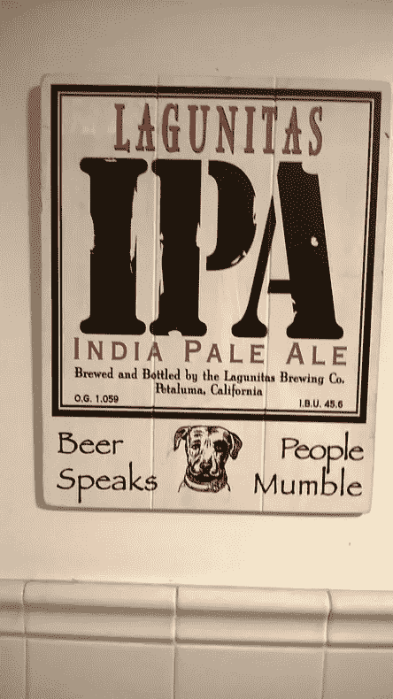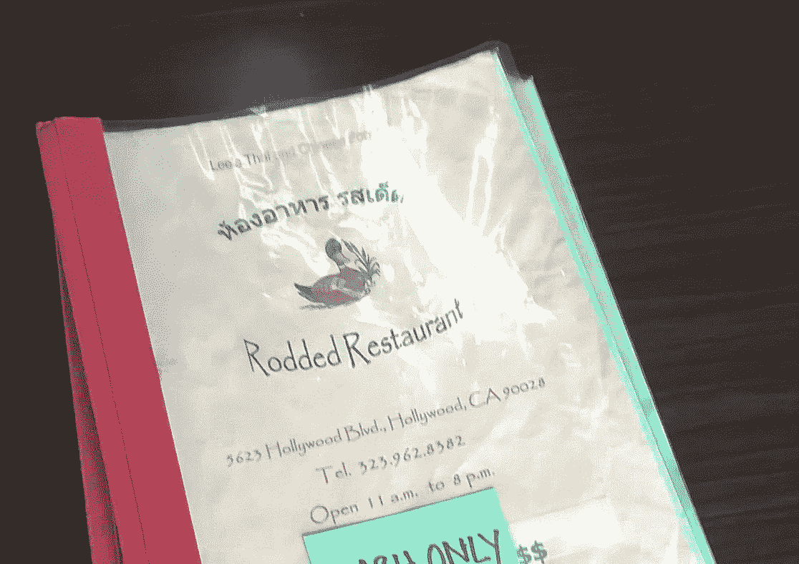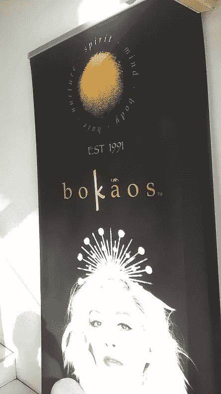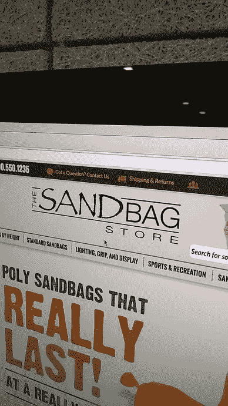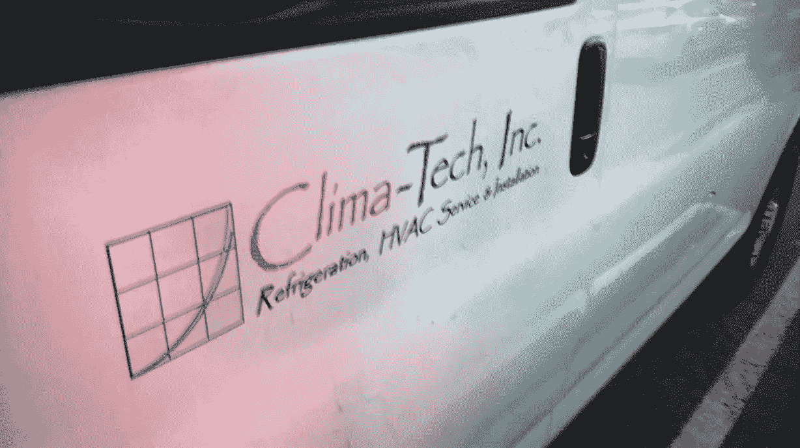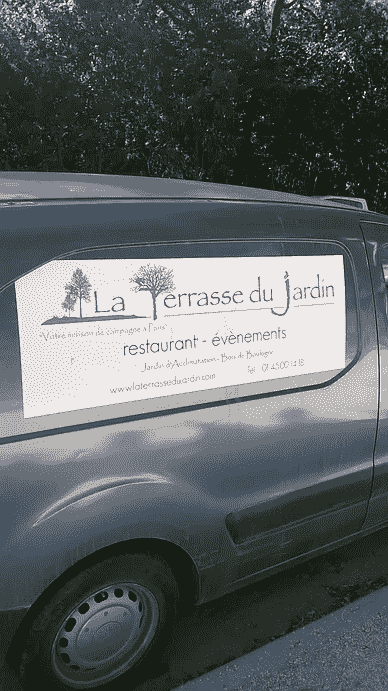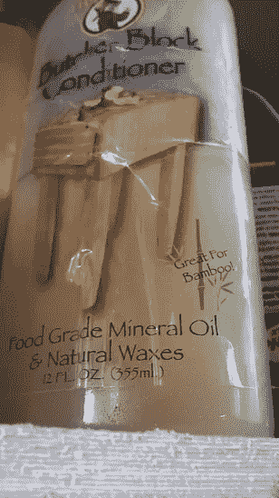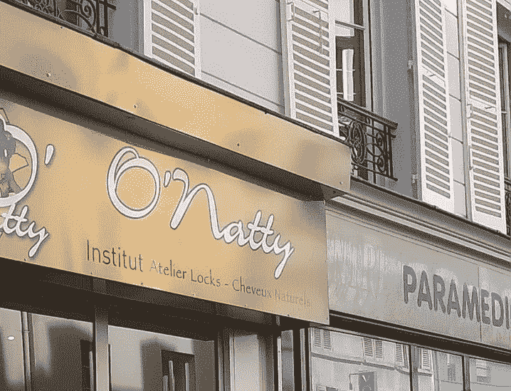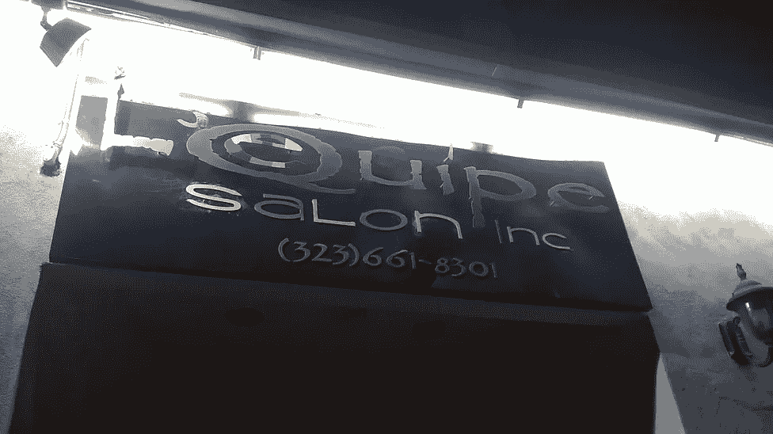

在这里找到纸莎草纸的完整收藏。

> [黑客中午](http://bit.ly/Hackernoon)是黑客如何开始他们的下午。我们是 [@AMI](http://bit.ly/atAMIatAMI) 家庭的一员。我们现在[接受投稿](http://bit.ly/hackernoonsubmission)并乐意[讨论广告&赞助](mailto:partners@amipublications.com)机会。
> 
> 如果你喜欢这个故事，我们推荐你阅读我们的[最新科技故事](http://bit.ly/hackernoonlatestt)和[趋势科技故事](https://hackernoon.com/trending)。直到下一次，不要把世界的现实想当然！

