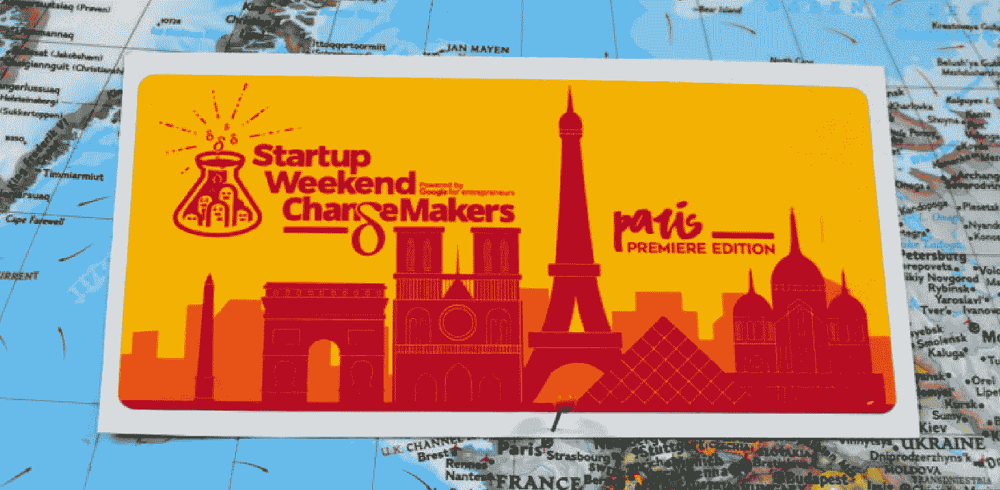

# 巴黎举办首届变革者创业周末

> 原文：<https://medium.com/hackernoon/paris-hosts-first-ever-changemakers-startup-weekend-c6996b5ab7>

本周末，光明之城将举办有史以来第一次[创业周末巴黎](http://communities.techstars.com/france/paris/) [变革者版](http://communities.techstars.com/france/paris/startup-weekend/11023)。目标？通过关注社会和环境变化的项目产生影响。

这些黑客马拉松式的周末为初露头角的企业家提供了一个难得的机会。始于 2009 年的几个人围着笔记本电脑的活动已经演变成一场全球性的运动，在 150 个国家举办了 4000 多场活动。这是一个培养和孵化了数以千计的想法和数百家企业的国际社区。我们已经为这些 [Techstars 拥有的](http://techstars.com/)活动发出了数百张很棒的贴纸，并且为 ChangeMakers Paris 打印了一张[长方形](https://stickergiant.com/custom-rectangle-stickers)定制[吻痕贴纸](https://stickergiant.com/kiss-cut-stickers)。他们的设计采用了红黄配色，以著名的巴黎天际线为背景，展示了 Startup Weekend beaker 和 event branding，巴黎天际线上有方尖碑、教堂、尖顶、博物馆，当然还有标志性的埃菲尔铁塔。

各行各业的任何人都可以参加和参与。不管你是营销专家、JavaScript 程序员、学生、洗碗工还是电工，每个人都有值得开发的想法。创业周末是说“不”和“不能”的时候，唯一的前进方式就是前进。用组织者的话说，变革者介于社会企业和纯粹的资本主义初创企业之间。变革者开发具有强大的社会、社会、环境和经济影响的项目，同时拥有盈利的商业模式，有可能支付红利。

在三天内，个人将提出想法，然后与他们未来的合作伙伴和队友建立一个可行的商业模式。有评委和导师将指导项目进入评审环节，评审团将审议并决定每个创意的奖项。我们要感谢所有的组织者、导师、评委和参与者，感谢他们抽出时间来做一些有益的事情。祝你好运做出改变！

关注他们的推特账户 [@sweparis](https://twitter.com/sweparis?lang=en) 和标签 [#SWChangeMakers。](https://twitter.com/hashtag/swchangemakers)

*原载于 2017 年 7 月 6 日*[*【www.stickergiant.com】*](https://www.stickergiant.com/blog/paris-hosts-first-ever-changemakers-startup-weekend/?utm_source=blog&utm_medium=social&utm_campaign=stickerstories&utm_term=customstickers&utm_content=startupweekend)*。*