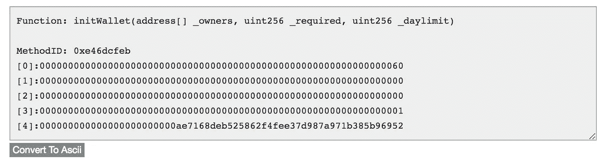
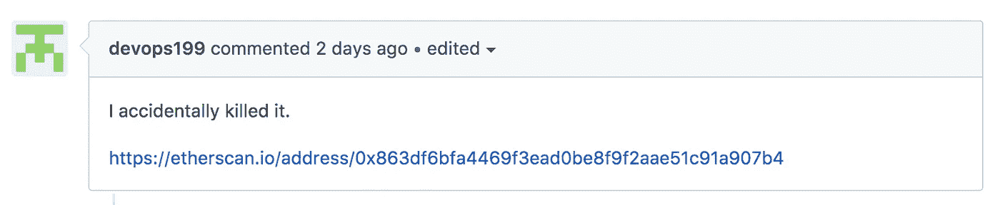
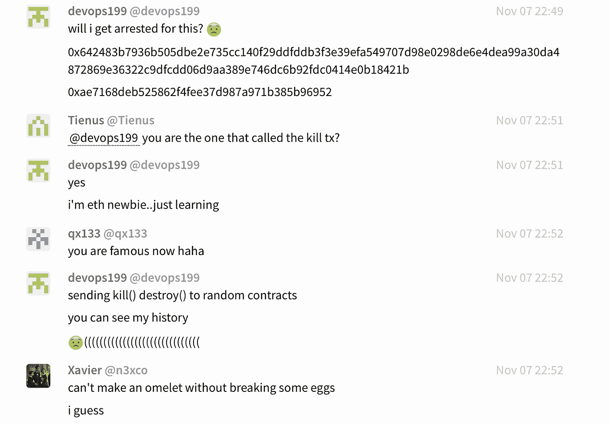
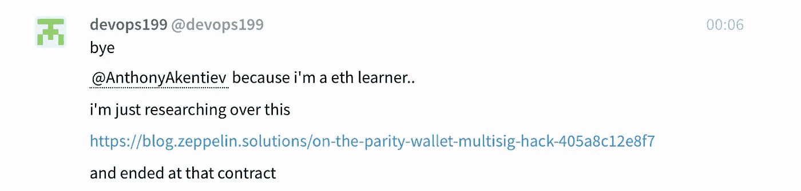
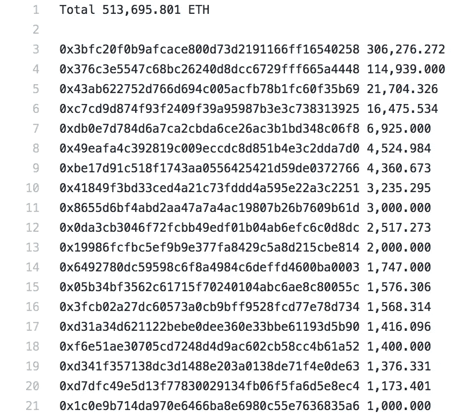
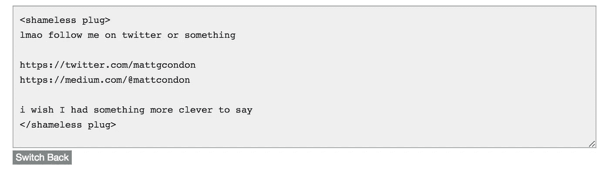

# 平价钱包黑客 2:电动布加洛

> 原文：<https://medium.com/hackernoon/parity-wallet-hack-2-electric-boogaloo-e493f2365303>

## 《邮报》:11 月 6 日奇偶性钱包黑客袭击是怎么回事


behold my photoshop skills

# TL；速度三角形定位法(dead reckoning)

在第一次奇偶性钱包黑客攻击一天后部署的[Parity Multisig](https://hackernoon.com/tagged/parity-multisig)WalletLibrary 合约中包含一个允许任何人执行的错误。有人在 WalletLibrary 上尝试了以前的漏洞利用`initWallet`，随后又尝试了`kill`，从[区块链](https://hackernoon.com/tagged/blockchain)中删除了这个漏洞。因为实际的 WalletLibrary 合约将所有调用委托给了这个硬编码的 WalletLibrary 合约，所以它不再具有发送资金的逻辑。

约 513k ETH(约 1.54 亿美元)已锁定于受影响合约。没有资金被“窃取”的说法；仅使无法访问。用户[devop 199](https://github.com/paritytech/parity/issues/6995)(其名称将载入史册😄)在实验之前的众所周知的漏洞时意外地做到了这一点。

# 奇偶性钱包黑客 1 有什么不同？

我建议大家看看这篇关于第一次黑客袭击是如何失败的技术分析。

 [## 平价钱包被黑客破解

### 在 Parity Multisig Wallet 上发现了一个漏洞，该漏洞允许黑客窃取超过 150，000 个 ETH。

blog.zeppelin.solutions](https://blog.zeppelin.solutions/on-the-parity-wallet-multisig-hack-405a8c12e8f7) 

Parity Wallet Hack 1 的简化版本如下:

`Wallet`合约是在 Wallet 函数的上下文中使用`delegatecall`使用`WalletLibrary`的代码*执行交易的简单合约。*WalletLibrary 合约假设在*确实*声明可以修改(即`m_numOwners`的合约上下文中调用该函数，这是导致最近灾难的核心假设。在第一次奇偶性钱包黑客攻击中，黑客改变了各种`Wallet`合约的状态，他将一个呼叫委托给`initWallet`，将自己设置为`Wallet`合约的所有者，然后正常地撤回资金。

## 如何以及为什么

在这种情况下，已经部署的`Wallet`合同的内部状态没有改变；改变的是`WalletLibrary`契约的内部状态。`WalletLibrary`契约包含一个状态变量`m_numOwners`(以及`m_owners`和类似的变量)，它期望被调用契约自身的状态所隐藏。其状态的其余部分在硬编码其地址的所有奇偶校验多签名钱包之间全局共享。

部署后，WalletLibrary 契约只是未初始化。`m_numOwners`就是`0`。这意味着`only_uninitialized`修饰符(在初始化的 Wallet 契约的上下文中调用时会正确动作)总是通过。如果 WalletLibrary 没有在 Wallet 契约的上下文中执行，`m_numOwners`是 0，允许任何人调用这个修饰符保护的方法，其中之一是`initWallet`。

任何人都可以在部署后的 110 天内随时调用这个函数，但显然直到现在才被发现。

## 结果

[下面是一个受影响的钱包](https://etherscan.io/address/0x3bfc20f0b9afcace800d73d2191166ff16540258#code)(Polkadot ICO 钱包，内含约 9000 万美元乙醚)。请注意第 451 行，其中 WalletLibrary 地址是硬编码的。假设对这个地址的所有调用都失败了(注释被删除，并且知道构造函数实际上没有包含在契约字节码中)，那么契约现在看起来就是这样:

```
contract Wallet is WalletEvents {
  function() payable {
    if (msg.value > 0)
      Deposit(msg.sender, msg.value);
  } function getOwner(uint ownerIndex) constant returns (address) {
    return address(m_owners[ownerIndex + 1]);
  } address constant _walletLibrary = 0x863df6bfa4469f3ead0be8f9f2aae51c91a907b4; uint public m_required;
  uint public m_numOwners;
  uint public m_dailyLimit;
  uint public m_spentToday;
  uint public m_lastDay;
  uint[256] m_owners;
```

…它根本没做什么，当然也不会把资金送到任何地方。

# 时间表

## T=世界协调时 2017 年 7 月 20 日下午 04:39:46

[](https://etherscan.io/address/0x863df6bfa4469f3ead0be8f9f2aae51c91a907b4)`[WalletLibrary](https://etherscan.io/address/0x863df6bfa4469f3ead0be8f9f2aae51c91a907b4)` [契约在奇偶校验 Hack 1 之后](https://etherscan.io/address/0x863df6bfa4469f3ead0be8f9f2aae51c91a907b4)展开。[你可以在 Etherscan](https://etherscan.io/address/0x863df6bfa4469f3ead0be8f9f2aae51c91a907b4#code) 上看到验证过的源代码。值得注意的是第 215 行(`only_uninitialized`)和第 225 行(`kill`)。

## T=世界协调时 2017 年 11 月 6 日下午 02:33:47

[事务 0x05f71e1b](https://etherscan.io/tx/0x05f71e1b2cb4f03e547739db15d080fd30c989eda04d37ce6264c5686e0722c9) 被发送到 WalletLibrary，调用`initWallet`方法。该交易成功使`[0xae7168deb525862f4fee37d987a971b385b96952](https://etherscan.io/address/0xae7168deb525862f4fee37d987a971b385b96952)`成为唯一所有者。



[https://etherscan.io/tx/0x05f71e1b2cb4f03e547739db15d080fd30c989eda04d37ce6264c5686e0722c9](https://etherscan.io/tx/0x05f71e1b2cb4f03e547739db15d080fd30c989eda04d37ce6264c5686e0722c9)

## T=世界协调时 2017 年 11 月 6 日下午 03 时 25 分 21 秒(比之前的发送时间多 51 分钟)

[交易 0x47f7cff7](https://etherscan.io/tx/0x47f7cff7a5e671884629c93b368cb18f58a993f4b19c2a53a8662e3f1482f690) 发送到 WalletLibrary，调用以`[0xae7168deb525862f4fee37d987a971b385b96952](https://etherscan.io/address/0xae7168deb525862f4fee37d987a971b385b96952)`为受益人地址的`kill`方法。


[https://etherscan.io/tx/0x47f7cff7a5e671884629c93b368cb18f58a993f4b19c2a53a8662e3f1482f690](https://etherscan.io/tx/0x47f7cff7a5e671884629c93b368cb18f58a993f4b19c2a53a8662e3f1482f690)

## T=世界协调时 2017 年 11 月 6 日下午 03:54:34 分(比之前增加 29 分钟)

devops199 创建了记录交易的[奇偶校验#6995](https://github.com/paritytech/parity/issues/6995) 。



[https://github.com/paritytech/parity/issues/6995](https://github.com/paritytech/parity/issues/6995)

## T=世界协调时 2017 年 11 月 6 日下午 04:33:00(比之前多 39 分钟)

devops199 在[奇偶性 gitter 频道](https://gitter.im/paritytech/parity)发布了该问题的链接。


I can’t seem to link to gitter messages, so a screenshot will have to do.

可以理解他对后果的担忧。



## T=世界协调时 2017 年 11 月 6 日下午 07:51:00(+3 小时 18 分钟)

奇偶校验发布警告并声明他们正在调查。

# 可能的解决途径

我想了想，这里有三种可能的回收资金的方法:

1.  Hardfork，ala DAO Hack，这可能会也可能不会导致另一个“经典”的叉子。如果这是在计划中的君士坦丁堡硬分叉，它可能会进行得特别顺利。
2.  破解加密技术，并为硬编码的 WalletLibrary 地址部署新的合约。目前，在宇宙热寂之前这在密码学上是不可行的。
3.  [实施 EIP156](https://github.com/ethereum/EIPs/issues/156) ，它提供了一种在此类事件中由社区控制的资金回收方式。虽然这个 EIP 没有具体解决这个问题(sciyoshi 提到的[，但是至少有一些社区支持这样的方法来避免硬分叉的先例。](https://github.com/ethereum/EIPs/issues/156#issuecomment-342698012)

不过，总的来说，在可预见的未来，这些资金似乎被锁定了。

# 可能的预防措施

如何防止这种情况发生？该错误的主要原因似乎有两个:

1.  在第一次平价钱包黑客攻击后，快速修补的 WalletLibrary 代码没有被审计。
2.  库模式隐藏了 WalletLibrary 是具有内部状态的实际契约的事实。这鼓励了一种假设，即它将只在钱包契约的上下文中被调用。Solidity 库结构会使这个错误更加明显；Solidity 库契约不允许有内部状态，所以任何人都可以调用`initWallet`的事实会更加明显。此外，他们不能实现所有权(内部状态)，这是使代码感到安全的原因；预期`onlyOwners`修改器会正确执行。

一些可能的预防措施(可能是):

1.  部署 WalletLibrary 契约后，任何人都可以用空所有者调用`addOwner`，有效地锁定契约以防更改(当直接调用时)。当 Wallet 协定状态隐藏 WalletLibrary 协定的空所有者状态时，它仍然可以作为库正常工作。
2.  将`kill`逻辑放在被设计为不可变的契约中是一个可疑的决定。同样，由于`onlyOwners`修饰符和钱包上下文假设，它看起来是安全的，这就是为什么`kill`没有直接放在钱包契约本身上。至少在未来，监控`selfdestruct`行将成为每一次代码审计的一部分。
3.  总的来说，WalletLibrary 合同的全球共享状态是一个奇怪的决定。这并没有直接导致这次攻击，但是像这样在多个契约之间透明地共享状态感觉很奇怪。

# 谁受到影响？

以下是因删除 WalletLibrary 而受到影响的钱包名单，按净值排序。



[but wait there’s more](https://github.com/barrywhitehat1/Parity2VictimList/blob/master/gistfile1.txt)!

值得注意的是:

*   带 306k ETH 的 [Polkadot ICO 钱包 0x3bf](https://etherscan.io/address/0x3bfc20f0b9afcace800d73d2191166ff16540258)
*   一个配有 115k ETH 的 ICONOMI 钱包 0x376
*   带有 16k ETH 的音乐经济钱包 0xc7c

如果你知道其他钱包的主人，并且不介意列出他们，请告诉我！

# 结论

很好。在某种程度上，形势仍在发展。奇偶校验很可能会在 Twitter 上宣布更新[。](https://twitter.com/paritytech)

需要澄清的是，我并没有责怪 devops199，我也不认为其他人应该这样做。



[ps. I was the first person to think of advertising on the contract’s old address.](https://etherscan.io/tx/0xe3667ceff0ab1508c7b18debfcf162e12d8f900e87f70bae8989f135e03e4b31)

*就此而言，如果这篇文章让你开心，有见识，或者其他一些模糊的积极情绪，请粉碎它👏按钮，因为我以虚构的网络点为食。*

感谢 Dror Liebenthal 校对后。