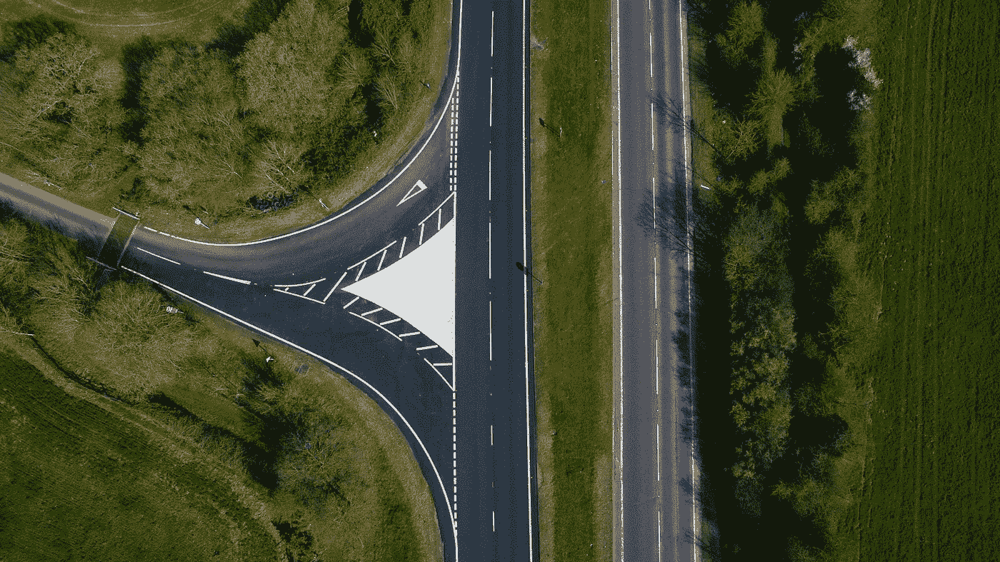
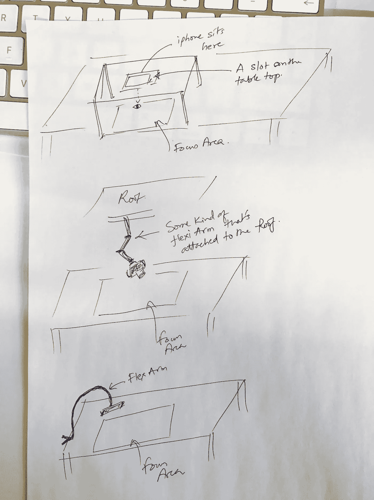
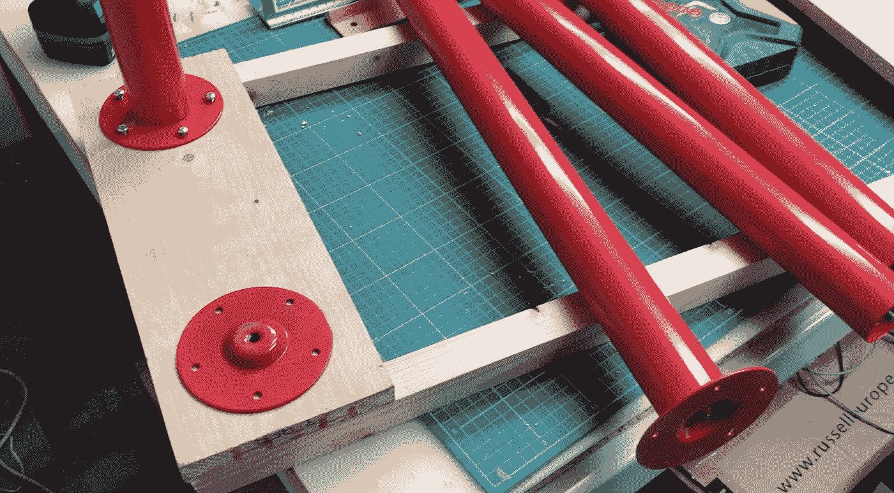
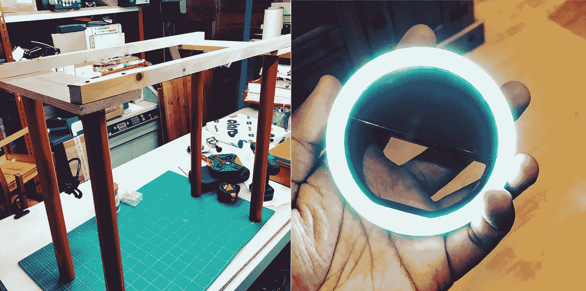

# 制作 Youtube 视频…

> 原文：<https://medium.com/hackernoon/part-1-building-the-mvp-overhead-camera-rig-78e4ed6bed4>

## 不倾家荡产—第 1 部分，共 2 部分

Empty Roads, Matt Seymour — Unsplash.com

*这是 2 部分系列的第 1 部分*

> **我尝试了一些事情来创建一个 YouTube🎬渠道。**

1.  拿起我的 GoPro 英雄第五场(【http://bit.ly/2qVkqzk】T4)
2.  想到了一个话题来带动渠道
3.  建立一个登陆页面来谈论这个想法
4.  一个 iPhone 柔性臂支架([http://amzn.to/2qVqtnk](http://amzn.to/2qVqtnk))
5.  建立一个媒体页面来谈论更多的视频内容
6.  建立一个 twitter 页面来标记我的频道。)
7.  为频道想出了一个名字，并设计了一个标志(设计师的思维方式—[1ux tip YT 频道](https://www.youtube.com/channel/UC7pOhp_Tcvf0TYt8vXqcryg))
8.  从我的小配件托盘里拿出我的旧 iPhone 6sPlus(我们每个人都有一个，我们不允许任何人靠近它…)，作为备用相机
9.  清理我的桌子，以容纳“新的视频记录奋进”。我的桌面空间目前是满员模式——2 台 macbook pros、1 台台式电脑、1 台 mac pro 和其他放不下的东西(参见上面的第 7 点)
10.  写了一份每周向频道上传视频剪辑的计划
11.  我和我妻子(她不太热衷)以及我 9 岁的儿子讨论了这个想法(这让他很兴奋——他开始了自己的 YT 频道)

现在你一定在想，这家伙已经计划好了一切——他怎么会失败呢？

我不会说我失败了，但是我清单上的这些首要项目都没有任何作用。太多的计划和梦想并没有让我去任何地方。没有结果。

我花了两个星期才想出这个清单，而且我一个视频都没录过。我本应该列出我想拍的 3 个视频，然后在 3 天内完成，而不是列出要做的事情。计划和无所事事到此为止

两个星期后，我仍然停滞不前，使名单完美。我是否错过了什么——这一直是我担心的问题。是的，我确实错过了一些东西——我甚至一个视频都没有录制。

我猜你可能经历过类似的阶段，当你想做一些事情，却被那些实际上没有任何好处的待办事项所困扰。欢迎来到我的俱乐部。

我知道浪费两周的时间太多了。所以我拿起我的 iPhone，走进我的花园小屋，看看我是否能快速录制一段视频。那么我接下来做了什么？

1.  拿起几张 A4 纸(那是相当于我们池塘对面的朋友的信纸大小)
2.  一些彩色笔
3.  iPhone flexi 臂架

我从一个想法开始，开始录制视频。就是这样——没有脚本，没有脆弱的设置。我说了我所知道的(那是我的谋生之道。在推特上打招呼— @leanux_bala)

三分钟后，第一个视频就准备好了。是的，录音质量和我的评论风格一样糟糕(太多嗯...)但在我看来，视频中的实际信息非常清楚。

去看看这里的视频—

 [## 1ux 今天提示

### 编辑描述

www.youtube.com](https://www.youtube.com/channel/UC7pOhp_Tcvf0TYt8vXqcryg) 

2 things suck — the video quality & my commentary style. But then, done is better than perfect.

> 我把视频上传到 YouTube 上，感觉不错。工作 1 完成。不要再浪费一周的时间让事情变得完美。

现在我可以回到清单上，看看还有什么需要做的。我学会了如何制作一个快速视频并上传到频道——我可以花一些时间来做得更好。

我觉得制作视频时最直接的痛苦是使用 flexi arm iPhone 支架来获得正确的角度。自己去试试吧，你会看到痛苦的(&也能感受到)。这让我开始思考，我开始寻找在创作视频时获得头顶拍摄的最佳方式。

有一件事一直很突出——头顶上的摄影设备。我想我应该看一看，看看我是否能有一个。这让我进入了搜索模式，我在 youtube 上找到了一些很酷的例子

1.  达尔宾·奥瓦尔
2.  [SidedMike](https://www.youtube.com/watch?v=1-vccT6jLH4)
3.  [马克·罗杰斯](https://www.youtube.com/watch?v=Z7u75_1EJ54)
4.  [天生书呆子](https://www.youtube.com/watch?v=Svgkir_FGK4)
5.  [乔作品](https://www.youtube.com/watch?v=XgJluM-v2rA)

数百万 YouTube 视频中的一个摄影设备(或桌子)是 Casey Neistat 的疯狂工作室和他的头顶摄影台。

[**看这个视频的家伙们，真是太好了！**](https://www.youtube.com/watch?v=vb60rrtTddQ)

其中一些例子令人震惊——我最喜欢的是 Darbin Orvar 的这个例子。我想为什么不直接联系渠道商，看看他们有没有卖这个产品。找不到买它的方法。

我看了看其他例子，看看我是否能从其他 YT 渠道购买一个。运气不好。没有办法从那些教你如何制作高架摄像机的神奇视频频道买到高架摄像机。然后我谷歌了一下，看看能不能从亚马逊上买些东西。这里也不走运。

我确实找到了一些来自 [**曼弗雷托**](https://www.manfrotto.co.uk/055-aluminium-3-section-photo-tripod-with-horizontal-column) & [**先锋**](https://www.amazon.co.uk/Vanguard-Alta-Pro-263AT-Multi-Angle/dp/B002KD9B3C) 的多角度三脚架——但这些都超出了我的预算。

我从 Edelkrone**那里偶然发现了这个 [***野兽——有一天我会买一个，但不是今天。我无法停止思考他们设计的超棒的东西。好了，让我们继续吧…***](https://www.edelkrone.com/p/138/slider-plus)**

**我又回到了起点。我所有的 YT 视频会很烂吗，即使内容很有用(我希望如此)？我想现在建立一个钻机-便宜和快速的东西，所以我回到 YT 教程为自己建立一个。**

**我真的很喜欢这个钻塔(由 [**达尔宾·奥尔瓦**](https://www.youtube.com/watch?v=KQ4ORaQLx9g) )并且想要建造它。但是这涉及到一些额外的工作，一些额外的东西去买一些我没有的设备。这开始看起来像一个停滞的项目。要么花钱买一个昂贵的钻机，要么花几周时间造一个真正好的钻机。**

**我一点也不同意。我回到了绘图板，实际上是工作顶部。我需要一些非常简单的东西来固定我的相机，面朝下放在桌子上。我想到了一些主意-**

****

**Can I call this paper prototyping?**

1.  **我能把手机挂在某种框架上吗**
2.  **我可以在天花板上固定一些东西来固定我的相机吗**
3.  **可以在操作台上放置一些东西，以便从高处拿起相机吗**

**我选择了第三个想法。我想，让我们只用木材建造一个立方体结构，这样我就可以找到一条出路，把手机放在顶面上。但这需要我去一趟 https://www.toolbarn.com/的 B&Q(类似于 www.homedepot.com 的家得宝)买我需要的东西。**

**有一个问题，我不想在一个我还在验证的想法上花任何钱。我决定在我家周围寻找可以用来制作这个相机支架的东西(当你环顾房子时，你会惊讶地发现什么……)**

**我在 3 分钟内制作了第一个视频。我想在 30 分钟内做好第一个装备。我是这样做的-**

1.  **找到了 4 条宜家桌脚(这些桌脚太棒了，因为它们带有圆形环，桌脚可以拧在上面，环本身可以固定在一块木头上)**
2.  **找到两块木头做顶架**
3.  **电池供电的螺丝刀/钻头组合**

> ****然后我开始建造 MVP 高架摄影机****

****

**build in progress**

****

**standing tall…**

> ****它有 4 条腿&可以站立。任务完成。****

**你可能会注意到顶部的大缺口(这完全是无意的)。这个想法是有一个缺口，让我的 iPhone 从顶部向下。但是现在我有了一个很大的缺口——一个很好的问题。怎么会？听着，如果这个缺口只能容纳一部手机，我永远也不可能让 DSLR 或摄像机放在那个顶框上。因此，巨大的差距是一件好事。倒楣的事永远会发生。**

**我确保我录下了整个过程，这样你就知道我是怎么做的了。我不得不录制 3-4 次，以覆盖整个过程。我可以很容易地看到我最终将面临的问题——将这些视频剪辑合并成一个剪辑进行上传。这意味着学习编辑视频(神圣的狗屎，这个故事有太多的切线…我可以看到你在想什么)。视频剪辑的故事是另一天…**

**我录完第二段视频了吗？不。但是我可以很快做到，现在我知道怎么做了。完成后，我会通知你们。**

> ****让事物更闪亮****

**花园小屋的光线不太好。**

****

**The ring light reminds me of Iron Man…**

**所以我决定从亚马逊买这个 7 环灯，录音的时候可以固定在 iPhone 上。**

**但正如你从上面的操作台图片中看到的，支腿的高度有点太高，这款小环形灯无法产生任何像样的效果。我又在想，一盏灯是不够的——如果我再买几盏，把它们固定在顶架上，会怎么样？愚蠢的想法。我知道。不走那条路。**

**如果 LED 灯带可以沿着顶部框架的底部延伸会怎么样？这应该可以了(至少我是这么认为的)。我们将不得不知道什么时候完成。**

**故事在这里戛然而止…因为我需要使用这个装置来录制第二个视频，故事将继续讲述第二个视频在 LED 灯固定到位后的样子..**

****

**请继续关注这篇文章，谢谢大家读到这里..**

> ****未完待续。****

****如果你喜欢这个帖子，请鼓掌…** 👏 👏**

**[www.1uxtip.today](http://www.1uxtip.today)**