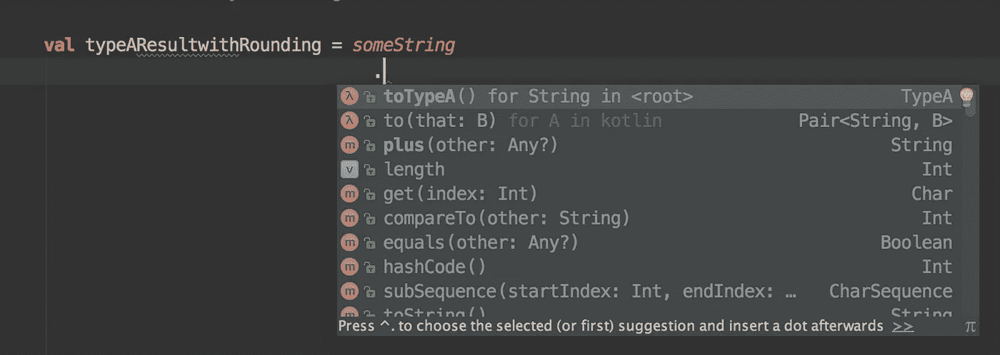
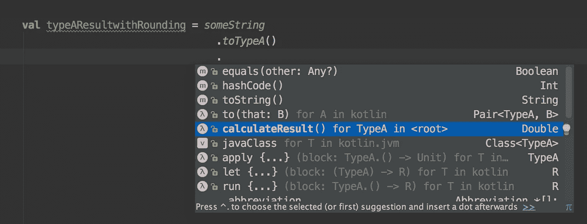
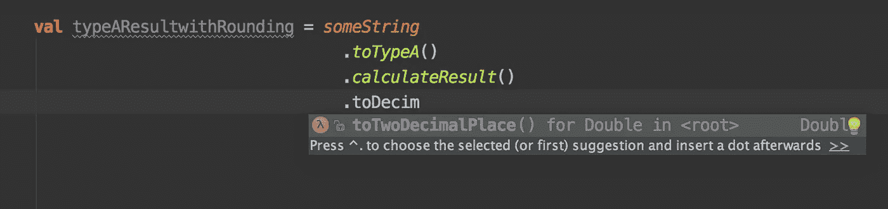
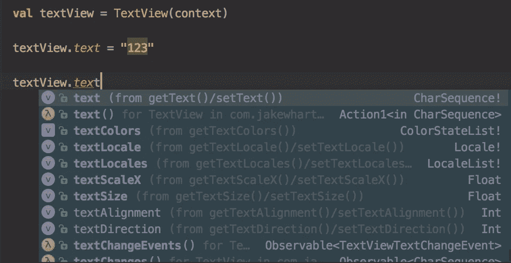

# 第 2 部分:为 Android 选择 kot Lin——杀死特性

> 原文：<https://medium.com/hackernoon/part-2-picking-kotlin-for-android-killing-features-a6a643c8dc8d>

## 更有生产力&编写有表现力的代码&构建更好的架构

欢迎来到第 2 部分，这一部分由许多 gist (Java vs Kotlin 示例代码)组成，作为一个展示案例。许多有用的评论/论点都写在要点里。为了有更好的阅读体验，我会推荐你使用大屏幕继续阅读这篇文章。

# 编译时空安全

与 Java 相比，Kotlin 中的“编译时 Null-Safe”是一个重大的根本性改进。它解决了 Java 中臭名昭著的空问题，并提供了一种非常高效的方法来编写高质量和无 NPE 的代码。

在 Java 中，默认情况下，你创建的每一个对象都会被赋值为 null。也被称为“[亿元错误](https://en.wikipedia.org/wiki/Tony_Hoare#Apologies_and_retractions)”。Java、第三方库甚至 IDE 中都出现了许多“变通方法”，例如:

*   `@NotNull`
*   `Objects.requireNonNull(..)`
*   `Optional.ofNullable(..)`

仔细看看下面的 Java 示例，它展示了编写相同功能的四种不同方法。

第一个函数`doRiskyThing`是不带`@NotNull`注释的。该函数不是自文档化的，您必须采取一些变通方法来改进它。

**如果我们只关注函数声明** `public String doRiskyThing(String riskyString)` **而不关注实现细节**，开发者将不会得到任何关于输入参数的信息。Java 开发人员可能会遇到这样的问题:

*   能不能过个`null`？
*   如果我过了一个`null`，回报会是什么？`null`？空字符串？其他默认字符串？

想想看，如果开发人员被要求使用`doRiskyThing`来构建一些东西，他们必须花费额外的努力来运行测试或查看源代码来建立他们的信心。

另外两个例子是流行的“变通办法”，只有`doOptionalThing(String strOpt)`在运行时是安全的。

**在 Kotlin 中，可空对象必须通过追加** `**?**` 来表示。比如`Int?` `String?` `Long?` `DateTime?` `BigDecimal?`。该语法将在编译时和 IDE 检查中被检查。

不需要任何变通方法，并且下面的功能是由**设计**自文档化的。

正如你在这个小例子中看到的根本区别，为什么 Java 不修复“十亿美元的错误”？

> Java 必须保持向后兼容性

***所以，你可能会问与科特林有什么关系？***

2016 年 8 月，我们将使用现有的 Java 库编写一个新的 Android 应用程序或后端应用程序。考虑到 Java & Kotlin 都可以 100%使用现有的 Java 库。如果我们选择 Java 而不是 Kotlin，我们就必须牺牲编译时空安全的美妙之处，并做许多额外的“变通”来应对我们甚至不需要的权衡(向后兼容性)？

> 科特林听起来很有趣？零安全只是主要的查杀功能之一。
> 
> 我要介绍的至少有 5+杀人功能。

***注意事项/免责声明:*** ***如果你一直看下面的 Kotlin 杀人特征，你就再也不想回 Java 了。相信我，三思而后行！***

# 零开销可空类型、可空链接和默认值

Java 8 在`java.util`包中引入了一个新的`Optional<T>`类。因为`Optional<T>`只是一个值类型(容器)来包装一个值。

然而，Java 中缺少模式匹配(Scala 中一个非常强大的特性)，解开和比较包装的值是 Java 中该死的痛苦。`[Optional<T>](http://stackoverflow.com/questions/31922866/why-should-java-8s-optional-not-be-used-in-arguments)` [拟采用**仅**为返回式以提高“无结果”的意识，](http://stackoverflow.com/questions/31922866/why-should-java-8s-optional-not-be-used-in-arguments)遂避开 NPE。查看以下示例

Java Optional Overheads example

让我们看一个 Scala 模式匹配(FYI)的简单例子:

Scala Option pattern matching

让我们看看 Kotlin 的可空类型有多强大:

Kotlin Nullable Type

从我的经验来看，在 Java/Scala 中从一种类型到 java.util.Optional/scala.Option 类型的重构是一场灾难，看起来像是重写了受影响的代码的一整部分。但是重构 Kotlin 的可空类型几乎不费吹灰之力。

# 类型推理

类型推理美化了静态类型语言的美，可以提高编码效率，使其达到动态类型的水平。

Java 和 Kotlin 都是静态的强类型语言。这一特性对于大规模应用非常重要。

> 好东西是有代价的

在 Java 中，与 PHP 或 Javascript 这样的动态弱类型语言相比，你必须花费额外的精力来为变量指定类型定义。

有时，类型定义是无意义和冗长的，因为

*   这对人类来说太明显了
*   编译器应该足够聪明，知道类型
*   类型定义增加了重构的成本。

例如，当我们使用类型关键字:`String`值:`Integer`创建带有种子值的映射时

在科特林，

> 让编译器帮你做吧

我们可以跳过类型定义，让编译器为我们进行类型推断。

语法非常类似于动态类型语言，但是任何类型不匹配的操作都将被认为是编译错误。

具有类型推断的 Kotlin 可以帮助我们编写不太冗长的代码，而不会牺牲任何东西。

# 默认参数和命名参数

在现实世界中，有些情况下我们需要缺省值而不是空值。Java 开发人员要么围绕 if-null-then-default 值做一项非常难看的工作，要么做一项冗长的方法重载。举个例子，

“丑陋的解决办法”和“冗长的方法重载”也不是自文档化的，很难用 Java 重构/更改。

Kotlin 支持**命名和默认参数**，它帮助开发者创建一个更加直观、有意义和可维护的 API。

作为主旨的例子已经清楚地展示了**命名和缺省参数的威力。**与 Java 相比，这是 Kotlin 的一个根本性的重大改进。

一旦你习惯了 Kotlin 强大的**命名和默认参数**来设计你的接口**，**你就不会再回到 Java 了。

# 延伸很牛逼

在 Java 中，我们不能直接在一个`Class`上添加功能。如果一些逻辑应用在特定的`Type`上，并且必须在一个项目中多次使用，Java 开发人员习惯于为`Type XXX`创建一个`XXXUtils`，以便遵循 D.R.Y .原则。

> 编程没有魔力。关于抽象的一切

Kotlin 提供了一个更好的抽象来建模由“Java Utils 模式”——**扩展**解决的类似问题

传统 Java 实用程序的用法

Kotlin 是如何为这个问题提供更好的抽象的？我们可以用非常简单的语法直接为特定的`Type`添加一个“扩展”！(非常类似于 javascript)

“Java Utils 模式”不是 IDE 友好的，新手不会注意到一些功能已经在 XXXUtils 中实现了，而 Kotlin 的扩展完全解决了这个问题。

下面是一些截图，展示了 IDE 自动完成 Kotlin 扩展的过程。

有了科特林分机，你就再也不用问了

> *是不是 XXXUtils.someFunc()已经实现了？*

永远不用在。utils 文件夹。100%的时候你会在自动完成的列表中找到它。

# 便捷数据类

在强类型语言中，我们将创建许多“值对象”来保存数据，通过显式类型来分类它们的域。比如 API 响应、API 请求、数据模型、代理对象等。

这是一种非常常见的做法，应该尽可能简单。

在我会见了 Scala 和最近的 Kotlin 之后。Java 对创建“值对象”的唯一印象:

> 对于函数式编程来说，Java 太冗长、太昂贵(不可变方法)

开始阅读下面的 Kotlin `data class`以获得一些见解，不要忘记阅读评论:)。

在 Java 中，开发人员不得不使用相对较差的方式(可变或生成器模式)来创建复杂的对象。举个例子，

我们如何在 Java 中使用它？

科特林提供了一个非常方便的`data class`

*   利用构造函数上的**名称和默认参数**的力量
*   为编写纯不可变对象提供便利的`.copy`
*   对于调试是开发人员友好的

它有助于减少 getter、setter 和多重构造函数的冗长。更重要的是，`data class`在默认情况下已经可以在一些流行的 JSON 序列化库中使用，比如 GSON、Jackson。

如果你熟悉 Java，在没有**名称和默认参数**的情况下，你会知道创建一个“值对象”来实现与科特林的`data class`相同的便利性是不可行的。

# “kotlineze”Java 库

在大型应用程序中，一致性是保持源代码更可预测和可维护的最重要的作用。

默认情况下，Kotlin 不鼓励为变量创建 getter/setter 函数。每个变量都有一个 get()/set(值)来实现:

因此，在纯 Kotlin 代码中，我们从不写`getXXX()`或`setXXX(value)`。但是，几乎 100%的 Java 库都会使用 getter/setter。

***科特林是如何解决这种出入的？让我们看看 Java Android 库中的“TextView”。***

Standard Android TextView(Java) in Kotlin

Kotlin 将 Kotlin 化 Java 的“默认”getter/setter 为 kot Lin 风格，使用 Java 库你永远不会感到不舒服。

如果你有在 Scala 中使用 Java 库的经验，你一定非常想要这个特性，至少我是这么想的。

# 更好的函数式编程支持

用 Java 编写函数式代码比用 Kotlin 要昂贵得多。因为 Kotlin 提供了以下功能:

*   类型推理
*   廉价的数据类(不可变的`.copy`特性)
*   函数/lamda 的直观类型声明，即`(Int)-> Int`、`(Int,Int) -> Bool`而不是`java.util.functions.BiFunction<T,U,R>...`
*   支持析构
*   每样东西都是一个表达式(更容易编写声明性代码)

Easy to create Pair & destructing a pair

Destructing a List

Destructing a data class

Currying function example

Every thing is an expression

# 主要好处(前述)

*   编译时空安全
*   零开销可空类型、可空链接和默认值
*   类型推理
*   默认参数和命名参数
*   延伸很牛逼
*   便捷数据类
*   “kotlineze”Java 库
*   更好的函数式编程支持

# 小点心

*   直观的字符串模板
*   Kotlin std-lib 中实现了许多方便的功能，即`array.find` …
*   单个文件中的多个类或对象
*   支持遗留 JVM。Kotlin 在 Java 6 上运行，它的接口可以像在 Java 8 中一样有默认的实现。
*   最佳 IDE 支持

***接下来—*** [*第三部分:为 Android 挑选 kot Lin—Android 中的 Swift？*](/@gaplotech/part-3-picking-kotlin-for-android-swift-in-android-7db405962c13)

> [黑客中午](http://bit.ly/Hackernoon)是黑客如何开始他们的下午。我们是 AMI 家庭的一员。我们现在[接受投稿](http://bit.ly/hackernoonsubmission)并乐意[讨论广告&赞助](mailto:partners@amipublications.com)机会。
> 
> 如果你喜欢这个故事，我们推荐你阅读我们的[最新科技故事](http://bit.ly/hackernoonlatestt)和[趋势科技故事](https://hackernoon.com/trending)。直到下一次，不要把世界的现实想当然！

