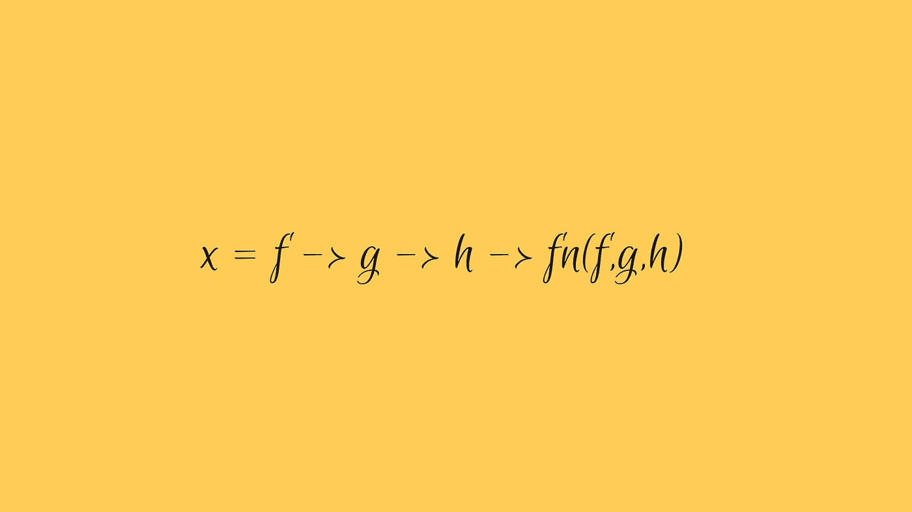

# 函数的部分应用

> 原文：<https://medium.com/hackernoon/partial-application-of-functions-dbe7d9b80760>



为函数提供比预期少的参数称为函数的部分应用。

虽然这个概念很简单，但它可以用来在我们日常的 JavaScript 中准备更强大的*函数构造*。

经常有人问我:“*你为什么要部分地应用一个函数呢？*


*“因为在那之后我得到的逻辑是一种美丽和功能纯洁的东西。”*

> 我们调用一个参数比预期少的函数，它返回一个接受剩余参数的函数。这叫做函数的局部应用。

# 使用 function.bind()

这种局部应用的风格在功能上并不酷，但我还是想让你知道这一点。

An example of Partial Application of functions using bind()

```
We created a function ‘*add*’ which accepts two arguments.We preloaded it with a single argument and created a function ‘*increment*’ which takes only one argument.We created another function by the same process of Partial Application, this time by applying a different argument.At last, we called our preloaded functions with the final argument.
```

将一个函数绑定到更少的参数有助于我们生成其他函数，使我们的代码更少重复，更明确。但这也有一些问题，除了功能不够酷之外。

*   **太不可预测:** Function.bind 总是会返回另一个函数，即使我们已经向基本函数提供了所有的参数。所以我们不知道什么时候停下来。


*   注意到代码中的' *null* '，这是我们必须作为 bind 的第一个参数传递的部分应用函数的上下文。所以，每当我们部分地应用一个函数时，我们被迫附加上下文。*不酷！*


# Currying

这是一种很棒的函数式编程技术，可以用 JavaScript 实现，因为它能够创建更高阶的函数。Currying 不是功能的部分应用，但它有助于以更具功能性的方式实现相同的目标。

Curried version of our *add(*)

## 装订过度


*   **可预测:**一个定制函数总是返回另一个只有一个参数的*函数*。
*   **棒极了:**由于闭包的缘故，curried 函数总是会记住所应用的参数。而且它们写成λ表达式的时候看起来那么好。😎
*   纯函数:一个定制的函数总是纯函数，因为它为相同的输入生成相同的函数。

# 功能纯度

> 一个简化的函数总是纯的，因为它为相同的输入生成相同的函数。

对于一个函数式程序员来说，Currying 是一个*蝙蝠侠的实用腰带*，我们将会看到它是如何的重要。


现在，我想让你看看这段代码。

```
‘Hello’.replace(/Hello/g, ‘Bye’).concat(‘!’); 
```

这种结构被称为*方法链*，被认为是一种很好的面向对象设计。现在，如果你仔细观察，你可以看到它是如何工作的，它缺少什么。

你好，数据正在通过兼容方法链传输，我们可以链接更多的方法，只要返回的对象与被链接的方法兼容。

所以，可以这样下去。

```
‘Hello’
  .replace(/Hello/g, ‘Bye’)
  .concat(‘!’)
  .repeat(2)  
  .split('!')
  .filter(x=>x!='!')
  .map(x=>'Hello').toString();
```

由于提供了“Hello”对象，上面的构造是可能的，如果没有提供给它们的对象，所有链接的方法都是没有价值的。*真可悲*。我可以说，这种面向对象设计的问题在于，一切都围绕着对象，一切都依赖于数据。

让我们把它功能化，

```
concat('!',replace(/Hello/g,'Bye','Hello'));
```

嗯，这看起来有点不太可读，*别担心这是函数式编程，*对于这种情况，我们有函数组合。


> **功能组合**是将两个或两个以上的功能组合产生一个新功能的过程。

好的，我们可以使用函数组合来组合我们的 *replace* 和 *concat* 函数，为此我们需要一个 composer 函数。

让我们来编写我们的函数，**但是等等，我们有一个问题**，我们的编写器处理的函数只有**一个参数**，但是我们的函数*替换了*并且 *concat* 显然需要多个参数。

该是我们最喜欢的技巧了，currying

*现在，我需要你仔细检查我是如何战略性地执行我的功能的，这样剩下的唯一要应用的参数就是要操作的“* ***数据*** *”。*

最后，

```
compose(replace(/Hello/g,’Bye’),concat(‘!’))(‘Hello’)
```

这可以像这样继续下去，

```
compose(
 replace(/Hello/g,’Bye’),
 concat(‘!’),
 repeat(2),
 split('!'),
 filter(x=>x!='!'),
 map(x=>'Hello'),
 toString
)(‘Hello’)orprocessHello(‘Hello’)
```

这在很多层面上都很酷。例如，由于我们的函数不再依赖于所提供的数据，我们可以这样做。

```
[‘Hello’,’Hello world’,’Hi’].map(processHello)
```

我很抱歉，我的意思是

```
map(processHello)(‘Hello’,’Hello world’,’Hi’)
```

嘿，恭喜你，我们刚刚写了一个无点风格的函数。你看到没有？。

好吧，无点式函数是那些不提及数据的函数。这种编写函数的风格被称为无要点风格或心照不宣的编程。根据[维基百科](https://en.wikipedia.org/wiki/Tacit_programming)

> 默认编程，也称为无点风格，是一种编程范式，其中函数定义不标识它们操作的参数(或“点”)。相反，这些定义只是组成了其他函数，其中包括操纵参数的组合子。

Currying 和组成发挥得很好，创造了这种风格。

Currying 准备函数只接受数据作为它们的参数(其余的参数预先被部分应用),而 Composition 帮助组合那些部分应用的函数，以便数据可以通过它们传输。

这种风格，这种无要点的写作风格是功能纯度的试金石。因为它确认了我们的代码由更小的*纯函数*组成，否则我们将无法组合它们。

看，我告诉过你结果是纯的，这就是为什么你部分地应用函数。


想象一下蝙蝠侠没有他的实用腰带，函数式 Javascript 没有 curry 是不可能的，这就是为什么像 [*lodash/fp*](https://github.com/lodash/lodash/wiki/FP-Guide) 或 [*Ramda*](http://ramdajs.com/) 这样的流行函数式编程库都带有自动定制的函数。

用...书写💖。

感谢阅读。

[](http://bit.ly/HackernoonFB)[](https://goo.gl/k7XYbx)[](https://goo.gl/4ofytp)

> [黑客中午](http://bit.ly/Hackernoon)是黑客如何开始他们的下午。我们是阿妹家庭的一员。我们现在[接受投稿](http://bit.ly/hackernoonsubmission)并乐意[讨论广告&赞助](mailto:partners@amipublications.com)机会。
> 
> 如果你喜欢这个故事，我们推荐你阅读我们的[最新科技故事](http://bit.ly/hackernoonlatestt)和[趋势科技故事](https://hackernoon.com/trending)。直到下一次，不要把世界的现实想当然！

