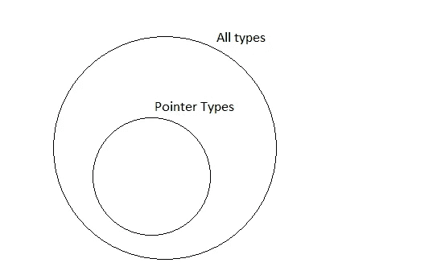

# 部分排序:包裹在谜底中的谜

> 原文：<https://medium.com/hackernoon/partial-ordering-an-enigma-wrapped-inside-of-a-riddle-a32e1a1fc10d>

在我看来，C++ [语言](https://hackernoon.com/tagged/language)中最复杂的规则与[函数](https://hackernoon.com/tagged/function)模板和类模板专门化的排序有关。它们是密集的、难以理解的、不规范的，涉及到在标准中从一个部分跳到另一个部分，而且，最重要的是，主要的编译器根本不同意这个标准。让我们探讨一下我的意思。

在进行重载决策时，我们要经历很多步骤来决定实际调用哪个函数。我们对不同类型的转换进行排序，我们更喜欢某些类型的引用，我们更喜欢非模板而不是模板，所有这些都按照小心的顺序排列。在我们放弃并认为调用不明确之前，最后一个决胜局是确定一个函数模板是否比另一个函数模板更加专门化。一个简单的例子:

我们这里有两个可行的候选者，它们都需要一个`int*`，因此完全符合论点。我们如何决定调用哪个函数？我们求助于[temp.func.order]:函数模板的部分排序。通俗地说，我们试图挑选哪一个函数模板可以应用到最少数量的类型。在这种情况下，我们很容易通过绘制图表来概念化这两个函数:



foo<int*> (#1) vs foo<int> (#2)

显然，#2 更加专门化，因为指针类型是所有类型的严格子集。我们能解决这个问题当然很好——但是对于编译器应该如何推理这个问题，规则是怎么说的呢？

大致的过程是，编译器为一个函数模板的每个模板参数合成新的类型，并尝试对另一个函数模板执行模板推导。然后，它以相反的顺序执行此操作。如果两个方向的演绎都成功，或者两个方向都不成功，那么两个函数模板都不会比另一个更专门化。如果演绎只在一个方向上成功，那么那就是专业化的反向。

在这个简单的例子中，我们首先试图从#2 推导出#1。我们合成一些新的类型，称之为`UniqueA`，并尝试进行演绎:

```
Function: template <class T> void foo(T ); // #1
Arguments: UniqueA*
```

这次推演成功，有了`T=UniqueA*`。现在，我们反过来做。我们合成另一种新类型，称之为`UniqueB`，并尝试进行演绎:

```
Function: template <class T> void foo(T* ); // #2
Arguments: UniqueB
```

这个推演就失败了。`UniqueB`不是指针类型。因为演绎只在一个方向上成功，所以#2 → #1，这使得#2 成为更专门化的函数模板。这整个过程回答了我们最初的问题:我们调用哪个函数？#2.

为了一个简单的例子，我们有必要经历整个过程，因为我们将要添加一个将撕裂我们的世界的皱纹:非演绎的上下文。我们在模板推导的正常情况下理解非推导上下文:非推导上下文中的模板参数不被推导(顾名思义！).这些参数必须要么明确提供，要么从其他参数中推导出来。如果这两种情况都没有发生，演绎就失败了。在本例中:

确定发生了什么很简单。#1 是一个可行的候选人，用`T=int`推断成功。在#2 中，`T`只出现在非推导的上下文中，没有提供。因此，演绎失败。我们只有一个可行的候选人，所以我们完成了。这调用#1。但是如果我们加上一条皱纹会发生什么？

现在，*两个*候选都是可行的，并且都是精确匹配的。和以前一样，我们进入了最后的决胜局:部分排序。哪个函数模板更专业？不像之前的`T` vs `T*`的案例，我们在这里没有任何清晰的直觉来判断哪个应该更专业。至少，我没有。所以让我们遵循规则，找出答案。我们从合成新类型开始，并在两个方向上进行演绎。让我们从从#2 推导#1 开始:

```
Function: template <class T> void foo(T );
Arguments: identity_t<UniqueA>
```

现在，`identity_t<UniqueA>`不是`UniqueA`。只是某种类型。在这个上下文中，我们不执行任何实例化。我们可以认为这是另一种独特的类型，称之为`UniqueA'`。这个方向推演成功，用`T=UniqueA'`。另一个方向呢:

```
Function: template <class T> void foo(identity_t<T> );
Arguments: UniqueB
```

我们有一个非演绎的上下文，所以演绎失败。因为演绎只在一个方向上成功，#2 → #1，#2 被认为是更专门化的函数模板，所以它是被调用的那个。(如果有任何疑问，每个编译器都同意这种解释。)

这符合直觉吗？我不确定。`identity_t<T>`是`T`类型的子集吗？但是等一下，桃乐茜，这趟旅程会变得更有趣。让我们添加另一个参数。

如果我们再增加一个参数会怎么样(我最初在 [StackOverflow](http://stackoverflow.com/q/31394260/2069064) 上问过这个例子):

在这里，即使`T`在#2 的第二个参数中是一个未推导的上下文，它也是从第一个参数中推导出来的，即`int`，因此推导成功，而无需显式提供任何内容。我们的直觉在这里会如何发挥作用？如果`identity_t<T>`比`T`更专业，那么专业应该在构图下工作，`(T, identity_t<T>)`应该比`(T,T)`更专业吧？好吧，直觉被高估了，让我们开始工作吧。

让我们从第二个推论出第一个:

```
Function: template <class T> void foo(T, T);
Arguments: UniqueA, identity_t<UniqueA> (or UniqueA, UniqueA')
```

这个推导失败，我们为`T`推导出两种不同的类型:`UniqueA`和`UniqueA'`。另一个方向呢？

```
Function: template <class T> void foo(T, identity_t<T> );
Arguments: UniqueB, UniqueB
```

在第一个论证中，演绎成功了，但是在第二个论证中，我们实际上做了什么？当参数是一个非推导的上下文时，我们在偏序中做什么？标准给我们的唯一指导在[temp.deduct.partial]中:

> 在大多数情况下，所有模板参数都必须有值才能成功推导，但对于偏序，如果模板参数不在用于偏序的类型中使用，则它可以没有值。*【注意:*在非推导上下文中使用的模板参数被视为已使用。 *—结束注释】【示例:*

```
template <class T>          T f(int); // #1
template <class T, class U> T f(U);   // #2void g() {
    f<int>(1); // calls #1
}
```

> *—示例结束】*

那是什么意思？`T`在#2 中是一个不可推导的上下文，所以在偏序中，我们可以推导出`U=int`，但不能推导出`T`。这一点表明，即使我们不能推出`T`，我们只是认为我们可以。仅出现在非推导上下文中的模板参数就像是推导出来的一样。我想。也许吧。

这意味着，在我们最初的例子中，演绎成功了#1 → #2(我们忽略了未演绎的上下文),但没有成功#2 → #1(我们为`T`演绎了不同的类型),所以我们称#1 为`(T,T)`函数，这与我的直觉所暗示的相反。但是在这里，我们也有我们的第一个分歧:虽然 gcc，clang 和 icc 都同意#1 更专业化，但 MSVC 认为这一呼吁模棱两可。这让 MSVC 错了吗？我其实不知道。有趣的是，MSVC 并不认为 T21 引用的标准例子有歧义。为什么在推理上有差异？

让我们在这个老人皮肤上再加一条皱纹。类模板部分专门化。我们如何挑选使用哪个类模板部分专门化？我们使用偏序规则。来自[临时类别订单]:

> 对于两个类模板部分专门化，如果给定对两个函数模板的以下重写，根据函数模板的排序规则(14.5.6.2)，第一个函数模板比第二个更专门化，则第一个比第二个更专门化:
> 
> (1.1)-两个函数模板中的每一个都具有与相应的部分专门化相同的模板参数。
> 
> (1.2)-每个函数模板都有一个类型为类模板专用化的函数参数，其中模板参数是部分专用化的 simple-template-id 的 template-argument-list 中每个模板参数的函数模板中的相应模板参数。

考虑这个例子(我最初也在 [StackOverflow](http://stackoverflow.com/q/42416993/2069064) 上问过这个例子):

是一种写类型特征的流行方式，所以在这篇文章中以某种方式突出它似乎是合适的。要回答这个程序打印什么的问题，我们必须知道选择了`A`的哪个专门化。并且，如所指定的，通过确定这些函数中的哪一个是由偏序规则最专门化的来回答该问题:

将#1 与#2 和#3 进行比较，很明显我们可以推导出#2 → #1 和#3 → #1 但不能反过来，所以它在#2 和#3 之间。让我们试试#3 → #2:

```
Function: template <class T> void foo(A<T, void_t<T>> ); // #2
Arguments: A<UniqueA*, void>
```

这成功了。我们可以从第一个参数匹配`T=UniqueA*`，然后像以前一样，我们忽略未推导的上下文。和#2 → #3:

```
Function: template <class T> void foo(A<T*, void> ); // #3
Arguments: A<UniqueB, void_t<UniqueB>>
```

这失败了。`void_t<UniqueB>`不是`void`(不管名字和沃尔特·布朗可能告诉你什么！)既然推演只在一个方向成功，太好了！#3 是最专业的。我们在这一点上也有编译器的统一:gcc、clang、icc 和 MSVC 都同意:#3 是这里最专门化的函数。

所以回到最初的问题。`A<int*, void>::value`产出什么？它显然产生 2 的权利，我们刚刚经历的过程中，确定这一点，所有的编译器同意我们！

不对。每个编译器都认为这是#2 和#3 之间不明确的专门化。对我来说，这很令人困惑。标准中表达的规则很清楚:最专门化的类模板专门化是给出最专门化的合成函数模板的那个。所有的编译器都同意#3 符合后者的要求，但是他们不同意#3 是最专门化的类模板专门化。这是编译器统一性的一个迷人之处。即使我发现了一个编译器错误，我也总是犹豫要不要提交。但是通常有一个正确的编译器和一个错误的编译器，我甚至不知道在这种情况下该怎么做。给每个人归档 bug？这种情况是怎么出现的？

最终，这似乎是一个不明确的问题。如果标准在这个问题上给出更多的清晰度，那就太好了。在偏序中，我们实际上是如何处理非演绎上下文的呢？特别是当`void_t`和类似的工具在代码中被更普遍地使用时，对代码实际上应该做什么有清晰的指导是很重要的。SFINAE 在类专门化中甚至没有很好的定义，但是在那里它的使用非常多。

不管怎样，有一件事非常清楚:C++真的很复杂。

[](http://bit.ly/HackernoonFB)[](https://goo.gl/k7XYbx)[](https://goo.gl/4ofytp)

> [黑客中午](http://bit.ly/Hackernoon)是黑客如何开始他们的下午。我们是 [@AMI](http://bit.ly/atAMIatAMI) 家庭的一员。我们现在[接受投稿](http://bit.ly/hackernoonsubmission)并乐意[讨论广告&赞助](mailto:partners@amipublications.com)机会。
> 
> 如果你喜欢这个故事，我们推荐你阅读我们的[最新科技故事](http://bit.ly/hackernoonlatestt)和[趋势科技故事](https://hackernoon.com/trending)。直到下一次，不要把世界的现实想当然！

