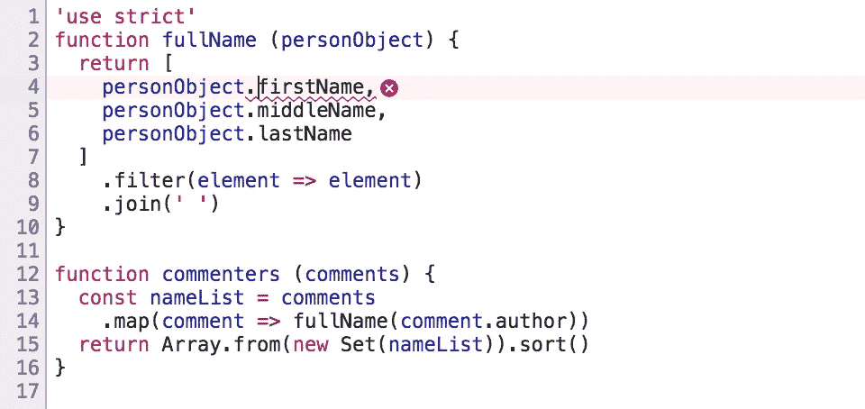
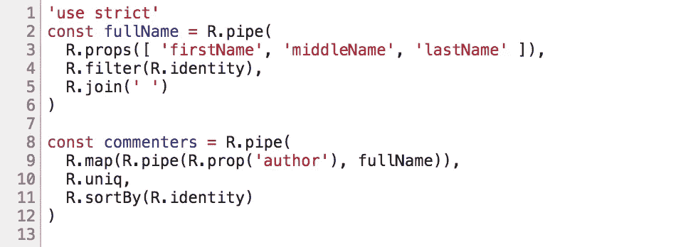
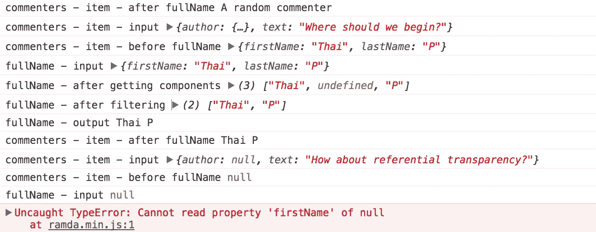

# 部分应用的(或简化的)函数可能会混淆 JavaScript 堆栈跟踪

> 原文：<https://medium.com/hackernoon/partially-applied-curried-functions-could-obfuscate-the-javascript-stack-trace-84d66bd8032e>

## 在用 JavaScript 编写函数代码时，这是一个经常被忽视的权衡。

在学习 JavaScript 的函数式编程时，尽可能多地以**无指针风格**编写代码是非常有诱惑力的。

# 什么是无点风格？

用 pointfree-style 编写函数意味着您编写一个函数而不提及输入参数。

考虑这个函数，它接受一个表示人的对象，并返回全名:

```
**function** fullName (***personObject***) {
  **return** [
    ***personObject***.firstName,
    ***personObject***.middleName,
    ***personObject***.lastName
  ]
    .filter(***element*** => ***element***)
    .join(' ')
}**const** me = {
  firstName: 'Thai',
  lastName: 'P'
}fullName(me)
  **// => 'Thai P'**
```

注意名字，`***personObject***`和`***element***`。我们需要给我们的输入变量命名，这样我们就可以处理它们来得到一个结果。

但是我们真的必须这么做吗？如果我们可以通过拼接更小的函数来创建这个函数呢？例如， [Ramda](http://ramdajs.com/docs/) 包含了一系列的实用函数来帮助我们做到这一点:

`**R.props**`将一组属性名转换成一个函数，该函数接受一个对象并返回一组值:

```
**const** nameComponents = R.props([
  'firstName',
  'middleName',
  'lastName'
])nameComponents(me)
  **// => [ 'Thai', undefined, 'P' ]**
```

`**R.filter**`接受一个谓词并生成一个函数，该函数可以使用该谓词过滤数组。`**R.identity**`相当于`element => element`。

```
**const** rejectEmpty = R.filter(R.identity)rejectEmpty([ 'Thai', undefined, 'P' ])
  **// => [ 'Thai', 'P' ]**
```

`**R.join**`接受一个分隔符字符串，并生成一个函数，将一个数组连接成一个中间带有分隔符的字符串。

```
**const** unwords = R.join(' ')unwords([ 'Thai', 'P' ])
  **// => 'Thai P'**
```

因此，我们的`**fullName**`函数可以写成由这三个更小的函数组成的管道:

```
**const** fullName = R.pipe(
  nameComponents,
  rejectEmpty,
  unwords
)
```

让我们将它们串联起来，这样当我们阅读`**fullName**`的定义时，我们就能确切地知道将要发生什么:

```
**const** fullName = R.pipe(
  R.props([ 'firstName', 'middleName', 'lastName' ]),
  R.filter(R.identity),
  R.join(' ')
)fullName(me)
  **// => 'Thai P'**
```

如你所见，现在我们不再需要编造`***personObject***`和`***element***`这样的名字。给事物命名是一个很难的计算机科学问题。以这种方式创建函数有助于减少命名事物的需要！

> **注:**我只是以`ramda`为例。也可以用`lodash/fp`、`sanctuary`，或者自己写这些函数。事情是你不自己写函数，而是你组合(重用)更小的函数来创建更大的函数。

当你部分应用函数时，你是在做无点风格:

```
**const** multiply = (a, b) => a * b
**const double = multiply.bind(null, 2)**
```

或者当你调用一个 curried 函数时:

```
**const** multiply = (a) => (b) => a * b
**const double = multiply(2)**
```

不管怎样，你最终得到的是一个由另一个函数生成的函数。

# 但是我们应该一直使用它吗？

简而言之:不总是这样，因为这可能会混淆 JavaScript 堆栈跟踪。请继续阅读，了解更多解释。

## 一个例子…

假设我们有一系列博客评论:

```
**let** comments = [
  {
    author: { firstName: 'Thai', lastName: 'P' },
    text: 'I like functional programming!'
  },
  {
    author: {
      firstName: 'A',
      middleName: 'random',
      lastName: 'commenter'
    },
    text: 'Why?'
  },
  {
    author: { firstName: 'Thai', lastName: 'P' },
    text: 'Where should we begin?'
  }
]
```

现在，我想获得一个评论者的列表，按字母顺序排序。

我可以想出这样的东西:

```
**function** fullName (*personObject*) {
  **return** [
    *personObject*.firstName,
    *personObject*.middleName,
    *personObject*.lastName
  ]
    .filter(*element* => *element*)
    .join(' ')
}**function** commenters (*comments*) {
  **const** *nameList* = *comments*
    .map(*comment* => fullName(*comment*.author))
  **return** Array.from(new Set(*nameList*)).sort()
}commenters(comments)
 **// => [ 'A random commenter', 'Thai P' ]**
```

根据我们对 pointfree-style 的了解，我们可以将上面的内容重构为如下内容:

```
**const** fullName = R.pipe(
  R.props([ 'firstName', 'middleName', 'lastName' ]),
  R.filter(R.identity),
  R.join(' ')
)**const** commenters = R.pipe(
  R.map(R.pipe(R.prop('author'), fullName)),
  R.uniq,
  R.sortBy(R.identity)
)
```

这要简洁和声明性得多！

## 然后意想不到的事情发生了

后来评论系统允许人们匿名评论。这意味着注释的`author`现在可以是`**null**`。

```
comments = [ ...comments, {
  author: **null**,
  text: 'How about referential transparency?'
} ]
```

由于我们无法阅读`comment.author.firstName`，应用程序崩溃了。

现在让我们比较两个版本之间的堆栈跟踪…

## 版本 1(非无点数)



This file is where the error was thrown.

```
**Uncaught TypeError: Cannot read property 'firstName' of null**
    at fullName (app1.js:4)
    at comments.map.comment (app1.js:15)
    at Array.map (<anonymous>)
    at commenters (app1.js:15)
    at index2.html:35
```

在这个版本中，上面的堆栈跟踪显示了错误发生的确切位置:在从传递给`comments.map`的`commenters`映射函数调用的`fullName`函数中。

## 版本 2(无点数)



No red squiggly lines here? But my app’s code lives here!

```
**Uncaught TypeError: Cannot read property 'firstName' of null**
    at props (ramda.js:7314)
    at ramda.js:138
    at f1 (ramda.js:31)
    at ramda.js:2061
    at ramda.js:2061
    at ramda.js:205
    at ramda.js:2061
    at ramda.js:205
    at _map (ramda.js:572)
    at map (ramda.js:848)
    at ramda.js:470
    at ramda.js:138
    at f1 (ramda.js:31)
    at ramda.js:2061
    at ramda.js:2061
    at ramda.js:205
    at index2.html:35
```

在这个版本里，我们看到的都是拉姆达。

**我们的应用代码** (app2.js) **从来没有在堆栈跟踪中提到过。**事实上，我们从未在那个文件中创建任何函数。我们只是将 Ramda 函数组合在一起，也许是以一种错误的方式…

在这个例子中，我们只使用了一次`R.props`,所以我们知道去哪里找。但是如果应用程序更大并且在很多地方使用`R.props`会怎么样呢？

祝你想明白的时候开心！

> **注意:**还是那句话，这不是 Ramda(或者其他 FP 库)的问题。我们只是用它来生成函数，使我们的代码更具声明性和无指针性，所以 Ramda 很酷。不酷的是编写无指针代码而不考虑它对堆栈跟踪的影响。

## `trace`功能

当提出对调试的担忧时，函数式编程的倡导者[会](/javascript-scene/composing-software-an-introduction-27b72500d6ea#5312) [建议](https://drboolean.gitbooks.io/mostly-adequate-guide/content/ch5.html#debugging) [使用`trace()`函数来处理](https://stackoverflow.com/questions/40289989/point-free-debugging)这个问题:

```
**const** trace = text => (
  value => (console.log(text, value), value)
)
```

这使我们能够看到流经管道的价值:

```
**const** pipeline = R.pipe(
  trace('input'),
  f,
  trace('after f'),
  g,
  trace('after g (output)')
)
```

因此，让我们继续将这些`trace`呼叫放入我们的应用程序中吧！

```
**const** fullName = R.pipe(
  **trace('fullName - input')**,
  R.props([ 'firstName', 'middleName', 'lastName' ]),
  **trace('fullName - after getting components')**,
  R.filter(R.identity),
  **trace('fullName - after filtering')**,
  R.join(' '),
  **trace('fullName - output')**
)**const** commenters = R.pipe(
  **trace('commenters - input')**,
  R.map(R.pipe(
    **trace('commenters - item - input')**,
    R.prop('author'),
    **trace('commenters - item - before fullName')**,
    fullName,
    **trace('commenters - item - after fullName')**
  )),
  **trace('commenters - raw list of authors')**,
  R.uniq,
  **trace('commenters - after unique')**,
  R.sortBy(R.identity),
  **trace('commenters - after sort (output)')**
)
```

现在，这使我们能够更容易地看到错误的原因:



Ok, so in `***commenters***` we tried to send **null** into **fullName**

虽然这种调试技术在开发过程中有效，但对于运行在产品上的应用程序来说并不实用，比如在客户的浏览器上。你会在一个生产应用程序中留下很多这样的跟踪代码吗？

**生产中的意外错误通常发生在客户的浏览器上**(否则，我们的测试会发现它们)，所以现在，我们剩下的只是一个带有堆栈跟踪的错误报告。我们不能只是告诉我们的客户编辑我们的应用程序的源代码，并加入`trace()`调用！

当出现问题时，错误报告应该包含足够的信息供开发人员修复。如果误差不能确定地再现，这一点尤其重要。

当然，如果我们有更好的涵盖所有边缘情况的测试套件，这个问题本来可以更好地避免。但是意外的事情还是发生了。能够轻松处理生产中的意外错误是不容忽视的。

当我从许多渠道学习函数式编程时，每个人都惊叹于如何使用 curried 函数来使函数像乐高积木一样组合在一起。

他们说`**const** g = (x) => f(x)`只相当于`**const** g = f`。但是没有人提到过，在实践中，这是如何消除对跟踪错误源至关重要的堆栈帧的。

# 那么我们能做什么呢？

如何让我们的功能代码更容易调试？如何才能让我们的堆栈跟踪更有意义？

## 自己创建一个函数来建立一个堆栈框架

我们可以创建非自由点函数，在适当的时候调用自由点函数:

```
**const** fullNamePipeline = R.pipe(
  R.props([ 'firstName', 'middleName', 'lastName' ]),
  R.filter(R.identity),
  R.join(' ')
)**function** fullName (personObject) {
  **return** fullNamePipeline(personObject)
}**const** commentersPipeline = R.pipe(
  R.map(R.pipe(R.prop('author'), fullName)),
  R.uniq,
  R.sortBy(R.identity)
)**function** commenters (comments) {
  **return** commentersPipeline(comments)
}
```

现在我们的堆栈跟踪更有意义了:

```
Uncaught TypeError: Cannot read property 'firstName' of null
    at props (ramda.js:7314)
    at ramda.js:138
    at f1 (ramda.js:31)
    at ramda.js:2061
    at ramda.js:2061
    at ramda.js:205
    at **fullName (app2.js:9)**
    at ramda.js:2061
    at ramda.js:205
    at _map (ramda.js:572)
    at map (ramda.js:848)
    at ramda.js:470
    at ramda.js:138
    at f1 (ramda.js:31)
    at ramda.js:2061
    at ramda.js:2061
    at ramda.js:205
    **at commenters (app2.js:19)**
    at index.html:35
```

但是现在有了更多的代码。

## 动态注入堆栈帧

我们可以通过使用这个辅助函数来注入一个堆栈帧。它有助于在调用时注入一个人工堆栈帧:

```
**// Note: This function only works correctly in Chrome.****function** /* yourNameIs */ 名は (名, f) {
  **const** キー = `(╯°□°）╯︵ ${名}`
  **return** {
    [キー] () { **return** f.apply(**this**, arguments) }
  }[キー]
}
```

那么我们可以这样使用它:

```
**const** fullName = **名は('fullName',** R.pipe(
  R.props([ 'firstName', 'middleName', 'lastName' ]),
  R.filter(R.identity),
  R.join(' ')
)**)****const** commenters = **名は('commenters',** R.pipe(
  R.map(R.pipe(R.prop('author'), fullName)),
  R.uniq,
  R.sortBy(R.identity)
)**)**
```

堆栈跟踪现在看起来像这样:

```
Uncaught TypeError: Cannot read property 'firstName' of null
    at props (ramda.js:7314)
    at ramda.js:138
    at f1 (ramda.js:31)
    at ramda.js:2061
    at ramda.js:2061
    at ramda.js:205
    at **(╯°□°）╯︵ fullName (util.js:3)**
    at ramda.js:2061
    at ramda.js:205
    at _map (ramda.js:572)
    at map (ramda.js:848)
    at ramda.js:470
    at ramda.js:138
    at f1 (ramda.js:31)
    at ramda.js:2061
    at ramda.js:2061
    at ramda.js:205
    at **(╯°□°）╯︵ commenters (util.js:3)**
    at index.html:35
```

在堆栈跟踪中可以更清楚地看到我们的函数，但是现在我们丢失了关于函数创建位置的信息(app2.js)。

## 记录函数的起源

We can improve our `名は` function by making it record the call site when we try to name a function:

```
**// Note: This function only works correctly in Chrome.****function** 名は (名, f) {
  **const** atOrigin = (
    String(**new** Error('ヤバい！').stack).split('\n')[2] || ''
  ).trim()
  **const** キー = `(╯°□°）╯︵ ${名} (created ${atOrigin})`
  **return** {
    [キー] () { **return** f.apply(**this**, arguments) }
  }[キー]
}
```

现在我们的堆栈跟踪看起来像这样:

```
Uncaught TypeError: Cannot read property 'firstName' of null
    at props (ramda.js:7314)
    at ramda.js:138
    at f1 (ramda.js:31)
    at ramda.js:2061
    at ramda.js:2061
    at ramda.js:205
    **at (╯°□°）╯︵ fullName (created at app2.js:2:18)** (util.js:5)
    at ramda.js:2061
    at ramda.js:205
    at _map (ramda.js:572)
    at map (ramda.js:848)
    at ramda.js:470
    at ramda.js:138
    at f1 (ramda.js:31)
    at ramda.js:2061
    at ramda.js:2061
    at ramda.js:205
    **at (╯°□°）╯︵ commenters (created at app2.js:8:20)** (util.js:3)
    at index.html:35
```

这不仅告诉我们函数的名字，还告诉我们它是在哪里创建的。

## 让库为我们注入有意义的堆栈框架

这只是一个想法…但是如果 FP 库可以在适当的地方为我们注入辅助堆栈帧，那是不是很棒？发生错误时，堆栈跟踪可能如下所示:

```
Uncaught TypeError: Cannot read property 'firstName' of null
    at props (ramda.js:7314:19)
    at ramda.js:138:46
    **at R.props([firstName,middleName,lastName])** (ramda.js:31:17)
    at ramda.js:2061:27
    at ramda.js:2061:27
 **at R.pipe(R.props([firstName,middleName,lastName]),
              R.filter(R.identity),
              R.join(' '))** (ramda.js:204:43)
    at ramda.js:2061:14
 **at R.pipe(R.prop(author),fullName)** (ramda.js:204:43)
    at _map (ramda.js:572:19)
    at map (ramda.js:848:14)
    at ramda.js:470:15
    at ramda.js:138:46
 **at R.map(R.pipe(R.prop(author),fullName))** (ramda.js:31:17)
    at ramda.js:2061:27
    at ramda.js:2061:27
    **at** **R.pipe(R.map(R.pipe(R.prop(author),fullName)),
              R.uniq,
              R.sortBy(R.identity))** (ramda.js:204:43)
    at index2.html:43:13
```

这将使开发人员更容易调试生产问题。

## 使用类型化语言，保证您的函数永远不会收到无效数据

像 Haskell 和 [Elm](http://elm-lang.org/) 这样的语言有助于防止类型级别的运行时异常。这意味着你可以编写无点函数，并且确信它 ***永远不会*** 接收到意想不到的值。

经常可以看到这些语言中的无指针风格的代码。他们甚至被认为是“良好的纪律”引用 [Haskell wiki](https://wiki.haskell.org/Pointfree) :

> 这种风格在通过计算获得高效程序时特别有用，并且通常构成良好的纪律。它帮助作者(和读者)思考如何组合函数(高级)，而不是混洗数据(低级)。

顺便说一句，玩得开心处理 [JSON 解码器](https://guide.elm-lang.org/interop/json.html)和那些[也许](https://guide.elm-lang.org/error_handling/maybe.html) s！当涉及到处理来自外部服务的数据时，这些安全特性会使您的代码变得非常冗长，但是[从长远来看，这是非常值得的](https://charukiewi.cz/posts/elm/)。

根据我的经验，重构 Elm 代码比重构 JavaScript 代码有趣得多，因为编译器在每一步都帮助了我。

## 或者只是不要过分使用 JavaScript 中的无指针风格

```
**function** fullName (personObject) {
  **return** [ 'firstName', 'middleName', 'lastName' ]
    .map(key => personObject[key])
    .filter(R.identity)
    .join(' ')
}
**function** commenters (comments) {
  **const** nameList = comments
    .map(comment => comment.author)
    .map(fullName)
  **return** R.sortBy(R.identity, R.uniq(nameList))
}
```

# 结论

用 pointfree 风格编写函数式代码可以让你的代码更简洁，更具声明性。命名的东西少了。但这也是有代价的。你不再免费获得堆栈跟踪清晰度。除非小心处理，否则它会使您的堆栈跟踪变得非常模糊，从而很难跟踪生产应用程序中的错误来源。

对如何提高函数式 JavaScript 代码的可调试性有更多的想法吗？请写回应！:)