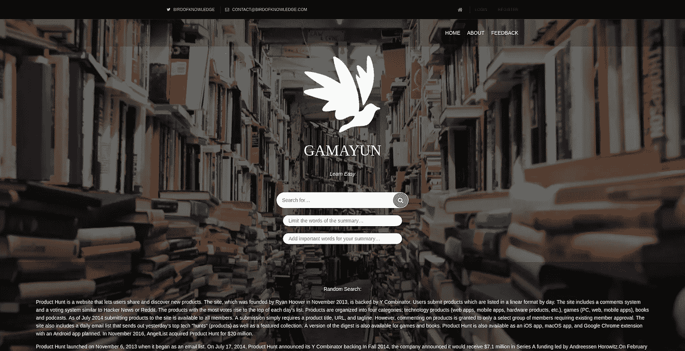

# 参加产品搜寻全球黑客马拉松—第 1 天至第 11 天

> 原文：<https://medium.com/hackernoon/participating-in-product-hunt-global-hackathon-days-1-to-11-676ce0db6e63>

自我介绍——自从我读了 Tim Ferriss 的书[泰坦的工具](https://www.amazon.co.uk/Tools-Titans-Billionaires-World-Class-Performers/dp/1328683788/ref=tmm_hrd_swatch_0?_encoding=UTF8&qid=1510501008&sr=8-1)后，我就成了日志爱好者。有几种类型的日志记录会导致不同的结果。Medium 上也有几篇关于写日记的文章，例如:[为什么写日记会改变你的生活](/the-mission/why-keeping-a-daily-journal-could-change-your-life-b9421a69912a)、[一种新的写日记方式](/personal-growth/a-new-kind-of-journaling-dd31db5c9ab8)等等。我喜欢在早上起床后和睡觉前写日记，只是为了过滤我所有的想法。当我把它们写在纸上时，它们似乎更容易控制。当我把它们写在纸上的时候，我能够远离它们，保持头脑清醒。我计划以日志的形式写一系列关于我在黑客马拉松中做什么的短文(这篇会稍长一些)。

Intro 2.0 —我想写一篇文章，讲述参与制作 Product Hunt 的书— [如何在技术领域建立职业生涯](https://www.producthunt.com/posts/how-to-build-a-career-in-tech-by-product-hunt)是多么棒，但一些旅行和其他事情阻碍了我的想法。也许如果有另一本书，我会写它。因为我错过了那个机会，所以我决定在我也错过这个机会之前，记录下我每天为黑客马拉松所做的事情。

## 第一天——提出想法

我一看到它就报名了。这是一个很好的机会来建造一些很棒的东西，测试产品亨特的船，会见其他很棒的家伙，他们正在制作有趣的项目，可能还有另外 10000 件东西。然而，我不知道我想做什么。

在第一天，介绍了第一个可交付成果——我们必须想出项目名称、推介和创建登录页面。我仍然丝毫不知道我要为 hackaton 做什么，但我必须提交可交付的东西——最好越快越好。经过一些单独的头脑风暴后，我想出了我想做的事情。我经常搜索一些东西，这些东西会导致一个冗长的维基百科或另一个网站文章，其中有很多信息，但很少是关于我正在寻找的东西。我也从几年前开始对人工智能和人工智能感兴趣。当你把这两者放在一起，你就得到一个可以为你研究和总结任何主题的人工智能平台。

然而这个名字被证明是有问题的。我习惯用不同神话中的神的名字来命名我的一些项目。然而，所有与“知识”有一点点联系的神都被人工智能项目“带走”了。经过短暂的搜索，我找到了一个同样与知识相关的斯拉夫神——[伽马云](https://en.wikipedia.org/wiki/Gamayun)。因为 Gamayun 是一只人头鸟，所以我可以制作一些很酷的动画，标题等等。

然而，包括 Gamayun 在内的域名被占用。所以我停在了 birdofknowledge.com 的 T2，因为这就是 Gamayun 的本质。我购买了域名。

在最初的 5 个小时内，我想出了我想做的事情，名称，并购买了域名。

这是第一天的。

## 第 2 天——创建 twitter 句柄

第二天我没有太多时间，所以我只是为这个项目制作了电子邮件和 twitter 账户。你可以发微博到这里——[@知识之鸟](https://twitter.com/BirdOfKnowledge)

## 第四天——制作一个简单的网站

我不擅长做网站。很多。于是我搜索免费模板，找出了 [OS 模板](http://www.os-templates.com/)。一个模板引起了我的注意，但它仍然与我想要的不同。我下载了它，并开始删除所有我不需要的东西。我需要一个非常简单的首页和其他几个页面，用户控制和反馈。经过大量的删除，我有了一个网页，似乎足够好了。

## 第 5、6、7 天—寻找用于创建摘要的库

我花了几天时间寻找解决这个问题的现成方法。我测试了至少 10 个网站，包括— [SMMRY](http://smmry.com/) 、[文本摘要器](http://autosummarizer.com/)、[在线摘要器工具](https://www.tools4noobs.com/summarize/)和其他几个。我查看了 github 和 random 论坛上所有试图解决概要生成问题的图书馆。它们都不是我要找的，也不容易理解。

## 第九天——制作自己的总结库

我放弃了，并为我遇到的问题编写了自己的库。最初的版本大概花了一个小时。几天后，我在其他任务之间对它进行了调整，处理所有关于总结、缩短文本、评估等等的类仍然不到 100 行代码！

很可能有更好的解决方案。然而，拥有自己的库也有一些好处——我知道代码，可以很容易地定制和维护它。尤其是当我把它和别人现成的解决方案比较时。它也可以根据我的需要量身定制。

## 第 10 天和第 11 天——为第二个交付件做准备

第二个可交付成果要求制造商必须展示他们产品的进展，并让社区参与进来。大多数人分享了产品的早期版本，我也决定这么做。所以我开始做头版。一旦我感到满意，我就把注意力集中在总结上，并对其进行修改。然后我添加了一个关于页面和一个反馈收集页面，这是一个简单的[类型表单](https://www.typeform.com/)。在做了所有这些事情之后，我决定在首页上看到一个随机的、汇总的搜索会很好，所以我为此做了一个简单的模型和控制器。我测试了所有的东西，认为它对于一个 alpha 版本来说已经足够好了。我没有注意到已经快凌晨 5 点了。我给所有的订户发了一条信息，然后就去睡觉了。

## 第 12 天——开始写日记

昨晚连续编码超过 10 个小时后，我决定只修复几个报告的 bug，看看让 Gamayun 成为一个 Slack bot 需要多少成本，然后开始这个 jorunaling。

## 序言

有些日子不包括在内，因为我有一份朝九晚五的工作，我无法每天为黑客马拉松编写代码。

项目可以在这里找到—【http://birdofknowledge.com/ 

目前看起来是这样的:

如果你是黑客马拉松的参与者，我很想听听你对黑客马拉松和这篇文章的印象，以及到目前为止我们的**之旅**是否有任何相似之处。

当然，我们非常欢迎任何人在这里订阅 gama yun——[https://www.producthunt.com/upcoming/gamayun](https://www.producthunt.com/upcoming/gamayun)，测试它，发微博给它，以及任何你能想到的东西:)