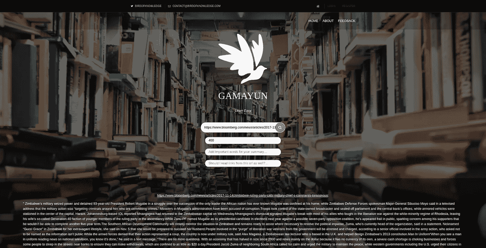
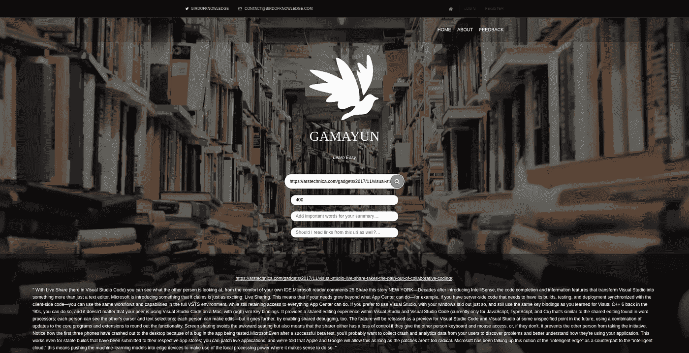
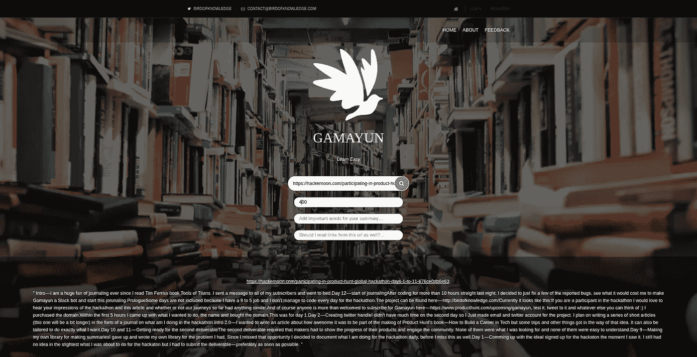

# 参加产品搜寻全球黑客马拉松—第 13 天和第 14 天

> 原文：<https://medium.com/hackernoon/participating-in-product-hunt-global-hackathon-days-13-and-14-137072e1d05c>

## 第 1 天到第 11 天

可以在这里找到->[https://hacker noon . com/participating-in-product-hunt-global-hackathon-days-1-to-11-676 ce 0 db 6 e 63](https://hackernoon.com/participating-in-product-hunt-global-hackathon-days-1-to-11-676ce0db6e63)

## 第 12 天

用户报告的 rest 和小修复

## 第 13 天

Gamayun 能够搜索和总结事物。是时候进行下一步了——总结网页！事实证明这其实很复杂。chrome 有几个扩展，可以将网页简化成更易于打印的版本。然而，它们似乎都不像我想要的那样工作，所以我决定尝试找到一种能够从在线文章中提取文本的方法。这花了一些时间。第 13 天，我熬夜到凌晨 2 点。还是不行…

## 第 14 天

我一直在努力。 [PHP DOMDocument](http://php.net/manual/bg/domdocument.loadhtml.php) 相当牛逼且易于使用。尽管网站有不同的 DOM 结构。实际上他们没有任何共同之处。又过了 5 个小时，我设法让它工作了。它结合了父节点、子节点、文本比较、子节点数量和许多其他的东西，但是我已经在几个网站上测试过了，看起来很有效。

[https://www.theverge.com/](https://www.theverge.com/)

[https://www.bloomberg.com/europe](https://www.bloomberg.com/europe)

[https://arstechnica.com/](https://arstechnica.com/)

[https://hackernoon.com/](https://hackernoon.com/)

我睡眠不足的大脑想不出更多的网站来测试它，但它在 http://birdofknowledge.com[在线直播，所以如果有人发现它不能工作的网站，请告诉我，我会修复它。](http://birdofknowledge.com)

## 然后

我将在未来几天内尝试添加用户帐户。我们将看看结果如何。

## 序言

如果你是[黑客马拉松](https://hackernoon.com/tagged/hackathon)的[参与者](https://hackernoon.com/tagged/participant)，我很想听听你对黑客马拉松和这篇文章的印象，以及迄今为止我们的**旅程**是否有任何相似之处。

当然，我们非常欢迎任何人在这里订阅 gama yun——[https://www.producthunt.com/upcoming/gamayun](https://www.producthunt.com/upcoming/gamayun)，测试它，发微博给它，以及任何你能想到的东西:)