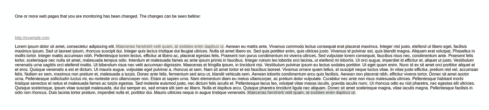
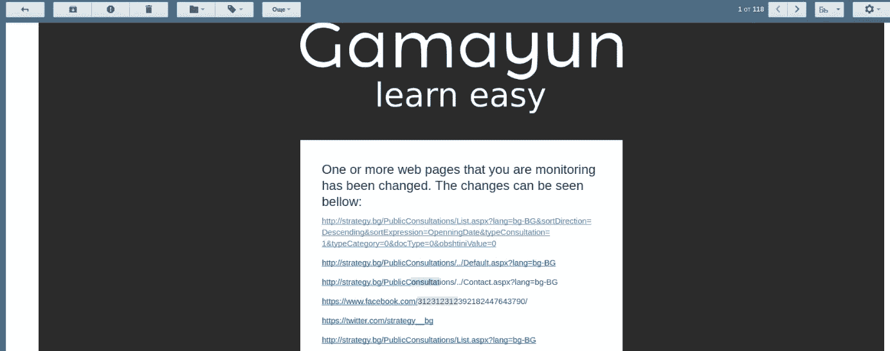

# 参加产品搜寻全球黑客马拉松—第 20-22 天

> 原文：<https://medium.com/hackernoon/participating-in-product-hunt-global-hackathon-days-20-22-33b0dab99063>

或者，为什么样式化[电子邮件](https://hackernoon.com/tagged/email)模板应该被认为是一种酷刑，是日内瓦公约所禁止的！

我的一个朋友告诉我，有很多人经常查看政府网站，看看是否有任何与他们有关的变化。我决定把这个也作为[知识之鸟](http://birdofknowledge.com)的一个功能添加进去。

想法很简单->用户输入他们想要跟踪的网站和他们想要跟踪的时间间隔，最少半小时。抓取网页，提取有意义的内容，检查是否有不同于以前的版本，发送电子邮件给用户。

男孩，我错了吗…

至少在保加利亚，政府网站有一个非常有趣的结构(是****)。奇怪的是，我设法在几个小时内从政府网站上提取了有意义的数据。

我还发现了一个第三方库，可以在两个字符串之间产生差异，我会在发送电子邮件时使用它。它看起来像这样。

version 0.1

然后我只需要发邮件。只有！事实证明，为不同的邮件提供商设计邮件样式是非常过时的。

记住我已经 24 岁了。我没有完全用表格制作网站来完美适应浏览器的经验。当我想要表示可视数据时，我使用表格。

设计电子邮件就像为 2000 +/-几年左右的东西编写网站的视觉部分。我花了一些时间找到免费的模板，甚至花了更多的时间(大约一个小时)来破译模板，删除所有我不需要的部分，修改我需要的部分。最后我只剩下这个了，我想这对于一个测试版来说是可以的。

尽管它看起来非常简单，但它是一堆表格、表格行、tds 和 tds 中的表格等等，直到电子邮件客户端决定用平面背景呈现简单的正方形。

## 然后

我会写不同的搜索 API 的状态，以及为什么我不使用它们，明天仍然能够抓取网页:)

## 序言

这个功能是活的，只有少数人在使用！这意味着我的痛苦没有白费！

如果你是[黑客马拉松](https://hackernoon.com/tagged/hackathon)的参与者，我很想听听你对黑客马拉松和这篇文章的印象，以及到目前为止我们的**旅程**是否有任何相似之处。

以前的文章可以在这里找到:
[https://medium.com/@k_ivanow](/@k_ivanow)

当然，我们非常欢迎任何人在这里订阅 gama yun——[https://www.producthunt.com/upcoming/gamayun](https://www.producthunt.com/upcoming/gamayun)，测试它，发微博给它，以及任何你能想到的东西:)