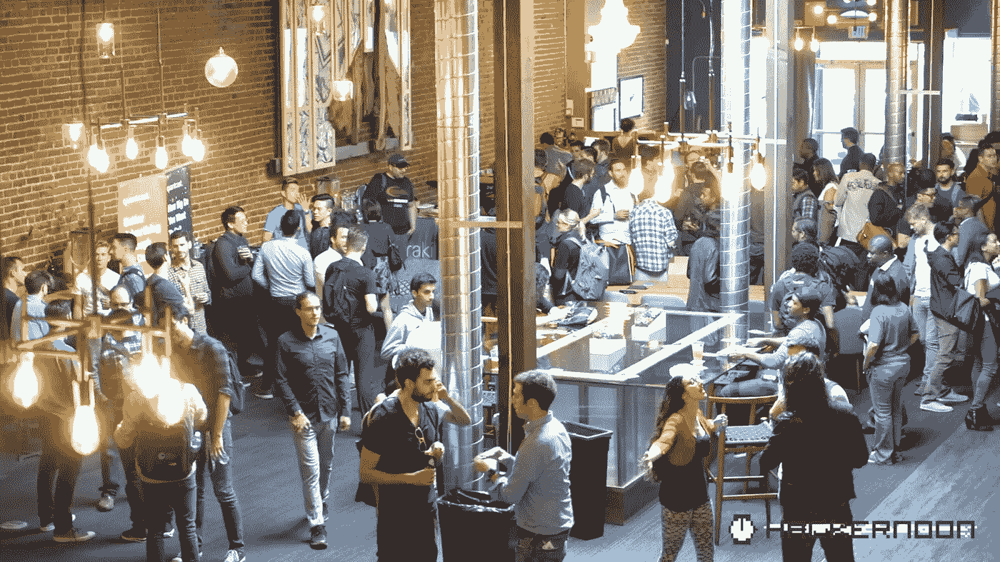

# 派对视频…还有你发布 w/ Hacker Noon 之后会怎么样？

> 原文：<https://medium.com/hackernoon/party-video-and-what-happens-after-you-publish-w-hacker-noon-e775a8ae5971>

## 查看我们就职黑客午间派对的[视频。还有](https://www.facebook.com/search/1876775545882918/stories-by?esd=eyJlc2lkIjoiUzpfSTE4NzY3NzU1NDU4ODI5MTg6Vks6MjEwOTI5Mzg5MjYzMTA4MSIsInBzaWQiOnsiMTg3Njc3NTU0NTg4MjkxODoyMTA5MjkzODkyNjMxMDgxIjoiVXpwZlNURTROelkzTnpVMU5EVTRPREk1TVRnNlZrczZNakV3T1RJNU16ZzVNall6TVRBNE1RPT0ifSwiY3JjdCI6InRleHQiLCJjc2lkIjoiZjhhNGEwMzYzZTBmMThmNGM3MmY5ODdjZjA3N2Q4NDkifQ%3D%3D)[也在浏览照片](https://www.facebook.com/pg/hackernoon/photos/?tab=album&album_id=2108605296033274)。

# 用 Hacker Noon 发布后会发生什么？

《黑客正午》的新撰稿人[莫希特·马莫里亚](https://medium.com/u/24f7fbc09357?source=post_page-----e775a8ae5971--------------------------------)一直在为他的科技故事寻找归宿。一家又一家顶级科技刊物拒绝了他的故事。但是为什么呢？让复杂的想法变得更容易理解的故事是非常有价值的。你不必成为一个著名的投资者或企业家来讲述一个伟大的故事。我们在黑客正午发表: [**WTF 就是区块链？简明英语 3500 字终极指南**](https://hackernoon.com/wtf-is-the-blockchain-1da89ba19348) **。在不到一周的时间里，它获得了 1000 多条推荐&33000 多浏览量。那些拒绝它的顶级科技出版物呢？他们现在要求重新出版。你现在也可以在 [The Next Web](https://thenextweb.com/evergreen/2017/07/04/ultimate-3500-word-plain-english-guide-blockchain/) 、[LinkedIn 5 个脉冲类别](https://www.linkedin.com/pulse/blockchain-absolute-beginners-mohit-mamoria)和其他技术渠道上阅读这个故事。**

[*本周促销免费赠品:思科 Meraki 正在赠送价值 100 万美元的免费技术——看看你是否有资格。*](https://goo.gl/WGtNp1)

[*本周晋升工作机会:Quantcast 员工软件工程师、归因和广告报告*](https://goo.gl/JaoF39)

# 本周黑客中午应该看什么？

## 2 大图趋势件:[比特币、以太坊、区块链、代币、ICOs:为什么有人要在意？软件/系统工程师](http://Bitcoin, Ethereum, Blockchain, Tokens, ICOs: Why should anyone care?)[普瑞蒂·卡西雷迪](https://medium.com/u/d446dafbe292?source=post_page-----e775a8ae5971--------------------------------) & [一条更好的体面之路:科技会引领潮流吗？](https://hackernoon.com/a-better-path-to-decency-will-tech-lead-the-way-ebd055c2482e)由 VC [布列塔尼·拉夫林](https://medium.com/u/c2f3fbddcb49?source=post_page-----e775a8ae5971--------------------------------)

## 5 近期指南:[寻求介绍](https://hackernoon.com/how-to-ask-for-an-introduction-b19ffcde2b00')、[建立 Http 容器](https://hackernoon.com/how-to-build-a-tiny-httpd-container-ae622c37db39)、[进行指导工作](https://hackernoon.com/why-people-resist-mentoring-and-how-to-make-it-work-e4e18f6f9a7e)、[找到美国的企业家精神](https://hackernoon.com/how-to-find-americas-entrepreneurial-soul-84199e49c1a1)、&、[在 1 天内建立一个订阅网站](https://hackernoon.com/how-to-build-a-box-subscription-site-in-1-day-8dd041fdfe5)作者:[乔丹根恩](https://medium.com/u/44177f8b0abf?source=post_page-----e775a8ae5971--------------------------------)、[唯帅(Ishaya)艾布拉姆斯](https://medium.com/u/1113acadcea4?source=post_page-----e775a8ae5971--------------------------------)、[普尔尼玛·维贾亚山克尔](https://medium.com/u/ebd37a9be319?source=post_page-----e775a8ae5971--------------------------------)、

## 1 关于如何谈论将驱动我们的技术的指南:[自动驾驶汽车，解释:关于谈论我们自动驾驶汽车未来的信息指南](https://hackernoon.com/self-driving-cars-explained-db9fc8ced7e8)，作者[亚历克斯·菲尔德](https://medium.com/u/e2053c5a15bf?source=post_page-----e775a8ae5971--------------------------------)。

## 关于产品管理的一条建议:[有些团队能完成任何事情真是个奇迹……或者，为什么你应该想象所有的工作和使用延迟成本](https://hackernoon.com/its-a-wonder-some-teams-get-anything-done-64104f59bf5e)

## 一篇回避问题的帖子，“是[烧完好还是](https://www.youtube.com/watch?v=cawk2cMTnGo)消失好？”[我是如何搞砸我的创业的——失败和内爆的人生教训](https://hackernoon.com/how-i-fucked-up-my-startup-life-lessons-from-failing-and-imploding-f3b3540f8545)作者 [Shival Gupta](https://medium.com/u/1b56910b667d?source=post_page-----e775a8ae5971--------------------------------)

## 1 个关于黑客为了我能而黑客的故事:[我是如何被保罗-阿曼德·阿苏斯](http://How I got banned from CodeWars)的《代码战争》封禁的

*我希望你喜欢这个关于* [*黑客正午*](http://hackernoon.com) *如何看待科技发展的综述。我们在这里* *迎来新的投稿* [*。也可以*](http://www.amipublications.com/hacker-noon) [*留言我们的新脸书页面*](http://facebook.com/hackernoon) *如果你想分享你想了解更多的东西，或者如果你只是想分享你对科技* [*风险投资*](https://hackernoon.com/venture-capital/home) *或者 [*猫*](https://hackernoon.com/tagged/cats) *的总体看法。**

直到下一次，不要把世界的现实想当然。

*亲切问候*

[*【大卫】斯穆克*](http://davidsmooke.net)*[*黑客正午*](http://hackernoon.com) *(阿米***)***