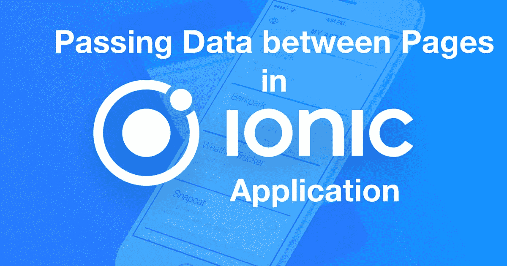
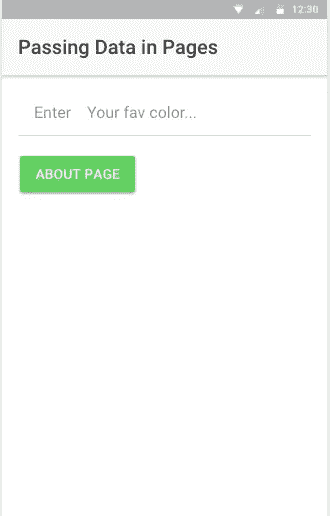
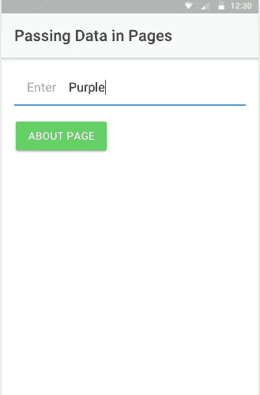
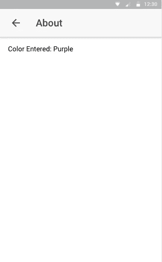
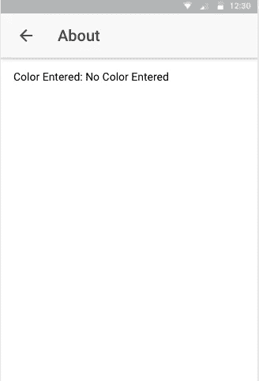

# 在 Ionic 应用程序中的页面之间传递数据

> 原文：<https://medium.com/hackernoon/passing-data-between-pages-in-an-ionic-application-129b387c93b8>

在之前的帖子中，我们已经看到了[如何在多个 Ionic 应用程序页面](https://hackernoon.com/https-medium-com-amanhimself-basic-navigation-in-ionic-applications-ecb199cdf15b)之间设置基本导航。这篇文章关注的是，如果你想把堆栈中上一页的一些数据发送到下一页，该怎么办？为 Ionic 提供了`NavParams`类来将数据从一个页面转移到另一个页面。

# 生成应用程序

在这个演示应用程序中，我们将首先设置一个带有文本框的主页，以输入将被转移到下一页的数据。首先，让我们生成一个新的离子应用程序:

创建新的“关于”页面:

最后，为了完成我们的设置，我们必须在应用模块中添加关于页面:

# 在主页中添加输入文本

然后我们会更新`home.html`:

`#color`是一个局部变量，我们将引用它的值传递给导航堆栈中的下一页。我们现在将用模板中唯一的点击事件背后的业务逻辑来更新我们的`home.ts`:

注意`this.navCtrl.push()`中用于传递数据的第二个参数。

# 关于页面

为了将数据从主页传递到 About page，我们需要导入`NavParams`类。因为我使用 Ionic CLI 生成页面，所以类`NavParams`已经被导入到 about 页面中。

# 显示提取的数据

为了捕捉导航堆栈中前一页的数据，我们使用了`NavParams`类的`get()`方法。我们在`AboutPage`类的构造函数中获取数据。

最后，要在“关于”页面上显示数据:

# 摘要

以下是一些截图:

主页:

正在输入的用户输入:

从主页传递的数据显示在“关于”页面上:

当在输入字段中没有输入任何内容时，会传递并显示一个默认文本:

*要获得这个演示 app 的完整代码，可以访问* [**这个 Github 资源库**](https://github.com/amandeepmittal/ionic-pass-data-pages) 。

**想看更多这样的文章？订阅** [**此处**](https://patreon.us17.list-manage.com/subscribe?u=ad4c168a6d5bb975f2f282d54&id=39e959cecd) **。有时，我会向我的订户发送“从未见过”的内容。**

# 如果你喜欢这篇文章，请鼓掌👏。

# 谢谢你！