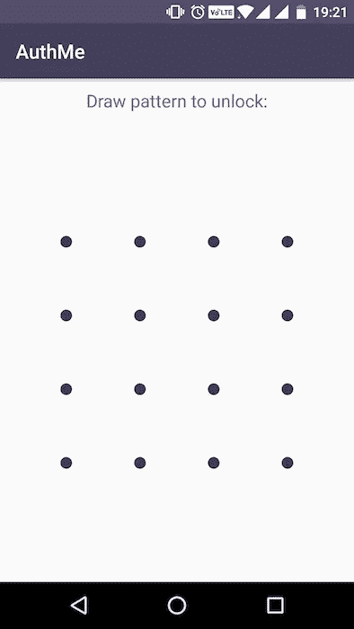
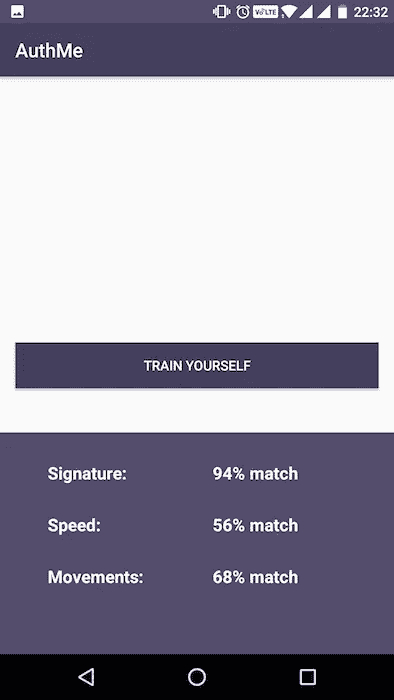

# 为什么密码不好？

> 原文：<https://medium.com/hackernoon/passwords-bad-ux-security-loopholes-and-more-eac4b63a4a52>

互联网用户喜欢为他们使用的不同服务保留相同的密码。(检查你的 FB、Twitter、LinkedIn、Adobe 和银行账户的密码是否相同。)如果一个特定的服务有一个限制性的密码策略或者要求用户频繁地更改他们的密码，用户最终会把它们都写在一个地方。

这意味着，即使一个联合国相关的应用程序被黑客攻击，它也会使你的帐户处于危险之中，因为密码在任何地方都是一样的！

**FB/Twitter 如何解决这个问题？**

1.  他们的[安全](https://hackernoon.com/tagged/security)团队得到了[被黑的用户转储](https://en.wikipedia.org/wiki/Rainbow_table)。(很难但有可能。)
2.  他们从转储中挑选每个用户，对他们自己的一组用户运行查询，并检查是否有人与被黑客攻击的转储中的用户具有相同的密码。
3.  如果发现匹配，他们会联系用户并要求他们更改密码。

拥有内部安全团队可能并非对所有人都可行。

架构师通常会在密码之外增加第二个身份验证因素，但这是以牺牲用户体验为代价的。

我们一直在试图找出解决这个问题的方法，我们认为我们有一个解决方案。

[**AuthMe**](https://authme.io)**——让人类行为成为他们的密码！**

密码是为桌面时代设计的，鉴于机器学习的进步，需要重新想象。

在 AuthMe，我们跟踪用户使用智能手机的行为，并将这种行为转化为他们的密码。

**这是什么行为？**

1.  打字速度
2.  刷卡速度
3.  触摸屏上的压力
4.  智能手机握持角度。
5.  加速度计和陀螺仪运动

我们根据 15 种不同的行为特征追踪用户，这些特征很难同时复制。

**这怎么比密码更安全？**

保证密码安全的钥匙？不断地改变它。

将人类行为作为你的密码可以自动解决这个问题，因为行为会不断变化。(一个月后你刷卡的方式就不一样了，相信我！)

**这是否符合认证的第一和第二要素的监管要求？**

绝对的。这是我们模式锁的截图。

AuthMe Pattern Lock

我们使用模式锁来符合认证的经典定义:你所知道的(你的模式+潜意识行为)和你所拥有的(你的智能手机)

**想试试吗？**

对于智能手机用户，请看我们的演示[这里](https://play.google.com/store/apps/details?id=io.authme.home)。

使用您的电子邮件 id 注册并刷相同的图案 6-7 次，您将开始看到如下信任分数:

AuthMe trust score of a user

将[发送到我们的推特账号](https://twitter.com/authforyou)，与我们分享上面的画面，并告诉我们你的想法。我们重视您的反馈，您甚至可以从我们这里获得一些奖品！:P

如果你想集成这项技术，我们有一个超级容易集成的 SDK 可用[这里](https://authmeio.github.io/docs/?java#android-integration)。

期待收到你的来信！

> [黑客中午](http://bit.ly/Hackernoon)是黑客如何开始他们的下午。我们是 [@AMI](http://bit.ly/atAMIatAMI) 家庭的一员。我们现在[接受投稿](http://bit.ly/hackernoonsubmission)并乐意[讨论广告&赞助](mailto:partners@amipublications.com)机会。
> 
> 如果你喜欢这个故事，我们推荐你阅读我们的[最新科技故事](http://bit.ly/hackernoonlatestt)和[趋势科技故事](https://hackernoon.com/trending)。直到下一次，不要把世界的现实想当然！

