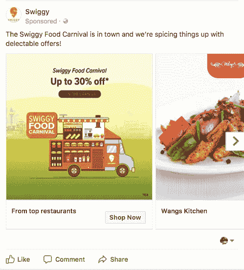
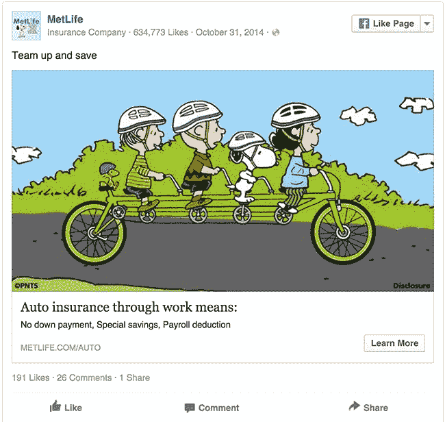
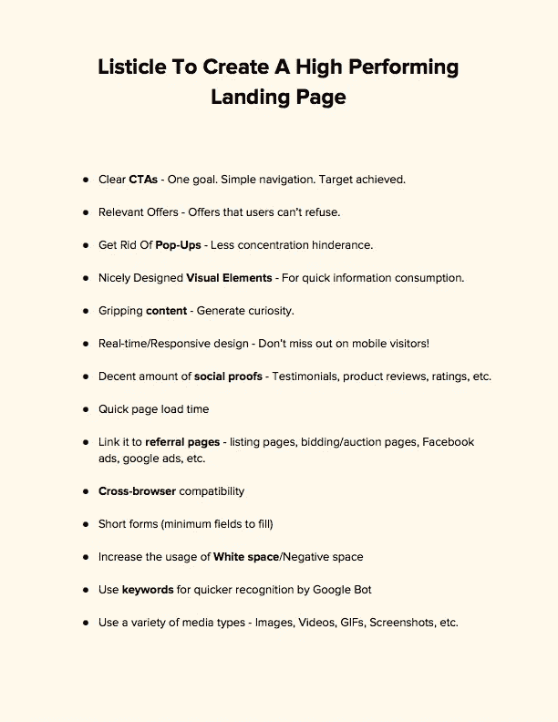

# 请密切关注这三个脸书广告元素

> 原文：<https://medium.com/hackernoon/pay-close-attention-to-these-3-facebook-ad-elements-9086599055fa>

Pay Close Attention To These 3 Facebook Ad Elements

脸书广告是提高你在线转化率的最佳方式。

我花了相当多的时间去理解脸书广告定位是如何真正为那些用它创造了大量收入的公司工作的！

> 在早期，那些害怕的人现在开始接受它。那些最后一次拥抱它的人，属于顶级亿万富翁之列。

让我们得到一些好的老东西**《脸书时报》……**

这就是 2004 年**脸书向企业/广告商推销其**广告目标**产品的方式。**

****

**给 thefacebook.com 的脸书打电话一定很奇怪！**

> **看他们的小游戏 ***见证攻略*** 在那里。**

**这是街头知识分子的草稿。脸书的内容贡献者肯定是其中之一。用最能引起普通人共鸣的语言知识。**

> **“你就是和你在一起的人”**

> **结果，**脸书**从 0 美元增长到了惊人的**3064 亿美元**，估值甚至高于**通用电气**(**2996 亿美元**)。**

**无论你以前是否使用过脸书广告，请注意这些**清晰的广告设计洞察力**和**技巧**来转化更多的访问者。**

# **技巧 1:客户评价**

****

> **增强用户信任的最简单的方法之一是——向他们展示客户评价。**

**一个买家反复寻找**正面评价**和**愉悦评价**。因为它们传达了你产品的真正价值。**

**尽管如此，大多数购买者最终只会在有了**可靠/热情的证明**后才会购买。他们**落客少**。**

**由你最满意的顾客之一来传达好处的最有针对性的广告比一般的广告更有影响力。因为它突出了你生意的真实性和透明性。**

> **展示推荐你产品的真人可以**增加**你的**整体转化率**。如果显示给最相关的用户/购买者，则导致收入增加。**

# **技巧 2:使用轮播广告**

****

> **与静态广告相比，轮播广告在表现上比 T42 好 10 倍。**

**动能社交公司的一项调查称，轮播广告让广告商展示多张图片给 T2，让他们有能力吸引更多的 T4 访客到他们的网站。他们分析了 3 个月的广告活动趋势，得出了一个结论。**

> **“旋转木马是 Kinetic Social 首席执行官脸书的主要推动力”**

**目前，1%的访问者点击轮播广告，相比之下，只有 0.1%的访问者点击静态广告。这远远好于典型的展示广告。**

****Emarketers** 表示，表现最好的横幅广告，来自零售商店等行业的横幅广告表现出色，平均点击率为 **0.5%。****

****领先的营销机构 VML** 分享了关于**温迪的**insta gram 广告表现的最有趣的数据，即**轮播广告**在用户规模和购买价值方面都比 **14 点提升**到**单一图片**广告导致 **20 点提升。****

# **技巧 3:插入登录页面**

****

> **“关系很重要”**

**任何脸书广告的首要目标都是在访问者登陆网站后立即增加销售额。**

**但是，当涉及到用户时，没有什么是按规则来的。他们不知道脸书的广告是什么，也不关心你昨晚是否被洗劫一空。他们真正关心的是， ***你的服务是否能以任何方式帮助他们*** 。**

**登陆页面并不总是必要的。在很多情况下，你可以将流量发送到你的主页或者直接发送到脸书标签。**

> **但是带领**脸书观众**到一个**专用登陆页面**可以看到**万无一失的秒杀在转化**。**

****Li 创建高性能登录页面的工具** (PDF 格式)**

****

# **下面是我的三篇经过深入研究的文章**

**如何让你的图片获得更多点击？**

**你可能在错误的时间发微博！**

**[节省时间和提高转化率的 6 个营销工具](/@steffi.Netizen/5-top-marketing-tools-3a9f8bf1c42a)**