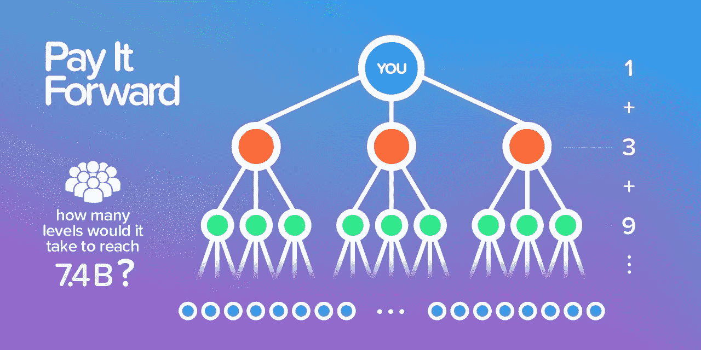
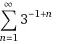
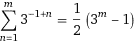
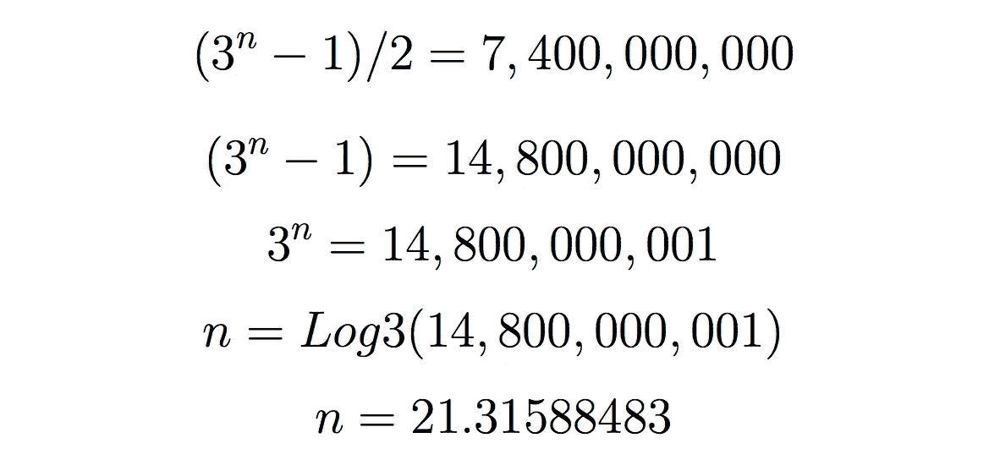
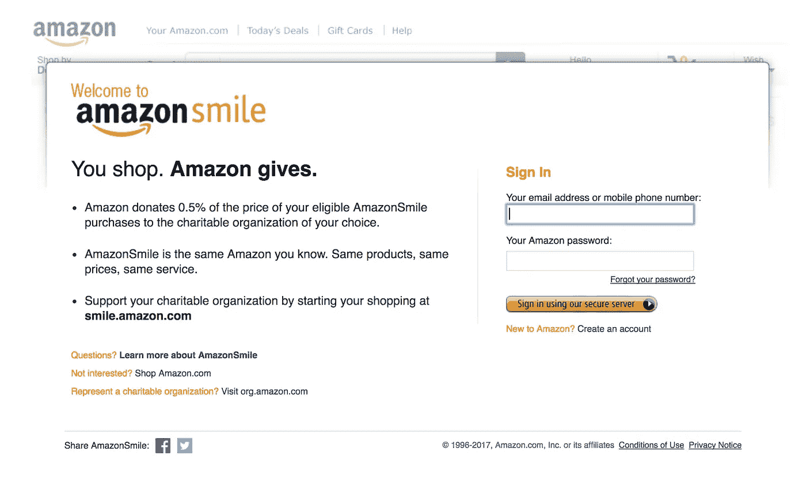
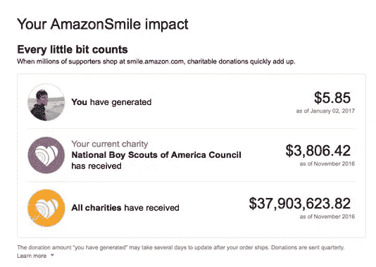

# 向前看，你会惊讶地发现你能实现多少。

> 原文：<https://medium.com/hackernoon/pay-it-forward-youll-be-surprised-to-see-how-much-you-can-achieve-201c0f4044a7>

## 这些假期，明智地选择

How many levels would it take to reach 7.4 billion people?

当我能够帮助别人时，我感觉真的很好。当我得到帮助时，我也感觉很好。但这是一种不同的感觉。当我得到帮助时，我觉得欠了帮助我的人的情。

人们出于许多原因和兴趣帮助他人。在生意上，我们可能用钱来支付帮助。但有时，金钱并不在考虑范围之内，就像你从导师那里得到建议，或者你被介绍给某人。这时你会听到这样一句话:“向前支付”。

记得那部电影吗？如果你太年轻，这里有一些凯文·史派西很久以前做的惊人的事情，在《纸牌屋》或《被指控》之前:

这个概念非常简单:

> **如果你帮助三个人，他们反过来又帮助另外三个人，如此类推，我们就能帮助数百万人。**

## 背后的数学原理

如果你有一个工程师朋友，那么你知道我们喜欢计算。随意的东西。如果我在一场音乐会上，我想知道有多少人买了票来计算收入，然后根据无意义的成本盈利。嗯，可能我不经常去听音乐会，但是我去咖啡店也是一样的。

我们在[测试实验室](http://beta.uy)对我们即将到来的项目做了同样的事情。我们希望建立一些具有社会影响力的东西，目标是将 Pay It Forward 运动带到网上，所以我们问自己这个问题:

> 帮助地球上的每个人需要多少层链条？

如果你和我们不一样，你“讨厌数学”，就跳过这里，直到你找到答案，我们认为有些人需要看到它才会相信。

厉害！我们来刷新一下那些微积分和代数概念，找出答案。首先，我们需要找出针对特定人群的通用公式。我们可以通过理解最初的 3 个层次来做到这一点，并考虑链的起点:

1 + 3 + 9 + 27 = 40

这可以表示为:

3⁰ + 3¹ + 3² + 3³ = 40

因此，如果我们想知道需要多少级别才能接触到特定数量的人，我们可以得到这个等式:

3⁰ + 3 + 3 + 3 + … + 3ⁿ⁻ +3ⁿ = X

求和可以表示为:

为了让事情变得简单，您需要在这一点上信任我们:

现在，剩下的就是简单的代数:

> 只需要 21 个人就能完成这个链条。

我们惊讶地发现这个数字是如此之小。在开发了数百万用户使用的应用程序后，我们看到了口碑的力量。我上一篇媒体文章是关于为增长而设计的重要性。如果你在为消费者打造一些东西，我建议你[快速阅读一下](https://hackernoon.com/what-most-dont-see-in-tbh-an-app-sold-for-100m-and-launched-only-9-weeks-ago-f15edd11505f)。

病毒式传播的应用程序的问题在于，只有创建者能够在内部分析仪表板上看到口碑的力量，而每个用户都没有意识到他或她最终帮助带来了多少新用户。

这促使我们建立一个平台，在网上推广、跟踪和可视化善行。它还可以跟踪推荐的总数(也显示被推荐人邀请的人数)。但是那些善行会是什么呢？

## 网上善行

我们在网上找到了很多做好事的方法。最有趣的一次是在买一些很棒的东西的同时向慈善机构捐款。但是有些事情完全占据了我们的注意力:

Amazon Smile

我们中的一些人知道亚马逊微笑计划(smile.amazon.com)，但没有使用它。其他人甚至不知道它的存在。如果你不知道的话，它可以让你捐出你所购物品的 0.5%来支持慈善组织。价格和在普通 Amazon.com 购物时一样。

Amazon Smile dashboard. Credit: [https://goo.gl/hgLJit](https://goo.gl/hgLJit)

亚马逊微笑是真正透明的，因为它让你看到有多少已经捐赠，无论是个人还是整个计划的开始。如你所料，我们问自己:

> 如果每个人都使用亚马逊微笑而不是 Amazon.com，它在第四季度能够捐赠多少钱？

亚马逊 2016 年第四季度营收为 437 亿美元。考虑到网络服务销售额高达 32 亿美元，而且不是所有的产品都能在 smile.amazon.com 上买到，所以说同样的价格至少能通过 Smile 买到 300 亿美元也不算疯狂。

> 这意味着至少有 1.5 亿美元可以在这些假期捐给慈善机构。

## 这些假期，明智地选择

根据美国商务部的数据，仅在美国，2016 年 11 月至 2017 年 1 月的零售额就达到了 1 万亿美元..德勤预测 2017 年的增长率为 4%到 4.5%。电子商务销售额为 930 亿美元，德勤预测 2017 年至少为 1110 亿美元。

> 如果今年 11 月和 12 月的销售额中只有 1%捐给慈善机构，那就是 11.1 亿美元。

有许多许多品牌将他们的部分收入捐赠给一项特殊的事业。而且他们捐的比亚马逊的 0.5%多得多。向慈善机构捐款是他们品牌理念的一部分。举个例子，IvoryElla.com 的 T2 已经捐赠了超过 100 万美元来拯救非洲的大象。

很多朋友告诉我一些你可能也在想的事情:“这是为了扣税”。如果你不知道，一个被认可的 501(c)(3)组织允许捐赠者通过扣除他们捐赠的金额来减少他们自己的应税收入。重要的是，该公司正在确保捐款像广告宣传的那样进行，这已经产生了巨大的影响。

我们认为，捐赠一部分销售额是一个很好的机制，可以销售客户喜欢的东西，同时“帮助他们”。我们同意丹帕洛塔的观点，我们看待慈善的方式是完全错误的。如果你没有看过 TED 演讲，原因如下:

## 向前支付它

写这篇文章的主要目的是帮助解决一个大问题:意识。今年你会产生巨大的影响。无需额外费用。