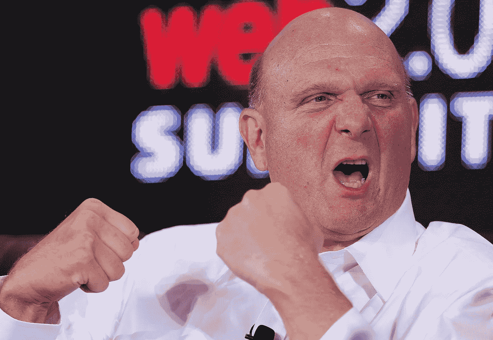
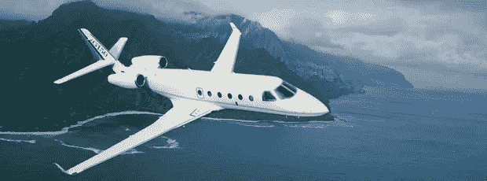
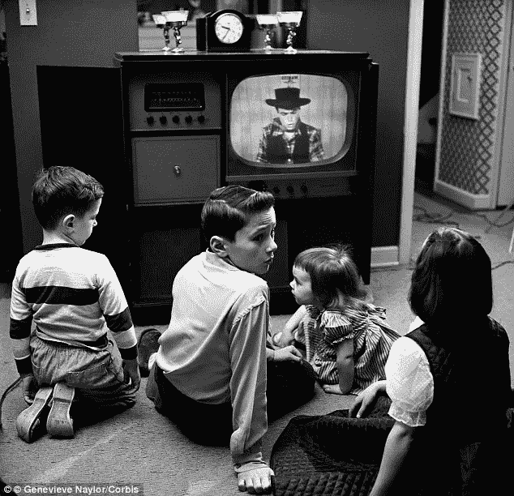
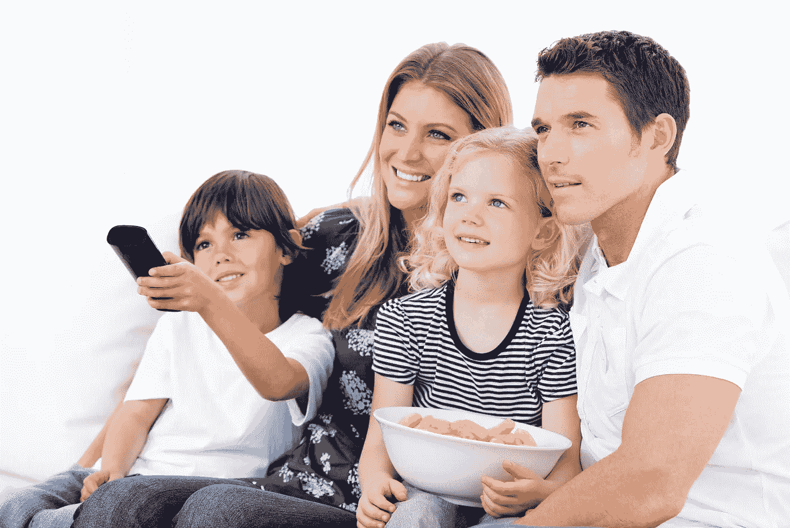
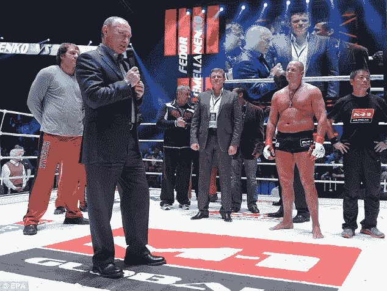
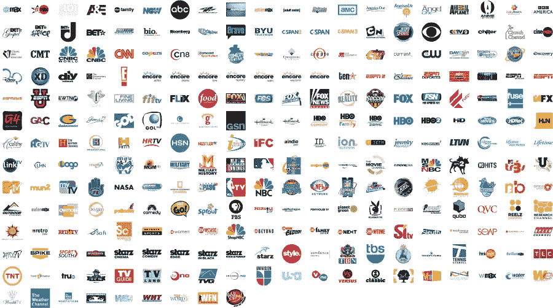
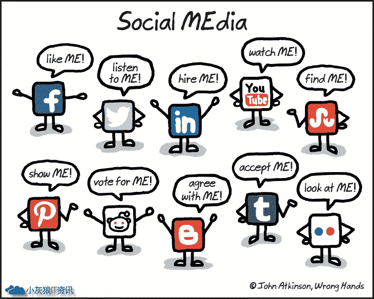
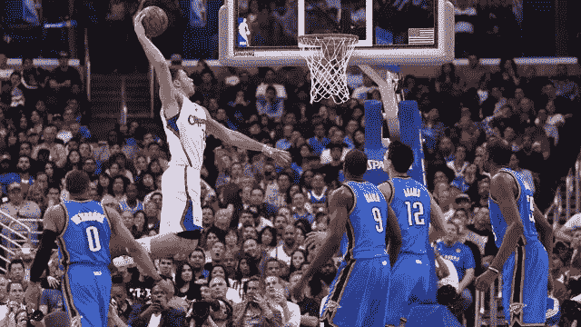
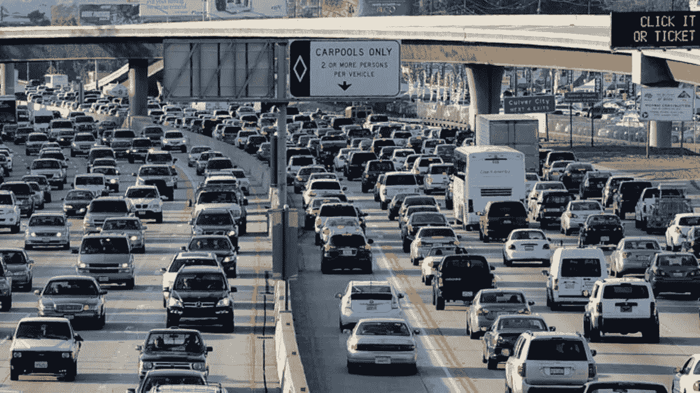

# 交钱还是关注

> 原文：<https://medium.com/hackernoon/pay-money-or-pay-attention-b9b7e678c3f4>

“如果你不为服务付费，你就不是顾客——你是产品。”—史蒂夫·鲍尔默

The famously pugilistic Ballmer will be kicking ass and taking names as the new owner of the LA Clippers.

前微软首席执行官(现在是洛杉矶快船队的老板)史蒂夫·鲍尔默表达了关于媒体的一个基本事实。而且，正如我马上要说明的，他还揭示了为什么，即使洛杉矶快船队的价格是 10 亿美元，对于那些有眼光的亿万富翁来说，购买一个主要的体育特许经营权也是一笔很好的交易。

With this G5 at his disposal, Steve Ballmer never has to miss an away game.

很久以前，无线电和电视的新技术创造了一个庞大而有利可图的产业。这是基于一个非常简单的商业交易:广播公司用免费的节目吸引观众，然后他们把用户的 T2 注意力卖给广告商。消费者通过观看广告，用他们的注意力为节目付费。没有其他成本。广播完全免费，就像我们呼吸的空气一样。只有几个频道，所以广播公司也面临资源短缺。除了和你的电视预约之外，再也没有别的办法去看一个节目了。三大网络形成了“三极格局”。它们是电视。

Had my mother not placed me in this position for several hours a day (more on weekends) I might never have had a career in entertainment.

有线电视的引入，以及(通过法律)取消实际的空中广播，迫使人们为曾经免费的节目付费。不是三个频道，现在是三百个。当然，编程选择的增加是有代价的。高昂的价格。我们现在每月支付 100 美元来获得曾经免费的服务，但仍然有商业广告。如果你在听，让我重复一遍:我们现在为一项曾经免费的服务支付每户每年 1200 美元。一些疯狂的数字:美国有 1.175 亿个家庭，相当于 1410 亿美元。

American families now spend more on cable television than they do on medical insurance.

有线电视公司运营其频道的广播公司，都从有线电视公司收取许可费，所以每个人都尝到了 1200 美元的滋味，这就是好的垄断(和黑帮经济)的运作方式。从腐败中获利的人越多，腐败就变得越正常，越被接受，因此也就越难根除。

When you’re skimming off the top of one of the world’s largest economies you don’t need to bother with a sports team. Here’s the world’s richest man congratulating Russian wrestler Fedor Emelianenko (bare-chested) on his win over U.S. fighter Jeff Monson in Moscow.

广播公司很好地度过了这场混乱。他们从有线电视公司获得费用，因为他们过去免费做的事情，他们仍然有广告商为他们的客户的注意力付费。他们很快发现，通过拥有一系列不同的频道，他们可以获得更多的费用，并为广告商提供更好的目标受众。因此，频道的创建和/或购买(见下文)都是由支付给广播公司、有线电视公司以及像鲁珀特·默多克(Rupert Murdoch)和特德·特纳(Ted Turner)这样的富有企业家的订阅费资助的，他们都利用其家族出版帝国进入广播媒体。

Yes, TV used to be free, but for $1200/year look how many channels you get.

另一方面，广告客户实际上已经在许多负面的方面受到了干扰。时间转移——观看录制的节目——已经达到了流行的程度。如果观众的时间改变了节目，那么过度锁定观众是没有价值的。虽然数字媒体极大地增加了广告商的选择，但没有好的方法来取代那些使用 youtube 或社交媒体失去的数百万眼球。很难一次达到几百万。

If you want to sell hundreds of thousands of cars this quarter, your media plan is all about television, not social media.

仍然有一个地方时移不起作用，广告是预期的，约会仍然必须遵守:像超级碗这样的重大体育赛事。因此广告商每分钟要支付 900 万英镑。体育迷必须实时观看体育赛事节目。其他体育赛事也同样受欢迎。

Buying the LA Clippers is a slam dunk.

体育不随时间转移，因此需要广告商支付额外费用。而且联盟对播放他们比赛的频道收取额外费用，以至于各队现在都有了自己的频道。他们甚至可以对受限游戏和互联网接入收取额外费用，就像 NBA、棒球和足球现在所做的那样。鲍尔默不只是买了一个团队，他买了一个渠道。当你有了一个频道，你就会排队去换另一个。当你有一支运动队时…

You’d never know these cars are moving at 60 mph. Better leave plenty of time to get to the game. There is no mass transit solution.

还有两件重要的事情需要注意。首先，NBA 是发展最快的美国体育联盟，拥有巨大的国际利益。第二，鲍尔默正在收购洛杉矶本身。洛杉矶是一个富裕、进步、多民族的大杂烩，全国超过 10%的人口生活在这里。交通越来越糟糕(那里有太多该死的人)，但空气越来越好，日落总是令人惊叹。除非发生大地震、火灾和/或干旱，否则洛杉矶是一个拥有一支篮球队或任何企业的非常棒的地方。营销人员必须在有鱼的地方钓鱼。史蒂夫·鲍尔默拿着一张价值 10 亿美元的支票入场了。他会拿回来的。

六家公司几乎拥有美国所有的媒体。