# “桃子只是混沌 Tumblr”

> 原文：<https://medium.com/hackernoon/peach-is-just-chaos-tumblr-625c788327c2>

屁股和迷因在[这一事实，在同一天被几个科技博客所报道，记者们试图弄清楚它是什么，以及它可能是什么——一个新的 WhatsApp 或 Snapchat，或者像 Jelly 或 Meerkat 这样的失败者。](https://medium.com/u/3cb4e7887354#.c6azho:HxVN)

当 Buzzfeed 的常驻[专家](http://www.buzzfeed.com/jwherrman/weird-twitter-the-oral-history#.ajzVG424q)、 [Katie Notopoulos](https://medium.com/u/1ed93f936640?source=post_page-----625c788327c2--------------------------------) 、[对 Peach](https://www.buzzfeednews.com/article/katienotopoulos/do-i-dare-to-post-on-peach) 进行快速搜索并鼓励读者加入并添加她为好友(@kapie)时，我发现了 Peach。

她很快就发了帖子。

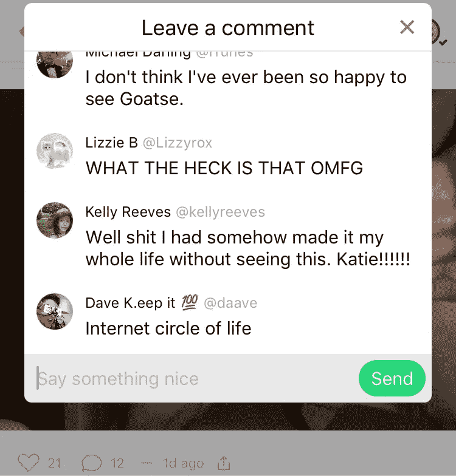

一些社交应用通过差异化吸引了注意力——Snapchat 的私人短暂内容，或 Vine 的 6 秒循环。Peach 最初被定位为像 WhatsApp 一样的消息平台，尽管实际上，它感觉像是目前使用的最流行网络的混合体。

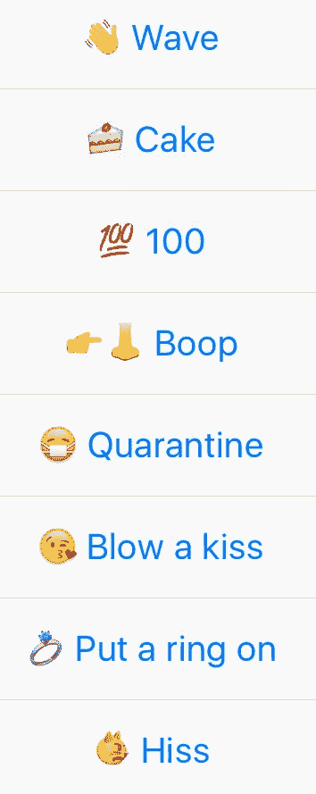

*Peach’s options for 1:1 direct user interaction, similar to Facebook’s “Poke”*

喜欢和评论功能，喜欢脸书完善？桃子有。

带有@前缀的用户名，比如 Twitter？桃子有。

Gif 支持，包括自动调整平台宽度，这使得 [Tumblr](https://hackernoon.com/tagged/tumblr) 成为内容热点，直到其他网络纷纷效仿？桃子有。

脸书的“戳”？桃子绝对有。

图像编辑和制作拼贴画的能力，就像 Instagram？算是吧，桃子有。

像 Snapchat 那样在图像上写文字的能力？桃子有。

短视频循环，像 Vine？桃子有。

一个[菜单，里面有一些并不真正保密的命令](http://peach.cool/support),可以调出同样有趣和无聊的功能，比如 Slack？桃子有。

苹果排他性，就像 Instagram 和 Snapchat 的早期？哦对了，桃子有。

桃子也有一些奇特而独特的特征。其中一个功能，比如“呼喊”功能，可以让你在一系列颜色或图像上以 1:1 的比例创建文本，这是 Peach 的杀手锏。这是一种简单的方法，可以从零开始创建图像，或者从手机摄像头或从网络上拍摄的图像中重新混合内容。第一个应用程序更新在发布五天后推出，允许用户通过将帧串在一起制作动画喊叫。

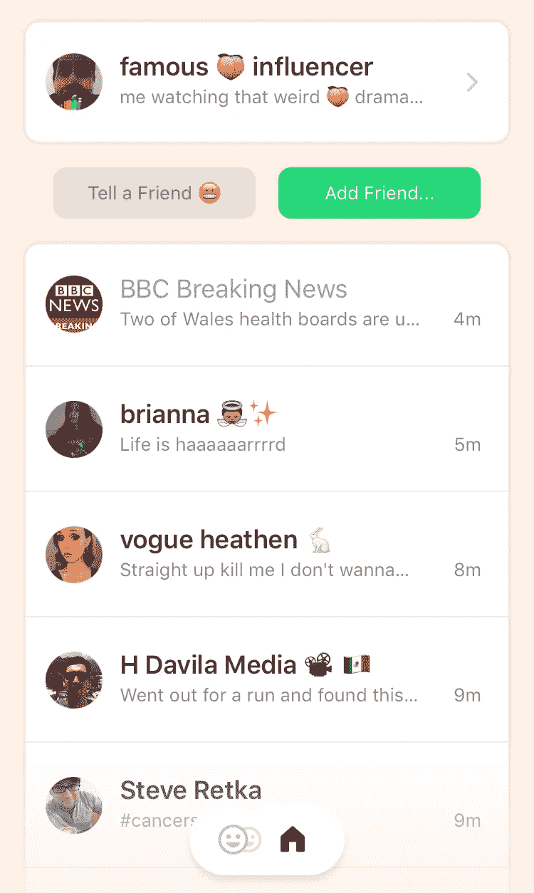

*the main feed of Peach (notice the Friends of Friends menu next to the “Home” button at the bottom of the screen)*

Peach 的一个更奇怪的组成部分是违反直觉的 feed 功能，这也是它令人上瘾的原因之一。每个用户的内容按照标准的时间顺序从上到下出现在他们的页面上，就像一个反向的 Twitter。不过，你联系的所有用户的内容并没有一个集中的提要，只有一个不断重新排序的好友列表，它会根据谁最近发布了内容而更新。然后你点击特定用户的订阅源，查看他们最近的内容，滚动浏览他们的时间表，然后点击回到你的主要好友列表，该列表可能已经刷新了新帖子。与 Twitter 不同的是，除非你们两个主动联系，否则你不能在你的主 feed 中包含一个用户，也不能轻易查看他们发布的内容。由于没有*转发*、*分享*或*转发*功能，新账户和内容发现是一件苦差事。

这一切都使得在应用程序中消费内容的行为成为一个非常活跃的过程，不断的翻转使你在意识到发生了什么之前很容易在应用程序中丢失 10 分钟到 1 小时的时间。

最初与@kapie 建立联系时，我的好友建议(从你的主页好友动态中可以看到)大多是拥有[“怪异 Twitter”审美观的用户](https://twitter.com/katienotopoulos/lists/weird-twitter)。我添加了我已经关注的人提到的用户。我发了几个简单的笑话——“布什做了 9/11”——看到用户把我加到了他们的“朋友的朋友”名单中。我接受了所有人。

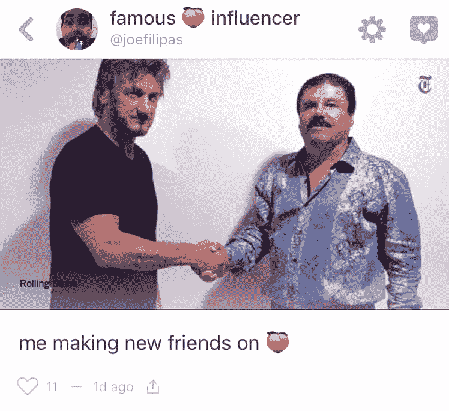

更多的帖子和对其他用户内容的积极评论，确保我的名字出现在反馈和建议中，导致了整个周末源源不断的好友请求。然而，我联系的人越多，内容的基调就开始转变。

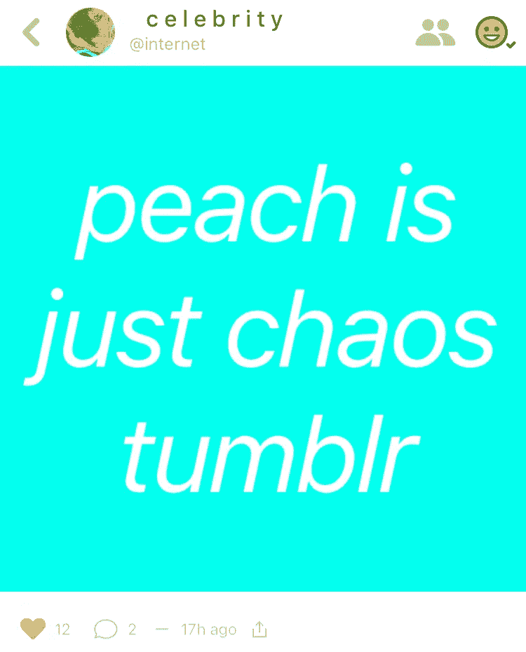

达达主义和讽刺性的幽默开始消失，重新发布的 Reddit 迷因、对 Tumblr 上无人回应自拍的抱怨以及对 succ 的厌倦开始蔓延。

不到 24 小时，桃子就变形了。正如网友@internet 恰如其分地说的，“桃子就是混沌 tumblr。”

然后，太阳下山了，烟头出来了。

“天黑后的桃子”可能在周五晚上首次出现。不管怎样，到了周六，这句话已经传遍了各种媒体，到了周日，饥渴已经不可避免了。自从这个平台被命名为“桃子”——这是“屁股”的俚语——人们似乎不可避免地会上传他们臀部的照片。

有女性的臀部。有裸露上身的照片。男人们也脱得精光，一些人选择赤膊照镜子，另一些人则厚颜无耻地全裸。当一位年轻女性询问她是否应该分享一张照片时，Peach 还没有直播 72 小时，这既不令人惊讶，也没有被忽视——评论很快就会充满鼓励裸露和分享商品的话语。

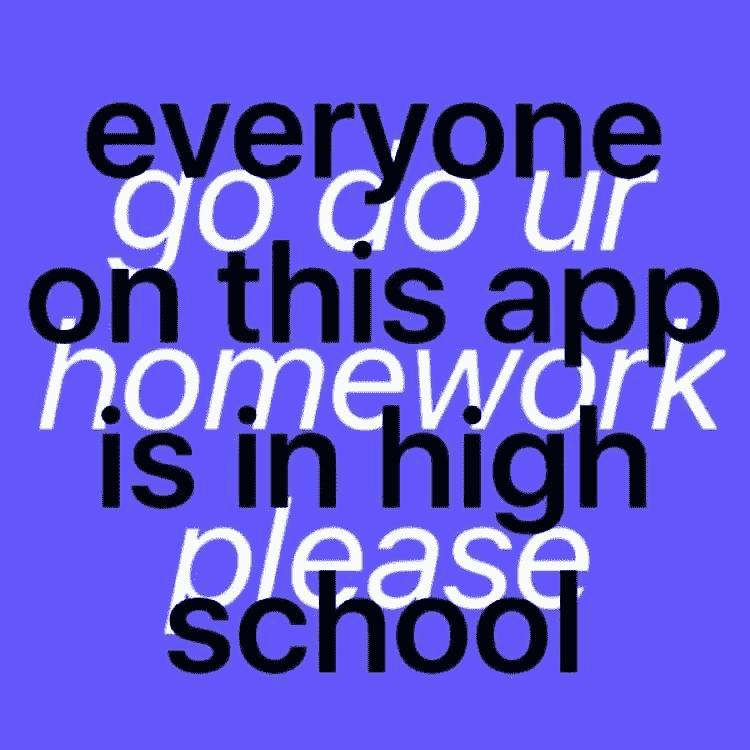

*via @internet*

到了周二，也许是由于总统的最后国情咨文，或者更有可能是由于疲惫，天黑后桃是呜咽。

然而，桃子可不仅仅是对烟头的渴望。

名人模仿账户比比皆是。如果你和碧昂斯互动，她会“给它戴上戒指”——用户对用户的互动选项之一；约翰·斯塔莫斯经常反复思考成为约翰·斯塔莫斯有多好；佐伊·达舍尔受不了邦·乔维，不消灭他是不会罢休的；多个 DJ 卡莉达用竭泽而渔的关键表情符号；琼·里弗斯和安娜·妮科尔·史密斯都活着，后者饥渴难耐；整个卡戴珊家族提醒其他人他们有多穷；扎克·埃夫隆在桃子舞会的同一天晚上举办了一个家庭聚会(这两件事都发生在周一晚上)；无论伊拉·格拉斯如何努力，他就是抓不住新媒体的窍门。

桃子上也有品牌。在第一个周末结束之前，Meme regurgitator 9Gag 非常活跃，疯狂地添加用户。多米诺骨牌在最初的 48 小时内也上线了，但到了周日，他们透露自己是一个粉丝账户，并以害怕诉讼为由更改了用户名。另一个多米诺账户很快出现了。BBC 突发新闻零星分享突发新闻的更新。[韦氏词典分享了搭配 twee 意象的词汇定义](http://www.adweek.com/news/technology/if-merriam-webster-doesnt-have-content-instagram-why-it-all-about-peach-168981)。

恶搞品牌账号也在桃子上。王牌硬件，[仍然沉浸在锤子令人尴尬和非常公开的一系列失态](http://www.clickhole.com/article/social-media-meltdown-ace-hardware-twitter-account-3648)中，经常发布关于锤子的帖子。@zune 分享了关于 zune 音频播放器的有用提示，比如如何让它自毁。@cokezero 提醒人们，冰镇时是提神饮料，但因为是饮料而无法走动。

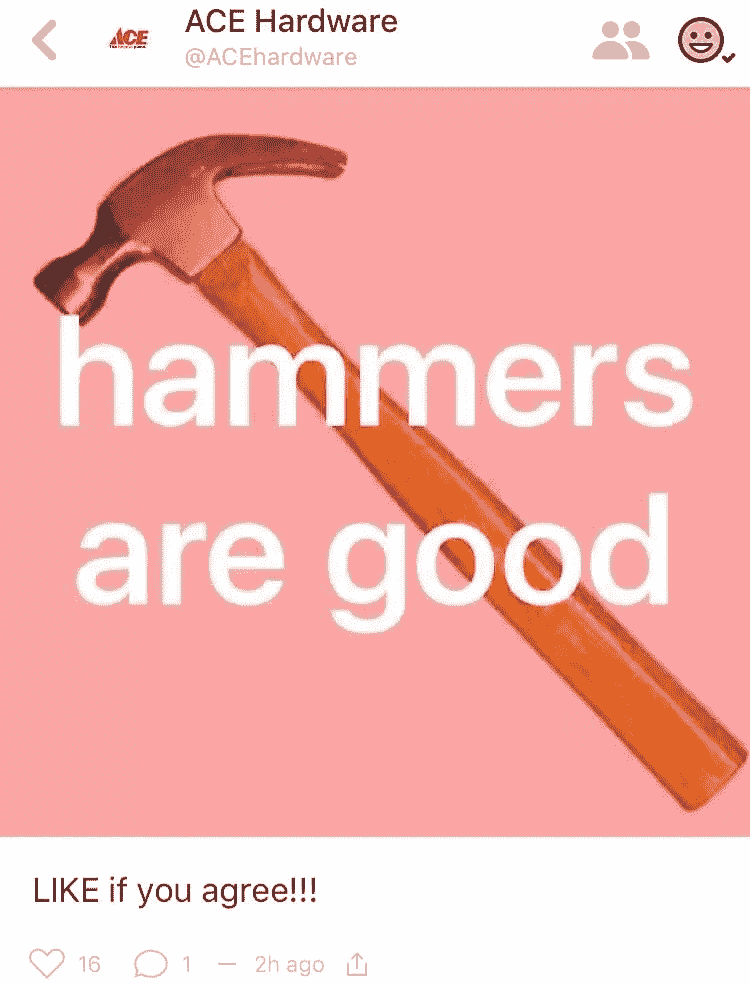

然而，非模仿账户确实存在。设计师@mattcrump 和@lisa_bizzle 发布了对模因和每日桃子日志的文字解释。@internet 定期提醒年轻的桃子用户，他们应该为学校学习并上床睡觉。@麦片要求桃子用户吃他们的麦片。@ThePeachOfGod 向用户保证，它将放弃[经常被嘲笑的 Twitter 账户@ thetweetogod](http://nymag.com/following/2015/11/what-is-the-worst-twitter-account-of-2015.html)，因此用户可以在 Twitter 上取消关注它——显然是 Twitter 账户的一个 troll。@ filth 贴出了在“绘制”功能内制作的荒谬插图。其他几十个用户零星地发布符合 Notopoulos 创建的[“怪异推特”列表的内容。](https://twitter.com/katienotopoulos/lists/weird-twitter)

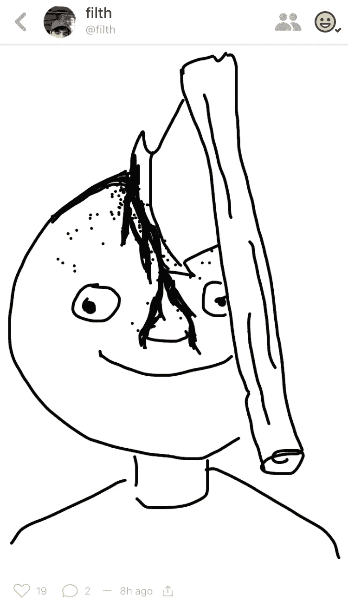

不过，如果你真的很想吃屁股，有一个名为@buttgifs 的账户。他们上传了屁股的图片。

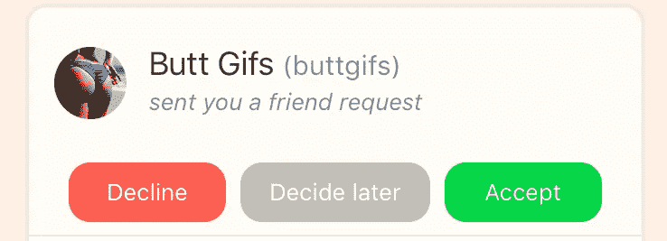

*I didn’t add them, they added me*

随着时间的推移，“混沌 Tumblr”这个绰号越来越贴切。

匿名选项，加上 Peach 固有的强大文本和图像选项，很快使它变得类似 Twitter 和 Tumblr。前者是因为简短的文字俏皮话和大量的名人恶搞账户；后者是因为可以无缝共享 gif，或者只需轻触一个按钮，就可以播放你正在阅读的歌曲、电视节目或书籍的名字。

可以预见，该平台的早期趋势包括用户发布困惑的帖子，说不知道桃子是什么或如何使用它。“绘制”功能用于制作阴茎的图像。“叫喊声”，即制作文本和图像宏的能力，被用来制作桃子双关语。gif 功能允许用户使用一个单词或短语搜索 GIPHY，被用来“Gif 你的名字”。用户想知道谁会是桃子的第一个突破人格。iOS 独占性备受推崇；Android 用户哀叹不可避免的到来。

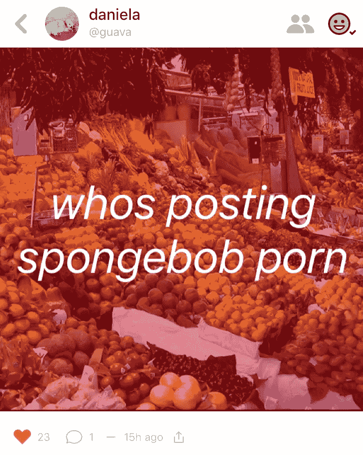

*a post made with Shout*

用户普遍抱怨他们无法将 Tumblr 连接到 Peach，并很快使用“大喊”来分享他们的 Tumblr、Twitter、Snapchat 和 Instagram 手柄。到周六，至少有一个 Twitter 直接消息组成立并活跃起来，用户可以更有效地相互交流。

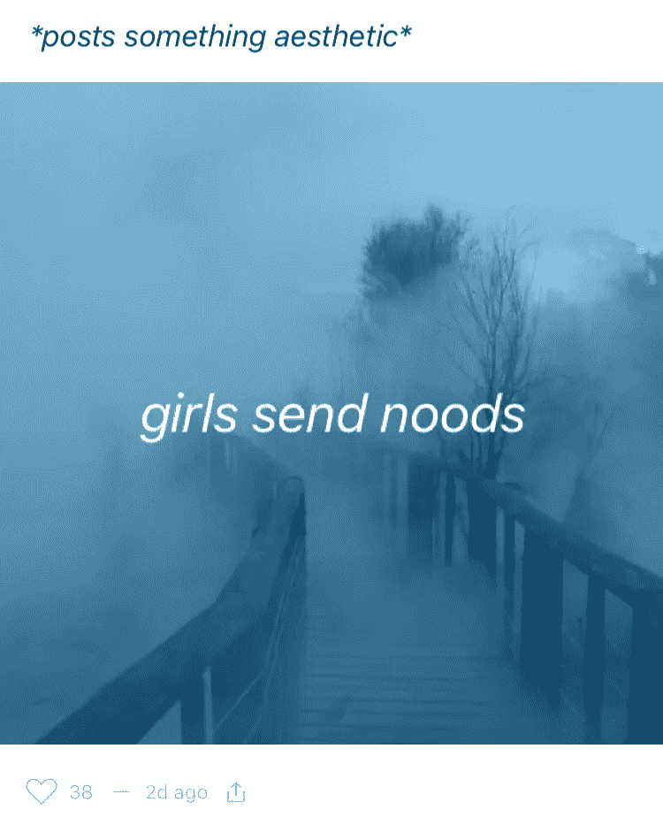

*via @rora*

随着早期用户的新鲜感逐渐消失——被称为“原创桃子”的“OP”——以及更多来自 Tumblr 和其他网络的用户，我的反馈明显发生了变化。来自我联系过的用户的内容，以及在我的朋友的朋友菜单中可以看到的内容，减少了解构主义笑话，增加了公众反思、k-pop 和 1D 粉丝以及自拍。用户之间的实际战斗和戏剧具体化，导致一些名人模仿账户持有人以戏剧的方式揭露自己。对工作、学校、父母、孤独、临床抑郁症或没有男朋友或女朋友的沮丧很快超过了我最初喜欢的解构主义和自我意识的讽刺。

展出的原始情感感觉像高中，有更多的自拍，屁股和派系。由于我从未拒绝过一个连接请求，内容、情感和笑话的组合不断更新我的 feed，变得越来越不同。

桃子只是混沌 Tumblr。

当第一个应用程序更新在周二下午出现时，修复了一些稳定性问题，并为喊声添加了动画方面，[一些人已经宣布桃子死亡](http://bgr.com/2016/01/11/peach-messaging-app-iphone-collapse/)。周三晚上宣布了另一轮即将进行的更新，包括更好的管理朋友列表的方法，增强的隐私控制，直接消息和用户档案的生物部分，这表明 Peach 开发团队正在试图听取用户的意见，[利用强劲的初始下载数据](http://arc.applause.com/2016/01/12/peach-app-app-store-data-analytics/)。

几个月后，Peach 完全有可能成为科技和媒体界的笑点，带着“发霉”的双关语。只要保持无广告，它可能是 Tumblr 特定部分的有利替代，或者只要保持有趣，它可能是 Twitter 的一部分。

就我个人而言，我怀疑我会继续偶尔打开桃子给[的便便](http://www.urbandictionary.com/define.php?term=shitpost)。几乎可以肯定的是，我会使用喊声为我的其他个人网络创造资产。但是，如果我威胁说要参加《天黑后的桃子》,就报警。

乔·菲利帕斯对于古怪的推特来说还不够古怪。他在明尼阿波利斯从事广告工作，业余时间是一名视频制作人。你可以在 Twitter 上通过[*@ joefilipas*](http://www.twitter.com/joefilipas)*与他联系，或者在 Peach 上通过@peachinfluencer 与他联系，这两个网站都没有他屁股的图片。*

> [黑客中午](http://bit.ly/Hackernoon)是黑客如何开始他们的下午。我们是 [@AMI](http://bit.ly/atAMIatAMI) 家庭的一员。我们现在[接受投稿](http://bit.ly/hackernoonsubmission)，并乐意[讨论广告&赞助](mailto:partners@amipublications.com)机会。
> 
> 如果你喜欢这个故事，我们推荐你阅读我们的[最新科技故事](http://bit.ly/hackernoonlatestt)和[趋势科技故事](https://hackernoon.com/trending)。直到下一次，不要把世界的现实想当然！

