# 与区块链专家网络进行同行审查

> 原文：<https://medium.com/hackernoon/peer-review-with-expert-networks-on-the-blockchain-d658cc105cbf>

## 使用全球专业知识库和专业加权审核来确定主观群体意见的“对”和“错”

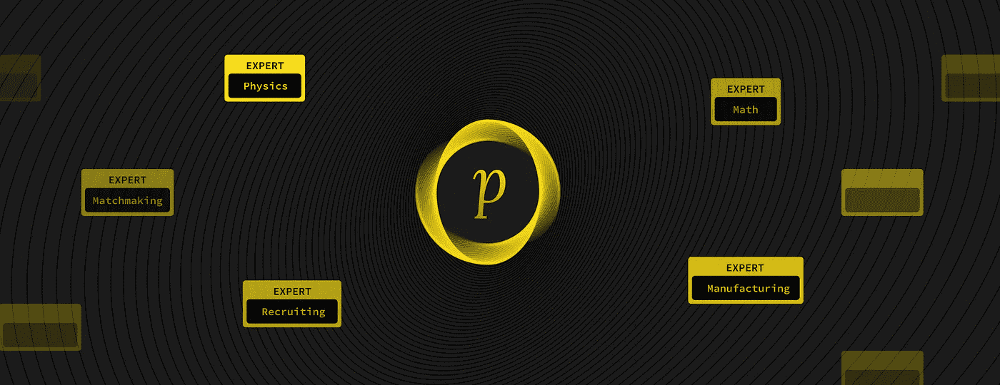

在我的上一篇文章中，我写了对社交搜索的需求——利用人类的智慧和经验来回答 T2、谷歌和人工智能无法回答的问题。

对于像[这样的社交搜索平台来说，provided】(或任何依赖于群体智能的系统)能够工作并提供高质量的回答**，**需要有**一个可靠的系统来评估群体提供的答案**——将答案分为更好或更差、正确或错误。如果没有一种机制来衡量答案的“正确性”，就没有办法对答案空间进行排序或过滤。此外，在一个提供奖励或惩罚以鼓励响应者参与的众包平台中，没有办法确定奖励哪些响应者，惩罚哪些响应者，以及惩罚多少。](/proffernetwork/announcing-the-proffer-protocol-978fade8eec5)

**同行评审**(将答案交由同一领域的其他专家审查)是评估群体意见的传统方法。这是一个强大的想法，并在学术界和在线社区中得到广泛实践，但受到政治操纵、专业知识测量缺乏粒度/特异性、评论者错误积累专业知识的能力以及熟练和非熟练评论者的投票对结果具有同等影响的非自然约束的影响。

在构建 Proffer 的过程中，我们试图为分散式同行评审创建一个协议，避免传统同行评审的缺陷，并在[区块链](https://hackernoon.com/tagged/blockchain)上运行，以适应未来全球范围内的众包和社交搜索用例。

Don’t want to read? Go through the slides for a protocol overview and example.

这篇文章的结构如下:

1.  目前实施的同行评审存在的问题
2.  解决方案和关键特性:一个基于**自我优化专家网络**概念的新型同行评审平台，其中评审通过评审者的专业知识进行加权，答案的“正确性”基于其支持者的累积技能减去其反对者的累积技能，所有主题的所有评审者的专业知识都存储在[区块链](https://hackernoon.com/tagged/blockchain) ( **全球专业知识库**)中并在其中进行更新。
3.  Proffer 上众包同行评审的演练，一个物理问答用例。
4.  启动全球专家银行(t=0 时会发生什么)

# 传统同行评审的问题

1.  同行评议受到政治影响:它将巨大的权力交到少数人手中，却没有提供必要的制衡或必要的激励来鼓励公正、周到的评议。问问学术界就知道了——例如，在[的这篇 Ars Technica 文章](https://arstechnica.com/science/2017/06/journal-tries-crowdsourcing-peer-reviews-sees-excellent-results/)中，李宇春将学术同行评审描述为“完全的随机性”，引用了评审者的“情绪、药物和记忆”对结果的不当影响。他提出了一个学术出版物的分散式同行评审流程，将每次评审向 100 多名专家小组成员开放，并大大提高了传统同行评审的质量和效率。
2.  **专家意见是武断的、不准确的，而且容易制造。**例如，任何人都可以在 LinkedIn 上为任何技能背书。Reddit 用户可以从一个子编辑(例如 */r/dogs* )中积累“因果报应”，使他们有资格在一个完全不相关的子编辑(例如*/r/以太坊*)上发帖。我们的计算系统很难识别真正的专业知识，这样的系统可以被愚弄。专业知识应该基于行动和结果来衡量，而不是基于自我报告或群体报告的单一数据点。
3.  **专业知识在应用中是分散的**，例如，区块链话题的 Reddit“karma”在 Stack Exchange 或 Quora 区块链话题中没有任何权重。一个中等博客上的人工智能“顶级作家”在 Reddit 上的人工智能帖子上发帖时，不会看到这种声誉带来的任何好处。用户被迫在他们加入的每个新平台或应用程序上重新创建他们的声誉，并且必须跨各种平台单独维护这一声誉，从而导致错过由跨应用程序共享声誉驱动的[网络](https://hackernoon.com/tagged/network)效果和使用的机会。

# 众包同行评审:主要特点

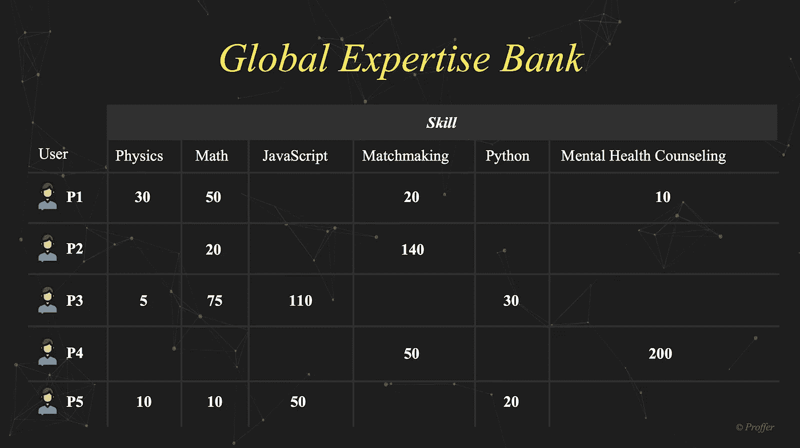

1.  **全球专业知识库**:将每个用户的**技能**存储在一个通用的分散分类账上。它是“全球性的”而不是“分散的”,因为所有 dApps 都向该银行提供读/写专业知识，而不是维护他们自己的特定于应用程序的技能库。全球专家银行受益于并创建了跨多个应用程序的共享网络效果——用户可以从一个数学辅导 dApp 切换到另一个，同时保留他/她在主题“数学”方面的专业知识。
2.  **技能加权同行评审:**一种机制，通过回答或投赞成票的人减去投反对票的人的累积专业知识，客观地确定主观答案的正确性。这使得更熟练的应答者比不太熟练的应答者对应答的正确性有更大的影响。
3.  **自我优化专家网络:**一个专家网络，任何个人都可以获得或失去专业知识，随着时间的推移，推动网络更接近地面真相。也就是说，当不正确的回答者失去技能时，错误的专业知识会被过滤掉，而真正的专家会因为反复提供正确的回答而脱颖而出。

# Proffer 上的众包同行评审:一个物理学问答实例

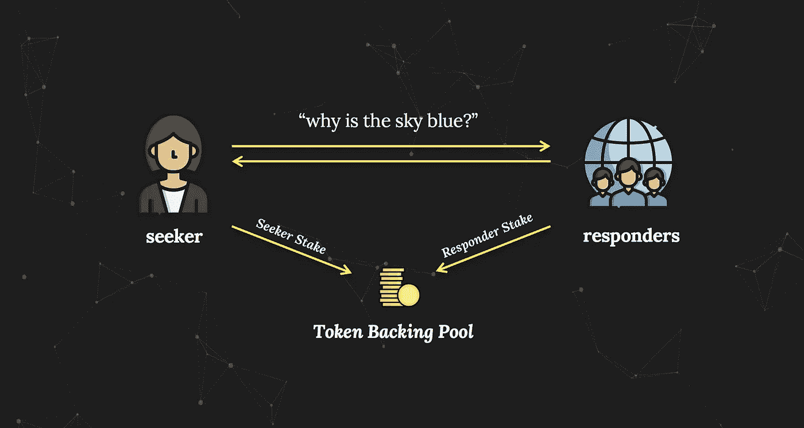

## 步骤 1:接收来自搜索者的问题，广播给合格的应答者

搜索者提出一个问题，他/她希望得到大家的反馈，例如“为什么天空是蓝色的？”搜索者可以选择用钱( ***SeekerStake*** )来支持问题，这些钱将被分配给正确的回答者。这个 ***SeekerStake*** 种子一个激励池叫做 ***令牌支持池*** 。为平台上提出的每个问题创建一个新的令牌支持池*。*

## 第二步:开始同行评审过程。接收回复者的回答和投票

回答者(也称为同行评审者)看到问题后，**可以给出新的答案，也可以对其他回答者之前提交的答案**投赞成票/反对票。与直觉相反，响应者还必须向 ***令牌支持池*** 贡献股份( ***)响应者以*** )作为对其响应的信心的表达；除非他们的回答被同行评审协议认为是不正确的(解释如下),否则该赌注将返还给他们。一个 ***响应者 take*** 的要求去激励垃圾邮件，把响应者的皮肤放到游戏里。

## 步骤 3:计算支持每个提交答案的净“技能”

该协议跟踪支持添加到答案空间的每个答案的“网络技能”。一个答案的 ***技能支持*** 等于第一个提出这个答案的回答者的技能*加上所有投赞成票的回答者的* (+)技能减去所有投反对票的回答者的技能。

****

**这里的“技能”指的是用户在问题中所涉及的主题中非常具体/细致的技能，在这种情况下可以是“物理学”或“光学现象”。技能从 ***全球专家库*** 中读取，并在每次更新时写回其中。**

**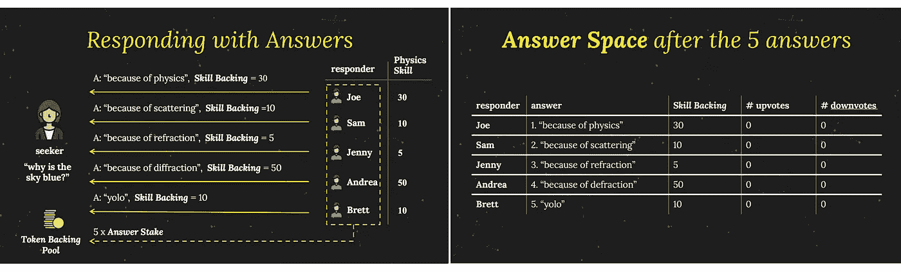**

**如上图所示，五个不同的回应者(乔/萨姆/珍妮/安德里亚/布雷特)对“为什么天空是蓝色的？”这个问题给出了五个新的答案，支付 ***答案赌注*** 进入 ***令牌后备池*** 为每个答案。**

**如下所示，名为 P1 至 P15 的 15 个不同的应答者选择对答案空间中已经存在的五个答案投赞成票或反对票，为每一票向 ***令牌支持池*** 支付 ***投票赌注*** 。请注意，每次投票都会更新每个答案的净技能支持:向上投票会增加向上投票者的技能，向下投票会减少向下投票者技能的净技能。**

**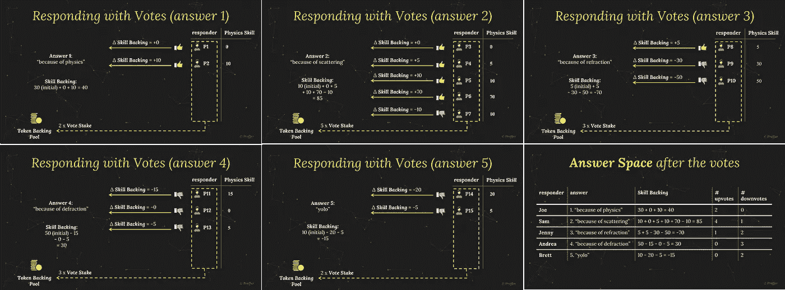**

## **步骤 4:使用净“技能支持”来确定哪些答案是正确的/不正确的，并相应地计算每个响应者的奖金**

**在 P1 到 P15 提交了他们的投票后，答案空间有五个答案，每个都有一个净技能支持。在这一点上，我们可以使用诸如“净技能支持大于零”的启发式方法来确定哪些答案是正确的，或者我们可以向最初提出问题的搜索者呈现所有选项，并允许他/她选择正确的答案。**

**确定“正确性”的最佳方式将取决于用例，因此我们的协议提供了两个可配置的参数，而不是规定正确/不正确的判断:**

**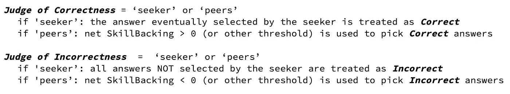**

**让我们假设这个例子中的 ***正确的判断者*** =“探索者”和 ***错误的判断者*** =“同伴”。这意味着我们可以根据净技能支持来确定不正确的答案。答案 3 得到的净技能支持为-70，答案 5 得到的净技能支持为-15，因此是不正确的*。***

***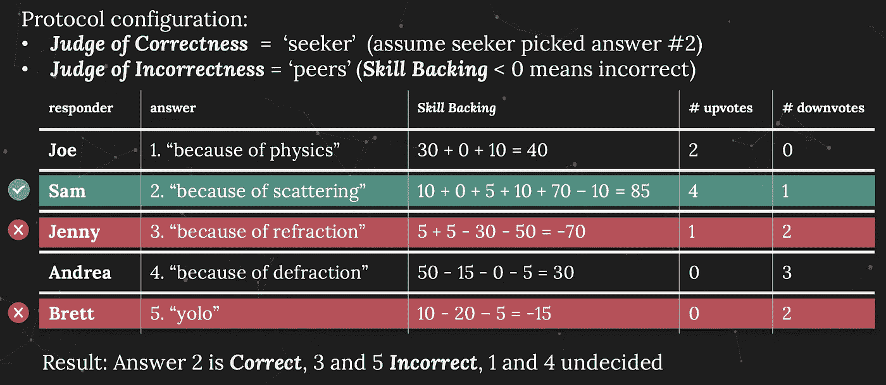***

***答案 2 被视为 ***正确*** ，因为我们假设搜索者会选择答案 2 作为最佳答案，因为它具有最高的净技能支持。既不正确也不错误的答案标注为 ***未定*** 。***

***我们现在使用以下准则来计算每位回应者的两种类型的支出——财务支出和技能支出:***

***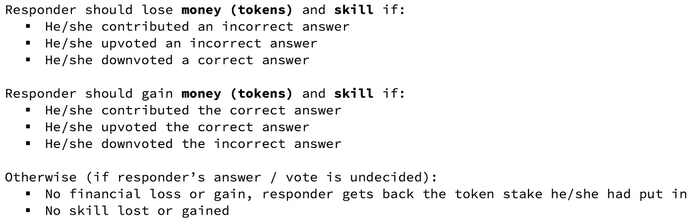***

***Guidelines for financial and skill payouts for each responder***

***技能是一个开放/不确定的量。可以免费给，也可以免费拿。因此，执行技能奖励就像在全球声誉银行中增加或减少回答者的技能一样简单。***

***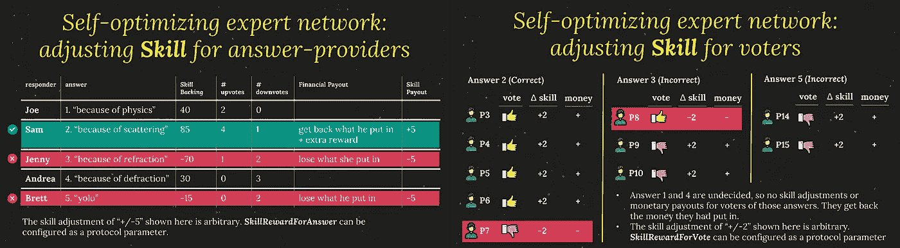***

***Skill updates after Answers 3 and 5 determined to be **Incorrect** and Answer 2 to be **Correct**.***

***另一方面，货币/代币是封闭的/零和的数量。它们是从错误的响应者到正确的响应者的重新分配，而不是创建。***

***该协议首先返回具有正确响应和未决定响应的响应者在过程开始时放入 ***令牌支持池*** 中的钱。***

***在这些赌注被返回之后，池中的剩余部分由原始 SeekerStake 以及不正确响应者的 AnswerStake 和 VoteStake 组成。最后，这个数量可以分配给正确的应答者，作为他们正确回答或投票的奖励。***

***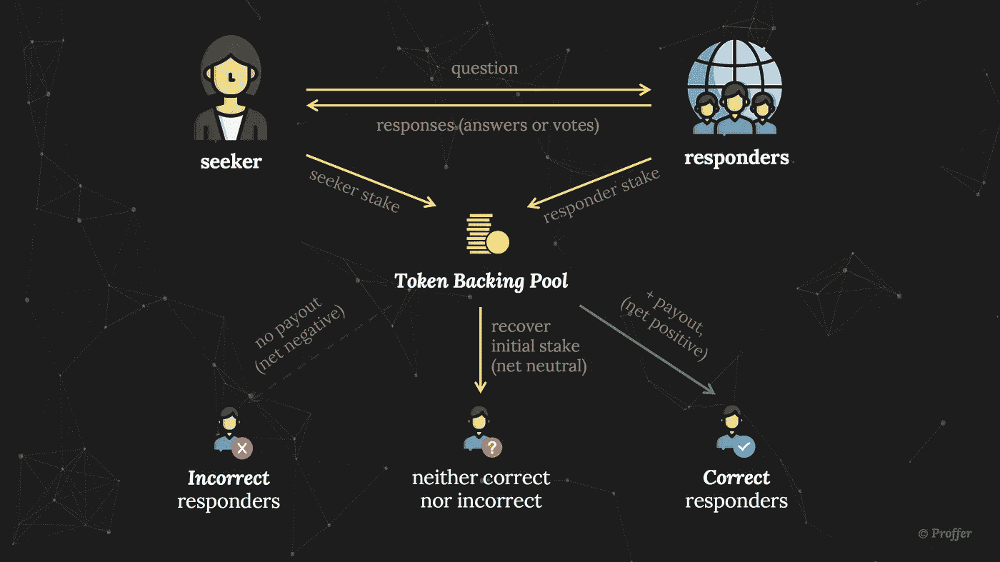***

***Possible outcomes in crowdsourced peer review. Incorrect responders lose what they had put in. Correct responders recover what they had put in AND get an additional reward.***

# ***自举全球专家银行:在 t=0 时正确行事***

***在稳定状态下，上述自优化专家网络基于他/她的当前专业知识、他/她的响应、人群的当前专业知识和人群的响应，随时间更新每个响应者的专业知识。***

***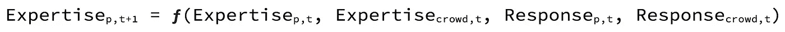***

***Expertise of person ‘p’ at time ‘t+1’ is a function of that same person’s expertise and response at time ‘t’, and the crowd’s expertise and response at time ‘t’***

***只要系统中的专业知识在时间`t`是可靠的度量，我们就可以放心，它在时间`t+1`将是可靠的，随着时间的推移，越来越接近所有用户的基本事实/“实际”专业知识。***

***我们的同行评审协议和全球专家银行能够开箱即用，所有响应者在所有主题上的技能为零。大数定律将确保通过足够的迭代，开始时没有技能的响应者将根据人群对他们的投票赢得或失去技能，相对于他们的同龄人，平衡在接近他们实际技能的某个地方。***

***然而，为了提高达到这种技能平衡的速度，并提供来自`t=0`的最高质量的答案，特别是对于需要专业知识或认证的行业主题，**我们建议通过从预先存在的网络**中手动选择和加入专家来启动专家网络，包括在线和离线、正式和非正式。***

***例如，在医疗保健领域，可以在医生网络上为每个医生初始化他们各自实践中的技能(“心脏病学”、“普通医学”等)。)基于过去的经验和面对面的采访。***

***对于法律相关主题的执业律师，对于 k-12 教育相关主题的学校教师，对于房地产相关主题的土地开发商和施工队，也可以这样做。***

***通过手动流程建立专家网络既不简单也不快速，但在一个工作性质已经倾向于允许员工利用空闲时间赚钱的临时工作的世界，一个位于区块链、对回答正确的专家进行无摩擦奖励的专家网络可能是一个令人兴奋的平台。这对 Proffer 的全球专家银行来说尤其如此，因为专家将能够利用 Proffer 上回答问题积累的声誉，同时使用基于同一全球专家银行的其他 dApps。***

****如果你想了解更多关于 profer 的信息，这是我们在众包同行评审和自我优化专家网络基础上建立的社交搜索协议，请在这里查看我们的* [*技术规格*](/proffernetwork/announcing-the-proffer-protocol-978fade8eec5) *，以及我们在这里* *网站上发布的展示 profer*[*五种不同用例的 5 款应用。*](http://proffer.network)***