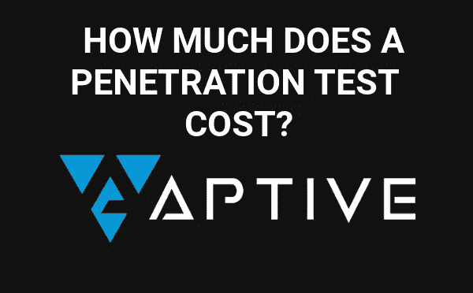

# 渗透测试报价——英国买家指南

> 原文：<https://medium.com/hackernoon/penetration-testing-quote-uk-buyers-guide-987eeb8ddbfe>

这份文件提供了 5 个有用的，简短的，简明扼要的提示给任何想在英国购买钢笔测试或获得渗透测试报价的人。

# 渗透测试认证

在向公司咨询渗透测试报价时，有两个认证脱颖而出:OSCP(攻击性安全认证专家)和佳洁士认证测试员(CCT)，后者有两个选项佳洁士认证 Web 应用测试员(CCT ACE)和佳洁士认证基础设施测试员(CCT ICE)。

## 佳洁士 CCT 认证概述

CREST CCT 要求通过一个多项选择+长格式(论文风格)问题和一个最终实践考试，在该考试中，渗透测试人员将接受旨在将高级渗透测试顾问推向其极限的实践挑战的评估。

## OSCP 认证概述

OSCP 认证采用稍微不同的方法，因为该课程是在线的，可以访问大型多子网培训实验室，以帮助您准备最后的 24 小时考试，渗透测试人员必须执行捕获旗帜式考试。24 小时考试结束后，考生有额外的 24 小时提交一份完整的严重程度报告。

Image source: [https://www.aptive.co.uk/penetration-testing/](https://www.aptive.co.uk/penetration-testing/)

# 示例报告

请务必索取示例报告，建议您索取相同或相似类型渗透试验的示例报告。

例如，如果您联系 pen 测试公司获取 web 应用程序渗透测试报价，请索取示例 web 应用程序渗透测试报告。

在查看示例报告时，您希望评估测试是否已经手动执行，确保它们不是作为渗透测试销售的漏洞评估。

# 人工渗透测试

如上所述，确保所有笔测试都是手动进行的，自动化工具将是该过程的一部分，但是测试应该由熟练且合格的顾问手动进行。manual 元素允许渗透测试人员组合发现的漏洞或安全问题，并利用更高严重性的发现或获得对系统的访问。

推进(旋转)是渗透测试项目的另一个关键部分，在[漏洞评估](https://www.aptive.co.uk/vulnerability-assessment/)中缺失。旋转允许渗透测试者在目标组织中获得立足点，尽管在渗透测试期间机器、应用程序或服务器受到损害。从受损的机器上，pen tester 能够发起攻击，执行权限提升或从目标组织进行数据泄漏。

# PCI 合规性渗透测试

从 PCI DSS 3.0 开始，需要满足行业认可的方法(如 NIST sp 800–115)的渗透测试。

PCI DSS 3.2 第 11.3 节规定了实施渗透测试方法的要求，包括以下内容:

*   基于行业认可的渗透测试方法(例如，NIST sp 800–115)
*   涵盖整个持卡人数据环境(CDE)外围和关键系统
*   包括来自网络内部和外部的测试
*   包括验证任何分段和范围缩减控制的测试
*   定义应用层渗透测试，以至少包括要求 6.5 中列出的漏洞
*   定义网络层渗透测试，包括支持网络功能和操作系统的组件
*   包括审查和考虑过去 12 个月中遇到的威胁和漏洞
*   规定渗透测试结果和补救活动结果的保留

有关更多信息，请参见 Aptive 关于 [PCI 渗透测试](https://www.aptive.co.uk/penetration-testing/pci-dss/)的页面，该页面详细解释了 PCI DSS 3.2+渗透测试的要求。

# 审查钢笔测试方法

在接受 pen 测试报价之前，请务必索取第三方渗透测试公司 pen 测试方法的副本，并由 it 部门审查其是否符合行业认可的测试方法或框架，如 NIST 或 OWASP 的应用渗透测试。

如果您需要任何帮助/建议或需要渗透测试报价，请随时联系 https://www.aptive.co.uk/penetration-testing/

> [黑客中午](http://bit.ly/Hackernoon)是黑客如何开始他们的下午。我们是 [@AMI](http://bit.ly/atAMIatAMI) 家庭的一员。我们现在[接受投稿](http://bit.ly/hackernoonsubmission)并乐意[讨论广告&赞助](mailto:partners@amipublications.com)机会。
> 
> 如果你喜欢这个故事，我们推荐你阅读我们的[最新科技故事](http://bit.ly/hackernoonlatestt)和[趋势科技故事](https://hackernoon.com/trending)。直到下一次，不要把世界的现实想当然！

