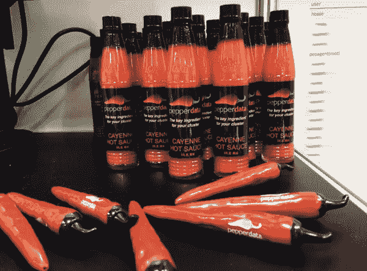

# Pepperdata:将 DevOps 实践引入大数据世界

> 原文：<https://medium.com/hackernoon/pepperdata-bringing-devops-practices-to-the-big-data-world-c7f4d0a7bd73>

大数据分析通常涉及将大型数据集传输到 Apache Spark 和 Hadoop 等处理系统中，离开去喝一大杯咖啡，然后回到有希望成功的地方。DevOps 和持续构建生态系统长期以来一直采用 linters、代码分析器和应用程序分析器来识别代码中的潜在问题和优化点，Pepperdata 希望将这种做法引入大数据世界。

我采访了雅虎前首席技术官兼首席执行官 Ash Munshi。和其他数据密集型技术公司的顾问，介绍该公司提供的产品以及他们的客户如何节省运行低效处理工作的时间。

*最初发表于*[T5【dzone.com】](https://dzone.com/articles/pepperdata-bringing-devops-practices-to-the-big-da)*。DZone 投稿人发表的观点均为个人观点。加入 DZone 社区，获得完整的会员体验。*