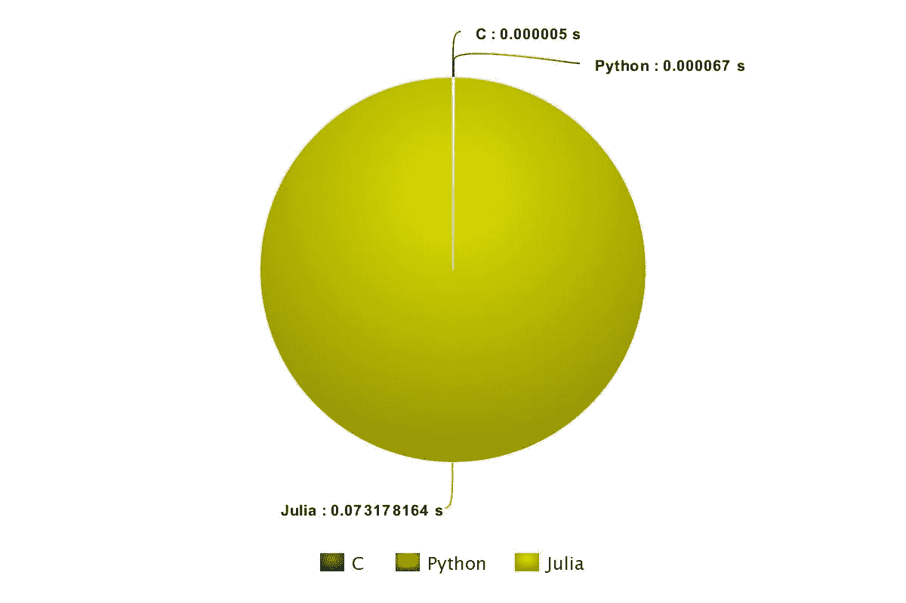
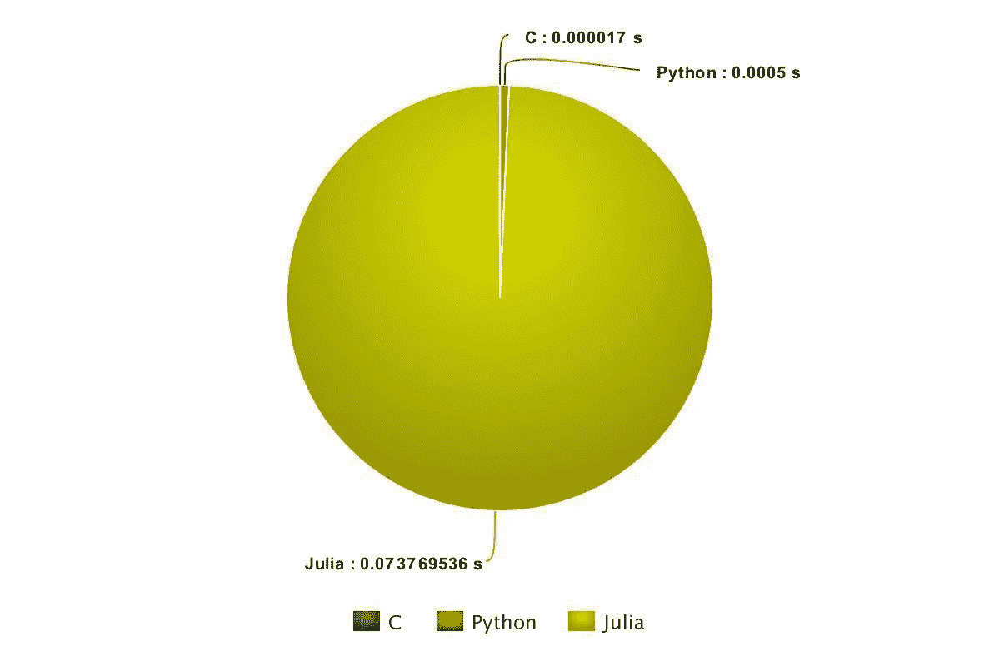
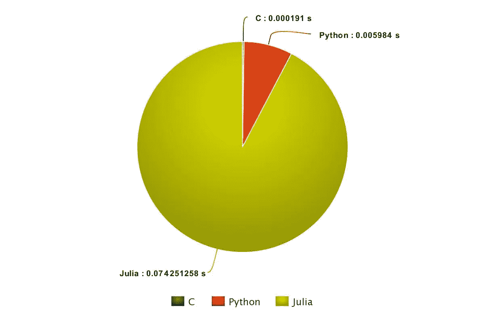
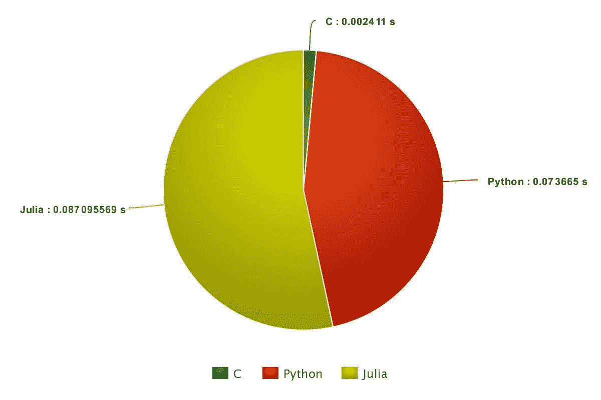
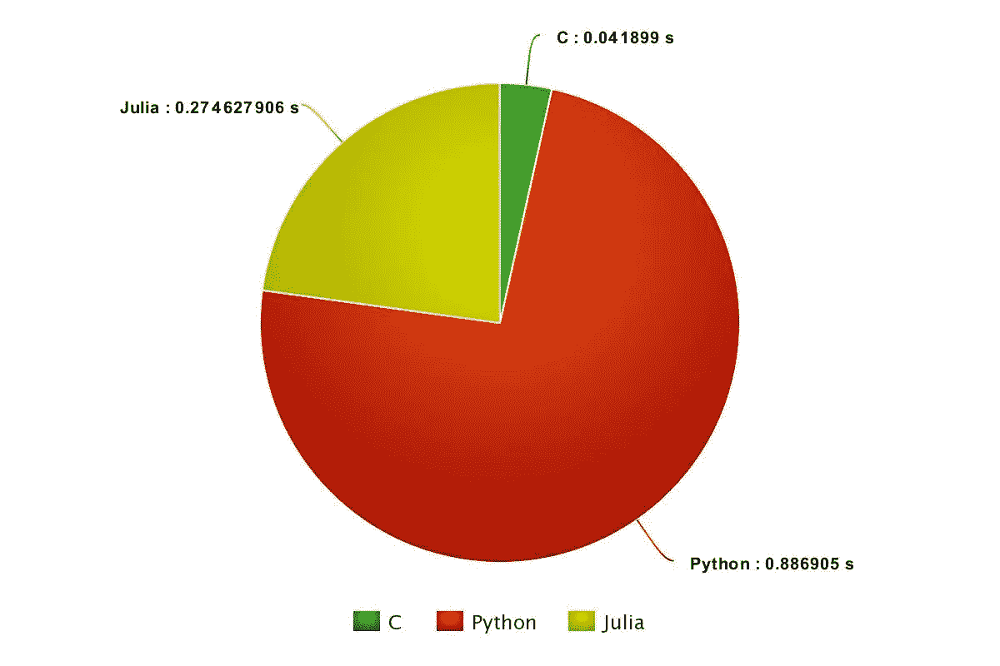
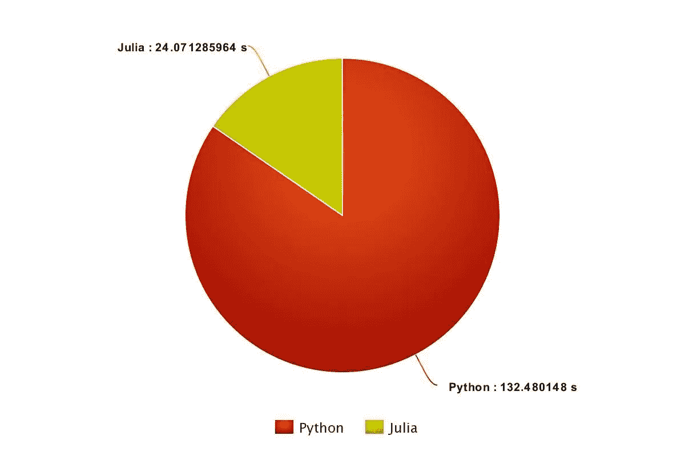

# 性能分析:Julia，Python & C

> 原文：<https://medium.com/hackernoon/performance-analysis-julia-python-c-dd09f03282a3>

在我进入开源世界之后，我不得不根据我正在从事的项目的需求，使用各种编程语言。我从事过 Python、Ruby、Java 和 C++的工作。所有 Python 程序员都会同意，学习如何用 Python 编码(不涉及内部细节)是非常简单的。稍加练习，你就可以用几行代码编写出大量功能强大的代码，并且可以完成某些大型计算(C 语言中甚至没有可用的数据类型)。对于 Ruby 来说也很相似，只是它不会让程序员太担心不正确的缩进。但是，说到性能，C 语言远远领先于基于解释器的语言。

最近，我偶然发现了一种新的编程语言——Julia。嗯，它仍处于婴儿期后期，但最让我感兴趣的是它承诺了一个简单的语法，(像 Python 一样)以及强大的性能(接近 C)，并且它也是基于解释器的。我想，“没错，这就是我们要找的！”所以，我决定在我自己的机器上测试一下。

在浏览了 Julia 中各种常用命令的语法之后，我编写了**合并排序**。选择它的原因是它对于所有情况都有 n log n(基数为 2)的时间复杂度。因此，对于随机生成的数字，它会给出可靠的结果。我也很快用 Python 和 C 编写了合并排序程序。我用 Julia 写了另一小段代码(因为我已经开始喜欢它了！)生成随机整数。使用一个 shell 脚本，我调用了所有程序来计算每个程序(c、Python 和 Julia)计算从 10 到 1，000，000，000 (10⁷).)的整数所需的时间这些程序没有 I/O。结果很有趣。我在下面展示了一个饼图来说明结果。

[程序](https://github.com/americast/Performance_analysis)运行在一个 2.30 GHz 64 位处理器、1.8 GiB 内存、Linux 4.4.0、GCC : 4.0 (20160609)、Python 2 . 7 . 12(2016–06–25)和 Julia 0 . 4 . 5(2016–03–18 00:58 UTC)的系统上。

10 (10¹):

100 (10²):

1,000 (10³):

10,000 (10⁴):

1,00,000 (10⁵):

10,00,000 (10⁶):

1,00,00,000 (10⁷):

从 10⁵开始，Julia 被证明比 Python 更快，因为它不断达到 c 语言的速度。从 10⁶开始，c 语言因分段错误而失败，Julia 表现得相当令人印象深刻，在速度方面保持了对 Python 的优势。

深入研究之后，我注意到在 Python 和 Julia 中向线性数据结构追加内容时，分配的内存量有所不同。Python 遵循的是 1.125 加一个常数，6 ( [点此](https://github.com/python/cpython/blob/202fda55c2dffe27125703225e5af92254602dc6/Objects/listobject.c#L32)参考)。

它遵循 8，16，25，35，46，58，72，88，…

但茱莉亚遵循的是因子 2 ( [点此](https://github.com/JuliaLang/julia/blob/f74cb71f5aa14835069d495db4380eefad5662a2/src/array.c#L737)供参考)。因此，当涉及到大数据时，Julia 远远超过 Python。

在本文中，我们只讨论了内存重新分配方面的内容，而与 Python 相比，还有其他几个因素使 Julia 更棒、更快。我将在下面的文章中更多地讨论它们。

合并排序代码库:【https://github.com/americast/Performance_analysis 

Julia 中内存再分配的参考:[https://github . com/Julia lang/Julia/blob/f 74 CB 71 F5 aa 14835069d 495 db 4380 eefad 5662 a 2/src/array . c # L737](https://github.com/JuliaLang/julia/blob/f74cb71f5aa14835069d495db4380eefad5662a2/src/array.c#L737)

Python 中内存再分配的参考:[https://github . com/Python/cpython/blob/202 FDA 55 C2 dffe 27125703225 e5af 92254602 DC 6/Objects/listobject . c # L32](https://github.com/python/cpython/blob/202fda55c2dffe27125703225e5af92254602dc6/Objects/listobject.c#L32)

饼状图演职员表:[www.meta-chart.com](http://meta-chart.com)