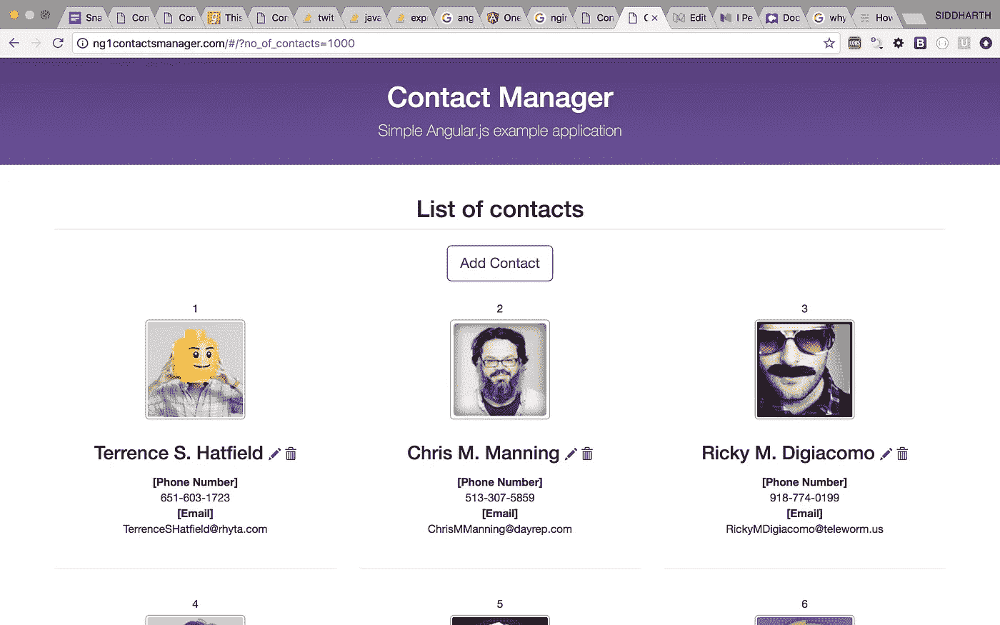
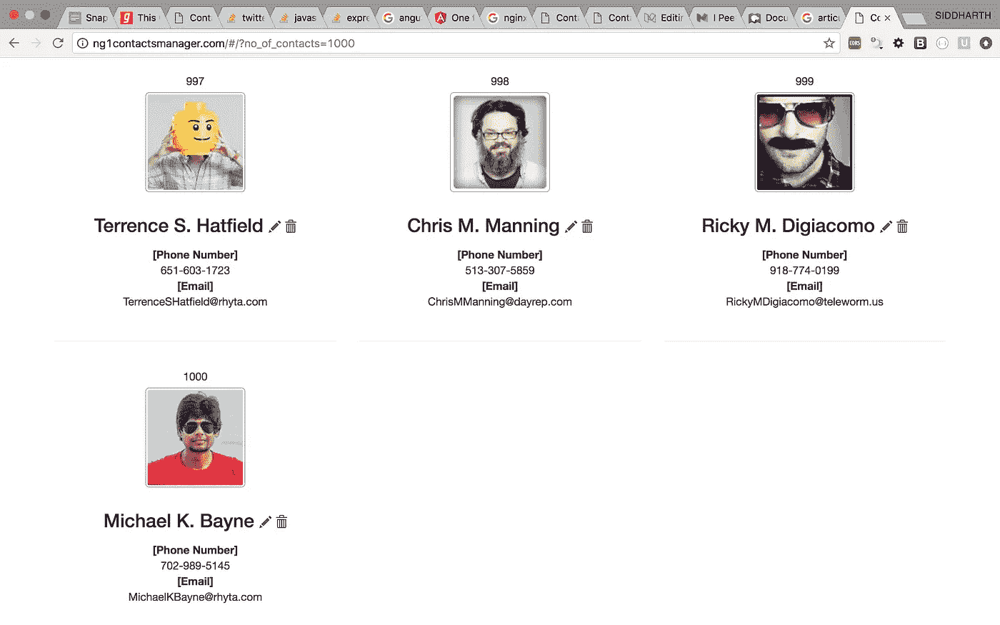
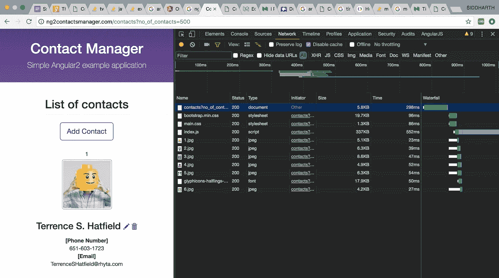
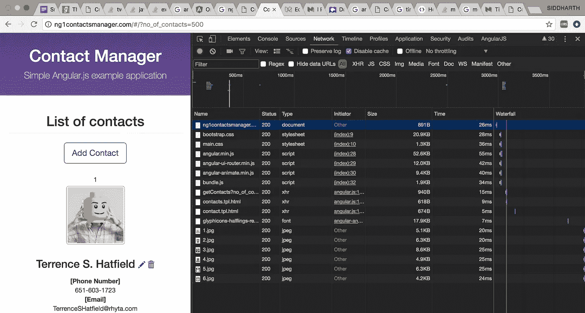
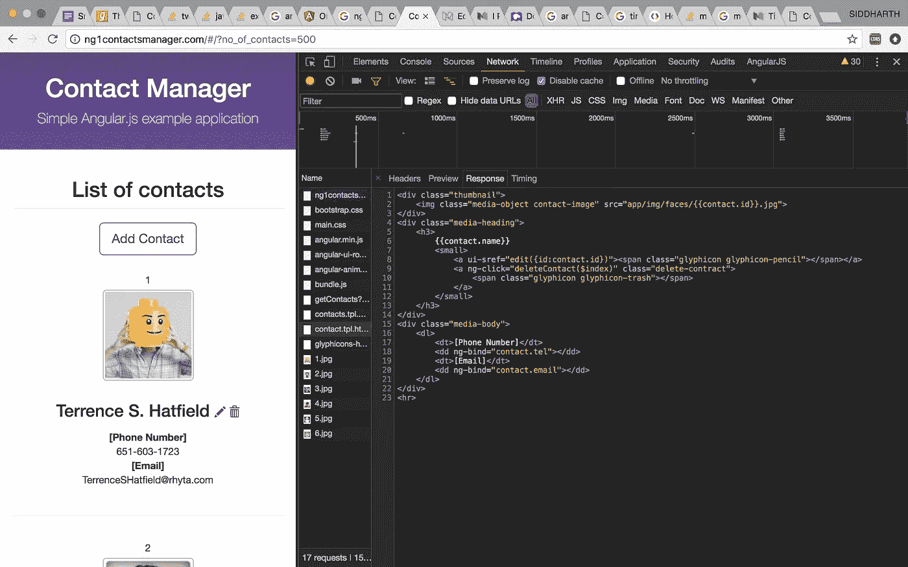
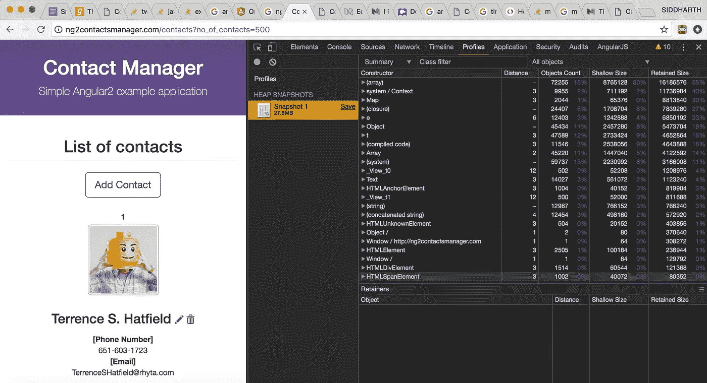
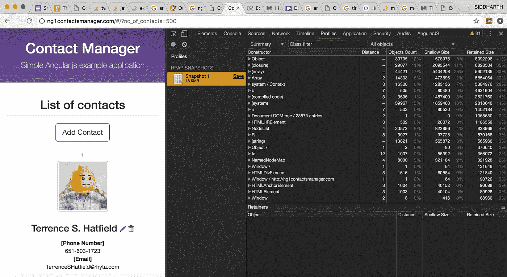
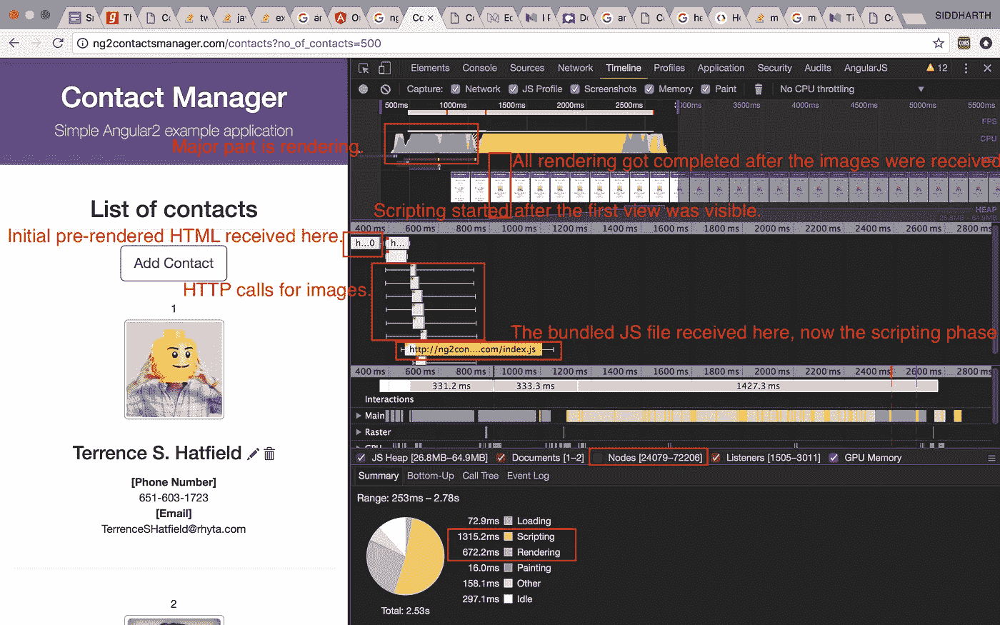
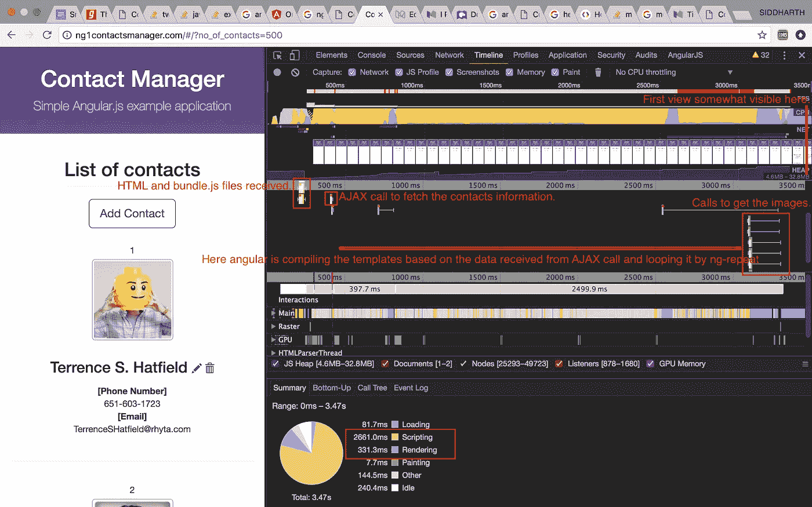
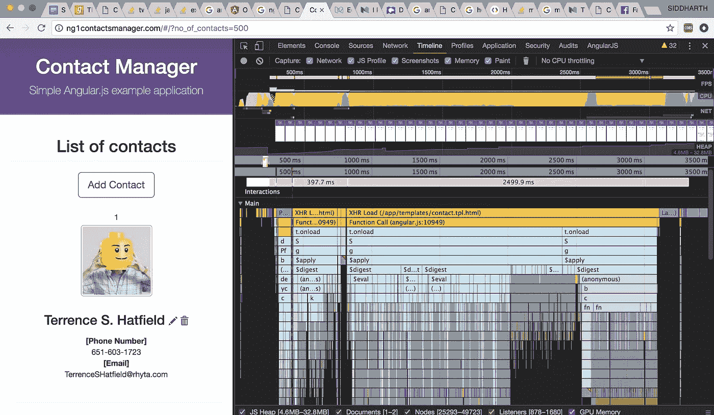

# 通过联系人管理器应用程序比较 AngularJs 1.x 和 AngularJs 2 的性能

> 原文：<https://medium.com/hackernoon/performance-comparison-of-angularjs-1-x-and-angularjs-2-through-contacts-manger-application-ccb5f00f29b1>


Contacts manager application preview

这篇文章旨在通过比较在 angular 1 (v1.4.10)和 angular 2 (v2.1.0，服务器端渲染)中创建的 chrome dev tools 简单应用程序(联系人管理器)的时间轴、配置文件和网络选项卡的报告，比较 angular 1.x 和 angular 2 在页面加载时间、堆大小、创建的 DOM 节点数量、捆绑文件大小等方面的性能差异。

# angular 1 解决了什么问题？

Angular 1 通过提供双向绑定等特性，让 web 开发人员能够快速创建 CRUD 应用程序，这方面做得非常好。开发时间减少了，不再需要像 jQuery 这样的库使用查询选择器来操作 DOM。

# 与 angular1 相比，angular2 为什么要重新设计？

Angular2 与 angular1 在语言方面有很大的不同，angular2 最重要的功能之一是从 angular1 中的摘要循环到 angular 2 中使用 zoneJs 的自定义实现的变化检测机制。

Angular1 减少了开发时间/工作，并能够提供模块来轻松集成新功能，但由于现在客户端处理更多，页面加载需要更多时间，至少初始页面加载需要更多时间。对于一个普通的 angular1+jQuery(用于扩展 angular1 的 jqLite)应用程序，函数调用树中的[脚本阶段](https://developer.mozilla.org/en-US/docs/Tools/Performance)花费了相当多的时间。
Angular2 试图解决这些问题，提供更好的变化检测机制和更好的结构来轻松创建/维护大型应用程序。

# 什么是服务器端渲染？

这里有一段来自[客户端与服务器端渲染的摘录——卡尔·塞金](http://openmymind.net/2012/5/30/Client-Side-vs-Server-Side-Rendering/)对此进行了解释。

> 通过**服务器** - **端渲染**，你的初始请求加载页面、布局、CSS、 [JavaScript](https://hackernoon.com/tagged/javascript) 和内容。对于页面的后续更新，客户机- **端呈现**方法重复它用来获取初始内容的步骤。也就是说，JavaScript 用于获取一些 JSON 数据，模板用于创建 HTML。

这里，在我们的应用服务器端，angular2 的渲染将包括编译模板和 AJAX 调用在服务器端完成。

# 让我们创建 web 应用程序，看看性能差异

我们将在 angular1 和 angular2 中创建一个联系人管理应用程序。默认情况下，该应用程序将有一些联系人，并会给用户添加，编辑和删除联系人的选项。下面是一个截图，向您展示该应用程序的外观。



1.1 Preview of the application



1.2 Preview of application (bottom of the page)

可以选择在 url 中提供一个查询参数，no_of_contacts，这样我们就可以动态地提供应用程序必须生成的联系人数量。我们将查看 **500 个**联系人的绩效结果。

如果你想检查不同联系人号码的应用程序性能，可以从本文底部提供的链接下载应用程序。

**注意**:应用 ***的 URL 并没有指向一个注册的域*** ，而是已经通过在本地主机和 NGINX 配置文件中进行更改进行了修改，以获得一个干净的 URL 并产生准确的读数(通过使用类似 gzip 压缩的特性)。

URL 已被设置为

[http://ng2contactsmanager.com/contacts?no_of_contacts=1000](http://ng2contactsmanager.com/contacts?no_of_contacts=1000)(角度 2)和

[http://ng1contactsmanager.com/#/?no_of_contacts=1000](http://ng1contactsmanager.com/#/?no_of_contacts=2000)(用于角度 1)

# 读数表(500 个触点) :

```
 ***Angular 2* **           ***Angular 1*** a.App size (html+JS)    342.8KB              77.9KBb.Heap size             27.8MB               18.6MBc.Total Loading Time    2530ms               3470msd.Page visible at       1250ms               3500mse.DOM nodes             24K - 72K            25K - 49Kf.Scripting time /      51.9%(1315ms)        76.6%(2661ms)
  Total time - (%)g.Rendering time /      26.5%(672ms)         9.5%(331ms)
  Total time - (%) 
```

安装环境的详细信息:

操作系统:macOS Sierra

浏览器:Chrome 金丝雀

Angular1 堆栈:gulp(用于捆绑)，node-express(用于服务文件)

Angular2 堆栈:angular-通用入门套件(Webpack、node-express 等。)

NGINX:启用 gzip 压缩

让我们深入研究一下，看看上面的读数是如何获得的，以及它们如何有助于提高我们的应用程序的性能。

## a)应用程序大小

应用程序大小决定了浏览器下载文件的时间，起着重要的作用，特别是当应用程序非常大或者我们的目标用户可能使用慢速互联网连接时。下面的图片是 chrome dev tools 的[网络](https://hackernoon.com/tagged/network)标签，上表中显示的应用程序大小是通过添加 HTML 和 JS 文件大小计算出来的。由于在 angular2 的情况下 HTML 在服务器上编译，因此 HTML 文件大小在这里起着重要的作用。而在 angular1 的情况下，模板是通过 get 调用来检索的，通过将检索到的数据归档到模板中来编译模板是在客户端完成的。

Angular2 应用程序大小= 5.8KB(HTML) + 337KB(index.js)

Angular1 应用程序大小= ~ 2KB(HTML)+(52.6+12+9.4+1.9)KB

注意:请不要被 chrome 开发工具的黑色主题所迷惑，因为我的偏好，我把 chrome 开发工具放在了黑色主题的右边。



2.1 Angular2 network tab



2.2 Angular1 network tab


2.3 Angular2: HTML comes compiled from server



2.4 Angular1 partial is received and is compiled on the client side

在网络选项卡中可以注意到的另一件有趣的事情是，angular2 没有 AJAX 调用，因为同样的事情在服务器端完成了。

## b)堆大小

Profiles 选项卡将显示页面的 JavaScript 对象和相关 DOM 节点的内存分布。对于我们的应用，angular1 和 angular2 的读数看起来都很好。



3.1 Angular2 heap snapshot



3.2 Angular1 heap snapshot

## c)总装载时间

总加载时间是加载、脚本编写、渲染、绘画、空闲等时间的总和，显示在时间轴选项卡的底部。参考下图中的饼状图。



4.1 Angular 2 timeline tab explantion



4.2 Angular 1 timeline tab explanation

## d)页面可见于

Angular2 显然是赢家，因为 HTTP 调用和 HTML 渲染都在服务器上完成。Page visible at 是页面与图像一起呈现的时间，它的第一个预览对用户可见。要确定相同，可以参考时间轴选项卡中的截图。

当页面变得可见时，并不需要所有的事件绑定都完成，如果我们参考火焰图，那么很明显，像 runTask、zoneJS 的 invokeTask 和 subscribe、来自 rxJS 的 call 这样的函数在 angular2 的视图渲染后开始绑定它们的监听器。


5.1 Angular2 flame chart



5.2 Angular1 flame chart

如果我们将参考 angular1 的火焰图，大部分时间和堆栈被用于消化循环。

## e) DOM 节点

这是一个重要的因素，因为模板引擎对模板的内部编译通常会插入一些额外的 HTML 元素。节点元素越少，DOM 树越轻，效果越好。

## f)脚本编写时间

脚本时间给出了浏览器在读取/处理脚本上花费了多少时间的概念。

脚本和渲染时间在阅读表中以百分比给出，因为它允许我们确定和推断对于 angular2，浏览器完成的主要工作是渲染视图。

在 angular2 的情况下，由于 HTML 是预编译的，AJAX 调用也是在我们的服务器上进行的，所以没有太多时间花在脚本上，因此正如我们在时间轴选项卡中看到的，一旦收到 HTML 文件，渲染就开始了。一旦呈现完成，脚本就开始执行将呈现的元素与它们各自的侦听器绑定的工作。

在 angular1 的情况下，首先接收并处理脚本，然后进行 AJAX 调用，一旦接收到数据，就将其放入 HTML 模板并解析以创建视图，在此期间进行获取图像的调用，一旦完成，图像也在视图中呈现。

## g)渲染时间

在渲染阶段，浏览器会将创建的 HTML 渲染到视图中。

因此，对于上述读数，angular2 在性能方面明显优于 angular1，但这可能是因为 angular2 提供的服务器端渲染。

react 和 angular2 之间还可以有进一步的比较(因为两者都有服务器端渲染可用)，angular2 有无服务器端渲染等。

## Github 链接:

https://github.com/hearsid/ng2-contact-manager 联系人经理= >

NG1 联系人经理= >【https://github.com/hearsid/angular-contact-manager 

[](http://bit.ly/HackernoonFB)[](https://goo.gl/k7XYbx)[](https://goo.gl/4ofytp)

> [黑客中午](http://bit.ly/Hackernoon)是黑客如何开始他们的下午。我们是 [@AMI](http://bit.ly/atAMIatAMI) 家庭的一员。我们现在[接受投稿](http://bit.ly/hackernoonsubmission)并乐意[讨论广告&赞助](mailto:partners@amipublications.com)机会。
> 
> 如果你喜欢这个故事，我们推荐你阅读我们的[最新科技故事](http://bit.ly/hackernoonlatestt)和[趋势科技故事](https://hackernoon.com/trending)。直到下一次，不要把世界的现实想当然！

[](https://goo.gl/Ahtev1)