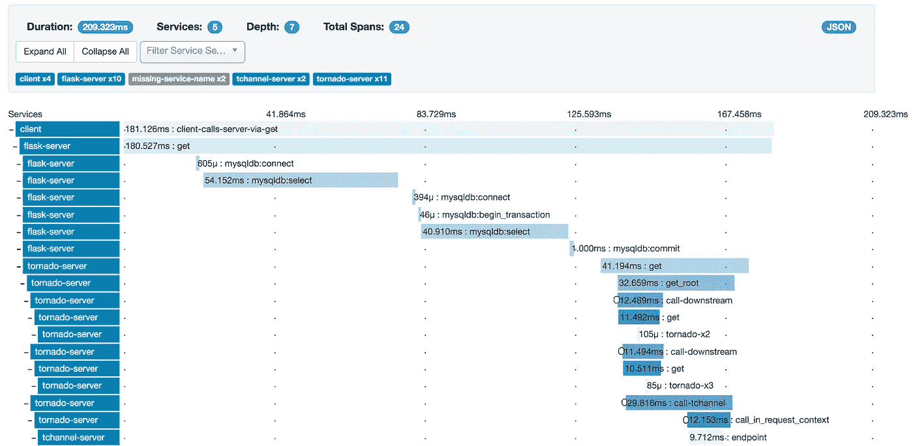

# 前端性能监控—简介

> 原文：<https://medium.com/hackernoon/performance-monitoring-for-the-frontend-an-introduction-e0ab422f131c>

在这一年中，我在全球各地的不同会议上看到了许多演讲。他们中有不少人关注的是[的表现](https://hackernoon.com/tagged/performance)，涉及各种话题:

*   从您的应用程序中删除 jank
*   拥有更快的屏幕或互动时间
*   通过 GraphQL + Apollo 或 Relay，在需要的时候只加载需要的数据
*   优化您的 redux-thunk 或 redux-saga 以更快地加载数据或预取特定资源

A loading screen in its natural habitat

这一系列的博客文章是关于网络相关的性能问题。
我们的目标是为您提供一套工具，帮助您了解如何向客户交付更少、更短的装货屏幕。因为还有什么比等待一个页面或者一个屏幕加载更烦人的呢？

我想从我使用的关于性能监控的第一个工具开始:[Zipkin](https://zipkin.io/)
“Zipkin 是一个分布式跟踪系统。”陈述[网站](https://zipkin.io/)。Zipkin 库由收集跟踪信息的服务器和向服务器发送跟踪信息的客户端组成。有很多各种语言的 Zipkin 客户端，比如 [Javascript](https://hackernoon.com/tagged/javascript) ，C#，Go，Java，Ruby，Python。还有为库预先准备的工具，例如 express、fetch、Postgres 和 Redis。

A screenshot from Zipkin

# 术语

为了让您开始跟踪上下文，我们需要定义我们谈论的内容。幸运的是，已经有了一些术语，所以让我们一起来复习一下:

## 使用仪器

某个东西的一个仪表化版本，比如说一个 API 客户端是一个通过添加跟踪来扩展原始版本的版本。在我们的例子中，这可能是一个 fetch API，它不仅发送有效负载本身，还发送带有跟踪信息的对 Zipkin 服务器的更新。

## 找到；查出

一个跟踪(见下图)描述了一个交互(例如，一个用户交互或一个 API 调用),特别关注执行时间。它由*Spans*和它们之间的依赖关系组成。最顶端和最早的跨度称为*根跨度*，它通常是触发工作负载的交互，位于系统的外部边缘。每个 span 都可以是另一个 Span 的父 Span，类似于一个函数能够调用其他 Span。如果存在这样的子关系，Zipkin 会自动命令跨度在彼此之下更深。

## 服务

你注意到下图最左边的蓝色标签了吗？这些被称为服务，它们是在构建跟踪器时配置的。将它们视为应用程序的不同层。您可以根据您的特定需求对它们进行裁剪:如果您有一个 express API，那么它可能是您想要分离成服务的各种中间件。如果你有一个微服务架构，每个服务可能有它自己的层。

## 日志和标签

如果没有日志和标记，搜索具有特定属性的特定范围将会很乏味。它们将字符串键映射到值，并允许在用户界面中进行平滑的搜索。标记和日志之间的区别在于，标记可以被认为是每个 span 的注释，而日志有一个时间组件。据我所知，Zipkin 并不尊重这种差异，但知道社区在谈论什么还是很好的。

如果你想了解更多的术语，请查看 [opentracing 规范](https://github.com/opentracing/specification/blob/master/specification.md)。

你读到这里，所以看起来你对这个话题很感兴趣。我有一篇后续文章，您可以在其中看到这些术语的实际应用。我们将学习如何通过 Zipkin: [**为您的应用程序添加监控功能——使用 Zipkin**](/@dschmidt1992/performance-monitoring-for-the-frontend-using-zipkin-bf3aa4a715e5) 进行前端性能监控

*想从我这里听到更多信息吗？欢迎订阅我的时事通讯，我大概一个月发一次新闻。*