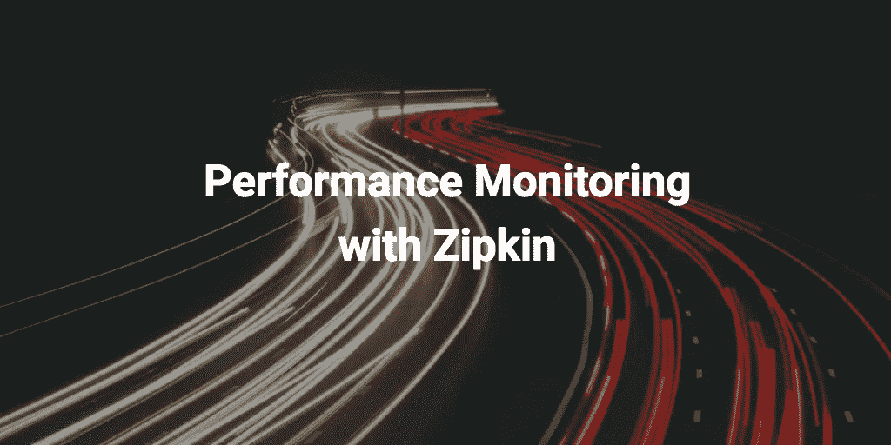

# 前端性能监控—使用 Zipkin

> 原文：<https://medium.com/hackernoon/performance-monitoring-for-the-frontend-using-zipkin-bf3aa4a715e5>

这一系列的博文都是关于网络相关的[性能](https://hackernoon.com/tagged/performance)问题。
我们的目标是为您提供一套工具，帮助您了解如何向客户交付更少、更短的装货屏幕。

请确保您也阅读了第一部分: [**前端性能监控—简介**](/@dschmidt1992/performance-monitoring-for-the-frontend-an-introduction-e0ab422f131c)

# 入门指南

既然我们已经得到了正确的名称，让我们看看如何跟踪单个 span。为此，我们需要一个追踪器来开始跨度。

您可以在第 13 行看到，我们需要设置一个采样器。采样器是返回布尔值的函数，该布尔值指示是否应该开始跟踪。设置很有用，因为您可能只想跟踪特定比例的用户，或者只跟踪连接到 WIFI 或您企业特有的设备的用户。
在第 14 行中，您会看到服务名被设置为“frontend”，这将显示在左侧。现在我们有了一个可以工作的跟踪器，可以用来开始一些实际的跟踪。

让我们详细讨论一下:您可能注意到的第一件事是，我们将想要跟踪的语句包装在一个限定了作用域的块中，并设置了 span 的当前 id，这样 [Zipkin](https://hackernoon.com/tagged/zipkin) 就知道我们具体讨论的是哪个 span。createRootId 部分意味着我们想要创建一个根 span，稍后我们将看到如何创建子 span。接下来要注意的是，我们为客户机发送记录了一个注释，它标志着我们的跨度的起点，并表明客户机将要向服务器发送一个请求。如果我们在这里写了一个服务器，我们将需要使用服务器接收注释；对于本地跨度(系统之间没有交互)，我们可以使用本地操作启动。在第 15 行我们看到了相反的部分，客户端接收注释，它标志着跨度的结束。正如您已经知道的，Span 可以有名称，在本例中，我们通过 RPC 注释将其设置为“My Span”。RPC 代表远程过程调用，这意味着我们用这个调用调用服务器上的一个函数。
最后但同样重要的是，我们想知道 API 调用的结果。因此，我们记录一个二进制日志，用键“result”和字符串化的响应作为值。

# 延伸跨度

应该只有一个根，所以让我们看看如何定义子关系:

您需要位于父块的作用域内，以便可以通过运行 createChildId 来扩展它。就这样，很简单，对吗？当您试图将两个系统相互连接起来时，事情会变得有点复杂，我可能会在本系列的后面部分详细介绍这一点。现在，我想告诉你，如果你想做这样的事情，你可以看看哪里:

- [给请求添加 HTTP 头](https://github.com/openzipkin/zipkin-js/blob/ee844c9249b47872444bdc5c4514f39df27a9714/packages/zipkin-instrumentation-fetch/src/wrapFetch.js#L11)
- [从请求中提取跟踪上下文](https://github.com/openzipkin/zipkin-js/blob/ee844c9249b47872444bdc5c4514f39df27a9714/packages/zipkin-instrumentation-express/src/expressMiddleware.js#L30)

# 局部跨度

最后，我想给你看一些‏recently 添加到 Zipkin 的东西:本地跨度。每当您发现自己需要跟踪只与一个服务有关的东西时，无论是同步计算还是带有承诺的异步计算，您都应该使用本地范围进行跟踪。您可以自己设置注释，或者让 Zipkin 为您处理，如下例所示:

local 的第一个参数采用一个 span 名称，第二个参数采用一个函数。如果函数返回一个承诺，当承诺完成时跨度结束，否则当函数完成时跨度结束

*想听我说更多吗？欢迎订阅我的时事通讯，我大概一个月发一次新闻。*