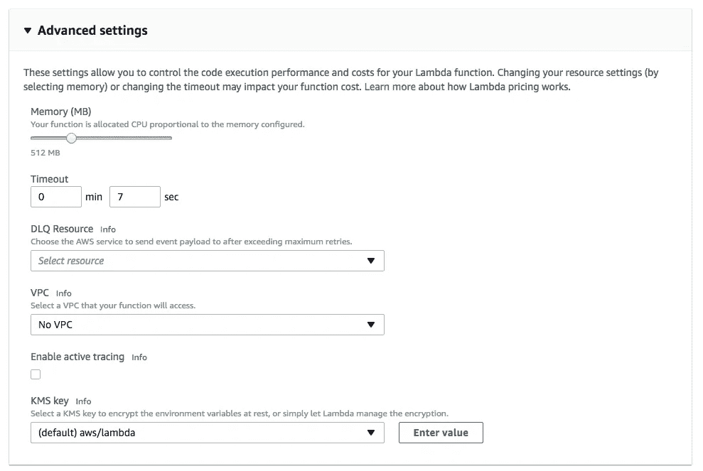
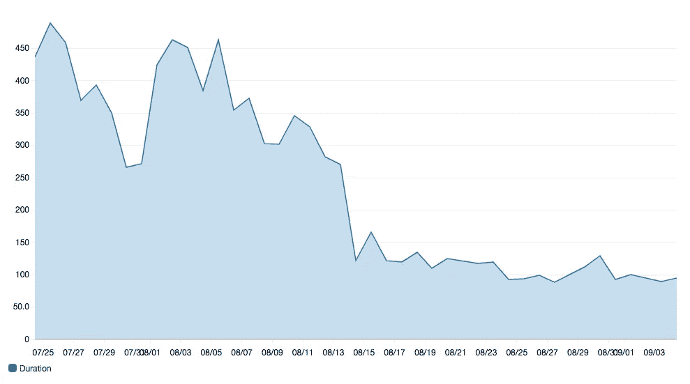

# 使用 AWS Lambda 调整 Alexa 性能的技巧

> 原文：<https://medium.com/hackernoon/performance-tuning-alexa-skills-using-aws-lambda-24ccacb7199b>

Photo courtesy of [sandid](https://pixabay.com/en/users/sandid-356019/) via CC2.0 on [Pixabay](https://pixabay.com)

我是 [Alexa 开发冠军](https://developer.amazon.com/alexa/champions/terren-peterson)和 [Alexa](https://hackernoon.com/alexa) 上的[奥莱利作者](https://www.oreilly.com/people/terren-peterson)。我每个月都创造新的 Alexa 技能，并监控那些已经运行的技能的使用情况，并根据需要进行更新。

AWS Lambda 是一个很棒的服务，默认情况下，它是流行的亚马逊 Alexa 平台背后的编码逻辑。我的 Alexa 技能之一是在每年的这个时候使用它，特别是从八月到十月。它叫做[飓风中心](https://www.amazon.com/Drawrz-com-Hurricane-Center/dp/B01EFCJ0OU)，在你的亚马逊 Alexa 设备上提供来自国家飓风中心的数据。

最近，随着飓风哈维和伊尔玛的到来，它的流量达到了峰值，创下了历史新高。鉴于它使用的是无服务器模式，它会随着负载自动扩展，所以我不需要做任何事情来支持峰值。这确实让我看了看我的每月 AWS 发票，只是为了确保我保持在相关成本的顶部。这是我对飓风中心技能的性能调整和成本影响的分析。

# 性能调整 AWS Lambda

提供 Lambda 函数时的一个默认变量是内存分配。它由控制台“高级设置”选项卡上的滑块(见下文)控制，默认情况下，启动时为 128MB。此设置可以在不对 Lambda 函数进行任何编码更改的情况下进行调整。只需保存，平台将使用新容量重新部署该功能。

通过将内存分配从默认的 128MB 更改为 512MB(相对应的 vCPU 更改为 4 倍)，性能显著提高。下面是 CloudWatch 中的响应时间图，显示了对该函数的调用的每日平均性能。8 月 14 日进行了更改。以前，性能在 300 毫秒范围内，现在平均在 100 毫秒范围内，提高了 3 倍！我在过去两周收到的流量峰值也没有对这一点产生影响，因为性能保持很快——100 毫秒。

# 对成本有什么影响？

每当我们向应用程序投入额外资源时，一个很好的问题是成本影响是什么。相对而言似乎不贵的东西可以很快增值。

AWS 在 Lambda 上的价格结构相当慷慨。考虑到 Alexa 技能的相对使用，这一点尤其正确。帐户上存在一个免费层，限制在 100 万个请求之下，以及一个月 40 万 GB 秒的 CPU 使用量。这是我们通过增加内存分配而影响的第二个指标，因为事务量保持不变。

# 让我们计算一下这个变化

从 128MB 升级到 512MB 的影响并不意味着成本会增加 4 倍。度量单位是分配的内存乘以以 100 毫秒为增量的事务时间的组合。鉴于我们看到响应时间减少了 3 倍，它们几乎抵消了。

> 场景#1 —小型(128MB)版本
> 
> 10k 执行 x 300ms 毫秒 x 128 MB = 384 GB-秒。
> 
> 场景#2 —更大(512MB)的版本
> 
> 10k 执行 x 100ms x 512 MB = 512 GB-秒。

因此，内存翻两番的最终结果是消耗增加了 34%——我的技能获得了 3 倍的性能提升。嘣！

# 不要调谐超过 100 毫秒

超过 512MB 是可能的，因为该服务支持高达 1.5GB 的大小。Lambda 的定价模型中有“细则”，强调每笔交易的成本四舍五入到最接近的 100 毫秒。这意味着，一旦性能低于 100 毫秒，堆的任何增加都会增加整体使用量。这是与上面的例子相匹配的场景。

> 场景#3 —最大(1.5GB)版本
> 
> 10k 执行 x 65ms 毫秒(四舍五入到 100 毫秒)x 1.5 gmb = 1500 GB-秒。

最终结果是，三倍的内存可能会提高性能，但使用成本也会增加 3 倍。

# 我的账单增加了多少？

现在荒谬的部分来了。每月前 40 万千兆秒是免费的，所以除非使用这个 Lambda 函数的技能变得非常流行，否则它将保持在免费层之下。让我们计算一下 Alexa 技能达到这个水平会有多受欢迎。*(示例假设上述场景# 2)*

33k 执行/天 x 30 天/月= 100 万执行/月。

33k 执行/天 x 30 天/月，512MB = 50k GB 秒。

因此，使用这种技巧要注意的不是内存，而是事务量。如果你不熟悉 Alexa 技能的使用，33k 执行/天是非常高的，只有平台上最顶尖的 1%的技能可以看到这种流量。当开发 Alexa 技能时，不要犹豫增加内存，因为它可以提高性能，而且是免费的！