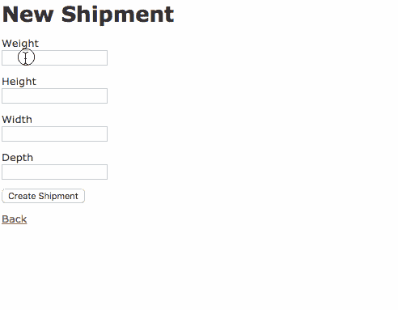

# 在 Rails 中执行定制验证——一个例子

> 原文：<https://medium.com/hackernoon/performing-custom-validations-in-rails-an-example-9a373e807144>

[Rails](https://hackernoon.com/tagged/rails) 提供了各种开箱即用的助手，用于快速[执行](https://hackernoon.com/tagged/performing)常用的验证——存在性、数值性、惟一性等。如果模型有超出标准助手的验证，我们必须实现一个定制的验证策略。我将展示进行验证的三种方法，并讨论其优缺点。

例如，我们有一个 Shipments 表，其中每个记录代表一个带有属性`width`、`height`、`depth`和`weight`的包裹。

每次装运必须遵守以下规则:

*   装运的体积必须在 20 到 4000 立方厘米之间(即体积验证)
*   货物的密度不能超过每立方厘米 200 克(即密度验证)
*   任何边的长度都不能小于最大边的 10%(即比例验证)

对于每一种情况，我们将使用不同的验证实现。为了使验证更具可读性，我们在装运模型中实现了#volume 和#density(查看[源代码](https://github.com/rfleury2/custom-validation-blog/tree/master/MyApp))。

首先，让我们通过在 shipment 类中创建一个自定义方法来验证装运量。我们可以使用`#validate`在验证过程中调用一个自定义方法。然后，在自定义方法中，向`#errors`对象添加新的错误([应该有自己的简短帖子](/@rfleury2/a-quick-guide-to-model-errors-in-rails-965e2be3ac93#.jycr0mkrl))

```
class Shipment < ActiveRecord::Base
  …
  validate :volume_limits
  … private def volume_limits
    if volume > 4000
      errors.add(:volume, “cannot be above 400 cubic inches”)
    elsif volume < 20
      errors.add(:volume, “cannot be below 20 cubic inches”)
    end
  end
end
```

在模型中执行验证工作得很好，但是它也给模型增加了更多的逻辑。在可能的情况下，我更喜欢将该逻辑提取到它自己的助手类中。这是因为它很好地将每个验证的逻辑封装到自己的对象中，使得将来的调试和/或扩展更加容易。

让我们通过创建一个助手验证器类来验证密度。`#validates_with`方法将验证指向一个助手类:

```
class Shipment < ActiveRecord::Base
  …
  validates_with DensityValidator
  …
end
```

然后，在/models/concerns 目录中，创建“density_validator.rb”。`DensityValidator`继承自`ActiveModel::Validator`，其约定有一个方法叫做`#validate`。该方法可以访问整个记录并实现验证逻辑，如果需要，还可以分配错误:

```
class DensityValidator < ActiveModel::Validator
  def validate(record)
    if record.density > 20
      record.errors.add(:density, “is too high to safely ship”)
    end
  end
end
```

最后一个验证是确保包的形状不奇怪。如果一个包的任何一条边的长度短于最长边的 10%,则称该包为奇形怪状。

对于上面的两个例子，我们都是在整体上验证货物的属性—任何包裹都只有一个体积和一个密度。对于包装的形状，每一面都必须单独验证。

使用#validates，我们列出了所有需要验证的属性，后面跟着`package_proportion: true`:

```
class Shipment < ActiveRecord::Base
  ...
  validates :height, :width, :depth, package_proportion: true
  ...
end
```

package_proportion 标志意味着我们期望有一个名为 PackageProportionValidator 的验证帮助器类。在/models/concerns 目录下，创建“package _ proportion _ validator . Rb”。

```
class PackageProportionValidator < ActiveModel::EachValidator
  def validate_each(record, attribute, value)
    if value < [record.width, record.height, record.depth].max * 0.1
      record.errors.add(attribute, "cannot be so short as to make                                                 
      the package oddly sized :(")
    end
  end
end
```

属性验证助手类期望一个`#validates_each`方法来促进验证。它提供了对当前被验证的单个属性和作为单独变量的整个记录的访问，这很有帮助。

让我们用一个形状奇怪、太大、太重的包来完成所有这些验证。



这是在 Rails 中实现验证的三种不同方式。哪一个是最好的取决于应用目标和验证用例。我通常尝试将逻辑封装到一个单独的类中，以使验证逻辑远离模型。当验证发生在属性级别时(比例示例)，我使用 validates_each 策略分别访问属性。当验证发生在对象级别时，我为整个对象使用一个定制的验证器(密度示例)。

感谢您的阅读。我是写代码的新手，所以我会感谢任何有助于成为更好的作者和沟通者的反馈。也开放给未来的话题！

[](http://bit.ly/HackernoonFB)[](https://goo.gl/k7XYbx)[](https://goo.gl/4ofytp)

> [黑客中午](http://bit.ly/Hackernoon)是黑客如何开始他们的下午。我们是 [@AMI](http://bit.ly/atAMIatAMI) 家庭的一员。我们现在[接受投稿](http://bit.ly/hackernoonsubmission)并乐意[讨论广告&赞助](mailto:partners@amipublications.com)机会。
> 
> 如果你喜欢这个故事，我们推荐你阅读我们的[最新科技故事](http://bit.ly/hackernoonlatestt)和[趋势科技故事](https://hackernoon.com/trending)。直到下一次，不要把世界的现实想当然！

