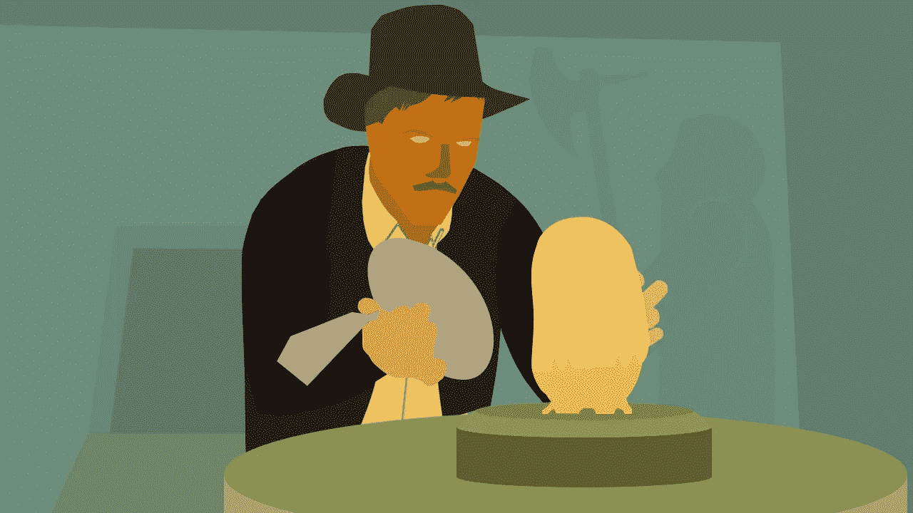

# 许可，采取——如何授予你自己的自由

> 原文：<https://medium.com/hackernoon/permission-taken-how-to-grant-your-own-freedom-3ff3c7145e1d>

## 从食品杂货到创办公司，没有人给予许可。

“我是成年人，我做我想做的事。”鉴于我们的年龄，这个词我和妻子说得太多了。我们已经成年一段时间了。

我仍然记得第一次意识到能够为所欲为引起了行为的改变。我在买杂货。在我发明自己的一套主食之前的早期杂货店旅行之一——仍然不擅长计划，我有点为以后购物，但实际上是为我的下一顿饭买。这次旅行来晚了。我设法吃着校园食品度过了大学的大部分时光。我离开了学校，开始了自己的普通日常生活，定期去杂货店购物。

当我走在过道上，左顾右盼的时候，我注意到了一些东西，但当一个想法突然出现在我脑海中时，我继续说道:“我打赌那些东西一定很好吃。”

几秒钟(几英尺)过去了。

“我可以买它们……它们是来被人买的！”

我是个成年人，我做我想做的。有时这意味着买一些装在明亮盒子里的东西，盒子上的名字是一种成分的巧妙拼写，它尝起来像，但实际上并不含，取而代之的是一周的钠含量。

## 需要许可

杂货店的故事听起来很基本，但它传达了一个我长期以来努力完全接受的理解:没有人需要批准你可以选择的大多数选项。

几乎没有权力允许做任何事情。只是人而已。他们中的一些人比其他人更善于探索可供他们选择的方案。

许可不是授予的，而是取得的。

然而出于某种原因，我一直渴望得到许可。我花了几年时间听取[初创企业](https://hackernoon.com/tagged/startup)的建议，与我周围的[商界](https://hackernoon.com/tagged/business)领袖共进午餐，阅读关于这个主题的博客帖子。我在挖掘能让我自己做好冒险准备的信息。回想起来，我想我在寻找一个标记，一个表明我准备好了，我得到了许可的东西。

在 2016 年，拥抱这一点适用于创业。十年前，它被应用于我想在生活中实现的六个其他“飞跃”:友谊的深度，搬到新的城市，像问我想要什么这样的基本事情，而不是试图赢得一切或希望我周围的人会读心术。

## 相同的概念，不同的框架

从我去买杂货到开公司，将近十年过去了。

为什么这么久？

在我意识到同样的模式——不需要许可——适用于生活中的几乎所有事情之前，我不得不多次进行同样的思维跳跃。

这些跳跃的框架并不总是“许可”。前提是，有些人做我也想做的事情，但除了做这些事情之外，没有什么能让他们与众不同。他们并不特别。没有人走近他们，为他们的道路做准备。他们刚开始散步。

因为他们并不特别，我也不需要特别。我只是需要一跃而起。

## 跳跃

大学二年级的时候，在一个我一个人都不认识的城市实习。我了解到，搬到新的令人兴奋的地方的人并不总是那些人。我能做到。我可以起来走动。

实习的申请条件之一是大三或大四。我了解到*有些规矩，不是*的规矩。

在实习期间，我学到了无论你认为某人有多有影响力，你都可以邀请他们共进午餐，他们通常会答应。最坏的情况是被拒绝，这就相当于从来没有问过。我学会了[拍摄](https://theringer.com/the-nba-guide-to-shooting-your-shot-d7f8502f9e39#.4hw6sp4di)。

三年后，我从美国东海岸搬到了澳大利亚的悉尼。这需要澳大利亚移民局的许可，但我想看看我是否掌握了搬家的窍门。我们开始时并没有完全准备好，这需要坚持。

对于生活中的绝大多数飞跃，没有人会给予许可，也没有权威机构提供授权。你永远不会读够或学到足够的东西。没有一个走在令人羡慕的道路上的人一开始就装备齐全。

飞跃。

我是韦斯利·瓦尔泽， [Ask Inline 的创始人兼首席执行官——我们帮助团队建立伟大的客户反馈活动](https://askinline.com)。你可以在[推特](http://twitter.com/wewals)或[上关注我。](/@wwalser)

> [黑客中午](http://bit.ly/Hackernoon)是黑客如何开始他们的下午。我们是 AMI 家庭的一员。我们现在[接受投稿](http://bit.ly/hackernoonsubmission)并乐意[讨论广告&赞助](mailto:partners@amipublications.com)机会。
> 
> 如果你喜欢这个故事，我们推荐你阅读我们的[最新科技故事](http://bit.ly/hackernoonlatestt)和[趋势科技故事](https://hackernoon.com/trending)。直到下一次，不要把世界的现实想当然！

