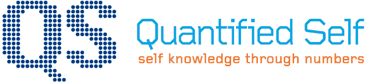
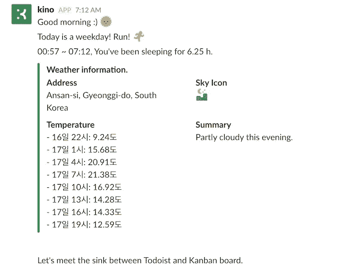
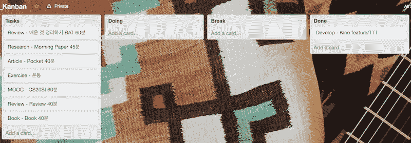
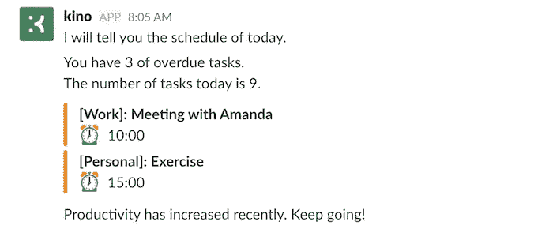
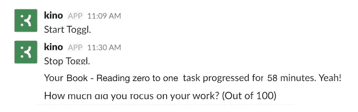
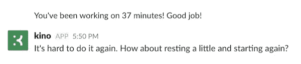
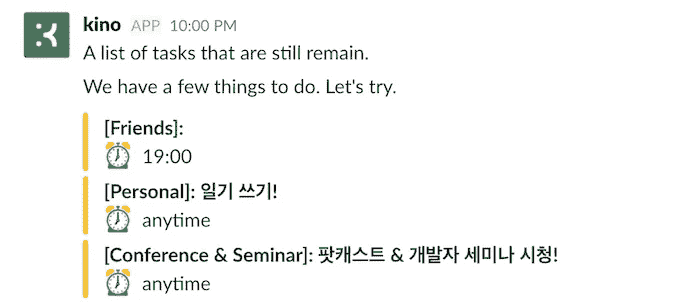
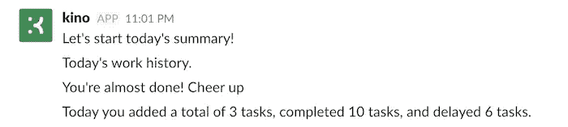
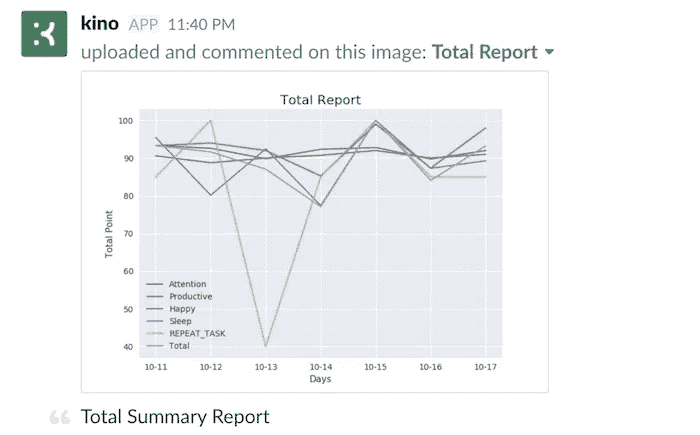
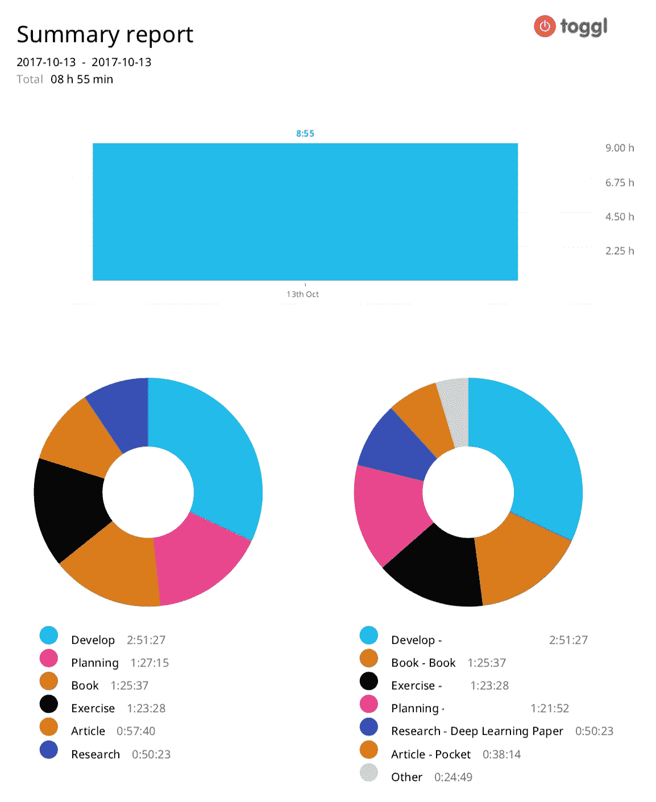

# 个人助理 Kino 第 3 部分— T3。

> 原文：<https://medium.com/hackernoon/personal-assistant-kino-part-3-t3-d078b65462be>

> Kino 是一个项目，通过量化的自我来了解自己，自动重复事情并提高生活质量。



From [http://quantifiedself.com/](http://quantifiedself.com/)

Kino 系列列表

*   [个人助理 Kino 第 1 部分—概述](https://chatbotslife.com/personal-assistant-kino-part-1-overview-496b97de4afd)
*   [私人助理 Kino Part 2——技能&调度器](https://chatbotslife.com/personal-assistant-kino-part-2-skill-scheduler-3cf25070fe8e)
*   [个人助理 Kino Part 3 — T3](https://hackernoon.com/personal-assistant-kino-part-3-t3-d078b65462be)
*   [个人助理 Kino 第 4 部分—智能馈送](/@humanbrain.djlee/personal-assistant-kino-part-4-smart-feed-b9e4cab966)

[上一个帖子(技能&调度)](https://chatbotslife.com/personal-assistant-kino-part-2-skill-scheduler-3cf25070fe8e)是在准备 Kino 按照我想要的那样工作的过程中。现在我想说说这个项目的目标，量化自我。它是收集关于我自己的数据，将数据作为图表查看，给我自己反馈，并通过它提高生活质量的过程。

# T3 =任务主管

我今天要讲的是**任务**。我非常喜欢 Todoist。所以我升级到高级，我正在使用它。有手机和桌面应用，所以我可以随时随地轻松管理我的待办事项。但是我需要更多的功能。我想知道花了多少时间，我在这项任务上集中了多少精力，我是如何度过一天的时间的。

仅仅用 Todoist 来满足我的需求是不够的。所以我开始寻找我需要的服务。 [Toggl](https://www.toggl.com/) 为测量时间提供了很好的服务，而 [Trello](https://trello.com) [的](https://trello.com)'s)看板是开始和完成任务最简单的工具。此时，只需通过“任务”、“执行”、“完成”、“休息”来管理电路板列表。

T3 是我所说的服务的集成。
即 T3 = Todoist + Toggle + Trello。

下面是 T3 的**技能**。

## Todoist

*   🌆今日简报:今日简报—简要说明任务
*   📃todoist_remain:指导您完成 todoist 中剩余的任务。

## 托格尔

*   ⌚️ toggl_timer:切换定时器开始或停止。
*   🔔toggl_checker:每 30 分钟检查一次时间。(如果工作超过 100 分钟，建议放松)
*   📊toggl_report : Toggl 任务报告。

## 特雷罗

*   📋看板初始化:初始化看板板。
*   📋kanban_sync:将 Todoist 的任务与看板板同步。

## 问题

*   ✍️注意 _ 问题:要求下班后注意力集中。(满分 100 分)
*   ✍️注意 _ 报告:注意报告。

让我们以:D 为例，看看 T3 是如何工作的

# 方案

太阳升起来了，现在是早晨。当闹钟响起，我起身连接 Slack 时，Kino 向我问好。



kino track sleep time and tell today’s weather

这时，让我知道当天的天气并初始化看板板，与 Todoist 任务同步(*Kanban _ init*+*Kanban _ sync*)。



Trello — KANBAN board

查看今天的天气，准备去上班。八点钟，奇诺向我介绍了今天的日程安排。



Skill : *today_briefing*

平时我都是在地铁上看[书](https://hackernoon.com/tagged/book)。
阅读书籍前，打开 Trello，将任务列表中的书籍卡片移动到待办事项列表中。基诺让我知道计时器开始了！

大约一个小时后，我到达了中转站。
打开 Trello，将待办事项列表中的卡片移至待办事项列表。
Kino 问我对阅读的书有多专注！



Skill : toggl_timer, attention_question

我其实给了它 82 分，因为我有点睡着了。基诺也在 Todoist 上做了同样的工作。干得好，:D

当我到达公司并在公司工作时，我移动特雷罗卡并专心于我的工作。

下午我太专注了。我工作了超过一个半小时。哦，基诺让我休息一下。我休息一下。



Skill: toggl_checker

…

现在我下班回家，结束一天的工作。
晚上 10 点，奇诺告诉我还有任务。哦，我忘了一份工作。



Skill : todoist_remain

所以在 11 点的时候..基诺给我一天时间完成！



Skill : todoist_feedback



Skill : total_chart



Skill : toggl_report

我完成了几乎所有的任务，而且注意力很集中！:D

看到了 toggl 任务图，度过了美好的一天！我为自己感到骄傲。LOL
为明天做准备，添加深度[学习](https://hackernoon.com/tagged/learning)学习任务，睡觉。

— — — — — — — — — — — — — — — — — — — — — — — — — — — — — — —

这是我管理一天任务的场景。我所做的只是移动特雷罗的牌。这不是很简单吗？

一个**量化自我**最重要的事情是，它可以很容易地收集数据并绘制成图表，以提供易于看到的反馈。从这个意义上说，T3 是一个非常简单和有用的特性！由于任务数据存储在 Toggl 中，我可以随时导出数据并进行分析。

接下来，我将简要介绍一下开发方面。

# 发展

使用 Python 中的打包服务，您可以轻松创建自己的定制技能。你需要做的就是准备和连接 TOKEN，ACCESS_KEY 等。，这是每项服务所必需的。

另一个需要实现的部分是 Webhook。在 [IFTTT](https://ifttt.com) 中可以使用 Trello，但基本上 IFTTT 不是实时的。但是要用 Trello 管理任务，它需要实时反应。Toggl 定时器在你把待办事项放上去 10 分钟后还能工作，太难受了。

Trello 支持 Webhook。要处理 Webhook，您需要一个处理回调的服务器。购买服务器来处理这种回调是一种浪费。这种情况可以通过使用[无服务器架构](https://serverless.com/)简单处理。完成 AWS 设置后，定义一个回调函数，然后部署它，您会看到 AWS API Gateway + Lambda 是自动设置的。

```
def kanban_webhook(event, context):
    input_body = json.loads(event['body']) action = input_body["action"]
    action_type = action["type"] if action_type == "createCard":
        list_name, card_name = get_create_card(action["data"])
    elif action_type == "updateCard":
        list_name, card_name = get_update_card(action["data"]) kanban_list = ["DOING", "BREAK", "DONE"]
    if list_name in kanban_list:
        payload = make_payload(action=list_name, msg=card_name)
        r = send_to_kino({"text": payload})
    ...
```

这里**实现了看板 _webhook** 。( [kino-webhook](https://github.com/DongjunLee/kino-bot/tree/master/kino-webhook) )现在我已经实现了 webhook，kino 对这个 Webhook 的处理就结束了！
下面是手柄的代码，根据卡片的移动显示技能。

```
def KANBAN_handle(self, event):
    toggl_manager = TogglManager() action = event['action']
    description = event['msg']
    if action.endswith("DOING"):
        toggl_manager.timer(
            description=description,
            doing=True,
            done=False)
    elif action.endswith("BREAK"):
        toggl_manager.timer(doing=False, done=False)
    elif action.endswith("DONE"):
        toggl_manager.timer(doing=False, done=True) 
                                ## connect with Todoist
```

*   正在做:Toggl 定时器启动
*   完成:Toggl 定时器停止& Todoist 任务完成
*   中断:Toggl 定时器停止

# 结论

在这篇文章中，我介绍了 Kino 的服务和各种功能，以便 Kino 可以轻松地管理任务和提供图表。

我正在为任务收集日常数据。稍后，我将能够对我所关注的事情、我所关注的时间进行各种分析。

所以，我每天收集关于任务的数据，这样我就可以专注于我正在做的任务，以及我什么时候专注于它等等。大量数据积累后，会进行分析。:D

所有代码都可以在[这里](https://github.com/DongjunLee/kino-bot)找到。任何帮助 Kino 变得更聪明的人都是受欢迎的:)

接下来，我将了解一下 **feed NC** 功能，它会告诉您最新的 Feed，并对我详细阅读的 Feed 进行分类，自动保存到 pocket。