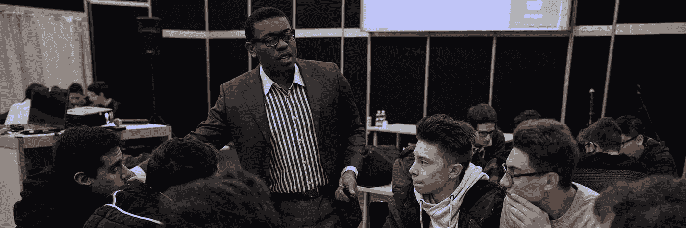
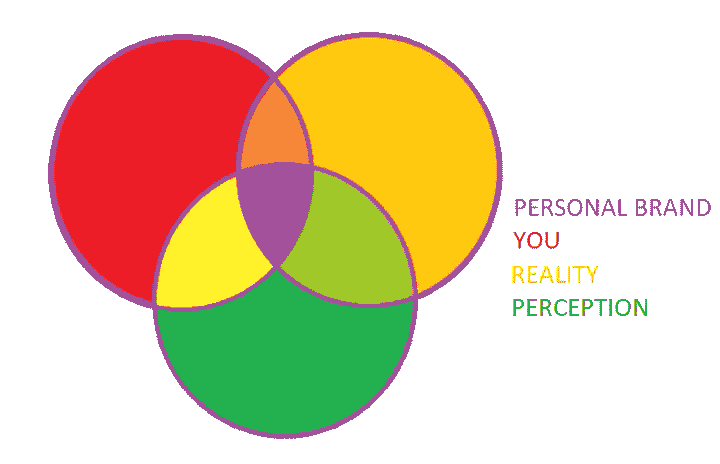
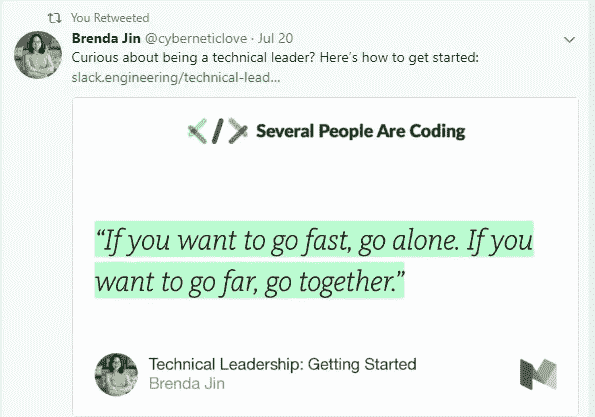
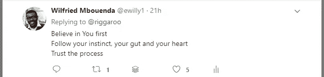

# 面向开发人员的个人品牌 101 {第 1 部分}

> 原文：<https://medium.com/hackernoon/personal-branding-101-for-developers-part-1-643d8ba42ace>

Android Sketching Workshop — Turin 2016

***免责声明:*** 本文中我将重点介绍 twitter。在以后的帖子中，我将介绍 linkedin 的[。](https://hackernoon.com/tagged/linkedin)

## 介绍

我决定为[开发者](https://hackernoon.com/tagged/developers)写一本简单实用的个人品牌指南。我将谈谈作为一名 Android 开发者，我现在正在做些什么来创建和提高我的个人品牌。我希望你能在这篇文章中找到有用的东西。

# 什么是个人品牌？

个人品牌是你身份的反映，它是现实、感知和你之间的交集。

你的身份是关于你真正的**为什么**和你的**核心价值观**。

你需要对你的**信息**，你的**为什么**保持一致和一致。

> 你相信什么？

我的回答是:

> 我相信一次经历、一篇博客、一本书、一次演讲、一句话或一个词可以永远改变人生。

让我告诉你一个故事。

> 2011 年，我在全职工作的同时接受了毕业的挑战。这很有趣，我通过创建一个[博客](http://mysc.altervista.org)来记录我的旅程。但是经过两年的努力学习和牺牲，我对完成我的硕士学位有些怀疑。我实际上有倦怠和精神抑郁。我试图寻找动力，重新站起来，继续我的挑战。我从我的虚拟导师那里找到了灵感([第四步:每天参与](https://medium.com/u/95c55dec121a#Firebase 学习者#咖啡爱好者和#电视节目迷
</blockquote><h1 id=)
> 
> [下一步是承诺参与 twitter 中的对话。这意味着每天发微博，大量转发，关注和回答。](https://medium.com/u/95c55dec121a#Firebase 学习者#咖啡爱好者和#电视节目迷
</blockquote><h1 id=)
> 
> ## [示例:](https://medium.com/u/95c55dec121a#Firebase 学习者#咖啡爱好者和#电视节目迷
</blockquote><h1 id=)
> 
> *   [我的一条推文:](https://medium.com/u/95c55dec121a#Firebase 学习者#咖啡爱好者和#电视节目迷
</blockquote><h1 id=)
> 
> *   [我的一条转发](https://medium.com/u/95c55dec121a#Firebase 学习者#咖啡爱好者和#电视节目迷
</blockquote><h1 id=)
> 
> 
> 
> *   [我的一个回答](https://medium.com/u/95c55dec121a#Firebase 学习者#咖啡爱好者和#电视节目迷
</blockquote><h1 id=)
> 
> 
> 
> *   [我喜欢的一条推特](https://medium.com/u/95c55dec121a#Firebase 学习者#咖啡爱好者和#电视节目迷
</blockquote><h1 id=)
> 
> # [额外收获:我在 twitter 上的工作流。](https://medium.com/u/95c55dec121a#Firebase 学习者#咖啡爱好者和#电视节目迷
</blockquote><h1 id=)
> 
> [我使用](https://medium.com/u/95c55dec121a#Firebase 学习者#咖啡爱好者和#电视节目迷
</blockquote><h1 id=) [feedly](https://feedly.com) 阅读 android 相关的博客文章，然后在我的 twitter 账户上发布最好的文章。
> 
> 如果你有一些在 twitter 上提升个人品牌的小技巧，你可以写在下面的评论里。
> 
> # 结论
> 
> 我认为发展个人品牌是一个漫长的旅程，而我才刚刚开始。我会做实验，我有时会犯错误，我会在过程中学习。
> 
> 这不是蓝图，这是我的过程。如果你还没有个人品牌，我邀请你以我为榜样创建一个。
> 
> {part 2}再见，在那之前**愿{code}与你同在**我的朋友！
> 
> [**记录我的安卓奇遇**](/@be.betr.codr/documenting-my-android-adventure-9352747910e6) ←之前
> 
> 接下来→ [**开发者个人品牌 101 {第二部分}**](/@be.betr.codr/personal-branding-101-for-developers-part-2-6822cb4410d6)
> 
> ## 非常感谢所有参与校对这篇文章的人！
> 
> **在你离开之前…** 如果你喜欢这篇文章，你会喜欢[订阅](http://eepurl.com/dcSFmz)我的时事通讯。获取我的备忘单:“ *Android Studio 键盘快捷键备忘单”。*
> 
> ## 资源:
> 
>  [## 关于如何扩大你的 Twitter 个人资料的 42 条专家建议
> 
> ### 有多少 Twitter 营销人员，就有多少不同的策略来增加 Twitter 的知名度。做什么…
> 
> follows.com](https://follows.com/blog/2017/09/expert-tips-grow-twitter)  [## 如何每天仅用 10 分钟在 Twitter 上发展你的个人品牌
> 
> ### 情况是这样的。你正在努力发展你的个人品牌，而 Twitter 是数字时代的一个必要组成部分…
> 
> marketingland.com](https://marketingland.com/how-to-grow-your-personal-brand-on-twitter-in-only-10-minutes-a-day-121514)  [## Twitter 生物创意增加你的追随者数量
> 
> ### 啊，Twitter:每个人最喜欢的角色-计数工头。如果你一直在使用这种最受限制的社交…
> 
> blog.hootsuite.com](https://blog.hootsuite.com/twitter-bio-ideas/)