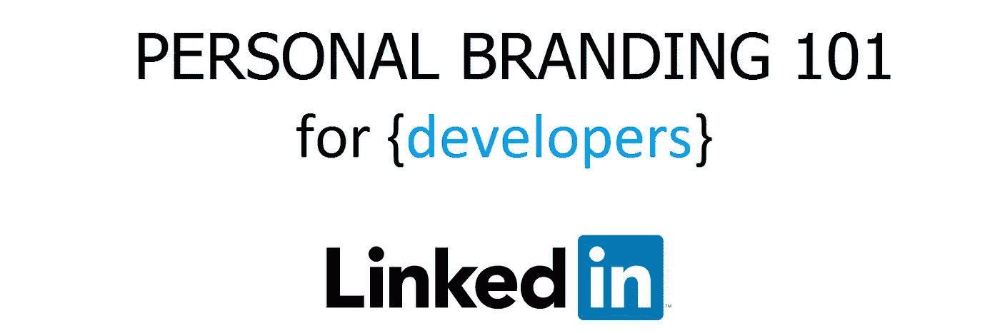
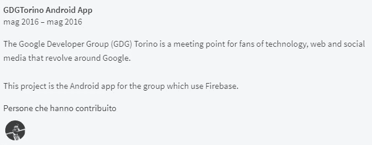
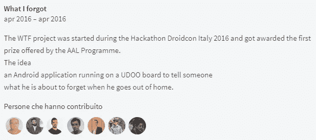
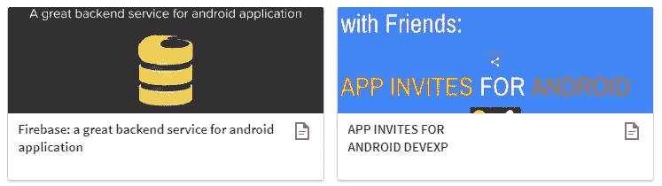
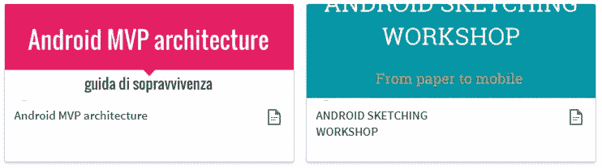
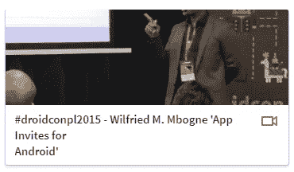
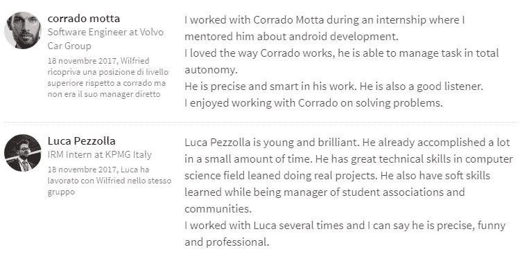
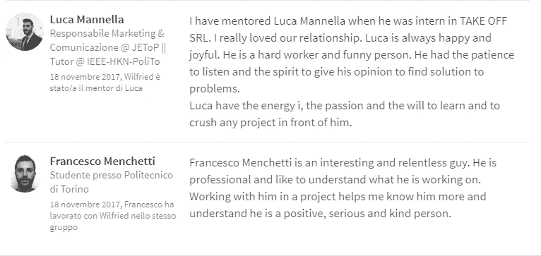
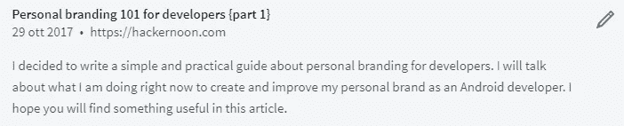

# 面向开发人员的个人品牌 101 {第 2 部分}

> 原文：<https://medium.com/hackernoon/personal-branding-101-for-developers-part-2-6822cb4410d6>

## 作为开发者如何在 LinkedIn 脱颖而出？

**免责声明**:在这篇文章中，我关注的是 [LinkedIn](https://hackernoon.com/tagged/linkedin) 。我将在接下来的文章中用 [Github](https://github.com) 讲述个人品牌。

这是我为[开发者](https://hackernoon.com/tagged/developers)写的关于个人品牌的系列博客文章的第二部分，告诉你我正在做什么来提高我的个人品牌。在上一篇[帖子](https://hackernoon.com/personal-branding-101-for-developers-part-1-643d8ba42ace)中，我定义了个人品牌，并展示了如何为你的个人品牌战略改善你的 Twitter 个人资料。现在我们来谈谈 LinkedIn。

LinkedIn 是四大和著名社交网络(脸书、推特、Instagram 和明显的 LinkedIn)中的专业社交网站

# 为什么你需要在 LinkedIn 上脱颖而出？

*   更好的工作机会
*   更多的客户，如果你是自由职业者
*   提高你在行业中的可信度

最重要的答案是:

> “你想成为这个充满噪音的世界里的一个信号。”

# 在 LinkedIn 上建立个人品牌的 4 个步骤

## 第一步:定制你的 LinkedIn 网址

通过自定义您的 URL，您可以轻松分享您的 LinkedIn 个人资料。这是最显而易见的事情。如果你还没有做，那就去做吧。下面是怎么做的:[https://www . LinkedIn . com/help/LinkedIn/answer/87/customizing-your-public-profile-URL](https://www.linkedin.com/help/linkedin/answer/87/customizing-your-public-profile-url?lang=en)

这是我的:[https://www.linkedin.com/in/mbouenda](https://www.linkedin.com/in/mbouenda/)

## 第二步:把你的工作经历变成一个故事

> 作为人类，我们都喜欢听故事来联系彼此。

让我们把一些工作经历写成引人入胜的故事，放在总结部分。

我是这样做的。

> 我在 2011 年开始了我的 Android 开发者生涯。在我的学士学位，我自学了如何使用书籍和谷歌搜索来开发 Android 应用程序。从那以后，我继续学习和成长。
> 
> 大三的时候，我帮忙改进了一个[家庭安全安卓应用](https://play.google.com/store/apps/details?id=com.androide_maze_mobile)快 2 年了。我学会了如何对一个 android 应用进行 QA 测试，如何调试以及如何添加功能。
> 
> 我的第二次经历是，我在一个团队中制作了一个令人惊叹的 Android 物联网中心: [Alyt](https://www.alyt.com) 。我从零开始学习如何将我的工程技能应用到一个真实的项目中。这是一次很棒的经历，我学到了更多关于 Android 操作系统、Api rest 设计和物联网的知识。
> 
> 在我的职业生涯中，我指导并教授初学者 Android 开发。
> 
> 我还为一家 android 应用程序中的初创公司做了一年的自由职业者，内容是关于信用卡折扣[menopecento](http://www.menopercento.com)。
> 
> 现在我是高级 Android 工程师和公共演讲人。我对 android 和技术有极大的热情，这就是为什么我总是学习和分享关于 android 开发的新技术和服务。我喜欢通过会议、聚会和博客与社区中的其他开发者交流！
> 
> 高级 Android 工程师:
> 
> 我设计并创建了一个[安卓应用](https://play.google.com/store/apps/details?id=com.willycode.bito)来保存都灵自行车共享服务 TOBIKE 最喜欢的自行车停放。
> 
> 公共演讲者:
> 
> 我喜欢在移动开发相关的会议上发言。我的主题包括 Android 开发、面向 Android 开发人员的 Google API 和 Firebase。

## 第三步:精心制作你的标题、照片和封面照片

对于这一步，我们将只使用上次中[的 Twitter 个人资料的内容。](https://hackernoon.com/personal-branding-101-for-developers-part-1-643d8ba42ace)

> 一致性是关键

## 第四步:举出你工作的例子

如果我们做了一些演示，一些项目或一些视频，这是展示和吹嘘的时候了。这一步是为了展示我们作为开发人员的工作。

我是这样做的:

我添加了我最近的两个项目

Projects

我添加了我过去演讲的幻灯片

我在一次会议上加了一段我的视频

Droidcon Poland 2015

# 一些额外工作:

## 写 LinkedIn 推荐

> 为了得到，你首先要付出。

我决定写 4 封推荐信。

## 出版物

Inception: the first part of this guide published in hackernoon website

如果你有一些在 Linkedin 上提高开发者个人品牌的小技巧，你可以写在下面的评论里。

# 结论

我认为发展个人品牌是一项持续的任务，我刚刚开始我的工作。我会做实验，我有时会犯错误，我会在过程中学习。

这不是蓝图，这是我的过程。如果你还没有个人品牌，我邀请你以我为榜样创建一个。

{part 3}再见，在那之前**愿{code}与你同在**我的朋友！

[**开发者个人品牌 101 { part 1 }**](https://hackernoon.com/personal-branding-101-for-developers-part-1-643d8ba42ace)←之前

接下来→ [**记录我的安卓冒险**](/@be.betr.codr/documenting-my-android-adventure-9352747910e6)

## 非常感谢所有参与校对这篇文章的人！

**在你离开之前…** 如果你喜欢这篇文章，你会喜欢[订阅](http://eepurl.com/dcSFmz)我的时事通讯。获取我的备忘单:“ *Android Studio 键盘快捷键备忘单”。*