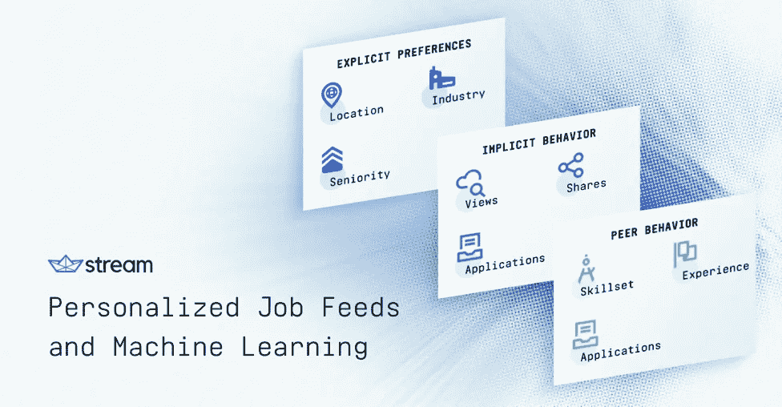
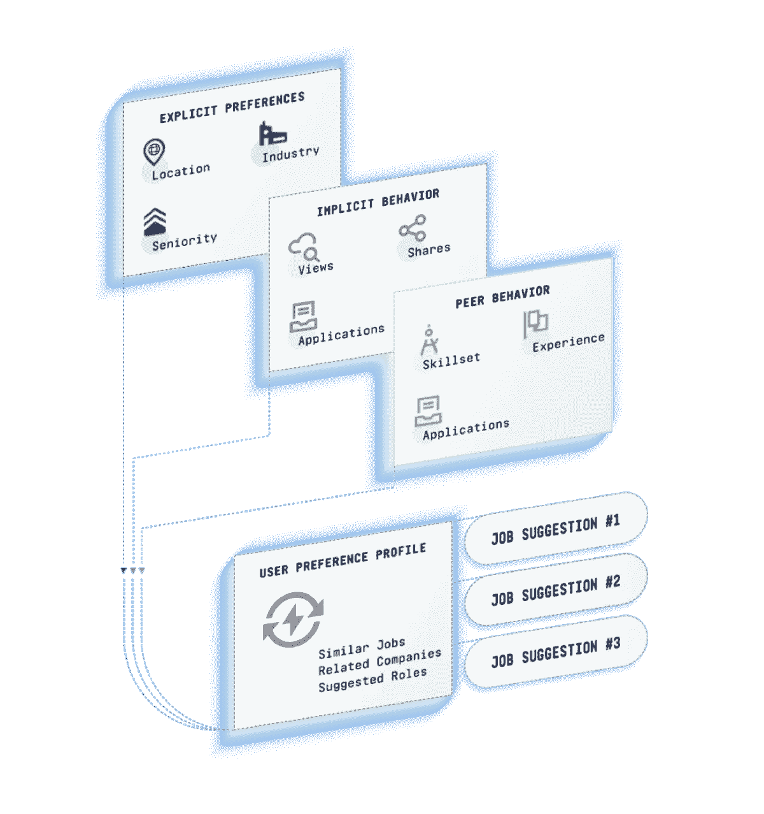

# 个性化工作源和机器学习

> 原文：<https://medium.com/hackernoon/personalized-job-feeds-and-machine-learning-3847ffb562dc>

工作网站的产品经理面临两个基本问题。第一，排名靠前的候选人找工作不积极，不好找，不好找。第二，顶级职位很快就会招满，通常会吸引网络中的候选人。因此，虽然你的网站上有优秀的候选人和很棒的工作，但很难在正确的时间将两者联系起来。

在整篇文章中，我们将解释如何利用由社交网络开创的个性化技术来改善求职者和工作之间的联系。虽然这项技术很复杂，但基本上可以归结为 4 个步骤。

## 步骤 1 —跟踪明确的用户偏好

首先，您需要存储所有显式的用户首选项。这包括位置、行业、资历、工资范围和职位等。例如，假设一个用户在 Boulder 搜索薪水超过 10 万美元的编程工作。用户输入此搜索参数后，您可以让他们能够跟踪或保存搜索。虽然这是创建个性化作业提要的良好起点，但设置过滤器是一项繁重的工作，大多数用户群不会花时间来配置它们。这就是为什么跟踪隐含的用户意图(或步骤 2)如此重要。

## 第二步——追踪隐含的用户意图

你的工作网站上有许多“事件”,可以很好地洞察用户的偏好。常见的例子包括:

*   点击工作列表
*   保存工作
*   打开雇主档案
*   申请工作
*   点击电子邮件中的工作

这些事件中的每一个都表明了意图，并提供了给定用户对什么感兴趣的线索。随着时间的推移，你会了解到某个用户经常查看苹果公司的空缺职位，或者他/她可能正在寻找专注于某种编程语言的职位。这些小事件累积起来，让你可以创建一个关于给定用户兴趣的档案。

## 步骤 3 —利用网络

提供最相关工作的另一种方式是利用用户群的其余部分来改进工作推荐。查找具有相似标准的用户，并查看他们正在查看和申请的职位。基于用户的工作历史(头衔、公司、地点)以及用户行为，可以使用许多相关性。

## 步骤 4——反馈回路

结合这三种技术将会创造一个强大的反馈回路。每次用户访问你的应用程序，你就能更多地了解他们的兴趣，从而改进你的工作推荐。即使是消极的求职者，如果他们偶尔打开你的摘要邮件，也会不断得到更好的推荐。这些定制的推荐鼓励人们回到你的网站，进一步提高你的推荐质量。可以想象，这种反馈循环极大地提高了用户参与度。

## 使用个性化工作推荐和推荐系统提高用户参与度

向求职者展示工作建议有几种方式。显而易见的是在你的应用主页上显示一个单独的 feed。另一种方法是每周一次的电子邮件摘要，里面有推荐的工作。

大多数产品负责人都在不断寻找提高用户参与度、增加用户在应用上花费的时间以及重新参与的方法。一封包含有趣和相关工作的邮件不仅可以提醒求职者返回 app，还可以让被动的求职者保持兴趣。参与度(打开、点击等。)也会被跟踪并输入到引擎中，从而进一步优化搜索结果。

## 机器学习和反馈的力量

我谈到的这个引擎利用了机器学习，使你能够建立、训练和调整一个旨在预测个人用户兴趣的模型。这种技术是由 Youtube、Instagram 和脸书等社交网络开创的。Instagram 的 discovery feed 和 Quora 的 digest email 是机器学习的两个很好的例子。每次你使用 Quora 或 Instagram，推荐都会变得更有针对性。

想象一下，呈现给用户的工作列表会变得越来越相关——在用户不知情的情况下，将他们感兴趣的东西拼凑在一起。突然，完美的工作出现在顶端，结合了他们所寻找的一切，给了他们成长的空间，但也吸取了他们经验中最好的部分，使他们成为理想的候选人。个性化给求职网站提供了一个很好的机会，通过更好地理解用户的兴趣来建立竞争优势。

在内部构建这些个性化订阅源可能是一项艰巨的挑战。它需要大规模饲料储存、分析跟踪和机器学习方面的专业知识。这对许多公司来说是极其昂贵的。 [Stream](https://getstream.io/) 提供个性化的 feed 技术即服务。我们的 API 被 500 多家公司和 2 亿终端用户使用。[安排一次演示](https://getstream.io/demo/)，与我们的产品专家交流，了解个性化订阅如何增强您的应用。

> 这是由 GetStream.io 的数据科学家 Balazs Horanyi 领导的 GetStream.io 团队的合作。原始博文可在[https://getstream . io/blog/personalized-job-feeds-machine-learning/](https://getstream.io/blog/personalized-job-feeds-machine-learning/)找到