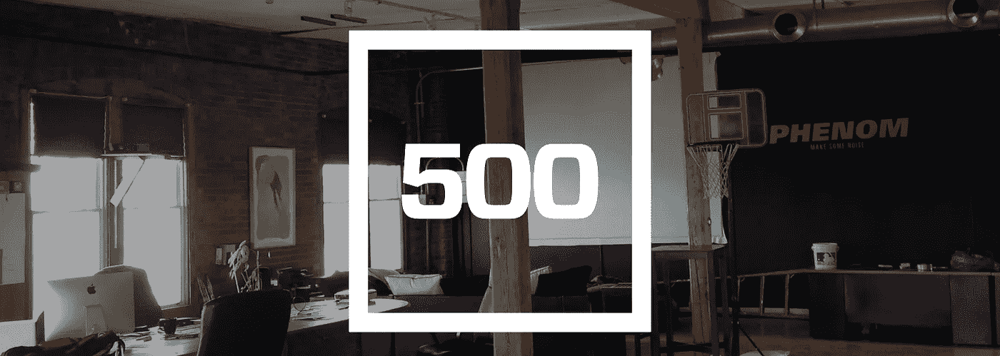
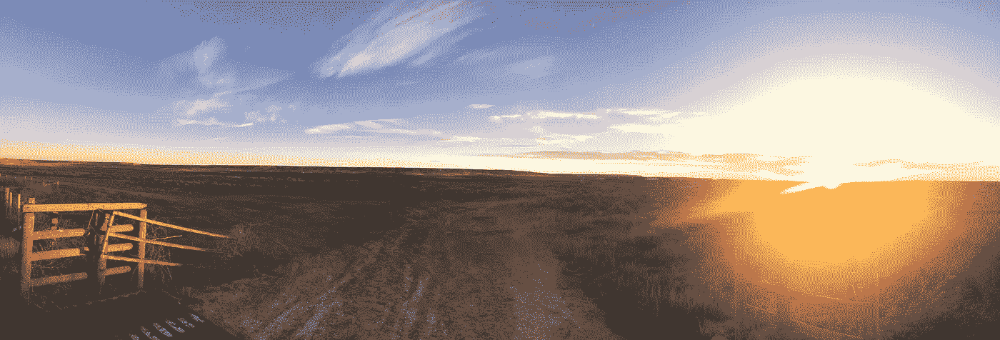
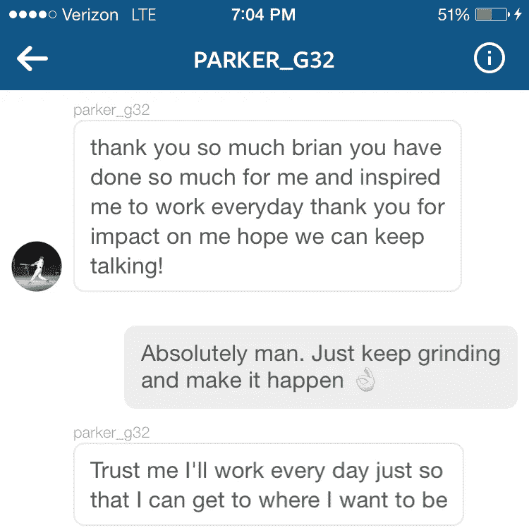
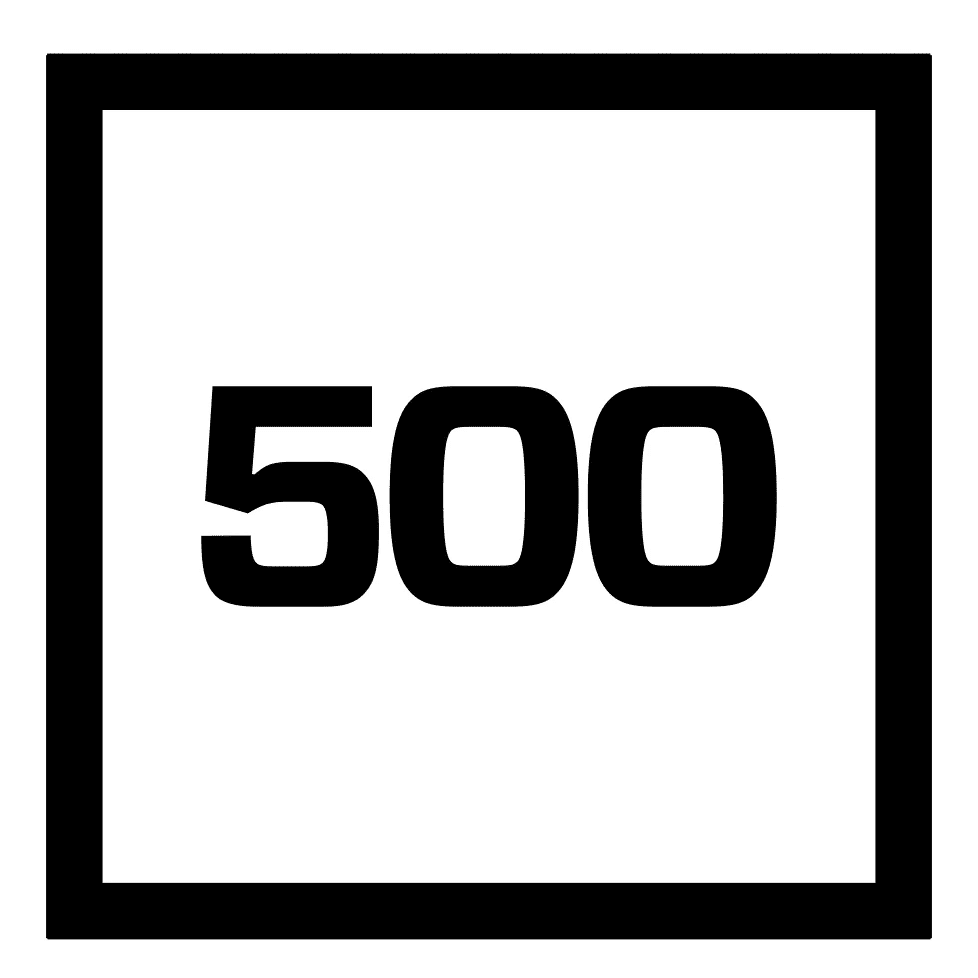

# Phenom，一家 500 家创业公司

> 原文：<https://medium.com/hackernoon/phenom-a-500-startups-company-ba232c37c3db>

在写这篇文章的时候，我发现事情总是会回到原点，这很有趣。五年前，我在克利夫兰机场遇到了一个非常聪明的人，他叫罗杰·塞兰特博士。罗杰在私营部门有着辉煌的职业生涯，最近，他成为了克里夫兰自己的[凯斯西储大学福勒可持续价值中心](https://weatherhead.case.edu/centers/fowler/)的执行董事。在与罗杰交谈时，他对我说，“布莱恩，一旦你能回答三个简单的问题，你就知道你准备好了；*这是为什么？为什么是我们？为什么是现在？*那时我还是个孩子，并不真正理解他的意思，但在商业和生活中，我相信“为什么”有很大的力量。我们为什么要做我们正在做的事情？作为团队的一员，为什么会要求我完成某项任务？说到最近的一个现象，我们为什么要从家乡克利夫兰搬到旧金山呢？

要成为最好的，你必须和最好的人一起比赛。身在克利夫兰一直是我们故事的重要组成部分。我们的梦想是在我们的家乡开创消费技术的先例，但我们需要一个新的挑战。我想成为一名更好的企业家和首席执行官，作为一家[公司](https://hackernoon.com/tagged/company)，我希望我们能与世界上最好的公司竞争，所以我们收拾好我的本田思域和我的狗 Maggie，开车穿越这个国家，开始了我们一生中最具挑战性，但也是最令人兴奋的时期之一。

The Continental Divide

作为企业家，我们最大的缺点之一就是把事情过于复杂化。几乎所有事情都有一个花哨的术语，甚至我发现自己有时在谈论诸如 KPI(关键性能指标)、拐点和产品迭代之类的事情时也会感到内疚；坦白地说(请原谅我的语言)，没人在乎，包括我自己。归根结底，我们衡量成功的方式应该非常简单。*“你创造的是人们真正关心的产品或体验吗？”如果答案是肯定的，那么其他的事情最终会自己解决；你的数字会很好看，投资者会很高兴，在真正的资本主义精神下，你会赚很多钱。*

在 Phenom，这个难以捉摸的*“为什么”*从未如此清晰。Phenom 在这里给所有运动员一个地方，简单地讲述他们未经过滤的故事。

我的一个同事总是对我说，*“布莱恩，你真的很爱我们的用户。”我当然明白，但我不确定他是否真的明白原因。*

由于社交媒体的力量，以及人类比以往任何时候都更容易接近，我有幸每天与世界各地数百名年轻运动员接触。我最感兴趣的是，每个运动员都有自己独特的故事要讲述。在成名之前，在我生命的大部分时间里，我只是一个孩子，碰巧是一个高于平均水平的棒球运动员。我很幸运能在大学打球，在我生命的前 22 年里，作为一名运动员是我人生中最重要的一部分。当我们从童年走向成年时，我们经常会忘记作为一个孩子是什么样的，我们从追求我们的梦想中获得的兴奋，无论是大是小，都成为遥远的记忆。

当我每天与我们的用户互动时，我意识到运动对全世界的年轻运动员有多么重要；体育的力量没有边界。

作为专业人士，我们都渴望回到童年，即使只是一瞬间。听到和阅读我们的用户故事是令人振奋和鼓舞的，最重要的是，让我回到了小时候和父亲在前院玩接球游戏的时候(谢谢爸爸妈妈——爱你们俩)。

技术经常被误解，对于我们父母和祖父母这一代人来说，有时它太令人困惑了。讲述一个故事没有什么过于复杂的。这让我兴奋不已，也让我夜不能寐。

话不多说，我代表我们整个团队，无比自豪地宣布 [Phenom](https://itunes.apple.com/us/app/phenom/id687226814) 是全球顶级加速器计划之一的[***【www.500.co】***](http://500.co/)500 Startups Batch 16 的成员。

500 Startups

通过加入# 500 大家庭，我们现在是代表 50 多个国家的 1500 多家公司、3000 多名企业家组成的全球社区的一员。

最重要的是，我们的信念得到了验证。冒险进入未知领域往往令人恐惧，但我们是来赢的，而且是大赢。

*不是打架的狗的大小，是打架的狗的大小。*

最后，我代表迈克和我，来自俄亥俄州克利夫兰的几个孩子，感谢所有相信我们和我们梦想的人。

我们是现象级的，我们是来这里制造一些噪音的。

[在 iOS 应用商店下载 Phenom。](https://itunes.apple.com/us/app/phenom/id687226814)

> [黑客中午](http://bit.ly/Hackernoon)是黑客如何开始他们的下午。我们是 [@AMI](http://bit.ly/atAMIatAMI) 家庭的一员。我们现在[接受投稿](http://bit.ly/hackernoonsubmission)并乐意[讨论广告&赞助](mailto:partners@amipublications.com)机会。
> 
> 如果你喜欢这个故事，我们推荐你阅读我们的[最新科技故事](http://bit.ly/hackernoonlatestt)和[趋势科技故事](https://hackernoon.com/trending)。直到下一次，不要把世界的现实想当然！

