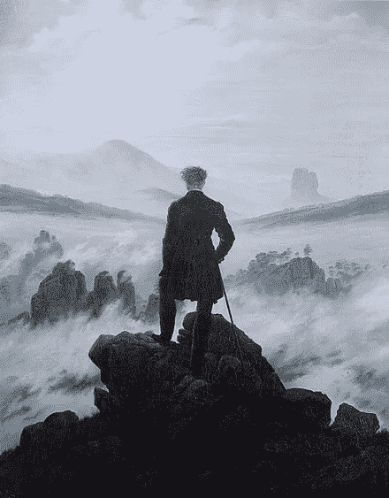

# 技术升华

> 原文：<https://medium.com/hackernoon/philosophical-thoughts-technological-sublime-fad52a9918c8>

Friedrich Wilhelm Joseph Schelling

我们可能处于一种技术崇高的状态:对新的数字技术既着迷又敬畏，但也恐惧和仇恨。

在 19 世纪英国工业革命之前，自然也激发了类似的东西:迷人而诱人的敬畏，但也有恐惧。当人类在工业革命中获得对自然更多的控制时，这种情况就消失了。

我们对社交和性方面的数字媒体感到敬畏，也对它带来的新奇娱乐感到敬畏，这些娱乐让我们着迷和平静。但对一些人来说，这可能是以被虐待为代价的。对一些人来说，情感和性依恋驱使他们大量使用我们的设备。有些人可能害怕新的数字媒体控制我们的行为、禁锢我们、命令我们使用它的能力。

我们正处于技术的巅峰。

我写了一本关于数字成瘾的书。现在购买从 [*巴诺*](https://www.barnesandnoble.com/w/trapped-in-the-web-an-turner/1129986845) *或*[*indie bound*](https://www.indiebound.org/book/9781732182196)*。*