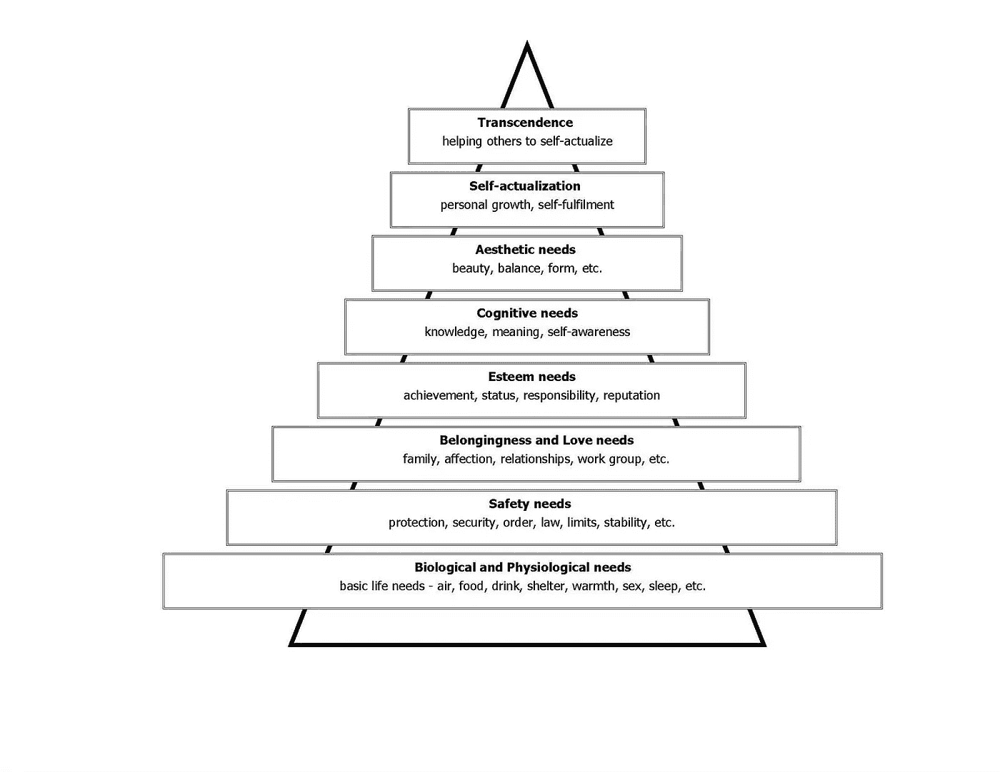

# 可扩展性的理念

> 原文：<https://medium.com/hackernoon/philosophy-of-scalability-275168846779>

人们普遍认为可伸缩性是一种有利可图的追求。规模扩大是否有道德上的必要性？

可伸缩性是系统、流程或平台处理大量用户负载的能力。在商业中，该术语通常指企业满足不断增长的需求的能力。

当然，一个企业家是否应该把目标放在扩大业务上的最终决定权在他们手中。让我们讨论一下企业家在评估他们的行动时必须考虑的关键因素。

可伸缩性可以从两个角度来考察——经济角度，或者伦理和哲学角度。企业变得可扩展的最常见的经济原因是增加利润率，容纳更多的用户，以及基本上最大化他们的增长潜力。这吸引了风险投资者和天使投资者，从而进一步促进了企业的发展。

然而，一些企业家可能有其他动机，可能不希望增长。许多年轻的科技企业家追求他们的事业，纯粹是因为能够做他们喜欢的工作赚钱。

这些企业家可能会选择停止产品线，终止客户支持，甚至关闭业务。[企业家](https://hackernoon.com/tagged/entrepreneur)可以自由选择如何利用他们的时间吗？

在一个完美的个人主义世界里，企业家会有这种选择的自由。然而，他们现在已经开始创业了。这不仅仅是他们的事。这是关于他们的产品对社会和环境的影响。任何体面的企业都在社会中发挥作用，因此有义务以社会的最大利益行事。所有初创企业都有社会责任，作为创始人，企业家的目标应该只是增强或维持现有的社会平衡。

> 企业家的目标应该仅仅是提高或维持现有的社会平衡。

# **业务种类**

根据 Society3 创始人阿克塞尔·舒尔茨的说法，企业可以分为两类:

> **为您和您的家人服务的企业。你开始做自己的老板，赚更多的钱，享受经营自己公司的声望，而你显然很好地服务了你的客户。**
> 
> **为他人服务的生意。当你对如何让世界变得更美好有一个宏伟的愿景时，你就开始了这项事业。你关心这个星球和居住在这个星球上的所有人类的福祉。只要你的企业保持可持续发展，你就不用太担心钱会进入你的口袋。**

Maslow’s Hierarchy of Needs

根据马斯洛的需求层次理论，一个企业家开始第一类业务的目的是满足自尊、归属感、安全感，在某些情况下，还有成长的生理阶段。对于这些企业来说，可伸缩性是绝对可选的。

然而，如果一个企业家开始了第二种类型的生意，他们可能会实现最高形式的成长-超越和自我实现。通过生意，他们回馈社会，同时找到了他们真正的目标。该企业的产品和服务是有影响力的，颠覆性的，可以单枪匹马地解决人类面临的一些问题。

这样的业务不可扩展有意义吗？让我们通过一个示例场景来探究这一点。

我们每天都面临的最大问题之一是通勤。考虑一个发明家和企业家(让我们称他为 Nelson ),他发现了这个机会，并着手创建一个新颖的传送系统。Nelson 为这项技术申请了专利，然后通过他的初创公司 WormHooli Inc .将其商业化。他充分意识到 WormHooli 目前还不具备可扩展性。WormHooli 产品显然非常实用和强大，所以市场上对它有巨大的需求。尼尔森以先到先得的方式出售 WormHooli 的所有产品。现在，尼尔森想去读研究生，追寻他童年时成为动物学家的梦想。如果他选择这条路，他将只能支持当前用户负载所需的基础设施。尼尔森要么出于自身利益去读研，要么负责任地采取措施让 WormHooli 更具可扩展性。

通过只让早期的人获得技术，尼尔森基本上抵消了社会平衡。WormHooli 给了一部分人(用户)比世界上其他人更大的优势。该产品被广泛宣传，但潜在客户被不公平地拒绝，只是因为纳尔逊选择用他的时间做其他事情。仅仅因为他们来参加聚会太晚，或者他们不是尼尔森的朋友，就没有机会获得产品的支持，这对他们公平吗？这就是伦理困境所在。

> WormHooli 给了一部分人(用户)比世界上其他人更大的优势。

这一切都归结于影响。影响取决于三个密切相关的因素:

1.  **使能**:它在多大程度上改变了一个人的生活？产品价值的函数(x)及其影响范围(o)，即它能改变多少人的生活。
2.  **技术性**:技术上有多复杂，概念上有多强？产品价值(x)的函数。
3.  **人气**:社会的兴趣。产品价值(x)和时间(t)的函数。

*   例 1: CandyCrush。

*低支持度*低技术性*高受欢迎度=低影响*

CandyCrush 的生产商 King 没有令人信服的道德理由让他们的产品具有可扩展性。该产品不会显著改变人们的生活，因此不会影响社会平衡。

*   例子 2: AirBnB。

*高支持度*低技术性*高人气=中等影响力*

虽然 AirBnB 的概念对社会有很高的影响，但产品本身没有义务单枪匹马地解决所有人的临时住房问题。由于产品技术性不高，类似 Wimdu 这样的点播房源平台很容易替代。因此，AirBnB 可以安全地停止扩展，而不会破坏社会平衡。

*   例 3: WormHooli(虚构)。

高支持度*高技术性*高知名度=高影响力。

这是一种变革性的技术。这不仅仅是对我们日常生活的一点小小的改进，而是对一种更新更简单的生活方式的一种帮助。它具有很高的技术复杂性——甚至可能获得专利——并且不能被其他公司复制。如果关于产品潜力和实现的信息被有效地传播，社会对它的兴趣显然会非常高。所有这些构成了一个高影响力产品的总体。这种产品有扩大规模的道德责任。

> 一句话:如果一个产品没有很大的影响力，那么它就不会在很大程度上造福社会，企业也不必觉得有义务扩大规模。

有些人可能会说，发明家、工程师和企业家不能因为他们的创造给社会带来的所有危害而受到指责。当后果与创造本身有关时，这是正确的。技术本身是中性的，它的用途只能由它在社会中的表现来决定。

物理学家奥托·哈恩没有预言他的发现——核裂变会被用于曼哈顿计划。蒂姆·伯纳斯·李绝不会想到有一天，他的发明——互联网，会被用来分享小猫视频和湿漉漉的迷因。杰罗姆·拉维兹在他的著作《科学知识及其社会问题》中声称，一个发明家不可能完全逃避对其工作的所有责任。他们也许可以合法地逃避，但是真的有 100%道德上的逃避吗？

许多科技博客都主张年轻的专业人士在创业时不要考虑可扩展性。很多时候，潜在的创业者被鼓励去创业，只是为了追求金钱收益、个人快乐和骄傲。虽然这三个因素都很重要，但企业的道德责任似乎没有被提及。这是一种高度危险的宣传。这些倡导者是否认为即将到来的创业公司不够有影响力，以至于他们需要可扩展？或者，也许他们意识到了，但完全接受这样一个事实:有影响力但不可扩展的产品会抵消社会平衡。

# **过度使用的后果**

看似无辜的决定往往会导致可怕的后果。尽管选择退出可伸缩性看起来是一种相当中立的行为，但这是非常危险的。无知永远不是借口。

> 任何没有经过批判性思考和全面评估的选择都有可能被认为是不道德的。

## **超人现象**

到目前为止，技术让我们变得更有效率、联系更紧密、信息更灵通。获取最具影响力的技术主要取决于我们的个人货币储备。如果有资金，他们可以购买一项技术，让自己变得更超人一点。这就是[资本主义](https://en.wikipedia.org/wiki/Price_system)，它不是最理想的，但也是相当合理的。

> 不合理的是由于没有更多的单元可供购买而导致的访问被抢劫。消费者被禁止购买该产品，不管他们愿意为此支付多少钱。

在这种情况下，技术提供的支持是无法购买的，因此没有货币价值，有点像天生的超人能力。现在，所有拥有该产品的人本质上都是超人(想想大脑解码器、电动外骨骼、智能数据分析器)。这些超人会根据自己的判断使用产品——以对社会其他人有利或不利的方式。这反过来又需要一些节制和政府监管。不可扩展的技术是有偏见的不平等的主要驱动因素。

## **稀缺市场**

事实上，在社会系统中引入稀缺性会导致一种非常不受欢迎的帕累托最优。人类在创造[非零和](http://cs.stanford.edu/people/eroberts/courses/soco/projects/1998-99/game-theory/nonzero.html)交易方面取得了飞跃，也就是说，参与交易的每个人都从交易中受益。这是一个双赢的局面。

> 目标是实现普遍的非零和，为此的关键要求是[消除稀缺性](https://en.wikipedia.org/wiki/Post-scarcity_economy)。

不可扩展的企业恰恰相反。它们引入了稀缺性——通常是以一种加速的方式——围绕着稀缺性建立了一个市场，商品可以以极高的价格进行交易。早期的产品采用者将能够通过有限的产品单位基本上垄断这个稀缺的市场。高需求会为产品设定一个适当的高价格，那些少数早期采用者可以利用这一事实，因为他们首先得到了产品。

这种类型的动态——创造稀缺商品，然后以市场设定的荒谬价格进行交易——将人类带回到适者生存的概念适用的根源。

人类正试图建立一个资源无限、人人平等享用的世界。从本质上来说，技术稀缺逆转了开源社区——广义而言，互联网——在创造非零和社会方面所做的努力。这阻碍了我们正常的进化和进步。

*很有可能存在更多不相称访问的后果。请随意探索这些途径并通知我。*

# **你的企业在更广泛的社会中应该扮演什么角色？**

Milton Friedman 在他的著名文章 [*中指出，企业的社会责任是增加利润*](http://umich.edu/~thecore/doc/Friedman.pdf) 认为企业的唯一目的是创造利润，而组织本身只是一个法律虚构，由企业高管组成，他们是股东的奴隶。尽管他清楚地表明，公司在创造利润的同时必须参与公平的实践，但他的教导在自由市场经济中被广泛误解，并为许多公司和制造商提供了剥削劳动力、过度使用自然资源、无情污染环境和从事动物试验的余地。

> 弗里德曼的教导在自由市场经济中被广泛误解，并为许多公司和制造商提供了剥削劳动力、过度使用自然资源、无情污染环境和从事动物试验的余地。

道德缺失的教义解释所推动的掺假资本主义是中产阶级萎缩的原因之一，所有财富都永远积累在最顶层 1%的人手中。

在他支持企业社会不负责任的论点中，弗里德曼没有承认大多数投资者根本没有考虑他们投资的公司的道德指南针。人们很容易认为这是糟糕借口的结果，比如没有足够的时间或不想花精力研究每一项潜在投资。

虽然这是一个主要原因，但大多数投资者在购买该公司的大量股票之前甚至无法获得这些数据。当投资者盲目地在黑暗中游泳时，我们期望他们做出符合他们道德的完美决策吗？他们不知情。即使他们愿意花费时间、资源和努力来建议他们自己这些组织的社会环境政策，他们也无法做出明智的选择。

***我们需要公开透明*** *。*我们需要执行 [ESG 标准](http://www.socialfunds.com/news/print.cgi?sfArticleId=2425) s，目前已有的指数(如 [DJSI](https://en.wikipedia.org/wiki/Dow_Jones_Sustainability_Indices) 、 [FTSE4Good 指数](https://en.wikipedia.org/wiki/FTSE4Good_Index)、 [MSCI ESG 指数](https://www.msci.com/esg-integration))本身就带有主观性。这些需要被标准化并变得更加可靠。

最后，许多投资者从事投资活动仅仅是为了获得丰厚的回报——金钱。人是不复杂的，利己的。

赞同弗里德曼的思想，即社会环境责任的重量可以转移到投资者身上，是相当不现实的。弗里德曼的观点是，企业不能被视为有道德和责任的人。我认为公司是一群拥有共同追求的人——商业。

> 一个公司可以被想象成一个集体的头脑，它的价值观是通过不同观点的聚合而发展起来的。

这意味着公司必须有价值观和责任，通常这些价值观和责任在理论上应该与社会的最大利益相一致。因此，企业应该履行重要的义务，与投资者共同承担社会责任。

***感谢击中*💙如果你喜欢这篇文章。**

*可伸缩性的* [*哲学*](https://hackernoon.com/tagged/philosophy) *的第 2 部分深入探讨了围绕社会资本、关于决策和内心平静的东方原则、亚当·斯密的看不见的手理论、比特币和道德市场创造的讨论。敬请期待！*

非常感谢丹尼尔·戈德堡对早期草稿的惊人评论。

> [黑客中午](http://bit.ly/Hackernoon)是黑客如何开始他们的下午。我们是 AMI 家庭的一员。我们现在[接受投稿](http://bit.ly/hackernoonsubmission)并乐意[讨论广告&赞助](mailto:partners@amipublications.com)机会。
> 
> 如果你喜欢这个故事，我们推荐你阅读我们的[最新科技故事](http://bit.ly/hackernoonlatestt)和[趋势科技故事](https://hackernoon.com/trending)。直到下一次，不要把世界的现实想当然！

