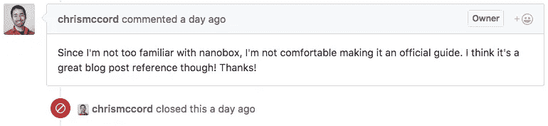

# 使用 Nanobox 部署 Phoenix 应用程序

> 原文：<https://medium.com/hackernoon/phoenix-application-deployment-with-nanobox-1d2274f061e5>


这篇文章最初是 Phoenix 文档的 [pull 请求](https://github.com/phoenixframework/phoenix/pull/2220)，但是最终被拒绝(原因我完全同意):



按照 Chris McCord 的建议，我把它变成了一篇博客文章，希望对 Elixir/Phoenix 社区有益。

本指南的目标是向您展示如何使用 [Nanobox](https://nanobox.io/) 将 Phoenix 应用程序部署到生产环境中。

*(警告，无耻插前方)*

为什么选择 Nanobox？实际上有两个原因。

我是 Nanobox 的工程师，自然要推广。但真的，不止如此。我真的相信 Nanobox 是开发和部署任何应用程序的最简单的方法。

Nanobox 允许应用程序开发人员部署他们自己的应用程序，消除了对 DevOps 的需求，或者实现了自动化，或者你想怎么称呼它都行。Nanobox 会为您做这件事，所以您不必这么做。

*(/不要脸的塞)*

# 在开始之前

要开始，你只需要三样东西:

*   菲尼克斯应用程序
*   Nanobox 桌面(Nanobox CLI 工具)
*   托管账户

从技术上讲，您甚至不需要 Erlang、Elixir 或 Phoenix，但是很可能您已经安装了它们。

*注意:所有“nanobox”命令都是从应用程序的根目录运行的。*

## 菲尼克斯应用程序

如果您需要部署应用程序，您可以使用这些“快速入门”之一:

*   nanobox-phoenix —一个普通的 phoenix 应用程序，带有一个随时可用的 PostgreSQL 数据库。
*   [nanobox-Phoenix-example](https://github.com/nanobox-quickstarts/nanobox-phoenix-example)—一个 Phoenix“Todo”应用程序，具有 PostgreSQL 数据库和基本的 CRUD 操作。

您也可以按照 Nanobox [从头开始](https://guides.nanobox.io/elixir/phoenix/from-scratch/)指南或 Phoenix [启动和运行指南](http://www.phoenixframework.org/docs/up-and-running)创建新的应用程序。

## Nanobox 桌面

如果你是第一次使用 Nanobox，[创建一个免费的 Nanobox 帐户](https://dashboard.nanobox.io/users/register)和[下载并安装 Nanobox 桌面](https://dashboard.nanobox.io/download)。

## 提供商帐户

你需要的最后一件事是一个像亚马逊 AWS 或 DigitalOcean 这样的托管帐户，你将把它与你的 Nanobox 帐户关联起来。Nanobox 经常向列表中添加更多的提供者，所以如果您没有看到自己的提供者，或者您没有使用一个提供者，您也可以创建自己的集成。

*Doc:* [*连接你的账号到你的主机*](https://docs.nanobox.io/providers/hosting-accounts/)

*Doc:* [*创建自定义提供者*](https://docs.nanobox.io/providers/create/)

# 入门指南

使用 Nanobox 部署应用程序有四个步骤:

*   [在 Nanobox 上创建应用](#cc58)
*   [配置您的项目](#1fc6)
*   准备你的申请(可选)
*   [链接并部署到生产](#d356)

# 创建 Nanobox 应用程序

新的应用程序是通过 Nanobox 仪表板创建的。在此过程中，系统会提示您命名应用程序，并选择您希望应用程序驻留的主机和区域。

*Doc:* [*启动新应用*](https://docs.nanobox.io/workflow/launch-app/)

# 配置您的项目

配置您的应用程序运行 Nanobox 有两个步骤:

*   [box file . yml](#0541)
*   [环境变量](#fdf4)

## boxfile.yml

Nanobox 使用一个名为 boxfile.yml 的简单配置文件来提供开发和生产环境。在项目的根目录下创建一个`boxfile.yml`,如下所示:

```
run.config:# elixir runtime
  engine: elixir# ensure inotify exists for hot-code reloading
  dev_packages:
    - nodejs
    - inotify-tools# cache node_modules
  cache_dirs:
    - node_modules# add node_module bins to the $PATH
  extra_path_dirs:
    - node_modules/.bin# enable the filesystem watcher
  fs_watch: true# deployment options
deploy.config:# generate the static assets digest
  extra_steps:
    - mix phoenix.digest# migrate the database just before the new process comes online
  before_live:
    web.main:
      - mix ecto.create --quiet
      - mix ecto.migrate# add a postgres data component
data.db:
  image: nanobox/postgresql# add a web component with a start command
web.main:
  start: node-start mix phoenix.server
```

此时，如果您愿意，可以使用`nanobox run`来提供本地开发环境。一旦启动，你可以在`run`命令给出的 IP 地址查看你的应用，或者[用`dns add`命令生成一个 dns 别名](https://docs.nanobox.io/cli/dns/):

```
$ nanobox dns add local nanobox-phoenix.dev
```

现在访问您的应用程序，网址为 [nanobox-phoenix.dev](https://nanobox-phoenix.dev/)

*Doc:*[*box file . yml*](https://docs.nanobox.io/boxfile/)

## 环境变量

Nanobox 使用环境变量(evars)来保持某些信息的秘密。要使用 evars，您需要对您的应用程序进行一些修改。

首先，通过将密钥添加到`config/prod.exs`中，从 Nanobox evars 而不是`config/prod.secret.exs`中加载密钥:

```
config :nanobox_phoenix, NanoboxPhoenix.Endpoint,
  http: [port: 8080],
  url: [host: "example.com", port: 80],
  cache_static_manifest: "priv/static/manifest.json",
  secret_key_base: System.get_env("SECRET_KEY_BASE")
```

*注:您可以使用* `*mix phoenix.gen.secret*` *为您的应用生成一个密钥。*

接下来，向`config/prod.exs`添加一个生产数据库配置:

```
# Configure your database
config :nanobox_phoenix, NanoboxPhoenix.Repo,
  adapter: Ecto.Adapters.Postgres,
  username: System.get_env("DATA_DB_USER"),
  password: System.get_env("DATA_DB_PASS"),
  hostname: System.get_env("DATA_DB_HOST"),
  database: "nanobox_phoenix",
  pool_size: 20
```

*注意:如果您计划在本地开发或运行您的应用程序，您将需要使用与上面相同的* `*username*` *、* `*password*` *和* `*hostname*` *evars 来更新您的* `*/config/dev.exs*` *和* `*/config/test.exs*` *。*

Nanobox 为您生成了`DATA_DB_USER`、`DATA_DB_PASS`和`DATA_DB_HOST` evars，但是您需要手动添加一个`SECRET_KEY_BASE`和任何其他您想要的 evars。

使用`evar add`命令添加开发和分级 evars:

```
$ nanobox evar add local KEY=VALUE
$ nanobox evar add dry-run KEY=VALUE
```

*注:生产 evars 通过 Nanobox 仪表板添加。*

一旦你添加了所有的 evars，在你的`/config/prod.exs`中注释掉`import_config “prod.secret.exs"`行:

*Doc:* [*环境变量*](https://docs.nanobox.io/app-config/environment-variables/)

# 准备您的申请(可选)

您可以使用`dry-run`命令在本地进行生产部署。**虽然这一步是可选的，但强烈推荐**。

```
$ nanobox deploy dry-run
```

与`nanobox run`一样，您可以使用`dry-run`命令给出的 IP 访问您的应用程序，或者使用`dns add`命令生成一个 dns 别名:

```
$ nanobox dns add dry-run nanobox-phoenix.stage
```

现在尝试在 [nanobox-phoenix.stage](http://nanobox-phoenix.stage/) 访问你的应用

*Doc:* [*预览你的 app*](https://docs.nanobox.io/workflow/deploy-code/#preview-locally)

# 链接并部署到生产环境

您需要做的最后一件事是将您的代码库链接到您在本指南开始时创建的应用程序。

*注意:第一次尝试链接应用程序时，会要求您使用 Nanobox 凭据登录。*

```
$ nanobox remote add [app-name]
$ nanobox deploy
```

就是这样！

*Doc:*[添加遥控器](https://docs.nanobox.io/workflow/deploy-code/#add-your-live-app-as-a-remote)

# 重要链接

*   [完整的文档](https://docs.nanobox.io/)
*   [完整指南](https://guides.nanobox.io/)
*   [完成仙丹/凤凰指南](https://guides.nanobox.io/elixir)
*   [加入我们的 Slack 团队](https://slack.nanoapp.io/)
*   [下载 Nanobox 桌面](https://dashboard.nanobox.io/download)
*   [故障排除](https://docs.nanobox.io/trbl/)

[](http://bit.ly/HackernoonFB)[](https://goo.gl/k7XYbx)[](https://goo.gl/4ofytp)

> 黑客中午是黑客如何开始他们的下午。我们是这个家庭的一员。我们现在[接受投稿](http://bit.ly/hackernoonsubmission)并乐意[讨论广告&赞助](mailto:partners@amipublications.com)机会。
> 
> 如果你喜欢这个故事，我们推荐你阅读我们的[最新科技故事](http://bit.ly/hackernoonlatestt)和[趋势科技故事](https://hackernoon.com/trending)。直到下一次，不要把世界的现实想当然！

