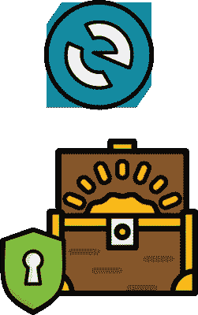
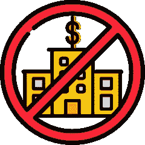
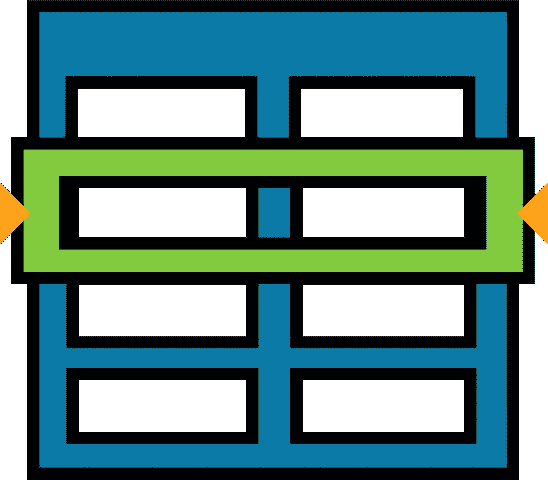
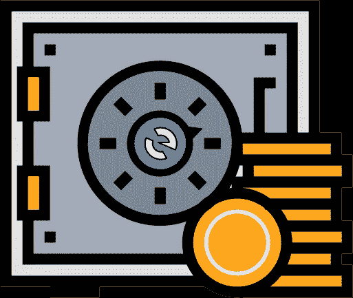
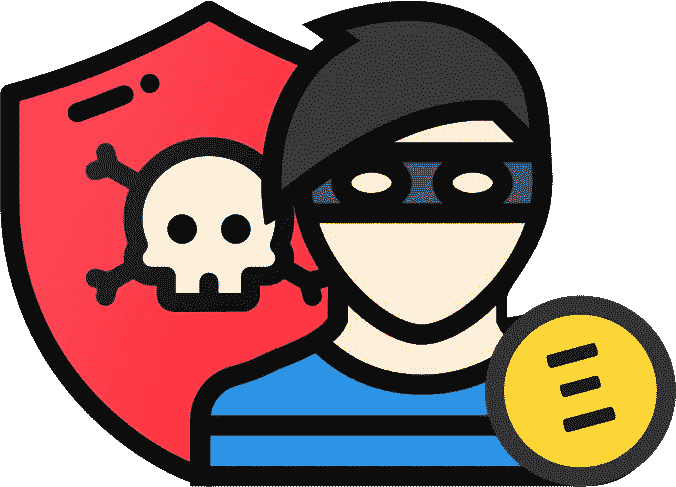
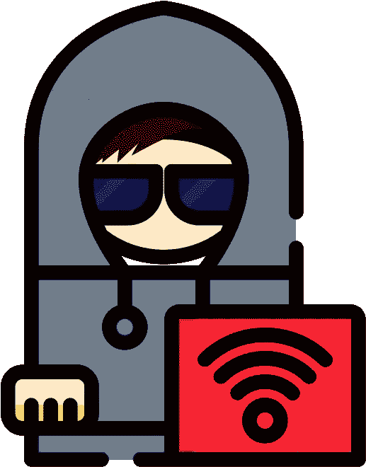

# 防范网络钓鱼&使用 MyEtherWallet 时确保安全

> 原文：<https://medium.com/hackernoon/phuck-phishing-be-secure-while-using-myetherwallet-93691775c0d6>

意识到不断试图窃取您的数字资产的互联网攻击变得越来越重要。遵循一些安全措施并保持谨慎可以避免这种情况。

本文由提供的关于 MyEtherWallet.com 的信息组成，以接触到更广泛的受众。阅读此内容，并通过自己键入地址来打开 myetherwallet.com。

*   为了您自身的安全，请花些时间了解这一点。🙏
*   如果你不注意这些警告，你的资金将被盗。

***什么是 MEW？***

*   MyEtherWallet 是一个免费的、开源的客户端界面。
*   MEW 允许您直接与区块链互动，同时完全控制您的钥匙和资金。
*   你并且只有你对你的安全负责。
*   如果您访问了一个钓鱼网站或丢失了您的私钥，MEW 将无法收回您的资金或冻结您的帐户。

# 我的钱包不是银行

*   当你在银行或交易所开户时，他们会在他们的系统中为你创建一个账户。
*   银行会记录你的个人信息、账户密码、余额、交易以及最终你的钱。
*   银行收取费用来管理你的账户和提供服务，比如当你的卡被盗时退款。
*   银行允许你写支票或从你的借记卡中扣款来汇款，上网查询余额，重置密码，如果你丢失了一张新的借记卡。
*   你在银行或交易所有一个账户*，他们决定你可以汇多少钱，汇往哪里，以及可疑存款保留多长时间。都是收费的。*

> 关注我的 [Twitter](https://twitter.com/confusedcoin) 关于加密货币&区块链的更新。

# MyEtherWallet 是一个接口

*   当您在 MyEtherWallet 上创建帐户时，您会生成一组密码:您的私钥和公钥(地址)。
*   对密钥的处理完全发生在你的计算机上，在你的浏览器中。
*   我们绝不会传输、接收或存储您的私钥、密码或其他帐户信息。
*   我们不收取交易费。
*   你只是使用我们的界面直接与区块链互动。
*   如果你把你的*公钥(地址)*发给某人，他们可以给你发送 ETH 或者令牌。👍
*   ***如果你把你的私钥发给某个人，他现在就完全控制了你的账户*** 。👎

# 等等，WTF 是区块链？

*   区块链就像一个巨大的、全球化的、分散的电子表格。
*   它记录了谁向谁发送了多少硬币，以及每个账户的余额。
*   它由全球成千上万拥有特殊计算机的人(矿工)储存和维护。
*   区块链中的块由从 MyEtherWallet、MetaMask、Exodus、Mist、Geth、Parity 和其他地方发送的所有单个事务组成。
*   当你在 MyEtherWallet.com 上看到你的余额或在 [etherscan.io](https://etherscan.io/) 上查看你的交易时，你看到的是区块链上的数据，而不是我们个人系统中的数据。
*   再次声明:我的钱包不是银行。

# 你为什么让我读这些？

因为你要明白我的钱包不能…

*   访问您的帐户或发送您的资金。
*   恢复或更改您的私钥。
*   恢复或重置您的密码。
*   冲销、取消或退款交易。
*   冻结账户。

你并且只有你对你的安全负责。

*   请注意保管好您的私钥和密码。您的私钥有时被称为您的助记短语、密钥库文件、UTC 文件、JSON 文件、钱包文件。
*   如果你的私人钥匙或密码丢失了，没有人能找回它。
*   如果您在钓鱼网站上输入您的私人密钥，您的所有资金都会被取走。

# 如果我的 therWallet 做不到那些事，那还有什么意义？

*   因为那是*放权*和*区块链*的点。
*   当你想转移你的资金时，你不必依赖你的银行、政府或其他任何人。
*   你不必依赖交易所或银行的安全来保证你的资金安全。
*   如果你不觉得这些东西有价值，问问你自己为什么认为*区块链*和*加密货币*有价值。😉
*   如果你不喜欢这个声音，可以考虑使用[比特币基地](https://www.coinbase.com/join/5922da0103b62e7e9e6b9df8)或者[区块链. info](https://blockchain.info/wallet/#/signup) 。他们有更多熟悉的用户名和密码的账户。
*   如果你害怕但又想用 MEW，[弄个硬件钱包](https://myetherwallet.github.io/knowledge-base/hardware-wallets/hardware-wallet-recommendations.html)！这些可以保护你的钥匙。

# 如何保护自己免受网络钓鱼者的攻击

网络钓鱼者会向您发送一封邮件，其中包含一个网站链接，该网站看起来就像 MyEtherWallet、EtherDelta、Paypal 或您的银行，但不是真正的网站。他们窃取你的信息，然后偷你的钱。

*   使用 [EAL](https://chrome.google.com/webstore/detail/etheraddresslookup/pdknmigbbbhmllnmgdfalmedcmcefdfn) 或[元掩码](https://myetherwallet.github.io/knowledge-base/migration/moving-from-private-key-to-metamask.html) Chrome 扩展来阻止恶意网站。
*   经常查看网址:`[https://www.myetherwallet.com](https://www.myetherwallet.com.)` [。](https://www.myetherwallet.com.)
*   始终确保地址栏中的`MYETHERWALLET LLC [US]`为绿色。
*   不要相信通过电子邮件、Slack、Reddit、Twitter 等随机发送给你的消息或链接。
*   在输入信息之前，请始终直接导航到某个网站。请不要在单击消息或电子邮件中的链接后输入信息。
*   [安装广告拦截器](https://chrome.google.com/webstore/detail/ublock-origin/cjpalhdlnbpafiamejdnhcphjbkeiagm?hl=en)，不要点击你搜索引擎(如谷歌)上的广告。

# 如何保护自己免受诈骗

人们会试图让你无偿给他们钱。

*   如果它好得令人难以置信，它很可能是真的。
*   在给某人或某个项目寄钱之前先做研究。在各种网站和论坛上寻找信息。要警惕。
*   当你不明白或觉得不对劲时，就问问题。
*   不要让恐惧、FUD 或 FOMO 战胜常识。如果事情非常紧急，问自己“为什么？”。可能是为了创造 FOMO 或者阻止你做研究。

# 如何保护自己不受损失

如果您丢失了您的私钥或密码，它就永远消失了。别弄丢了。

*   备份您的私钥和密码。不要只是把它存储在你的电脑上。将其打印在一张纸上或保存到 USB 驱动器上。
*   将此纸张或 USB 驱动器存储在不同的物理位置。如果备份和你的笔记本电脑一起被火灾或洪水毁坏了，它就没有用了。
*   不要在 Dropbox、Google Drive 或其他云存储中存储您的私钥。如果那个账户被攻破，你的资金就会被盗。
*   ***如果你有超过 1 周的支付价值的加密货币，买一个硬件钱包。没有借口。值了。我保证。***

[更多安全提示！](https://myetherwallet.github.io/knowledge-base/getting-started/protecting-yourself-and-your-funds.html)

# 好吧，我不想再教训你了！

抱歉变成这样。向前！

*   [获得一个硬件钱包](https://myetherwallet.github.io/knowledge-base/hardware-wallets/hardware-wallet-recommendations.html)
*   [如何设置 MEW + MetaMask](https://myetherwallet.github.io/knowledge-base/migration/moving-from-private-key-to-metamask.html)
*   [如何离线/本地运行 MEW](https://myetherwallet.github.io/knowledge-base/offline/running-myetherwallet-locally.html)
*   [如何通过账本硬件钱包发送](https://myetherwallet.github.io/knowledge-base/migration/moving-from-private-key-to-ledger-hardware-wallet.html)
*   [如何通过 TREZOR 硬件钱包发送](https://myetherwallet.github.io/knowledge-base/hardware-wallets/trezor-sending-to-trezor-device.html)
*   [如何通过元掩码发送](https://myetherwallet.github.io/knowledge-base/migration/moving-from-private-key-to-metamask.html)
*   [了解更多信息或联系我的钱包](https://myetherwallet.github.io/knowledge-base/)

如果你觉得这篇文章有用，请按以下地址留下任何金额的小费:

*   BTC:1p 8 zce 4 vubczd 4 evcvfxytyj 9 HP 1 gbe 38 f
*   ETH:0xc 347018 dbfcffba 91872635 AC 4 CFC 0521359 a 420