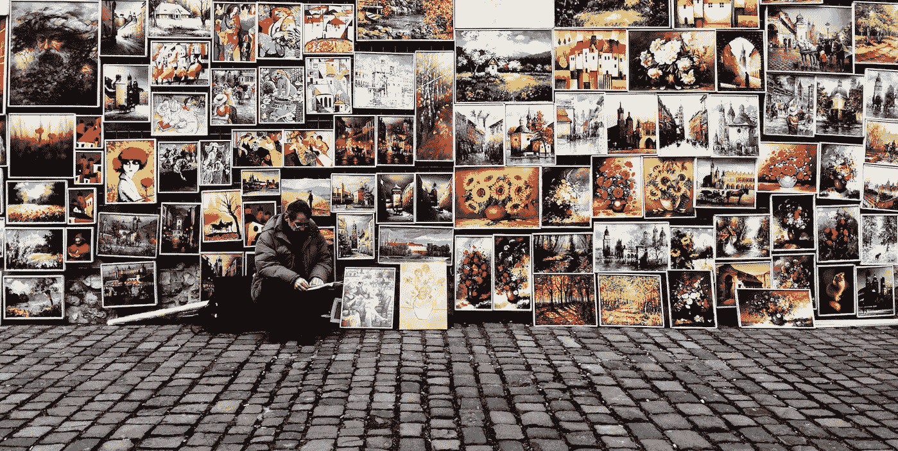
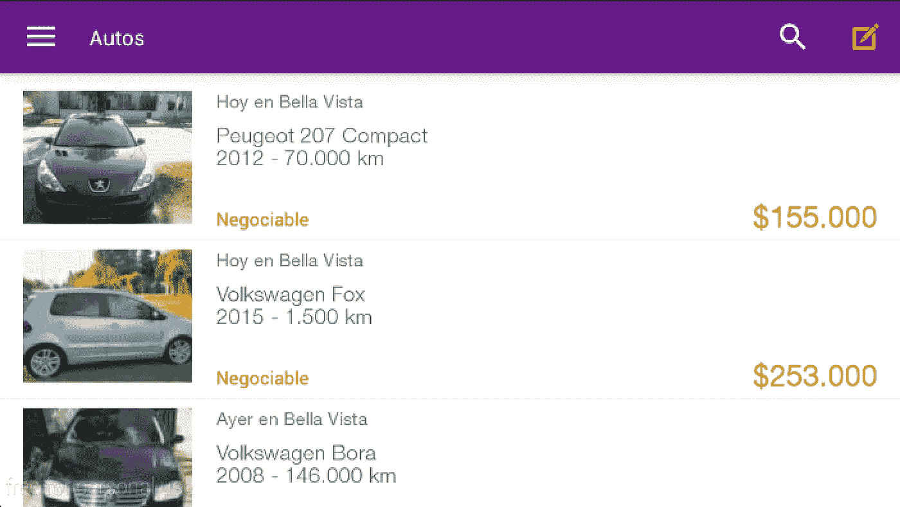
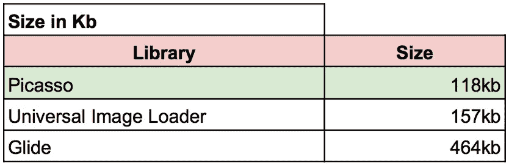
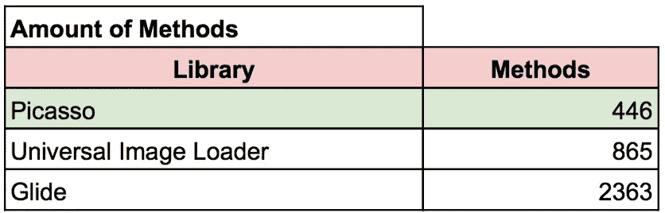
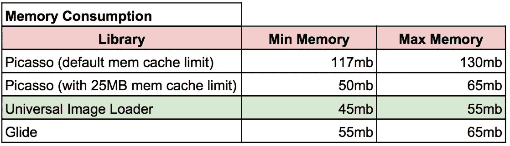

# 毕加索，通用图像加载器还是 Glide？这就是问题所在

> 原文：<https://medium.com/hackernoon/picasso-universal-image-loader-or-glide-that-s-the-question-af34fa7f5e63>

Original picture: [https://unsplash.com/photos/-6mZyblCys4](https://unsplash.com/photos/-6mZyblCys4)

每当我开始一个新的 Android 项目或在现有项目上工作时，我都会想我应该使用哪个图片库。

我不得不承认，我已经在这些库之间进行了一些比较，以了解它们的性能，但我还没有找到任何真正令我满意的基准。这就是为什么我决定在[毕加索](https://github.com/square/picasso)、[通用图像加载器](https://github.com/nostra13/Android-Universal-Image-Loader)和[滑翔](https://github.com/square/picasso)之间做自己的比较。

*注:也许你会奇怪为什么* [*壁画*](https://github.com/facebook/fresco) *(脸书提供的选项)不在我的选项之内。该库使用自己的自定义视图来显示图像(称为付款人)，因此，您应该使用它来代替 ImageView。因为我在一个现有的项目中运行这个测试，并且完全重构它不是一个选项(因为付款人的事情)，我不能选择它作为赢家。特别是，如果我还能从其他三个人那里得到非常好的结果。对不起壁画迷和脸书！*

# 我对比了什么？

内存和 CPU 消耗、方法数量(由于 65k 方法限制)、[联网](https://hackernoon.com/tagged/networking)、大小和实现的难易程度。

# **我考的怎么样？**

我有一个包含图片的 200 个元素的列表。图像(180 x 135 px)没有重复，它们是在第一次运行时从服务器加载的。我上下滚动列表三次，测量网络、CPU 和内存的使用情况。

这个想法是以“开箱即用”的方式使用每个库。对于通用图像加载器，我必须手动设置内存和磁盘上的缓存，对于内存基准，我使用 Picasso 的默认内存缓存限制和 25 mb 的自定义限制。

This is a part of the listing that was scrolled during the test.

# 给我看看结果！

Size in kilobytes of each JAR. The winner is Picasso.

Measured with [Dexcount Gradle Plugin by KeepSafe](https://github.com/KeepSafe/dexcount-gradle-plugin). The winner is Picasso.

Measured from Android Studio. The winner is Universal Image Loader.

**网络和 CPU** 呢？在这两个方面没有明显的差异。

还有…那么**实现**的难易程度呢？嗯，都很好用。**通用图像加载器**在使用之前需要**a**多几行(比如说多 4 行)和其他竞争对手一样。关于**毕加索**，虽然**很好用，但是**我发现**很容易产生内存泄漏**在其他人没有这种问题的情况下。关于 **Glide** ，我没有什么要补充的，它**开箱后就很好用。**

# **那么，我学到了什么？**

我可以说，上面提到的所有库都很棒，真的让图像在 Android 上的使用变得很容易。谢谢你们。

我建议如下:

*   **已有项目**:我推荐**通用图像加载器**(或者改用它)，因为它的定制化，内存消耗低，方法和大小平衡好。
*   **小项目**:我会选择**滑翔**。我真的很喜欢它的简单实现，我代码中的 Picasso 实现有内存泄漏，Glide 没有(也不是通用图像加载器)。
*   **目前使用毕加索？我认为如果你确定没有内存泄漏，并且你能控制使用多少缓存内存，这是可以的。**
*   还有……壁画！？嗯，据我所知，这是一个非常好的图书馆。如果我不得不从头开始一个项目，我会尝试一下。

你喜欢你读到的东西吗？(通过点击❤按钮)推荐这个故事，这样其他人就可以看到它了！
你也可以在推特上反应 [@santihollmann](http://www.twitter.com/santihollmann)

> [黑客中午](http://bit.ly/Hackernoon)是黑客如何开始他们的下午。我们是 [@AMI](http://bit.ly/atAMIatAMI) 家庭的一员。我们现在[正在接受投稿](http://bit.ly/hackernoonsubmission)并乐意[讨论广告&赞助](mailto:partners@amipublications.com)机会。
> 
> 如果你喜欢这个故事，我们推荐你阅读我们的[最新科技故事](http://bit.ly/hackernoonlatestt)和[趋势科技故事](https://hackernoon.com/trending)。直到下一次，不要把世界的现实想当然！

