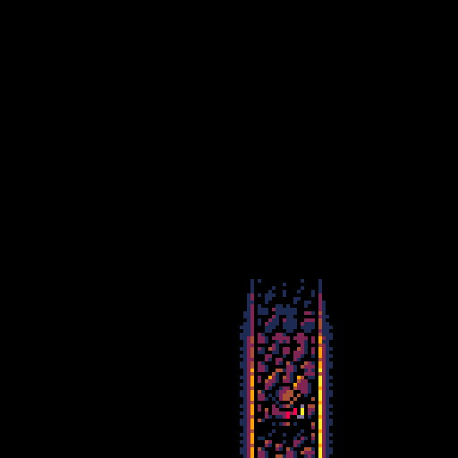
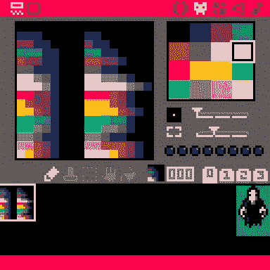
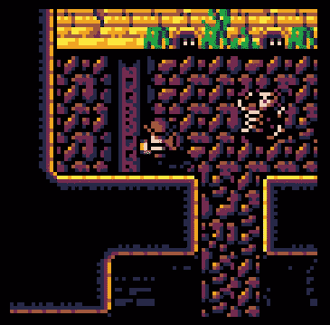
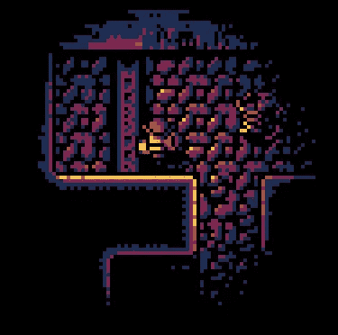
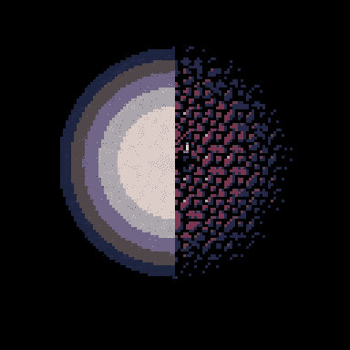
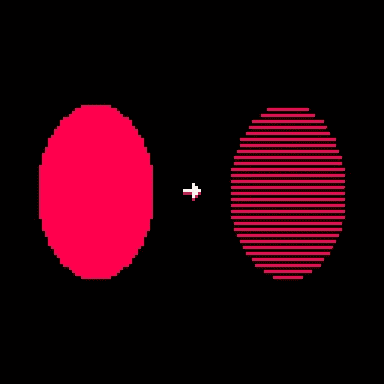
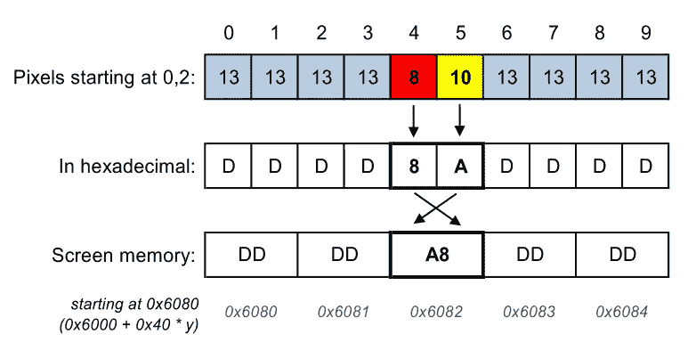

# 手工照明#1:细黑线

> 原文：<https://medium.com/hackernoon/pico-8-lighting-part-1-thin-dark-line-8ea15d21fed7>

## 皮科-8

两周前，我对在微型幻想控制台 [PICO-8](http://www.lexaloffle.com/pico-8.php) 上进行某种形式的实时照明的想法产生了兴趣。我想我会摆弄它一段时间，并决定它不可能在弱小的模拟 CPU 上，但这被证明是错误的——[PICO-8](https://hackernoon.com/tagged/pico-8)毕竟被证明是一个相当强大的机器！从事这项工作是如此有趣，以至于我无法停止推动它，添加新功能并优化它背后的引擎，直到我达到这一点:



我已经为此工作了很长一段时间，并愉快地在推特上发布了它，慢慢地将这个引擎变成了一个[游戏](https://krajzeg.itch.io/dank-tomb)。然而，我最近让它以 60 FPS 运行，并开始得到一些令人不安的响应。

And I’m all out of fairy dust.

决心证明我不是一个女巫，我决定以[弹药筒](http://www.lexaloffle.com/bbs/?tid=28785)的形式发布魔法印加…代码，以及这些完全科学且完全不深奥的关于其工作原理的解释。

这里的一些东西将非常特定于引擎，而其他技术将有望更加通用，并适用于您想要大量优化的任何一段 PICO-8 代码。我试图保持帖子的可访问性，但我必须假设自己对[十六进制表示法](https://www.khanacademy.org/math/algebra-home/alg-intro-to-algebra/algebra-alternate-number-bases/v/hexadecimal-number-system)和[位运算](https://en.wikipedia.org/wiki/Bitwise_operation)有些熟悉，只是为了将已经膨胀的字数保持在一个合理的水平。

## 当你只有一个调色板时，一切都是钉子

在现代游戏中，光照是由着色器在 GPU 上完成的，着色器具有 24 位色彩空间和每像素进行大量计算的能力。在 PICO-8 上，事情更离奇一些——任何与操纵颜色有关的事情通常都可以归结为一件事:**调色板效果**将 16 种颜色映射到不同的颜色。这是做基本淡入淡出的方法，灯光效果只是更复杂的淡入淡出。我们不是将所有像素均匀地向黑色移动相同的量，而是根据亮度来选择这个量。


Palette: The Darkening

因此，我们知道我们的效果的基础将是设置几个调色板——每个调色板对应一个我们支持的照明等级。对于*阴湿的坟墓*，调色板#1 基本上是一个什么也不做的调色板，因为它代表“全亮”。然后，我们有一些中间调色板，每个调色板中的颜色逐渐变暗。最后一个调色板将用于完全无光的区域——该调色板将每种颜色映射为黑色。

我选择了六个照明级别，包括全亮度和全黑。每增加一个照明级别都是一个显著的性能提升——所以选择 6 作为最佳点。调色板保存在 sprite 内存中，并在初始化期间从其中读取—这样它们便于编辑，并且很容易看出什么颜色应该放在哪里才能正常工作。



The palettes (left-side for lighting, right side for fades)

## 选项，选项

使用这些调色板时，基本上有两种选择:

1.  对于每一个要画的东西，首先设置正确的调色板(基于它是如何被照亮的)，然后画它。
2.  首先绘制完全照亮的一切，然后操纵屏幕上的像素来应用灯光效果。

第一种选择看起来更有吸引力，因为这正是 PICO-8 通过`pal()`函数支持的。这种想法的问题是，光照水平的变化发生在对象的中间——所以我们要么不能让它看起来很正确(每个对象只支持一个光照水平)，要么我们必须用达到拜占庭复杂程度的遮罩/剪裁设置多次绘制每个对象。让我们甚至不去想需要什么来处理背景— `map()`当每块瓷砖的灯光都改变一次时，肯定是不行的。

我们只剩下第二种选择，相比之下，它简单得令人耳目一新。我们像平常一样先画出所有的东西，充分享受使用`map()`和`spr()`的乐趣。一旦我们完成了这些，我们就操纵屏幕上的每个像素来应用正确的调色板。



Before and after applying the filter

## 关于划分、征服和转移话题

在我们深入编码之前，有必要花点时间考虑一下我们的过滤器是如何工作的。作为一个核心概念，它将是一系列以光为中心的同心圆盘——随着我们远离中心，每个圆盘应用更暗的照明水平。



编写代码一下子做到这一点有点令人生畏，但是每个复杂的任务都可以分解成简单的任务。在图形[编程](https://hackernoon.com/tagged/programming)中，有一个处理复杂形状的标准方法——将它们分解成**条水平线**。画一条水平线很简单，所以我们可以集中精力在一个紧凑的循环中实现我们想要的任何效果。与此同时，复杂的计算，包括确定在哪里画线，可以在一个单独的地方完成。



这就是引擎的工作方式，本系列的第 1 部分将集中于尽可能快地淡化一条水平线，将可怕的细节留到以后的文章中讨论。这里我将主要使用伪代码——对于实际的、最终的代码，请在插件中查找`fl_blend()`函数。

## 如果你想把它做好，就自己动手

在我进入三个完整段落的一般编程原则之前，我们决定在将所有东西都绘制到屏幕上之后，应用我们的效果*。*

这种方法的问题是内置的 PICO-8 对调色板的支持不能帮助我们。如果我们有一个像`spr()`一样工作的函数，但是从屏幕内存中复制数据，我们可以使用它——但是，唉，没有这样的东西。我们真不幸。

这意味着我们必须手动完成所有工作。调色板只是将一种颜色的像素替换为一种新的颜色，因此应用调色板的简单方法如下:

```
**for each x, y we want to change:**
  local pixel = pget(x, y)
  local mapped_pixel = palette[pixel]
  pset(x, y, mapped_pixel)
```

这非常简单，就像大多数琐碎的算法一样，非常慢。以这种方式对超过 32x32 的区域应用效果已经让我们丢帧了。这是因为`pset()`和`pget()`有很多额外的工作要做:他们必须裁剪坐标，应用相机位置，他们还必须处理一件额外的事情——我现在将更详细地解释这一点，因为这也将是我们解决问题背后的想法。

## 走向极端:PICO-8 屏幕内存

PICO-8 模拟了一个老式的计算系统。我们的像素不存在于通过 200MB 驱动程序访问的独立 GPU 卡上的匿名屏幕缓冲纹理中。相反，它们只是在我们模拟的 [RAM](http://pico-8.wikia.com/wiki/Memory) 中的地址 0x6000 处冷却，等待被直接操纵。

由于 PICO-8 只有 16 种颜色可用，16*16=256，我们虚拟硬件的设计者做出了明智的决定，在每个内存字节中存储两个像素。每个屏幕行的长度为 64 个字节，每个字节存储两个像素，如下所示:byte =(左像素)+ 16 *(右像素)。看起来是这样的:



How it all fits (artist’s impression)

这意味着`pset()`有它的工作要做——它不仅处理剪辑/相机/调色板，它实际上必须进入正确的字节，并且只处理它的一半。这就是为什么它被模拟得非常慢的部分原因，也是为什么如果 PICO-8 是真正的硅，它会很慢。

## 偷看和抬头

幸运的是，我们可以避免`pset()`所做的所有额外工作——我们可以在那个东西上疯狂科学家，直接操纵屏幕内存！由于超快的`peek()`和`poke()`功能，这变得很容易。

如果我们仔细想想，我们的过滤器没有理由一次只能处理一个像素。调色板基本上是一个 16 条目的表格，上面写着:对于颜色 X，使用颜色 Y。我们可以创建一个类似的表，但是有 256 个条目。这样，每个条目可以处理包含两个像素的整个字节(就像上面图像中代表红黄对的`A8`),并同时对两者应用调色板，返回一个具有两种新颜色的新字节。

这是一种非常通用的技术，称为查找表，通过预先计算结果并在运行时在表中查找，可以加速各种效果。

一旦我们在初始化期间根据 sprite 内存中的调色板准备好查找表，解决方案的第一个草图应该是这样的:

```
local start = calculate_address(x1, y)
local end = calculate_address(x2, y)
for address = start, end do
  poke(address, lookup[peek(address)])
end
```

这比`pset()`快多了，但是因为我们是疯狂的科学家，我们不想要快——我们想要疯狂的快！

## 做更多的工作，做更少的工作

就像以前一样，上面的一行程序有一个隐藏了大量额外工作的地方:`lookup[…]`是一个秘密的性能猪。

在像 C 这样的编译语言中，数组只是连续内存块。访问元素很简单:只需获取数组的地址，加上索引(乘以元素大小)，瞧！

在 Lua 中，表结构必须处理从简单数组到复杂嵌套对象的一切。我们知道我们的查找表只有整数作为索引，这并不重要。就 Lua 而言，我们可以在任何时候改变主意，比如说`lookup[“banana”] = “cucumber”`毁了它的一天。这意味着 Lua 不能像 C 一样使用简单的数组表示，而是依赖较慢的哈希表。

作为疯狂的科学家，我们该怎么办？疯狂科学家总是做的事情——我们自己实现它！为了方便起见，PICO-8 内存映射中保留了一大块内存，从 0x4300 开始。如果我们将查找表保存在内存中，我们可以用`peek(tableaddr+index)`替换`lookup[index]`，这样会快得多。

但是我们可以做得更好！我们的表正好有 256 字节长，所以如果我们把它们保持在“圆形”(0x？？00)地址，我们可以不用使用按位“或”(PICO-8 上的`bor()`)来代替加法，利用这个运算更快的优势。

说了这么多，做了这么多，我们的循环现在看起来是这样的:

```
for screenaddr=start,end do
  poke(screenaddr, 
    peek(**bor(lutaddr,peek(screenaddr))**)
  )
end
```

*看起来确实不像是一个进步*，但这不是第一次优化让事情变得丑陋。

## 排除万难

我们的过滤器工作在可笑的速度，但像往常一样，还有一个问题。屏幕坐标就像人一样——大约有一半是奇数。当我们要画的线段在一个奇怪的 X 坐标上开始或结束时，我们不能改变整个字节——我们必须小心地只改变描述左(或右)像素的部分。

我们可以在循环中处理这个问题，但是在最经常重复的代码中添加条件句是最重要的优化。这就是为什么我们在主循环之外处理棘手的事情，小心翼翼地使用按位运算只改变半个字节:

```
start = **address of first full byte of our line**
**if x1 is odd:**
  local addr = start-1
  local previous = peek(addr)
  poke(addr, bor(
   band(previous, 0xf),
   band(***<LUT[v]>***, 0xf0)
 ))
```

对`x2`也进行了类似的处理(但不幸的是当`x2` 持平时)。真正的代码在这种情况下有一些额外的魔力，以便处理分数坐标，但是原理是一样的。

## 行尾

第一部分到此结束。我们现在可以将一条水平线变暗，这可能还不足以给聚会上的人留下深刻印象。

但是不要害怕！下一篇帖子将会是关于我们的水平线的例行公事和把效果放在一起。所以，如果你有心情看更多疯狂的科学，请继续关注第 2 部分并在我的推特或 lexaloffle.com 论坛上寻找。如果您喜欢这个部分，请告诉我，如果您有任何问题，请随时在推特上与我联系。

在那之前，祝你在 PICO-8 上玩得开心！

***第一部分*** *|* [*第二部分*](https://hackernoon.com/lighting-by-hand-2-stitching-lines-together-24edc9f819bf#.nfio7en93) *|* [*第三部分*](https://hackernoon.com/lighting-by-hand-3-breath-of-life-7a775617697e#.tbtcy74bb) *|* [*第四部分*](https://hackernoon.com/lighting-by-hand-4-into-the-shadows-a92bc8bc6d97#.ff98yyjb0) *|* [*玩游戏*](https://krajzeg.itch.io/dank-tomb)

[](http://bit.ly/HackernoonFB)[](https://goo.gl/k7XYbx)[](https://goo.gl/4ofytp)

> [黑客中午](http://bit.ly/Hackernoon)是黑客如何开始他们的下午。我们是 [@AMI](http://bit.ly/atAMIatAMI) 家庭的一员。我们现在[接受投稿](http://bit.ly/hackernoonsubmission)并乐意[讨论广告&赞助](mailto:partners@amipublications.com)机会。
> 
> 如果你喜欢这个故事，我们推荐你阅读我们的[最新科技故事](http://bit.ly/hackernoonlatestt)和[趋势科技故事](https://hackernoon.com/trending)。直到下一次，不要把世界的现实想当然！

